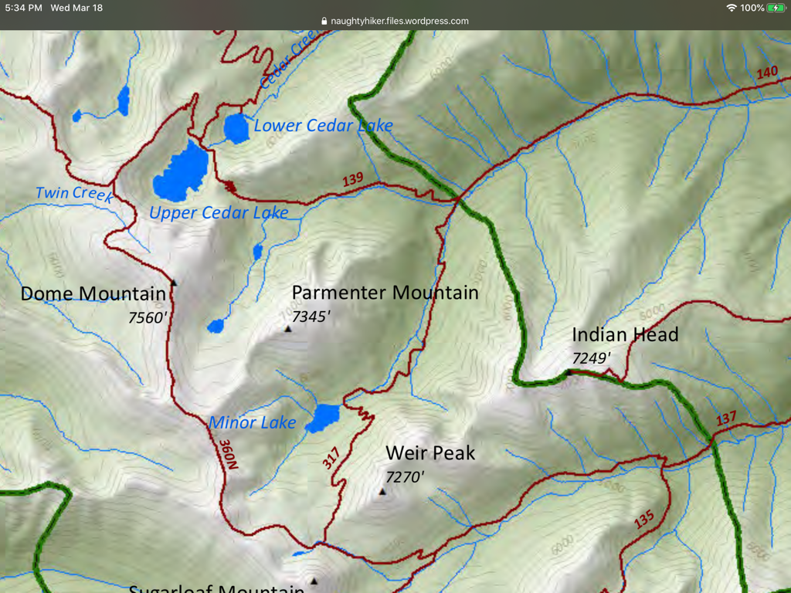

---
tags:

- Peaks & Mountains

- Difficult

- Day Hiking

- Backpacking

- Loop

stats:

- label: Event Type
  icon: hiking
  value: Day hiking, backpacking, loop

- label: Distance
  icon: map-marker-distance
  value: 14 miles RT

- label: Elevation Gain
  icon: elevation-rise
  value: 1646 verts, from upper Cedar Lake

- label: Difficulty
  icon: speedometer
  value: Difficult

- label: Maps
  icon: map
  value: Kootenai N.F., Crowell Creek topo

- label: GPS
  icon: crosshairs-gps
  value: 48°21’44" n 115°45’09" w

- label: Libby Ranger District
  icon: pine-tree
  value: 208.293.7773

- label: Lincoln County Sheriff
  icon: shield-account
  value: CALL 911 FIRST or 406.293.4112
notes:

- Kootenai national forest/alerts<https://www.fs.usda.gov/alerts/kootenai/alerts-notices>
---

# Dome Mountain

*Dome mountain 7560’ trail #360*

## Description

We have added the areas sheriff’s emergency phone numbers for each trip write up under the ranger district info. if an emergency ocurrs, evaluate your circumstances and call only if needed.
First you hike the Cedar Lakes trail to the upper lake. Then Trail #360 rounds the Upper Cedar Lake to the west on its way to Dome Mountain.

Most of the trail is on scree to the summit.

## Option #1

One of the cool things about this hike, is it’s connection with several trails that form about a 25 mile loop hike mostly up high. Consult a CMW forest map to plan your trip.
Peaks that are on this loop are, Sugarloaf Mountain, Weir Peak, and Parmenter Mountain

## Directions

From Libby, head west on Highway 2 for about 3 miles and turn left (south) up Road # 402. Look for milepost # 27.7.

## Hazards

Rock hopping and scree near the summit.

## Cool things close by

Ross Creek Cedars, Cedar Lakes, Dome Mountain, Kootenai Falls, and the Proposed Scotchman Peaks Wilderness.

## R & p

Henry’s in Libby, Pizza Hut, Rosaeurs, Clark Fork Pantry & Squeeze Inn in Clark Fork. Eicharts, Mr Sub, Burger Express, & Jalapeños in Sandpoint

## Photo gallery

---

---

## No mages at this time. contact chic to contribute

---

---

---

---

---
