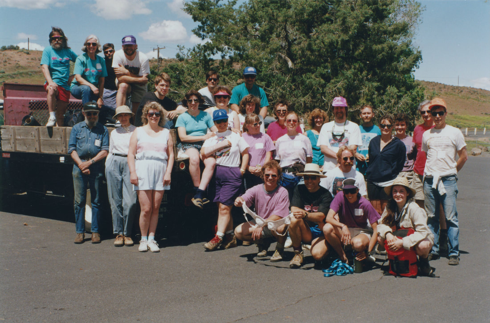

---
tags:
- Lakes stats:
- label: Waterfall icon: waterfall value: Dry Falls
- label: Drop icon: arrow-collapse-down value: Once this 400 foot falls was the worlds largest waterfall.
  Now some 15,000 years later it is dry
- label: Waterfall Type icon: hiking value: It was a block falls
- label: Distance Car to Falls icon: map-marker-distance value: From Sun Lakes State Park its about 105
  miles
- label: Maps icon: map value: Coulee City topo
- label: GPS icon: crosshairs-gps
## value: 47°59’45" n 119°36’53" w
## Dry Falls Sun Lakes Sp
## Dry Falls at Sun Lakes State Park
## Description
If you have never been to the Dry Falls area, you will be amazed at what the area represents. The last rush
of the Glacier Lake Missoula Floods was a mere 15,000~ years ago, but there were many before. As you look
out at the terrain from the visitors center on Hwy 17, imagine a wall of water 1,000+ feet tall
rushing at
55 mph, over the far lip of the plunge pool it created. It is said that the volume of water released from
the Clark Fork area in N. Idaho and Montana, was the size of Lakes Erie and Superior combined, and it
emptied the majority of it's water in a day and a half.
To read more about what is considered the largest catastrophic event in the history of the world, click
HIKE, then WASHINGTON, then double click WASHINGTON SCABLANDS, in the above menu.
## Option #1
Monument coulee Monument Coulee is located within Sun Lakes State Park, off of Hwy 17 near Coulee City.
Drive thru Sun Lakes S.P. to the Deep Lake-Dry Falls Lake Road about 1.2 miles from Camp Delany. Hike up to
Camp Delany, and follow the Monument Coulee trail, thru gigantic basalt columns. Some are still standing,
some are leaning, while others are laying on the ground. Its kind of eerie to walk past these once majestic
towers of basalt. please see hazards below.
## Option #2
If you own a kayak or canoe, you can drive up to Dry Falls Lake and paddle below the 400 foot lip of the dry
falls. Above the Dry Falls Lake is Dry Falls Cave to explore. Please see "hazards" below.
## Option #3
There are many more places to hike to see this incredible area. At Sun Lakes State Park or the visitor
center on Hwy 17, you can get a map of the area and choose the places you want to explore. Plaes see
"hazards" below.
---

# Dry Falls Sun Lakes Sp

## Directions

From Spokane, drive west on Hwy 2 for about two hours, to the Hwy 155 Junction near Coulee City. Turn left
onto Hwy 155, and drive to Hwy 17 on your left.

---

## Cool things close by

Electric City, Coulee Dam, Summer Falls, and the Rhino Cast.

## Hazards

The biggest hazard you need to be aware of while hiking in the scablands, is rattlesnakes. During the
mornings and during cool weather rattlesnakes hang out on the sun side of rocks and bushes. They are cold
blooded and come out into the sun to warm. If you are interested in hiking extensively in the Scablands,
google Rattlesnake lower leg covers. These wraps fit around your lower legs and are impenetrable.

Don't miss out on hiking in the Scabs because of fear. Simple buy the leg wraps and enjoy this truly unique
area of Washington State. You will not regret the many places to hike. There are many waterfalls in the
Scabs to explore.

## R & P

NA

---

## Plan your trip

Click for Current NOAA Weather Conditions

## Photo gallery

In 1993 on my way h0me from a climbing trip in the n. cascades, i stopped by dry falls. what i noticed was
the 400 foot cliffs below the visitors center was littered with trash. so i organized an outing to clean up
the cliffs. we belayed 5 climbers over the cliffs to clean up 51 large garbage bags of garbage. another 40+
people cleaned the rest of

the dry

falls area

### Picture (Image missing)

## Some of the cleaning crew enjoying the views near the gazebo

### Picture (Image missing) Details

## As the crowd gathered to watch us, many people pitched in

## The next two images were of the crews cleaning the valley floor below the visitors center

### Picture (Image missing) Details (2)

### Picture (Image missing) Details (3)

## We had ropes from above so the cleaners could slid the garbage bags down to the valley floor

### Picture (Image missing) Details (4)

## The plunge pool below dry falls rim at twilight

## Most of the clean up crew, standing by the truck of trash
