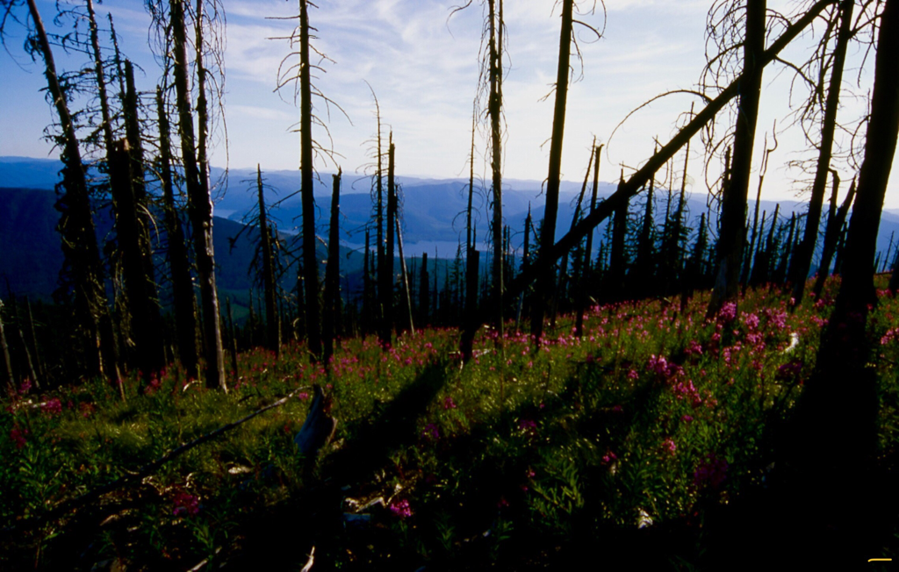
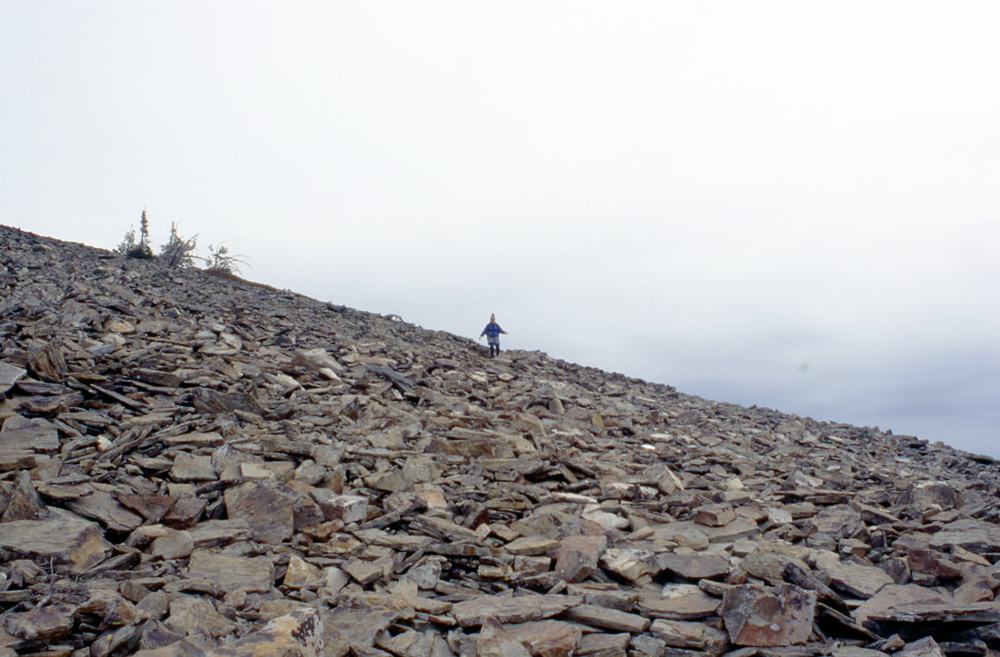
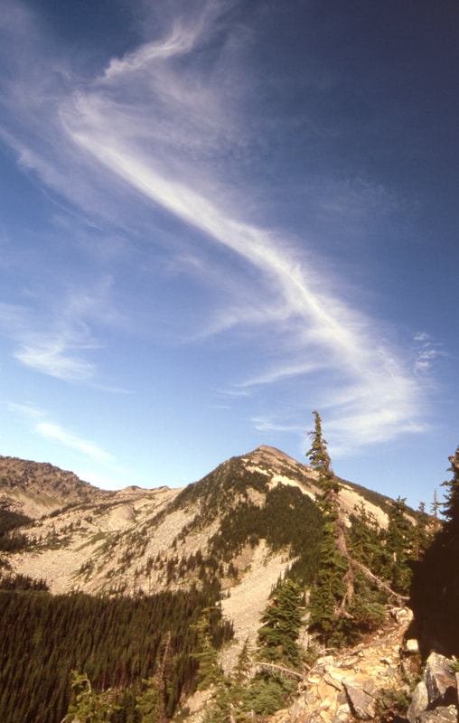
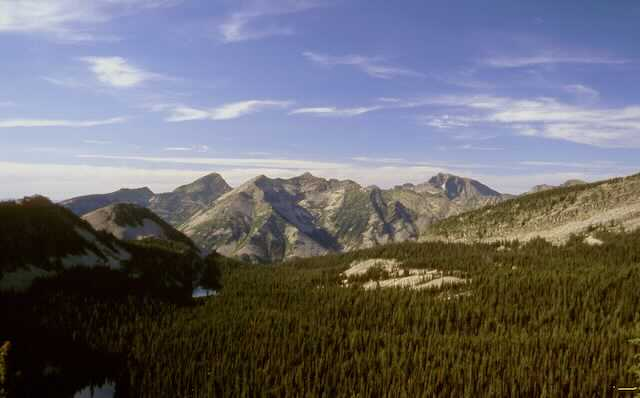
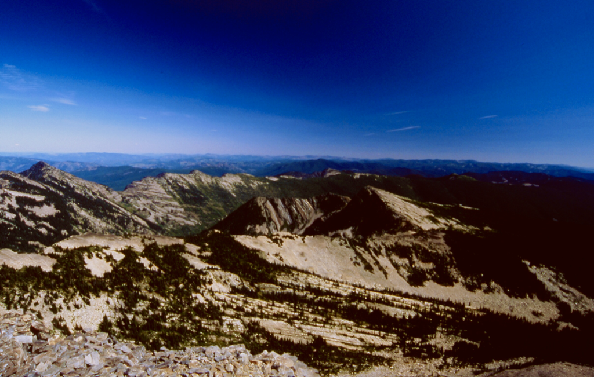

---
tags:
- Peaks & Mountains
- Backpacking
- Hiking
- Backcountry Skiing
stats:
- label: Event Type
  icon: hiking
  value: Backpacking, hiking, and backcountry skiing
- label: Distance
  icon: map-marker-distance
  value: 7.8 miles RT
- label: Elevation Gain
  icon: elevation-rise
  value: About 3489'
- label: Difficulty
  icon: speedometer
  value: Moderate due to 1500, in first mile.
- label: Maps
  icon: map
  value: Kaniksu National Forest, Cabinet Mountain Wilderness and Goat Peak
- label: GPS
  icon: crosshairs-gps
  value: 47°97’30" n -115°76’10"
- label: Ranger District
  icon: pine-tree
  value: Cabinet R.D. 406.827.3533
- label: Sanders County Sheriff
  icon: shield-account
  value: CALL 911 FIRST or 406.827.3684
notes:
- Kootenai national forest/alerts<https://www.fs.usda.gov/alerts/kootenai/alerts-notices>
---

# Engle Peak 7583 Trail 926

*Engle peak 7583’   trail #926 to 932 & 932a*

## Description

We have added the areas sheriff’s emergency phone numbers for each trip write up under the ranger district info. if an emergency ocurrs, evaluate your circumstances and call only if needed.
As you leave the trailhead, the challenge of this hike becomes evident. In the  first mile it climbs 1500 vertical feet thru a dense forest. As the trail mellows it follows a ridge line that undulates thru a forest that got blown down in the 90's, then burned in 2000. Of course, Fireweed blankets the entire area along the ridge. As the ridge starts it's ascent towards the peak, you come across several rock scree slopes to pick your way thru. About a third the way up, the genius that designed the trail, shined. Kinda! When it is at its hottest and your sweating buckets, the narrow trail sneaks thru the only little ribbon of forest towards the summit. The last section of the trail winds around the summit twice before summiting. Then the views all around, will amaze you. To the right (east), but out of sight, is Wanless Lake. To the north, most of the tall peaks of the CMW stand proud. Retrace your step back to the cars.

## Option #1

Hike Trail # 926 to junction 932. Turn right on 932 to the junction down to the lakes. At the lakes  junction, continue on Trail #932 A to the summit.

## Option #1

Follow the Engle Peak Trail #926 for about 3 miles to a junction with Trail #932. Turn left on 932 where the trail drops down to the seven lakes in about 400 vert.

## Directions

Drive east of Clark Fork on Hwy #200 to milepost 17. About 2 miles east of Noxon, turn left onto Rock Creek Road # 150. Drive 5 miles to the Orr Creek Road #2285, and veer right for 7 miles and follow the road to the trailhead.

## Cool things close by

Engle Lakes, Rock Lake off in the distance below you, Wanless Lakes

## R & P

And if you like sushi, try the Kaiju Bar & Grill. They also make incredible burgers
Henry’s, Pizza Hut, & The Shed in Libby.
Clark Fork Pantry & Squeeze Inn in Clark Fork,
Eicharts, Mr Sub, Burger Express, and Jalapeños in Sandpoint.

*Picture (Image missing)*

## Photo gallery

"

## Fireweed along the saddle above engle lakes

---

## The last section to the summit, wraps around the peak

---

## The saddle before the up. engle lakes are down on left

---

## Two of the seven engle lakes

---

## Looking south from engle peak

---

Up high, where the air is thin. Our hearts, can soar without restraint. From up high, we can see all. Where we've been, and where we will go.  chic.    11.29.2014
