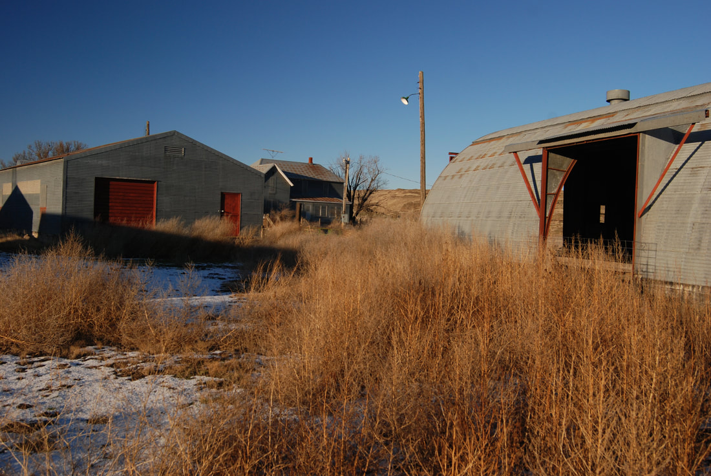
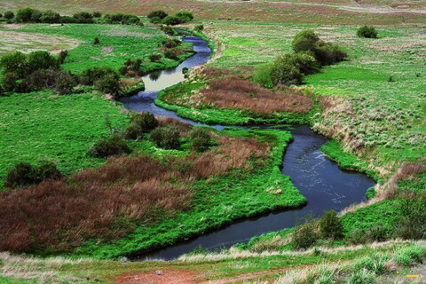
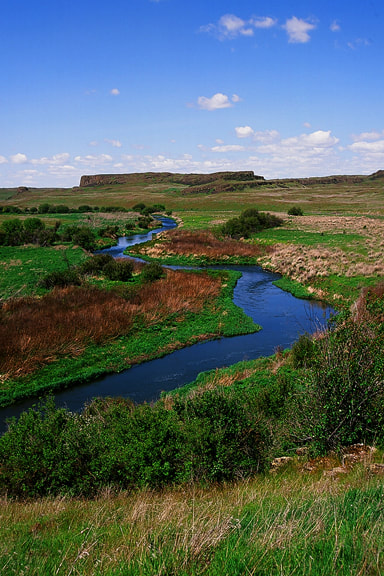

---
tags:

- Trails & Scrambles

- Easy

- Day Hiking

- Backpacking

- Equestrian

- Photography

- History

stats:

- label: Event Type
  icon: hiking
  value: Day hiking, backpacking, equestrian, photography, and history

- label: Distance
  icon: map-marker-distance
  value: 6.4 miles RT

- label: Elevation
  icon: terrain
  value: 530’

- label: Difficulty
  icon: speedometer
  value: Easy

- label: Maps
  icon: map
  value: BLM District Maps, Hoon Lake & Revere topos

- label: GPS
  icon: crosshairs-gps
  value: 47°00’85"n 117°56’61" w

- label: Managing Agency
  icon: domain
  value: blm. 509.536.1200

- label: Whitman County Sheriff
  icon: shield-account
  value: 509.397.6266

- label: Adams County Sheriff
  icon: shield-account
  value: CALL 911 FIRST or 509.754.2011
---

# Escure Ranch

*Escure ranch & towell falls*

## Description

We have added the areas sheriff’s emergency phone numbers for each trip write up under the ranger district info. if an emergency ocurrs, evaluate your circumstances and call only if needed.
The Escure Ranch was an over 14,000 acre cattle and sheep ranch from the 40’s to 1990 when the BLM acquired it.
First, know that you are in an area that may be very foreign to you. Do not venture off the road/trail, unless you are aware of your surroundings and your ability to route find.
The trailhead is located near the old ranch house and it’s many out building. Wander over the bridge to the ranch house and take a look at how the owners built a farm to last many lifetimes.
Once back at the gate, follow the old road for 3.2 miles to Towell Falls.
If the gates are closed, please close them behind you.
For the first .5 miles the road skirts Rock Creek, then wanders thru nice steppes on its way towards the falls. As you walk this trail, be sure to notice it’s route and landmarks along the way. If you get misplaced, knowing the landmarks can help get you back on track.
Another idea is to take an image of what the landmark looks like after you have passed it. That wise you can be assured that you are on trail back.
About half way along this road, it comes close to Rock Creek once more. But then the road leaves the creek area and travels thru the steppes once again.
As you get close to the falls, BE SURE TO MEMORIZE YOUR ROUTE FROM THE ROAD TO THE FALLS. Because, after a nice visit to the falls, the road back is not as evident as it could be. The road heads eastish to the main road thru the ranch.
Watch for rattlesnakes, badgers, and other wildlife along the trail.
The Lower Falls sits on the SW corner of an island, that you have to get on. During spring runoff this creek can be an issue. Once on the island, walk its perimeter to see up to 4 waterfalls, depending on the season and the spring runoff.
The Lower Falls is about 25-30 feet wide and drops about 12-15 feet.
The Upper Falls, fall into a plunge pool canyon about 25 feet deep, but are a straight drop from it's rim to the plunge pool below.
The two other falls are only around during peak runoff, and are located on the NE edge of the island. In any other season these falls are dry.
Near the Lower Falls, is a colorful tree to have your lunch under.
After spending your day here, FOLLOW YOUR ROUTE IN, EXACTLY, TO GET OUT. If you wander north, you can get out by knowing that the road in is on your right and funnels down to the creek along the road to the north of the falls.
One of the cool things about this area, is that it is spectacular in any season. But November and December are my favorite. See images below.

## Option #1

Instead of hiking the road to the falls, go across the bridge from the parking area, and pick up a fisherman’s trail along Rock Creek’s west side. BE AWARE...during runoff, you may not be able to cross onto the island. But the views are still great from either side. Follow your route in exactly as you did getting to the falls.

## Option #2

Turtle and Wall Lakes are located NW of the ranch area about 4 miles one way.
DO NOT ATTEMPT if you are not familiar with route finding, map & compass, or know GPS inside and out. And as stated, notice the landscape and landmarks as you go to the lakes, so getting back has some resemblance to you.

## Directions

From I-90, take the exit for SR 23 and go south 8 miles, through Sprague,and turn right on Lamont Road. In about 2.5 miles Lamont Road bends left and turns into Revere Road; 8 miles after the turn, go right on Jordan-Knott Road, then another 2 miles until you reach Rock Creek Management Area, another right turn. Drive until you reach a parking area with port-a-potties.

## Hazards

Rattlesnakes, Badgers, heat and exposure.
Memorize the trail down to the falls as you leave the road you walked in on. You will need it to return via the main road you came down on. If you don’t remember the route, KNOW that the road is too the east, and you can't miss it.
If by chance you don’t take that route, you can follow Rock Creek north, and you will eventually come across the road in about a mile

## Cool things close by

Sprague’s Dave’s Antique Truck Museum, Crab Creek, Twin Lakes, Z Lake, Fishtrap Lake, and the Snake River

## R & p

Harvest Resturant in Spangle. Lenny’s in Cheney

---

## Plan your trip

## Photo gallery

## Escure ranch house and out buildings

## Rock creek from the escure ranch bridge

## Rock creek on the way to towell falls

---

*Picture (Image missing)*

## Towell falls in november

---

*Picture (Image missing)*

## Upper towell falls

*Picture (Image missing)*

## Summer time in the scabs can be hot
