# Faces in Nature

---

> [!TIP]

> **Interactive Photo Gallery**: Click on any photo to open the high-resolution lightbox modal. These
natural formations take a bit of imagination to spot the faces!

---

 <a href="assets/images/12272021748p.jpg" title="A MOTHER HOLDING HER BABY - STEVENS
PEAK"> 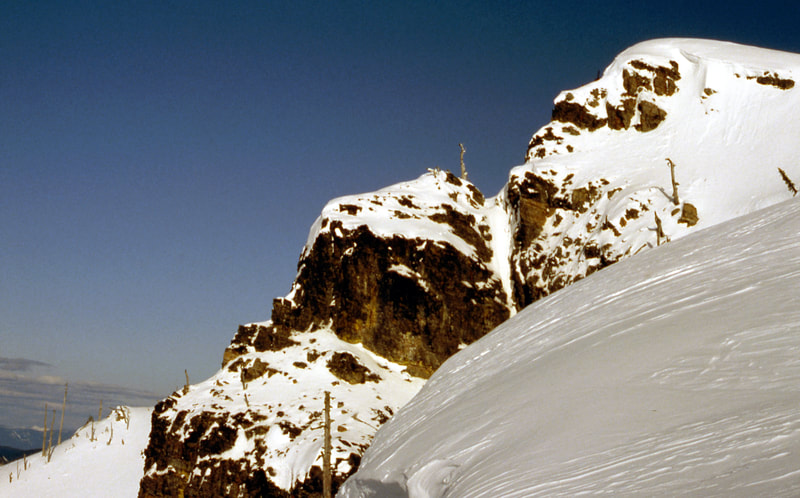 </a> 
A Mother Holding Her Baby - Stevens Peak

 <a href="assets/images/12272021749p.jpg" title="SNOOPY AT SMITH ROCKS, OREGON">
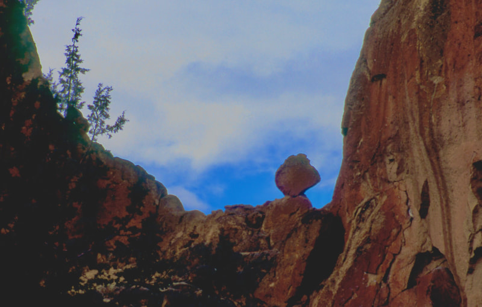 </a> 
Snoopy at Smith Rocks, Oregon
 

 <a href="assets/images/12272021806p.jpg" title="THE CHIEF ALONG WHISKER RIDGE,
A.S."> 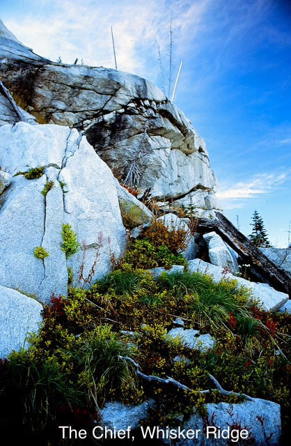 </a> 
The Chief Along Whisker Ridge
 

  
Old Time Mountaineer Guide
 

 <a href="assets/images/12272021808p.jpg" title="A MOUNTAINEERING GUIDE"> 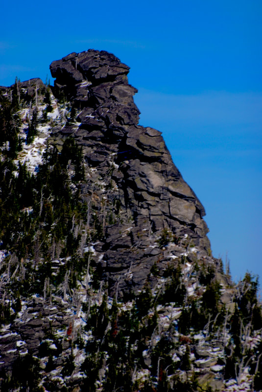 </a> 
A
Mountaineering Guide
 

 <a href="assets/images/12272021809p.jpg" title="DO YOU SEE HIM YET?"> 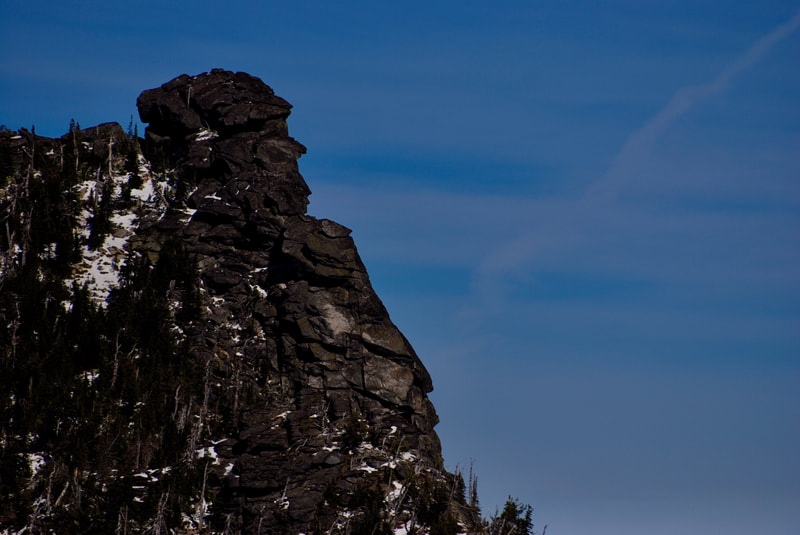 </a> 
Do
You See Him Yet?
 

 <a href="assets/images/12272021810p.jpg" title="CAMERA TRIPPED ACCIDENTALLY - IMAGE
OF A MAN"> 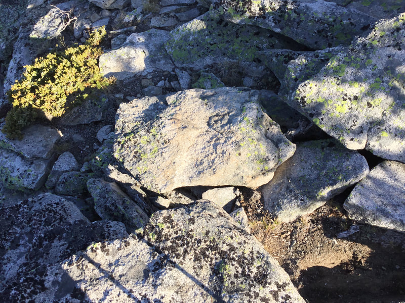 </a> 
Accidental Image of a Face
 

 <a href="assets/images/12272021811p.jpg" title="LOOK CLOSELY"> 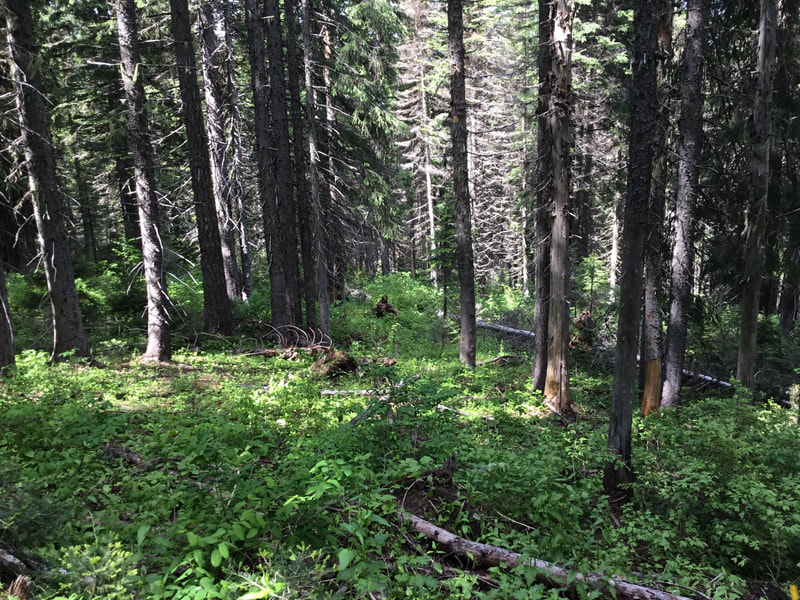 </a> 
Look
Closely
 

 <a href="assets/images/12272021812p-copy.jpg" title="BIGFOOT PROOF - GLIDDEN LAKES,
SILVER VALLEY"> 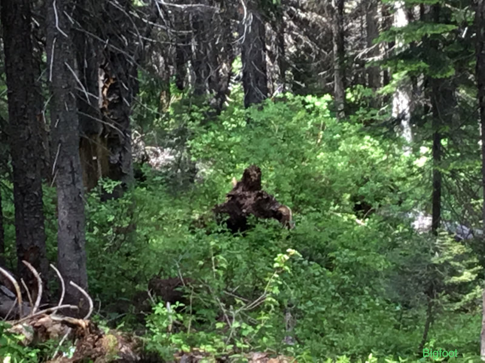 </a> 
Bigfoot - Glidden Lakes

 <a href="assets/images/11062021150p.jpg" title="ROTATE IMAGE COUNTERCLOCKWISE">
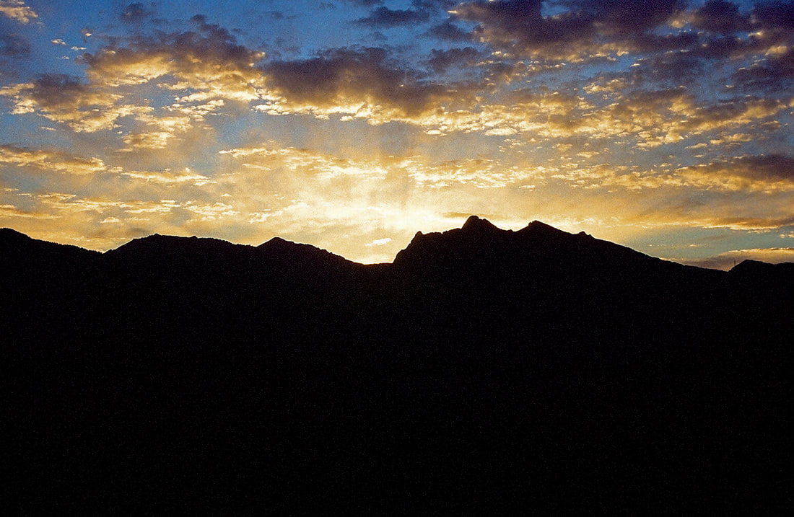 </a> 
Rotate Counterclockwise
 

 

Energizer Bunny - Palouse Falls

 <a href="assets/images/12202021735p-copy-2.jpg" title="A TOTEM OF FACES - HOW MANY
DO YOU SEE?"> 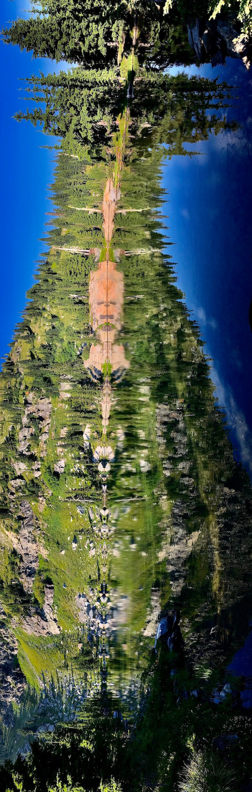 </a> 
A Totem of Faces
 

 <a href="assets/images/12272021936p.jpg" title="A FACE BY DAVID - CEDAR LAKE, CMW">
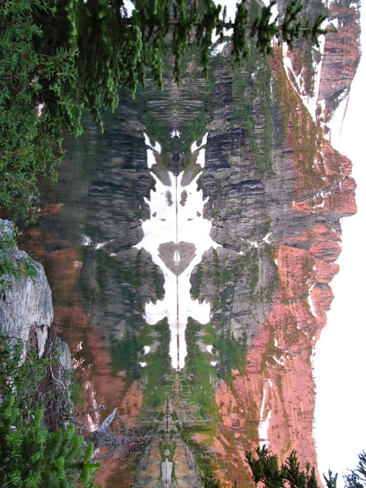 </a> 
A Face by David - Cedar Lake

