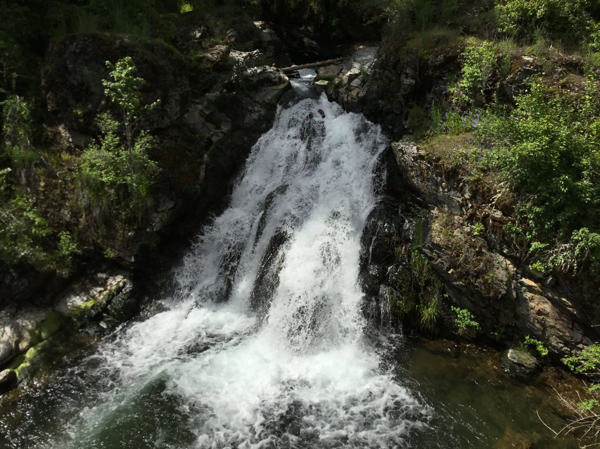

---
tags:
- Waterfalls
stats:
- label: Waterfall
  icon: waterfall
  value: falls creek falls, st. joe river road, idaho
- label: Drop
  icon: arrow-collapse-down
  value: 25'
- label: Waterfall Type
  icon: waterfall
  value: Tiered horsetail
- label: Distance Car to Falls
  icon: map-marker-distance
  value: 40'
- label: Maps
  icon: map
  value: I.P.N.F., ST JOE N.F., St. Joe topo
- label: GPS
  icon: crosshairs-gps
  value: 47°19’15" n 116°12’51" w
---

# Falls Creek Falls Idaho

## Falls creek falls, st. joe river road, idaho

## Description

The hardest part about visiting this falls, is the fact that as you are driving east on the St. Joe River
Road, it is on a curve and you will miss it, either way. Do not fit the brakes to pull over. Continue until
its safe to turn around. There are some close pull offs near the falls. This small falls offers a great drop
to photograph. Take your tripod and wonder about for your best angle.

Descending as a wide stream from the broad St. Joe River, Falls Creek Falls drops 20 to 30 feet on private
property. Enclosed by St. Maries Ranger District in the St. Joe National Forest, Falls Creek Falls is
situated at 1,980 feet and is easily accessible.

## Directions

Exit Scenic Route 3 approximately 0.5 mile northeast of St. Maries; turn east onto St. Joe River Road and
proceed 10.5 miles; note Shadowy St. Joe Camp and continue forward 4.5 miles until reaching a parking area
near Falls Creek Bridge where the falls can be seen.

---

## Cool things close by

The Rochat Divide, Crystal Lake, the Shadowy St. Joe River, Ward & Eagle Peaks, and Avery, Idaho.

## Hazards

All waterfalls are a hazard, due to their slippery nature. always be extra careful near any
waterfall.Missing the falls as you are driving by is a concern. PLEASE BE CAREFUL. Continue on to a safe
place to turn around

## R & P

TFP's 55 Milwaukee Road Avery, Idaho [208.568.2181](tel:208.568.2181) Wood Fired Pizza, Broasted Chicken &
JoJos, Beer & Wine

---

## Photo gallery

### Picture (Image missing)

##
