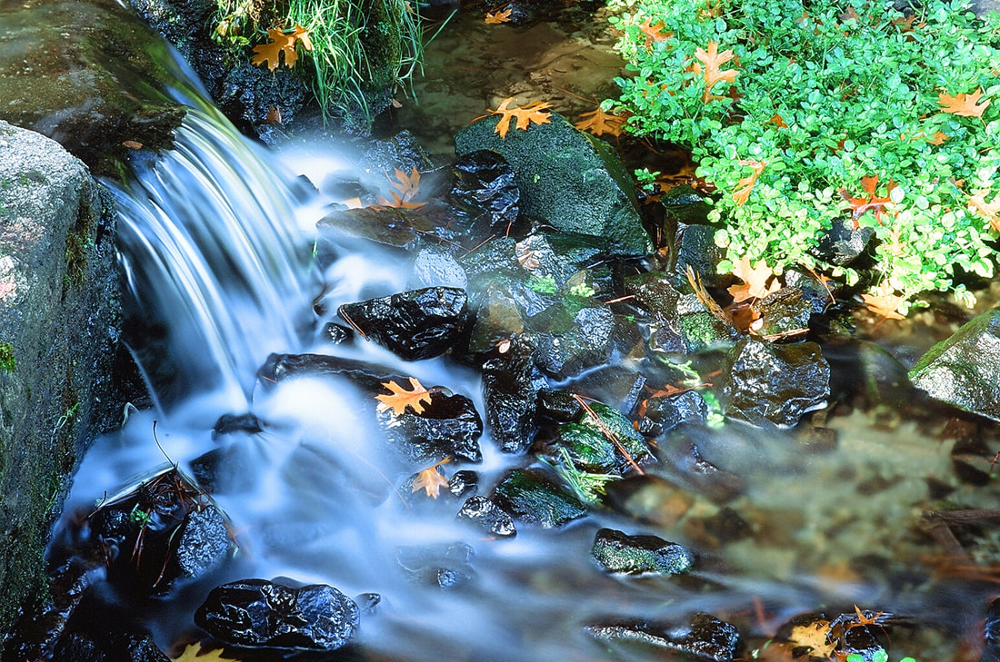
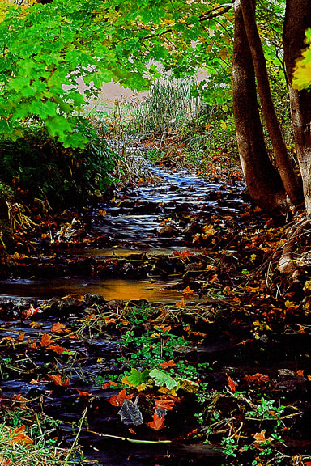
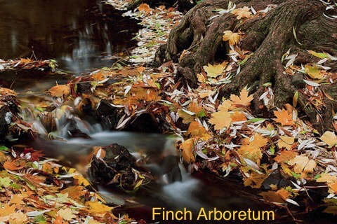
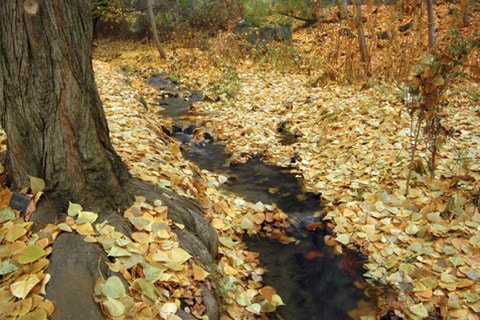
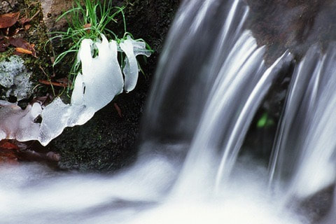

---
tags:
- Trails & Scrambles
- Very Easy
- A Walking Guide
stats:
- label: Event Type
  icon: hiking
  value: A walking guide
- label: Distance
  icon: map-marker-distance
  value: 1.25 miles round trip
- label: Elevation
  icon: terrain
  value: Minimal gain
- label: Difficulty
  icon: speedometer
  value: very easy
- label: Maps
  icon: map
  value: Spokane Parks & Recreation map.
- label: GPS
  icon: crosshairs-gps
  value: 47° 38’36"n 117° 27’45"w
---

# Finch Arboretum

*John a. finch arboretum*

## Description

The John A. Finch Arboretum is one of the most beautiful parks in the Spokane area, and should not be missed.
All seasons are incredible, but early Rocktober before the city rakes up the fallen leaves is my favorite.
The Arboretum planting started in 1949 with 49 specimens comprising of 10 genera and 23 species.
Currently, the arboretum houses over 2000 labeled trees and shrubs representing over 600 species and varieties include 120 genera.
The John A. Finch Arboretum occupies nearly 65 acres of beautiful tree-covered land along Garden Springs Creek in the southwest part of Spokane. Their collections of trees and shrubs include natives of the inland northwest and plants from many parts of the world. They were selected as educationally useful, scientifically important and aesthetically attractive. The Arboretum is used as an outdoor classroom by naturalists, horticulturists, students, gardeners and photographers. Those interested in home landscaping find the Arboretum to be a valuable source of information on plants hardy enough to grow in the Spokane area. The Arboretum’s educational and scientific value are enhanced by seasonal programs and public events throughout the year. The park-like character and natural charm is appreciated by all who enjoy nature’s beauty.
Hungry for more history? Check out John A Finch Arboretum by Tracy Rebstock - SpokaneHistorical.org.

Pets are not allowed.
​

---

## Directions

From I-90, take the Garden Springs Road Exit 277, and turn north off the Interstate. Turn right at the stop sign onto W. Sunset Blvd, head down hill towards Spokane, and be in the right hand lane. Turn right onto "F" street to the Woodland Center and parking.
509.363.5466

## Cool things close by

Palisades Falls, The Spokane River, and the Riverside State Park

## Hazards

Do not take any pets.they do not allow animals.

## R & p

NA

---

## Plan your trip

Click for Current NOAA Weather Conditions

## Photo gallery

---

## Garden spring creek runs thru the arboretum

---

*Picture (Image missing)*

## Spring at the finch arboretum is well worth the visit

*Picture (Image missing)*

## As the colors start to change, the trees turn vibrant

---

*Picture (Image missing)*

## Garden spring creek cascades often

*Picture (Image missing)*

## Soon all this grass will be covered in yellow leaves

---

---

## There are many photo ops along garden springs creek

---

*Picture (Image missing)*

## There are several places to sit and watch the day go by

---

## This is a one of a kind image. the tree fell a few years ago

*Picture (Image missing)*

## The next three images show the carpet of yellow along garden spring creek

*Picture (Image missing)*

## In late fall, the creek freezes around its many cascades
