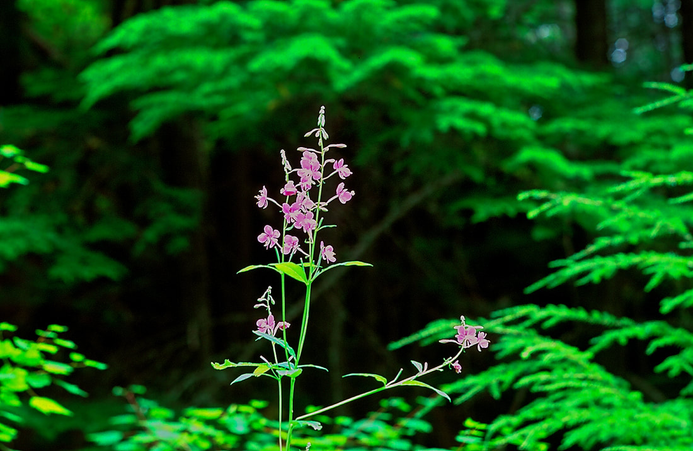

---
tags:
- Trails & Scrambles
stats:
- label: Genesis Name
  icon: book-open-variant
  value: Chamerion amgustifolium (L.) Holub
- label: Distribution
  icon: earth
  value: All of Canada and most of U.S. except the Deep South
- label: Season
  icon: calendar
  value: Fireweed blooms **from June to September**, and the typically magenta flowers
    (2 to 4 cm wide with 4 petals) grow in clusters at the apex of the stems. In late
    summer, fireweed seeds disperse on the wind thanks to the fluffy tuft of white
    hairs at their tip.
- label: Medicinal Use
  icon: information-outline
  value: 'Fireweed is an herb. The parts of the plant that grow above ground are used
    to make medicine. Fireweed is used for **pain and swelling (inflammation), fevers,
    tumors, wounds, and enlarged prostate** (benign prostatic hyperplasia, BPH). It
    is also used as an astringent and as a tonic. Fireweed: Is a **great anti-inflammatory
    especially for acne prone skin**. It also soothes dry, irritated skin types. ...
    It retains moisture, fights free radicals and helps maintain the skin''s youthful
    appearance. The high amounts of zinc and vitamin E improve skin tone, fight acne
    and help with skin renewal.'
- label: Poisons
  icon: skull-crossbones
  value: The fire weed in-flower is the most toxic to some stock and animals. When
    ingested it can be toxic to the liver and neurological system eventually leading
    to death. .
- label: Edible
  icon: food-apple
  value: Traditionally, fireweed shoots are **eaten like vegetables**, and the leaves
    can be eaten like greens or made into tea. The young shoots are hung and dried
    for a few days to make them sweeter. The insides of older stems can be scooped
    out and eaten. The reason this sting is so painful is that it has **stinging hairs
    that are easily embedded in the skin when pulling it barehanded**. By doing this,
    you encourage venomous hairs to become embedded in the skin thus increasing the
    agony that is pending and it is a pain that will last for hours.
- label: Features
  icon: information-outline
  value: The name fireweed stems **from its ability to colonize areas burned by fire
    rapidly**. It was one of the first .
notes:
- I have two friends that toured Alaska a few years ago. They called their presentation
  "Following the Fireweed". They spent 15 weeks in Canada, starting where fireweed
  first starts, and followed it until it stopped blooming at the end of it's season.
---

# Fireweed

!!! warning "Before you go"

    i have revised this section.

    It was brought to my attention that part of this plants description was incorrect. FIREWEED is toxic to
    some stock and animals. It is not toxic to humans. id like to thank ben clark for bringing this to
    my attention. chic

## Description

Fireweed is a tall showy wildflower that grows from sea level to the subalpine zone. A colorful sight in
many parts of the country, fireweed thrives in open meadows, along streams, roadsides, and forest edges. In
some places, this species is so abundant that it can carpet entire meadows with brilliant pink flowers. The
name fireweed stems from its ability to colonize areas burned by fire rapidly. It was one of the first
plants to appear after the eruption of Mt. St. Helens in 1980. Known as rosebay willowherb in Great Britain,
fireweed quickly colonized burned ground after the bombing of London in World War II, bringing color to an
otherwise grim landscape. Fireweed is the official floral emblem of the Yukon Territory in Canada. A member
of the Evening Primrose family (Onagraceae), taxonomists previously included fireweed in the Epilobium
(willowherb) genus, but it is now placed in the Chamerion (fireweed) group. The Evening Primrose family
contains about 200 species worldwide. A hardy perennial, fireweed stems grow from 4 to 6 feet high but can
reach a towering 9 feet. The numerous long narrow leaves scattered along the stems are the origin of the
species name "angustifolium" (Latin for narrow leaved). The leaves are unique; leaf veins are circular and
do not terminate at the leaf edges. A spike of up to 50 or more pink to rose-purple flowers adorns the top
of the stems from June to September. The four petals alternate with four narrow sepals, and the four cleft
stigma curls back with age. Each flower is perched at the end of a long cylindrical capsule bearing numerous
seeds. Seeds have a tuft of silky hairs at the end. A single fireweed plant can produce 80,000 seeds! The
delicate fluffy parachutes can transport seeds far from the parent plant. The fluff was used by native
peoples as fiber for weaving and for padding. Fireweed was important to native people around the world.
Choice patches of fireweed were even owned by high-ranking families in British Columbia. Tea was made from
the leaves. High in vitamins A and C, fireweed shoots provided a tasty spring vegetable. Flowers yield
copious nectar that yield a rich, spicy honey. Today, fireweed honey, jelly, and syrup are popular in Alaska
where this species grows in abundance. Fireweed can be a beautiful addition to the home garden. Since it
reproduces readily from rhizomes as well as from seed, fireweed can quickly take over a garden if left
unattended. You will be rewarded for your efforts however, since the colorful flowers are sure to attract
lots of pollinators.

---

## Photo gallery

---

*Picture (Image missing)*

## Fireweed grows throughout our region. it's growth starts from an area that has recently burned

*Picture (Image missing)*

## This image was taken above the settler's grove of ancient cedars

##
