# Fireworks

---

## Fireworks (2)

Shooting fireworks No matter what system you are using, you need to make long exposure to get the image you
want. A tripod is the key to not having blurry images. Next you will need a cable release or a bluetooth or
remote control, to capture your long exposures. When you push your shutter button, you will have blurry
images due to camera movement without a remote release. The settings on your camera need to be set in the
following way. A... Turn off auto focus, and manually focus your images. This is difficult to achieve, so I
suggest you practice a lot before. You might take a magnifying loop to closely examine your focus. B... set
your ISO/ASA to 100 or lower. The ISO represents the sensitivity of your sensor (or film) to light. Normally
in low light situations, you increase your ISO. But in the case of fireworks, fireworks are not low light,
hence your ISO's need to be set low. C... Turn off your flash. They only reach about 10 to 20 feet. And if
your flash is up, your exposures will be incorrect. D... Set your command dial to Manual. Put your shutter
speed on Bulb and set your aperture to f-8 to f-11 for all images except the Grand Finale, which you might
set your aperture at f-11 to f-16. Consult your image for needed corrections. E... After composing your
scene, watch for the fireworks to be sent skyward. If the round is bright as it goes up, release your
shutter and make your exposure. It may last 5 to 10 seconds to get the trail and explosion all in. If there
is no trail of light, wait a few seconds after the round is fired, then release your shutter. A good rule of
thumb, is to watch the explosion in the sky as the fireworks goes off. Then as the fireworks starts to
dissipate, stop your exposure. The coolest thing about digital cameras is that you can see your exposure
right away, and make corrections on the spot. That also goes to which white balance setting you use. F...
The different settings in White Balance will render different results in your final image. The best way to
tell what you like best, is to practice with each settings and see what you like best. They all will produce
nice results, but its up to you to examine what pleases you the most. G... Now the hard part starts. You
will need to travel to various locations to see which works for you the best.

Do not shoot personal fireworks from any of the locations listed below. shoot only images. Below are some
suggestions. Please understand, if you trespass to get that shot, you could go to jail. Most the areas
listed are public lands. And also be aware, the city of cda and/or the kootenai county has restrictions on
shooting off fireworks on public land. shoot only photos. 1... Hwy 97. On the road about .2 of a mile south
of the Arrow Point Resort. There are adequate pull offs along Hwy 97. 2... Hwy 95. About 1.6 miles south of
the Spokane River, on Hwy 95, just before the Cougar Bay Nature Reserve. Please be aware, parking on 95 here
is against the law. You can park off the hwy to the NW safely. Then walk down to the water's edge to
shoot. 3... Cougar Bay Nature Reserve. The spot to get the best viewing, is to walk the trail (its rough) out to a
vantage point. Please be aware, walking out too far will put you on private property. do not trespass. Its
best to paddle to a beach near the line of pilings. 4... Canfield Butte. This location takes a lot of hiking
to get to the West Summit. Start early and be sure to carry extra batteries for your headlight. 5... East
Lake CDA Drive. Head out towards the Higgins Point Boat Launch. About 1.2 miles SE of the Silver Beach
Marina, is a Lake Steamer Marker. Please do not park on lake cda drive. pull off into a designated parking
area. You won't be able to see the fireworks launch site, but easily see the fireworks explosions. 6...
Signal Point. This area is located up the Signal Point Road. It will require walking the road past the gate
for about 1.5 miles to a viewpoint. Please do not trespass. stay on the road only. signal point is on
private property. 7... MICA PEAK, WASHINGTON VIA BELMONT ROAD. This option will require you to walk about
9-10 miles with 2500 verts. Consult Spokane County Parks, or search S.C.P. on this website. be aware, the
faa radar dome and area is not open to the public. stay out. 8... Mineral Ridge Silver Tip View Point. This
option requires about a 3.3 mile loop trial to reach the Silver Tip View Point. The launch area will be
obscured, but the explosion in the sky will be visible. 9... NIC Parkway (Dyke Road). This option is a very
popular spot to view the fireworks, but don't expect to be alone. And please park in designated areas, being
sure not to block the road. 10... CDA City Beach. Do not expect privacy. There will be thousands of people
with you. 11... Tubbs Hill. Tubbs Hill is a great spot to shoot the fireworks. The trail is about .2 to 1.1
miles to viewing areas. But be aware, tubbs hill is very dry. do not set off fireworks from tubbs hill.

The authors of this website are not responsible for people who trespass, light off fireworks, or mis-
behave.

These areas are suggested for photography purposes only.

Fireworks images for phones Because of copyright issues, I would suggest you search the internet and use the
info accordingly. It is doable, but will require a tripod, release system and more.

---

## Click on image to enlarge

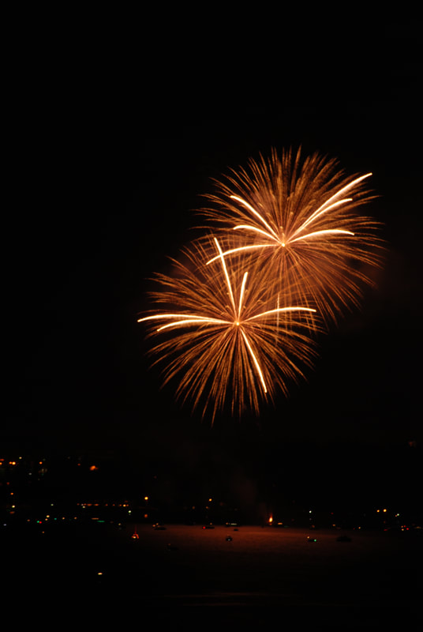
_CDA 4TH OF JULY_

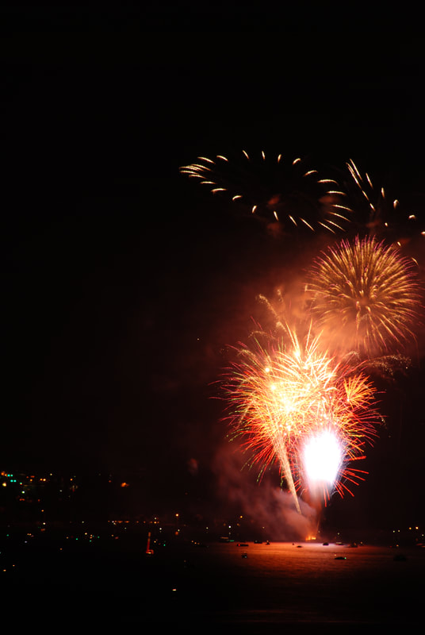

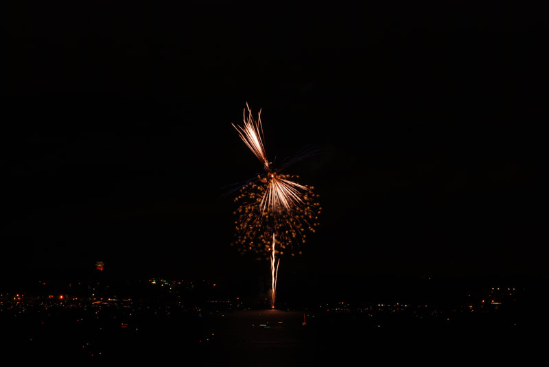

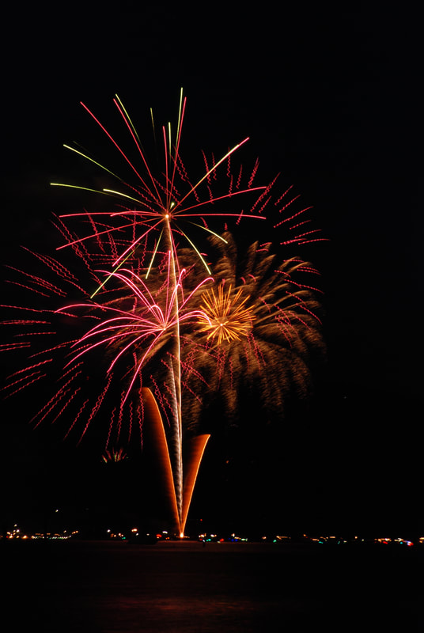

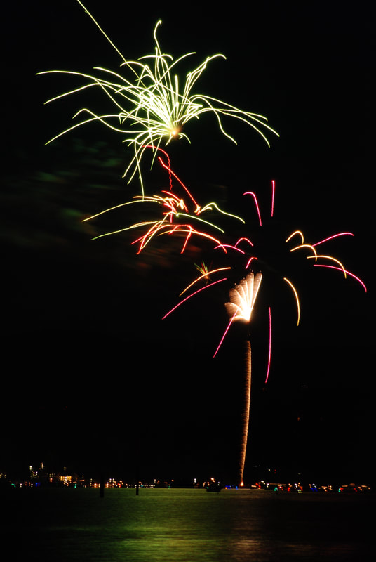

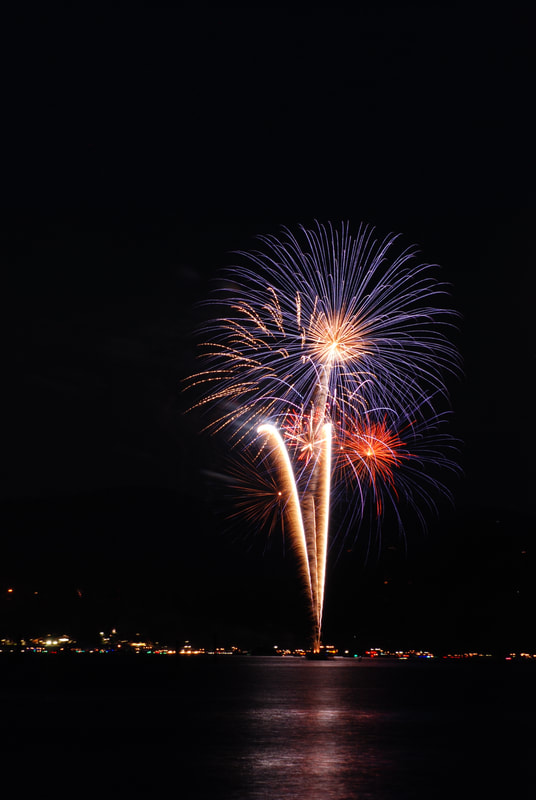

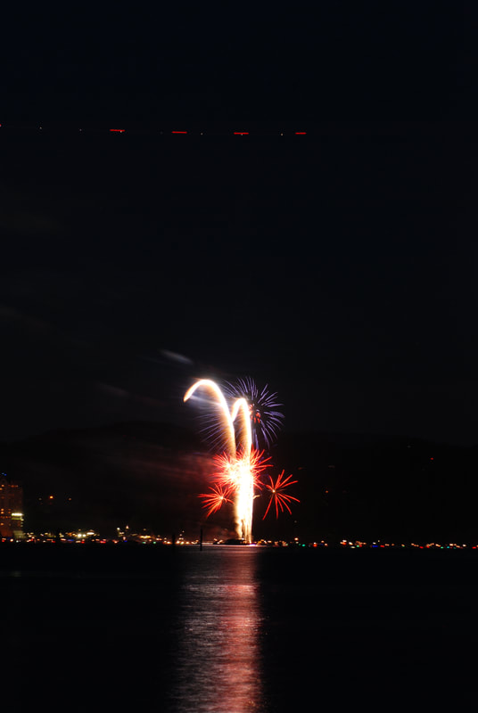

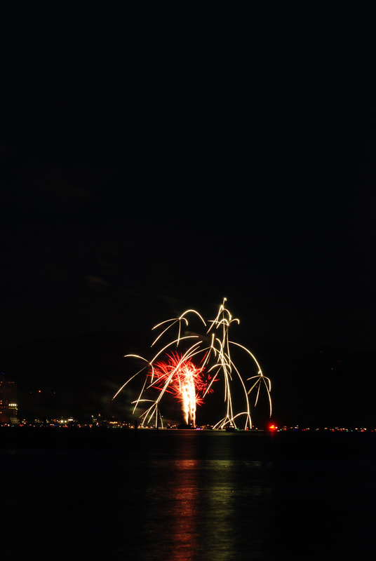

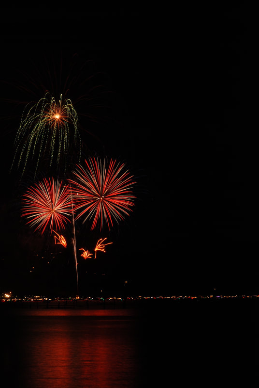

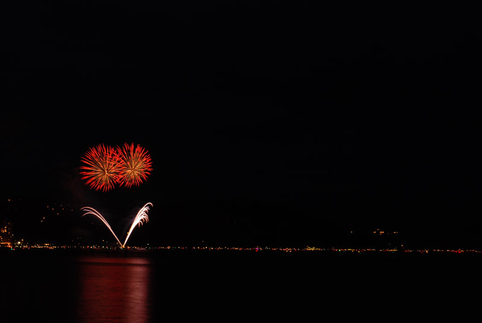

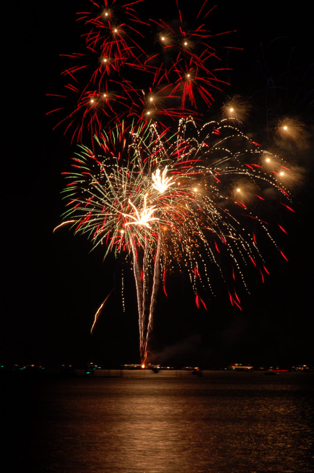

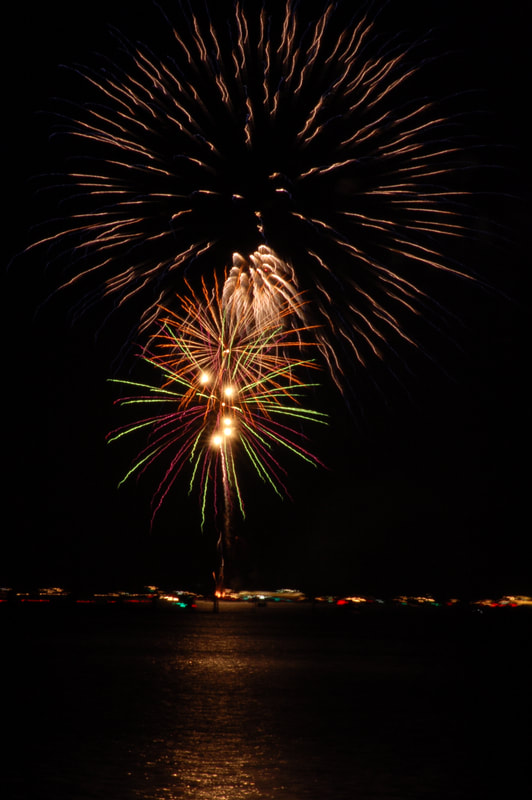

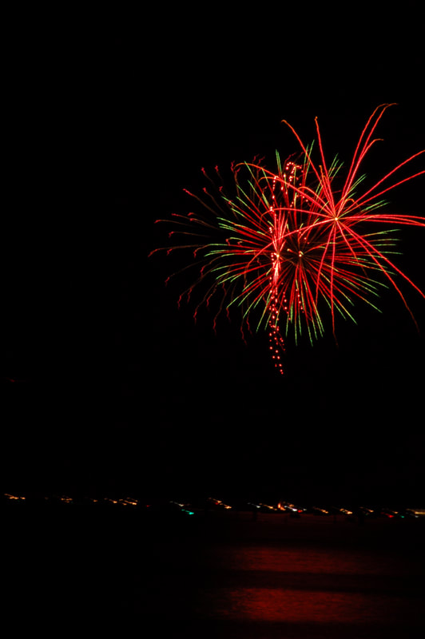

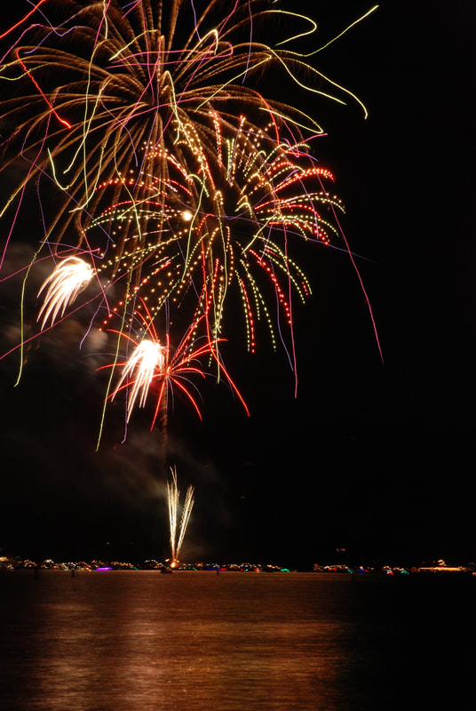

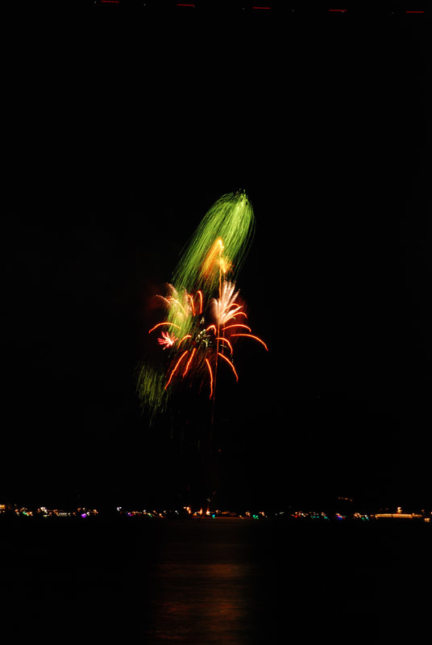

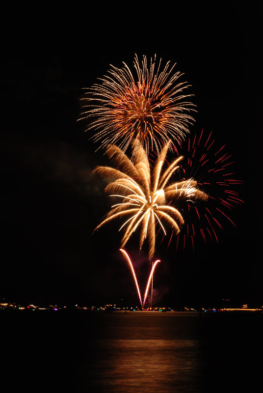

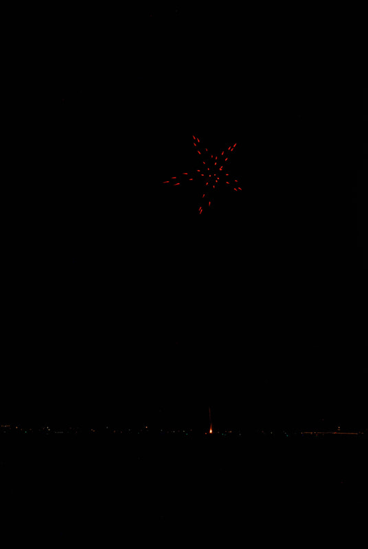

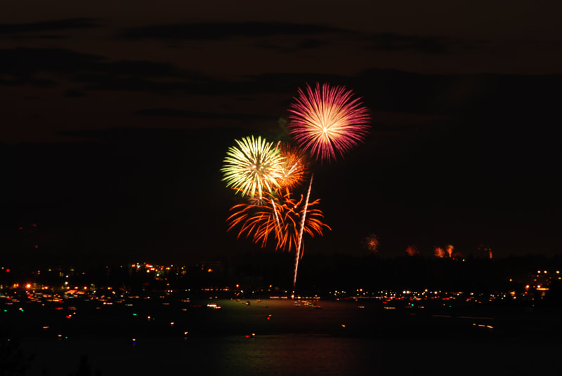

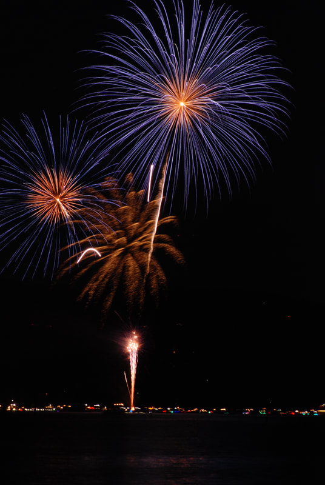
