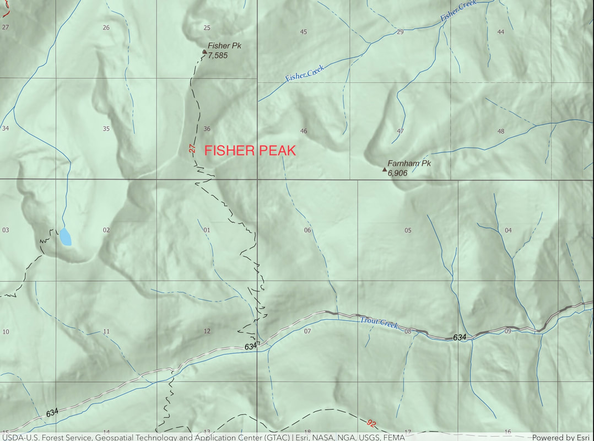
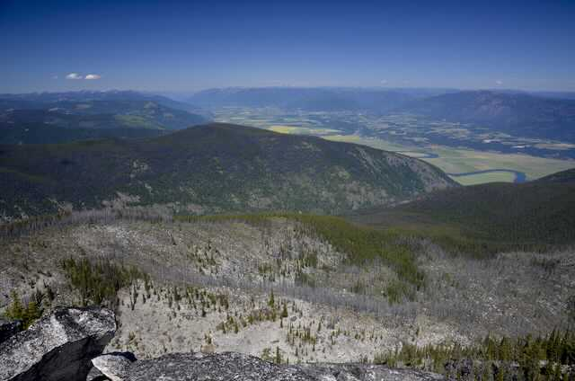
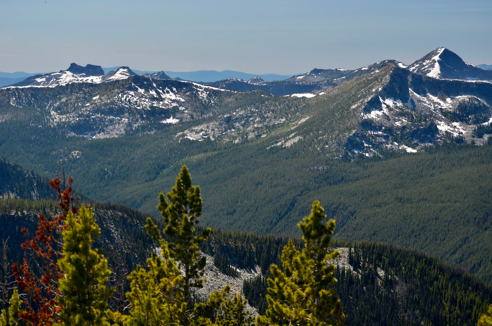
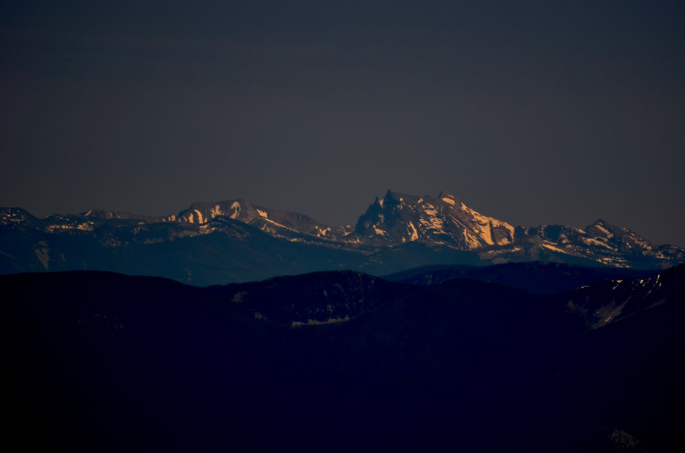

---
tags:
- Peaks & Mountains
- Difficult
- Day Hiking
- Backpacking
- Scenery
stats:
- label: Event Type
  icon: hiking
  value: Day hiking, backpacking, scenery, and possibly mt biking for the hearty.
- label: Distance
  icon: map-marker-distance
  value: 14 miles RT
- label: Elevation
  icon: terrain
  value: Less then 3000’
- label: Difficulty
  icon: speedometer
  value: Difficult
- label: Maps
  icon: map
  value: IPNF, Pyramid Peak topo
- label: GPS
  icon: crosshairs-gps
  value: 48°9’8" n 116°31’31" w
- label: Ranger District
  icon: pine-tree
  value: Bonners Ferry R.D. 208.267.5561
- label: Boundary County Sheriff
  icon: shield-account
  value: CALL 911 FIRST or 208.267.3151
notes:
- Idaho panhandle national forest/alerts
- url: https://www.fs.usda.gov/alerts/ipnf/alerts-notices
---

# Fisher Peak Trail 27

## Fisher peak 7580’ trail #27

## Description

We have added the areas sheriff’s emergency phone numbers for each trip write up under the ranger district
info. if an emergency ocurrs, evaluate your circumstances and call only if needed. Trail #27 starts at 4145’
on F. R. #634, Trout Creek Road, or the road to Pyramid Peak. The first thing you will notice, is the trail
is not too steep, but relentless to the summit. The trail received some improvements in 2012, which helps
with the up. There are about 25+ switchbacks to the summit.

In less then a mile from the trailhead, the trail crosses a stream that could be tricky during runoff. This
stream is the only water source on this hike. A clear cut and road is crossed at about 2 miles. After 14
switchbacks you will be hiking on Farnham Ridge. Up near the real summit, and just past 2 false summits, the
trail becomes less relentless, and the views become unbelievable. To the north is Creston, B.C., with the
Kootenai River flowing thru it.

## Option #1

Instead of hiking the trail down for about 1.3 miles, stay up on Farnham Ridge to the right (west) along a
ridge line.. Off to the SW is a nondescript knoll that is the highest point in the American Selkirks, at
7709’. When you notice the trail is fading from view, chicwack east down to the trail.

## Directions

While driving thru Bonner’s Ferry, turn left (west) onto Riverside Street, just before the Kootenai River
Bridge. Drive 5 miles to the West Side RoadF.R.#18, turn right (north) to the Kootenai National Wildlife
Refuge. There’s a read room here. In about 15 miles past the K.N.W.R., turn left (west) onto he Trout Creek
Road # 634. Drive another 5.3

miles to

the pull off for parking

## Hazards

This trail isn’t too steep, but is relentless the whole 6.5 miles. There is no water up high.

## Cool things close by

Parker Peak, Trout Lake & Big Fisher Lake, Pyramid Peak, and Pyramid Lake & Ball Lakes.

## R & P

Eichardt’s, Mr Sub, BURGER EXPRESS, jalapeños in Sandpoint.

---

## Plan your trip

Click for Current NOAA Weather Conditions

## Photo gallery

---

### Picture (Image missing)

## Trout creek cascades Image by chris h

### Picture (Image missing) Details

## Fisher peak 7580' image by chris herath

---

### Picture (Image missing) Details (2)

## The spokane mountaineers enjoying the views from fisher peak image by chris herath

---

## Creston, b.c., canada from fisher peak image by chris herath

## The lions head peak group (l)-parker peak (r) image by chris herath

a peak 8634', , snowshoe peak 8738' ibex peak 7676' The highest in the cabinet mountain wilderness se of
fisher peak image by chris herath

---

### Picture (Image missing) Details (3)

## The purcell trench from fisher peak

---

## If there is a way to go.. Up is it. chic     8.2.2023

---
