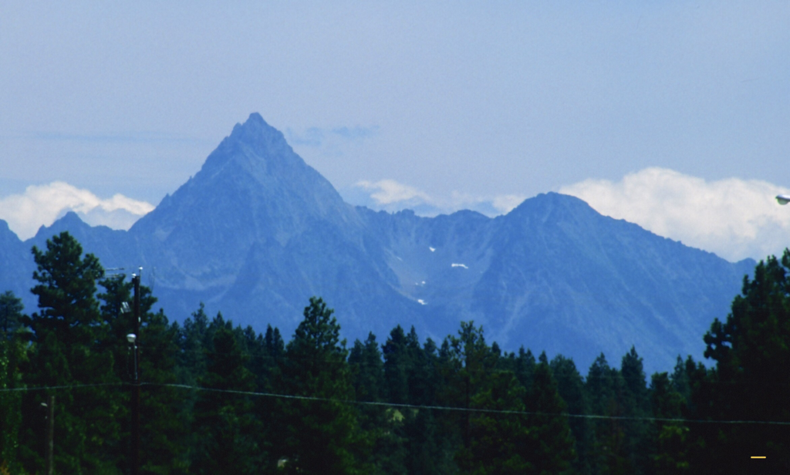
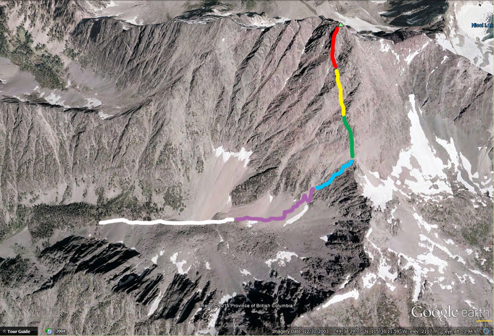
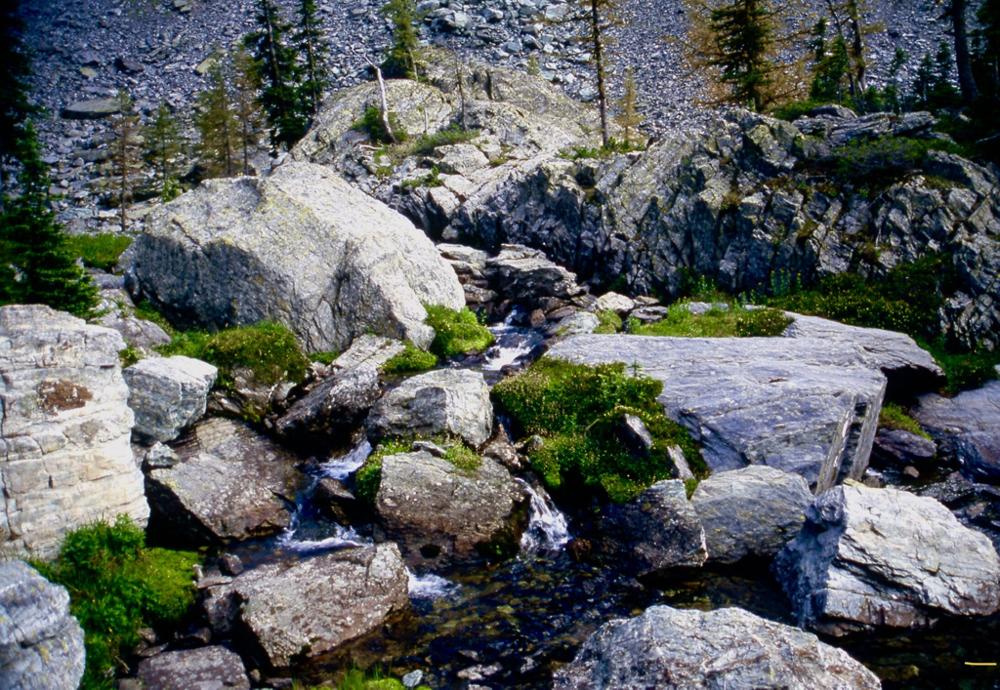
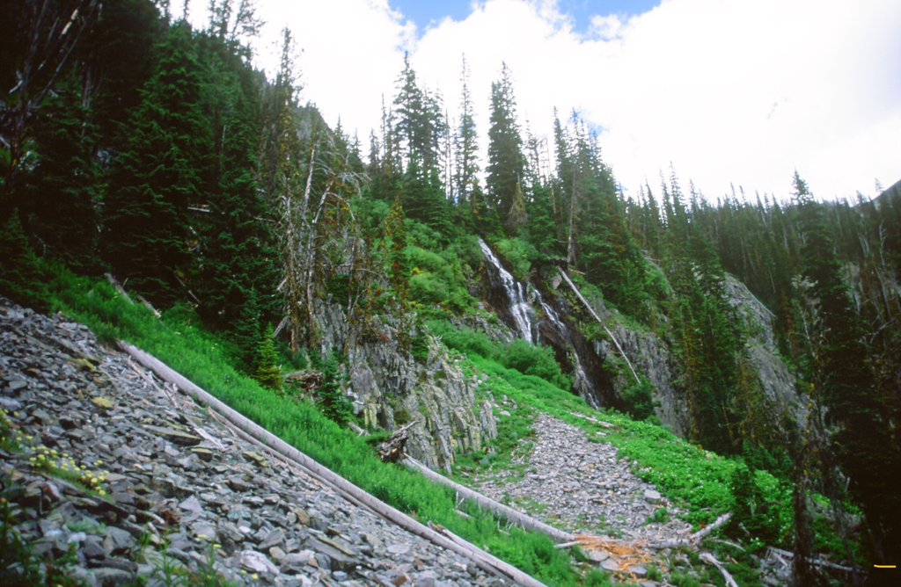
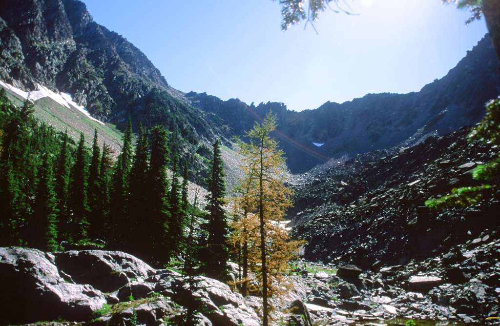
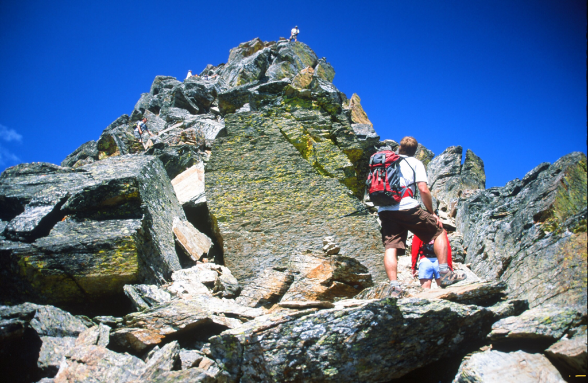
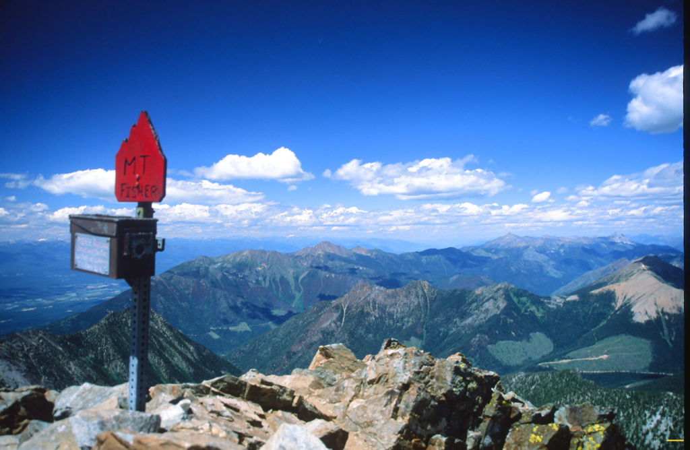
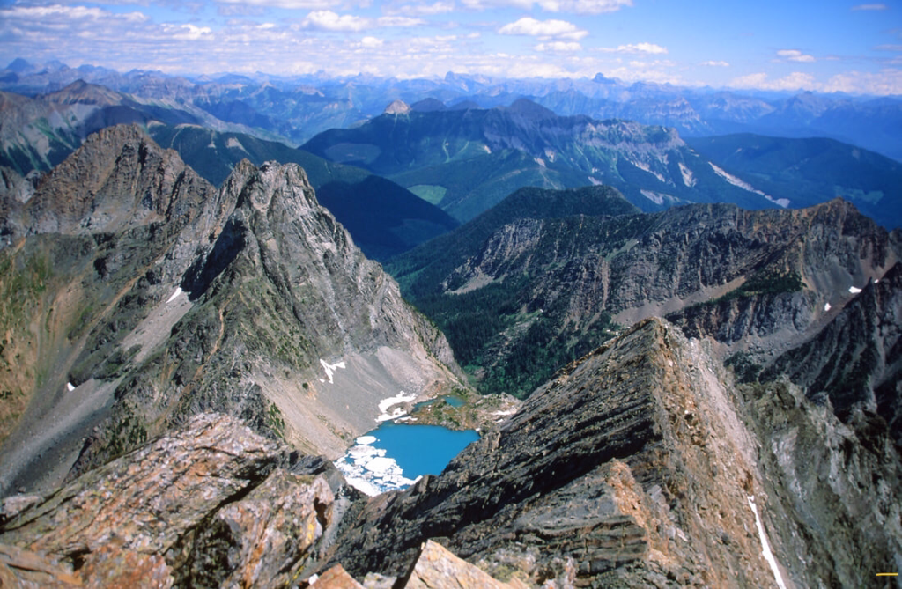

---
tags:
- Peaks & Mountains
- Strenuous
- Scrambling
stats:
- label: Event Type
  icon: hiking
  value: Scrambling
- label: Distance
  icon: map-marker-distance
  value: 11.1 miles RT
- label: Elevation Gain
  icon: elevation-rise
  value: 5208’
- label: Difficulty
  icon: speedometer
  value: Extremely strenuous
- label: Maps
  icon: map
  value: Cranbrook 82 G/NE-NW
- label: GPS
  icon: crosshairs-gps
  value: Trailhead 49°38’01″N 115°30’42″W
notes:
- label: Summit GPS
  value: 49°38’47″N 115°29’04″W
---

# Fisher Peak

## Description

If you have ever visited Cranbrook, you may have noticed Fisher Peak to the East. Fisher Peak is in the
Fisher Range of the Southern Canadian Rockies. From Cranbrook, Fisher sticks up 1,300’ above the tallest
peaks in the range. Its prominence is a draw I just could not resist. After driving to the trailhead, I van
camped so I’d be ready bright and early. I woke at 5am, ate breakfast, and decided I wanted to climb a
vertical mile to the top. So I hiked down the road about 80 verts to start my ascent.

The trail starts out like most trails in the Rocky Mountains: rocky and somewhat steep. Then it gets
steeper. It seemed to me that about every 2,000 verts, there’s a less steep section that holds small ponds
and a moment of relief from the relentless UP. Above one section, there’s a nice waterfall to stop a minute
to catch your breath. The next 2,000’ is on loose scree up through a narrow gully, and is above the tree
line. The gully is edged with fluted vertical rock bands that offer great images.

The third vertical section rises higher amongst high ridges all around you. The scenery is spectacular
within these sections. Wildflowers, marmots, and birds tend to lift your spirits on your ascent. Then, as
you scale a near-vertical scree section that tends to rob you of your steps, you are on the saddle 1,300
verts below the summit.

During my ascent, a wedding party from the weekend decided to climb the peak. They moved up past me as I
started my ascent. They had dogs and kids with them, so I volunteered to watch the dogs while their humans
summited and shot more wedding photos. In a short time, one of the guys came down to relieve me of my dog
duties.

On the summit is a red summit registration box. I told them I knew cameras, and used their camera to shoot
more wedding photos. It was too crowded on the summit, so I headed down after getting the images I wanted.
They spent a long time on top, which gave me time to descend. In all of these 2,000’ sections, rock fall is
a serious concern. Be aware. And yell ROCKS loud.

About 3/4 of the way down, they overtook me on the descent. Two of them were as slow as I was, so we hiked
and chatted about what a beautiful climb it is.

When the three of us reached the cars, the folks had their cars pointed in the direction of the trailhead.
What was really nice was that they had a large cooler of Canadian beer on ice. We sat on fenders and drank
beer until I needed a rest. After I drove back to Cranbrook, I couldn’t take my eyes off Fisher Peak.

## Directions

From Fort Steele, turn off Highway 93 at the Fort Steele Gas Station and Campgrounds onto the Wardner-Fort
Steele Road. After precisely 2.0 kilometers, turn left onto Mause Creek Road (totals (T) are from this
point). Follow the main road for 2.1 kilometers (T 2.1 km), and go straight ahead (do not take the fork to
the right). After 1.3 km (T 3.4 km), continue straight ahead (do not take the fork to the left). After 6 km
(T 9.4 km) you will see the trailhead sign on the left, and some parking spots mostly on the right.

## Option #1

While you are in the area, drive up to Kimberley, and visit Marysville Falls.

## Option #2

After visiting Marysville Falls, get back on Canadian Hwy 95A, and drive NE towards Canadian Hwy 93. Along
the way, watch the right (east) side of the road for a spectacular display of every ski you have ever owned.
A property owner has collected old skis for decades, and wired them to his fence. They had to separate the
sets of skis, because people have been stealing them.

## Hazards

This is a serious hike/scramble. Weather and rock fall are big concerns. BE PREPARED.

## Cool Things Close By

Cranbrook, Kimberley, Purcell Wilderness P.P., Goat Range P.P., Valhalla P.P., The Rockies P.P., and of
course, the home of Kokanee Beer in Creston, B.C.

## Restaurants & Pubs

N/A

## Photo Gallery

_Fisher Peak in winter, east of Cranbrook, BC, from Fisher Peak, Idaho._

_Fisher Peak from near Cranbrook, BC, Canada._

_An aerial image of the route to Fisher Peak._

_A creek along the lower section of Fisher Peak Trail._

_A waterfall along the trail._

_Chic taking a break on the steep scree slope before the summit pitch._

_Climber’s registration box on the summit._

_Nicol Lake and the Canadian Rocky Mountains, from the summit._
