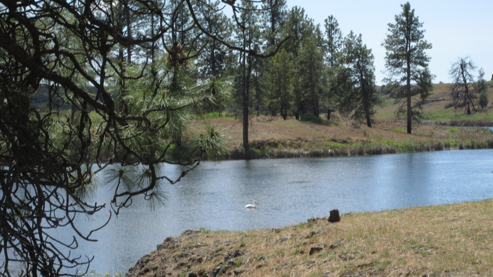
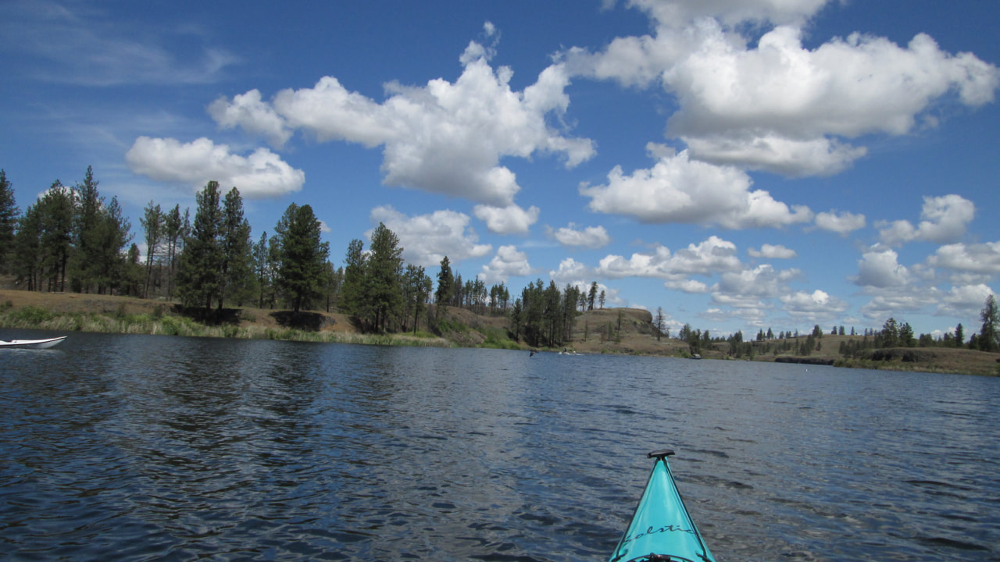
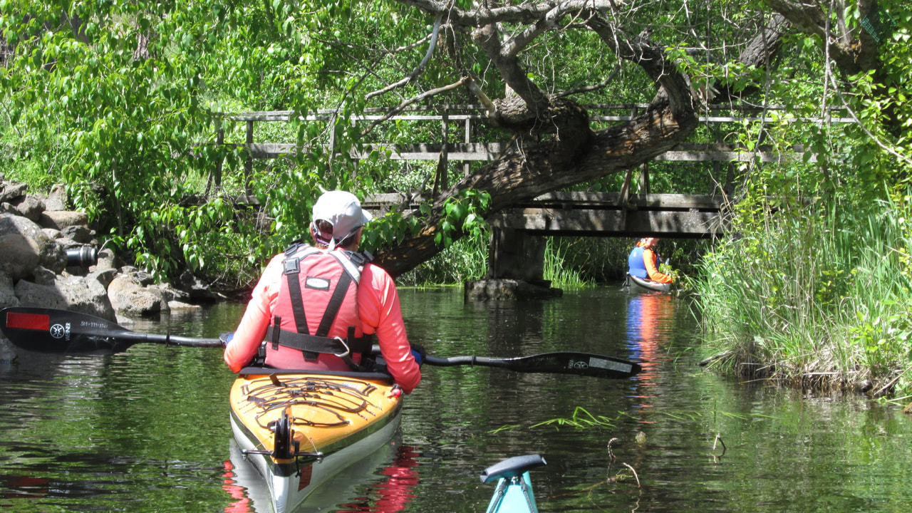
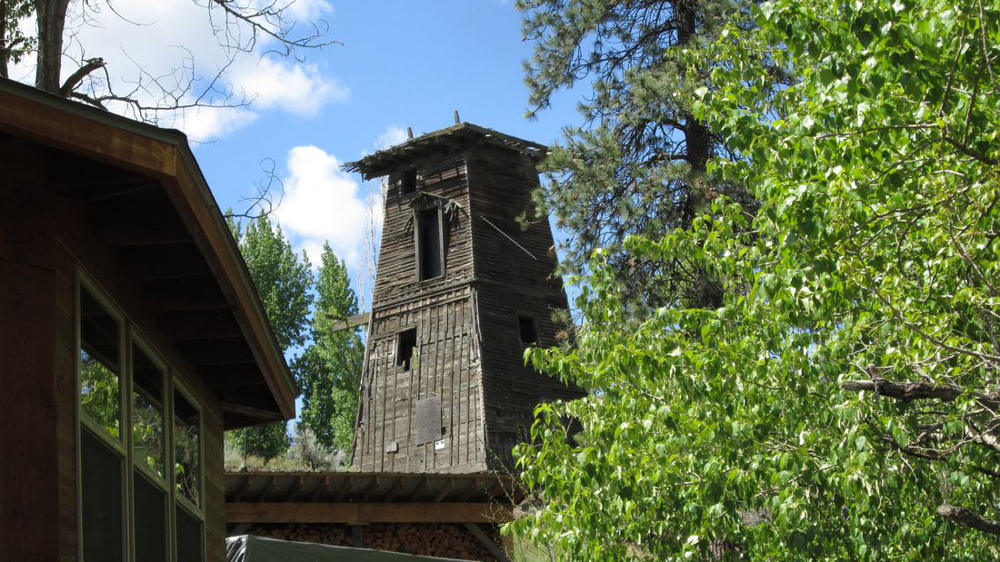

---
tags:
- Lakes
stats:
- label: Paddle Distance
  icon: map-marker-distance
  value: 6.6 miles RT
- label: Elevation
  icon: terrain
  value: 1,978'
- label: Length and Acreage
  icon: vector-square
  value: 2.0 miles long & 190 acres
- label: Maps
  icon: map
  value: USGS - FISHTRAP LAKE, BLM Fishtrap-Miller Ranch map
- label: GPS
  icon: crosshairs-gps
  value: '*47°21’17" n 117°49''25"w'
- label: Spokane County Sheriff
  icon: shield-account
  value: 509.447.2240*
---

# Fishtrap Lake Wa

## Paddling instructions

We have added the areas sheriff’s emergency phone numbers for each trip write up under the ranger district info. if an emergency ocurrs, evaluate your circumstances and call only if needed.
​Spring is the perfect time of year to paddle Fish Trap lake: it is not too hot, the grass is green, the flowers are blooming, and the birds are in their breeding colors. There is a lot to do here: fish, camp, hike, bike and paddle. This is the perfect spot for kids to explore the natural world. I can only imagine the generations that had the opportunity to grow up on the farms around here. A couple of the farms been sold to the public so that we can all get a taste of life in the scab lands. Most of the north side of Hog Canyon is BLM land including the majority of the lake shore.

## Items of interest

The BLM Fishtrap Recreation Area has a trail head with several hikes leading north and south from there. On the left side of the road into the lake Folsom Farm interpretive site demonstrates how the landscape was converted into small farms. The is an old dance hall built over the inlet to the lake dating back to the first World War. Imagine the stories to be told there.

## Directions

From Spokane, go west on I-90 to Fishtrap Exit 254, then south 2 miles on Old State Highway to Scroggie Road, then east 1.5 miles to the Public Fishing  sign.

## Hazards

None other than the water is cold in the spring and watch out for the cow patties.

---

## R & p

Fishtrap Lake Resort, Lenny’s in Cheney

---

## Plan your trip

[Click for Current NOAA Weather Conditions](https://www.nws.noaa.gov/wtf/udaf/MapClick.php?lel=4000&uel=9000&polygon=49.016%2C-114.180%2C48.994%2C-114.381%2C48.890%2C-114.341%2C48.924%2C-114.151%2C&area=63)

## Photo gallery

---

## White Pelican

---

## Looking North East Up the Lake

---

## Turtles

*Picture (Image missing)*

---

*Picture (Image missing)*

---

## Inlet

---

