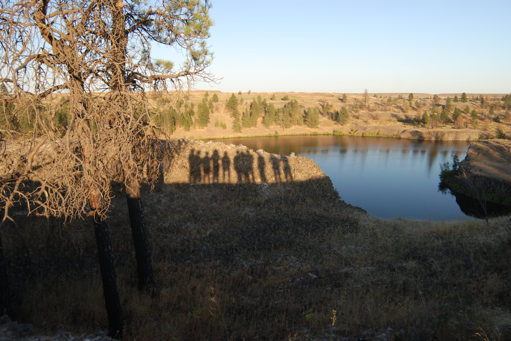

---
tags:

- Lakes

- Easy

- Day Hiking

- Paddling

- Mt Biking

- Fishing

- Equestrian

stats:

- label: Event Type
  icon: hiking
  value: Day hiking, paddling, mt biking, fishing, equestrian

- label: Distance
  icon: map-marker-distance
  value: 6.5 miles with variations

- label: Elevation
  icon: terrain
  value: Minimal

- label: Difficulty
  icon: speedometer
  value: easy

- label: Maps
  icon: map
  value: BLM maps, FishTrap topo

- label: GPS
  icon: crosshairs-gps
  value: 47°21’64" n 117°49’84" w

- label: Managing Agency
  icon: domain
  value: blm. 509.536.1200

- label: Spokane County Sheriff
  icon: shield-account
  value: CALL 911 FIRST or 509.477.2240
---

# Fishtrap Lake

## Description

We have added the areas sheriff’s emergency phone numbers for each trip write up under the ranger district info. if an emergency ocurrs, evaluate your circumstances and call only if needed.
As with many drives west of Spokane, the terrain looks dry and desolate. But with a little exploring, you find great opportunities for hiking and other activities. The Fishtrap Lake area consists of 9,000 acres to explore.
As you get closer to the lake, well maintained trailheads and trails appear. Fishtrap Lake sit about 30 or 40 feet below the lay of the land. On the north end of the lakes is the Fishtrap Lake Resort and a public boat launch.
In 2016 thru 2018, the Spokane Mountaineers and the Washington Trails Association, have built new trails and redone sections to enhance visitors experiences. On the west side of the lake, the trail runs from Farmers Landing in the south to beyond the north shore line, and the Fishtrap Lake Resort. Stop by a kiosk for a brochure with current trail routes.

For paddlers, put in at the public launch near the Fishtrap Resort, and paddle SW to see the entire lake about 3 miles long. At about 2 miles down lake, look for a protected cove on the west side of the lake. Find a place to beach your boat and climb up onto the high shore line.
Here the views of the unique cove are great. Just north about 200' is a deep pothole created during the Glacier Lake Missoula Floods.

## Directions

North trailhead
Drive west on I-90 to about 25 miles to the Fishtrap exit #254, and turn left over the freeway on the Sprague Highway. At 2.5 miles turn left onto Fishtrap Road to a trailhead for several trails.

South trailhead
After exiting I-90, drive south on the Sprague Highway for about a mile past the Fishtrap Road, and turn left to the BLM Ranch House, and turn right for less than a mile to the trailhead.

## Hazards

Rattlesnakes, wood ticks, heat, and dust. There are ankle sleeves you can buy to avoid snake bits.

## Cool things close by

Fog Canyon, Lake & Falls, the Turnbull National Wildlife Refuge, Bonnie and Rock Lakes, and Escure Ranch & Towell Falls.

## R & p

Lenny’s in Cheney.

---

## Plan your trip

## Photo gallery

*Picture (Image missing)*

## A secluded cove just south of mid lake

## Shadows of spokane mountaineers on a wednesday night hike

---

*Picture (Image missing)*

## Fishtrap lake area

## Images coming soon
