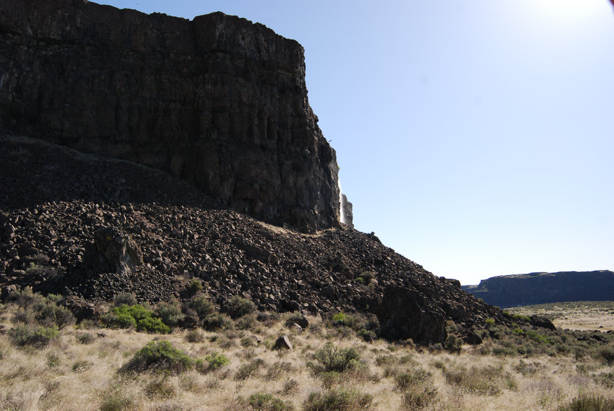
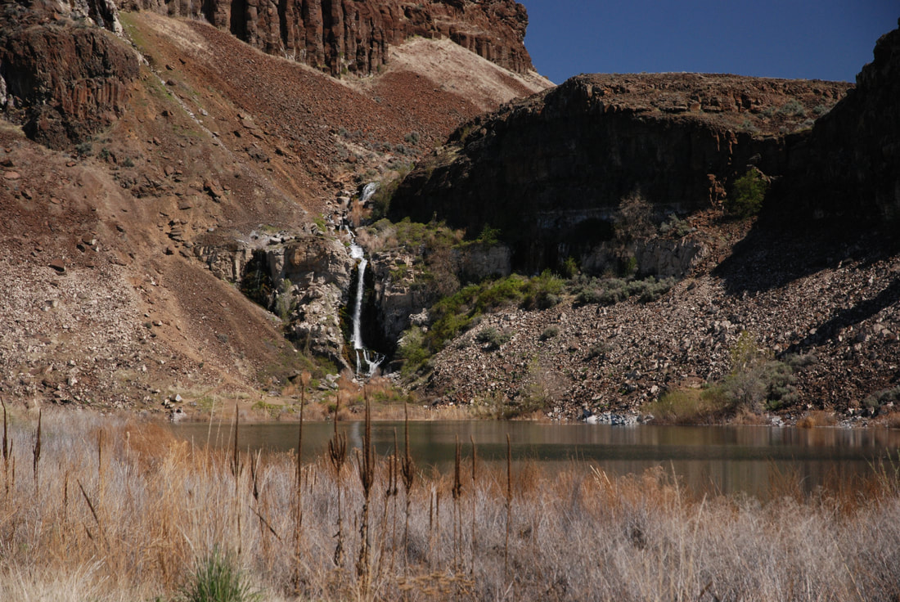
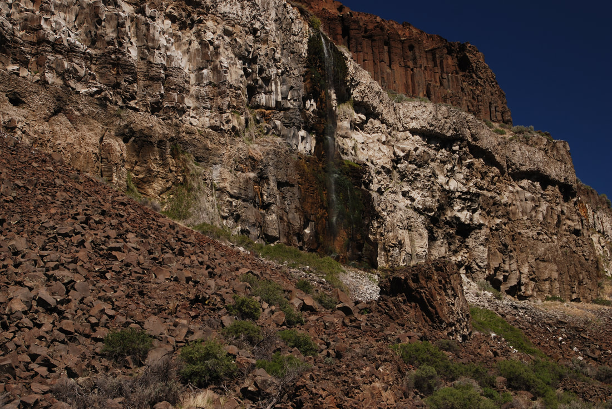
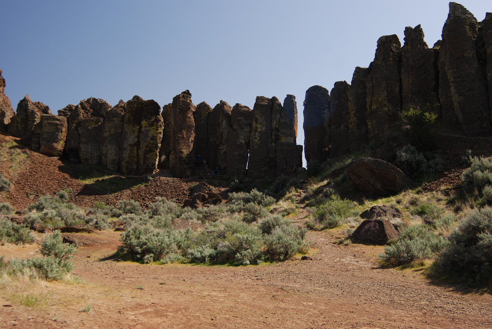

---
tags:
- Trails & Scrambles
- Day Hiking
- Backpacking
- Equestrian
- Mt Biking
- Climbing
stats:
- label: Event Type
  icon: hiking
  value: Day hiking, backpacking, equestrian, mt biking, climbing
- label: Distance
  icon: map-marker-distance
  value: 4 miles RT
- label: Elevation
  icon: terrain
  value: 100’ to the falls. 400-500 ‘ to the rim
- label: Difficulty
  icon: speedometer
  value: easy to the falls. Moderate to the rim
- label: Maps
  icon: map
  value: Washington Dept. Fish & Wildlife, Columbia Basin Wildlife Area, Bancock Ridge
    topo
- label: GPS
  icon: crosshairs-gps
  value: 47°08’38" n 119°59’52" w
- label: Managing Agency
  icon: domain
  value: w. d.f.& w. 509.765.6641
- label: Grant County Sheriff
  icon: shield-account
  value: CALL 911 FIRST or 509.754.2011
---

# Frenchmans Coulee

*Frenchman coulee, washington scablands*

## Description

We have added the areas sheriff’s emergency phone numbers for each trip write up under the ranger district info. if an emergency ocurrs, evaluate your circumstances and call only if needed.
From the parking area, the trail heads NE for about .2 miles to a "Y", and bear right. After about another .2 miles bear right (east) up into the coulee.
About 2 miles up the coulee, take note of the waterfall along the north rim. As you pass beneath the power lines, walk towards the waterfall.
This fall is intermittent run off from area farms. Do not drink or purify the water.
In early spring the area is carpeted with wildflowers.
Hiking in the Washington Scablands in the summer is very hot and dry.
Take extra water with you, and protect yourself from the blistering sun.
The Spokane Mountaineers were contributors to the pit toilets that are now in use near the Feathers and camping area.

## Option #1

To extend your hike, walk the old road for about .4 miles above the falls and out of the coulee.
You can either retrace your steps back to the cars, or you can walk along the high rim, west, back towards the Babcock Bench. The views of the mighty Columbia River stretch out before you.

## Directions

Drive I-90 west to exit #143, and turn right (north) on Silica Road. After about .8 miles turn left (west) onto the Vantage Road, which was the old Hwy 10. After about 3.6 miles you will drop back down into Frenchman Coulee. Stop by and watch the climbing community on the Feathers.

## Hazards

As in all the Scablands, DO NOT DRINK SURFACE WATER. TAKE ALL YOU WILL NEED. Filtering won't do the job
And ALWAYS be on the lookout for rattlesnakes. They won’t strike unless you invade their space. There are ankle shields you can buy, to protect yourself.
Keep in mind that snakes come out to warm up nine the sun. So be aware that south, south east & west sides of rocks and bushes, may be where they are at.

A word of caution while hiking in the scabs
Because the terrain you will be in while hiking, you must be aware of your surroundings.
Note all high points and landmarks. Even those off in a distance. Take a picture of them to use if you need to orientate yourself.
They can be use to gain perspective of your current location, as apposed to your entry route.
Always make sure Each hiker is carrying a map of the area.
And do not allow any hiker in your group to wonder off.
Your group Must stay together.

There are safety shin guards you can buy to protect from snake bites.

---

## Cool things close by

Quincy Lakes, the Columbia Basin Wildlife Area, the Columbia River, the Gorge music venue, and Breezy Hills.

## R & P

Lenny’s In Cheney.

## Photo gallery

---

## As you enter the frenchman coulee, this waterfall drops from above

*Picture (Image missing)*

## A lone rock stands near the entrance to frenchman's coulee

*Picture (Image missing)*

## A waterfall off the coulee rim falls about half way into the canyon

## Near the back of the coulee a waterfall drops a tier then again to the small pond

*Picture (Image missing)*

## Walk around the lake for a place to have lunch and enjoy the sounds and sights

## As you leave the pond and waterfall, look for large raptors floating on the thermals

## As you walk west back towards the trailhead, another fall offers great sounds

## The feathers climbing area near the west entrance to the coulee

---

---

---

---

---

---

---
