# Fungi   Rooms

---

## Fungi - rooms

---

## Click on the image to enlarge

"

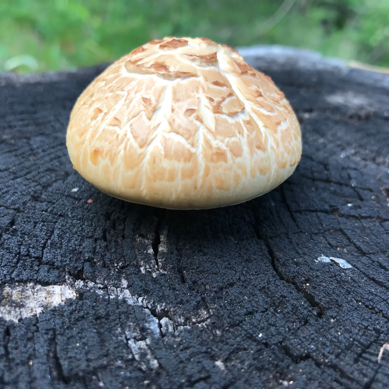{: data-src="assets/images/152022114p_orig.jpeg" data-title="GIANT SAWGILL" }

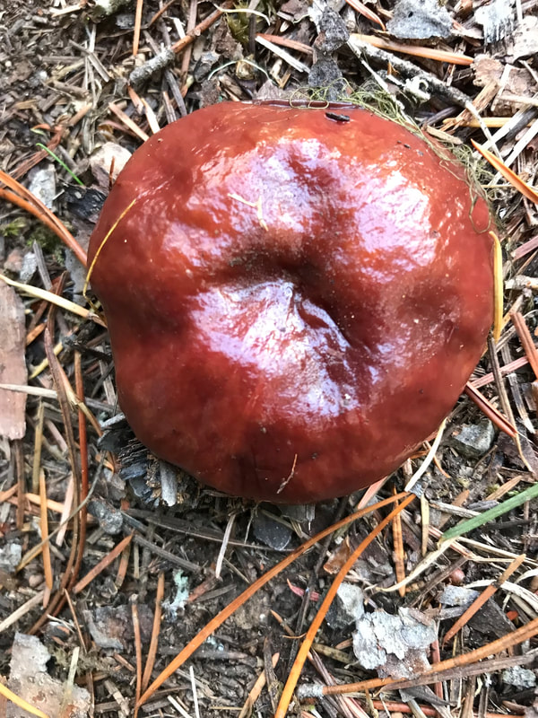"

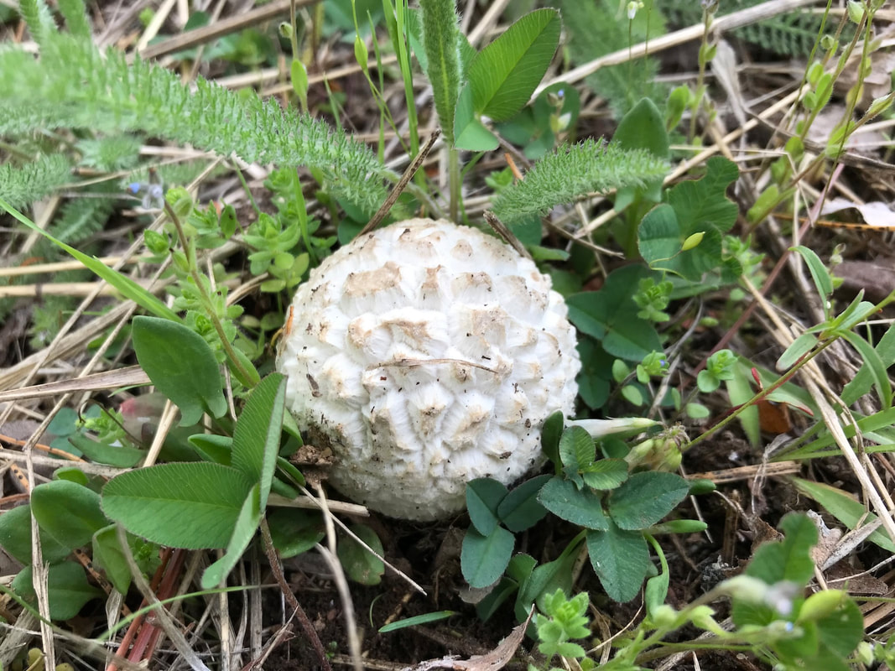{: data-src="assets/images/1520221151p_orig.jpeg" data-title="PUFFBALL MUSHROOMS" }

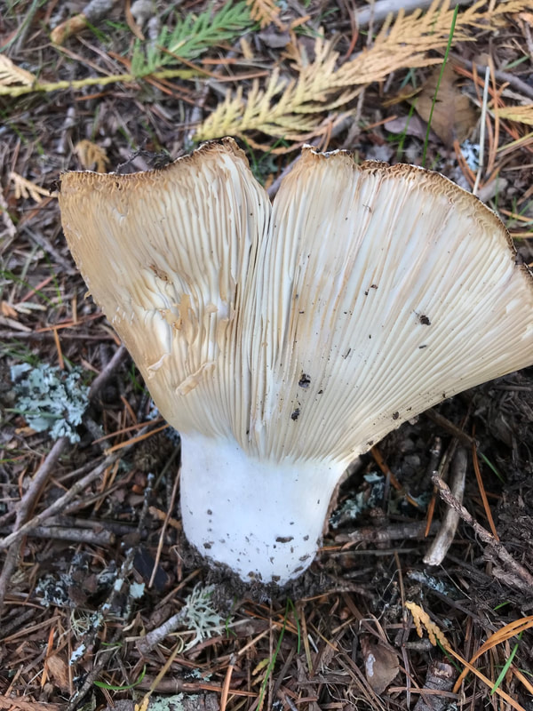"

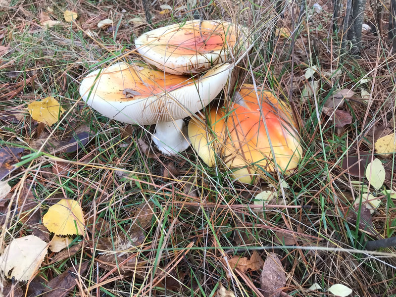{: data-src=" data-title="FLY AGARIC" }

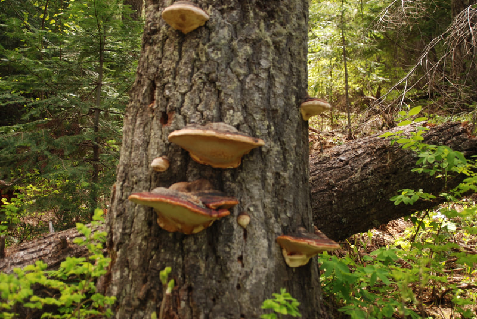"

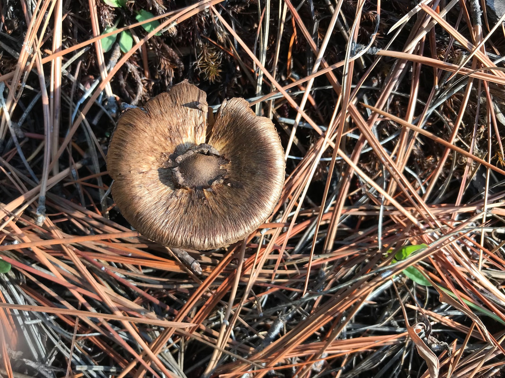{: data-src="assets/images/152022120p_orig.jpeg" data-title="Image" }

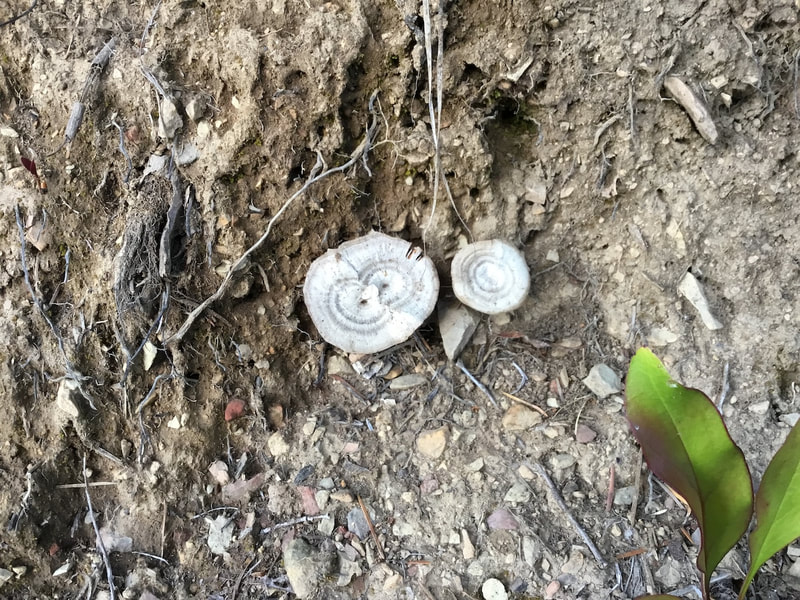"

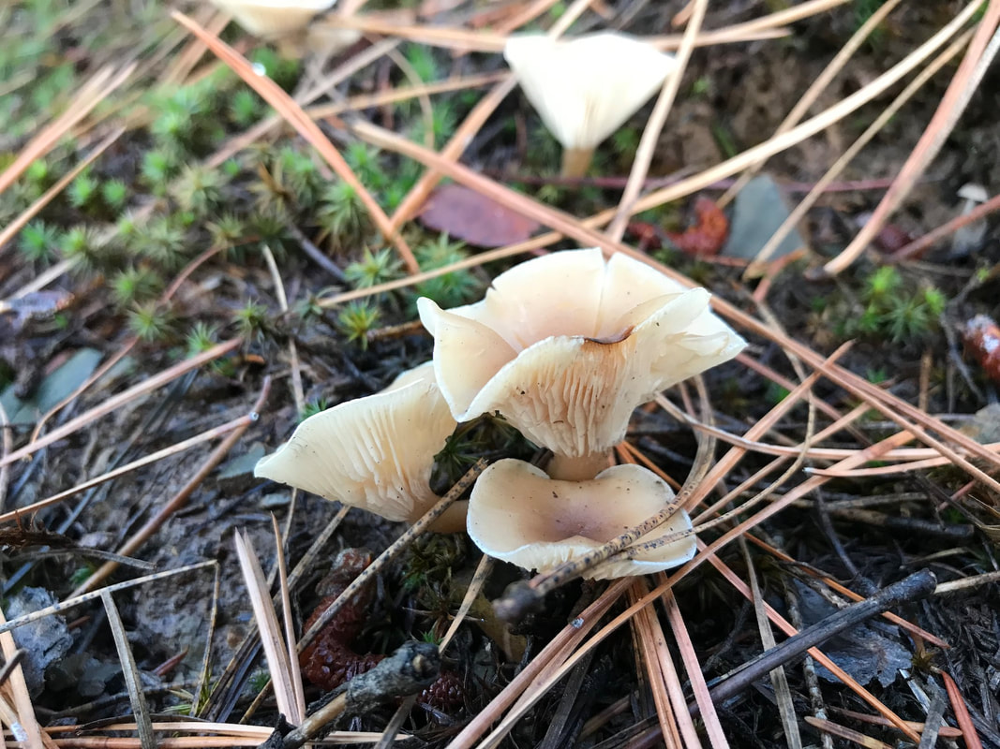{: data-src="assets/images/152022122_orig.jpeg" data-title="UNKNOWN" }

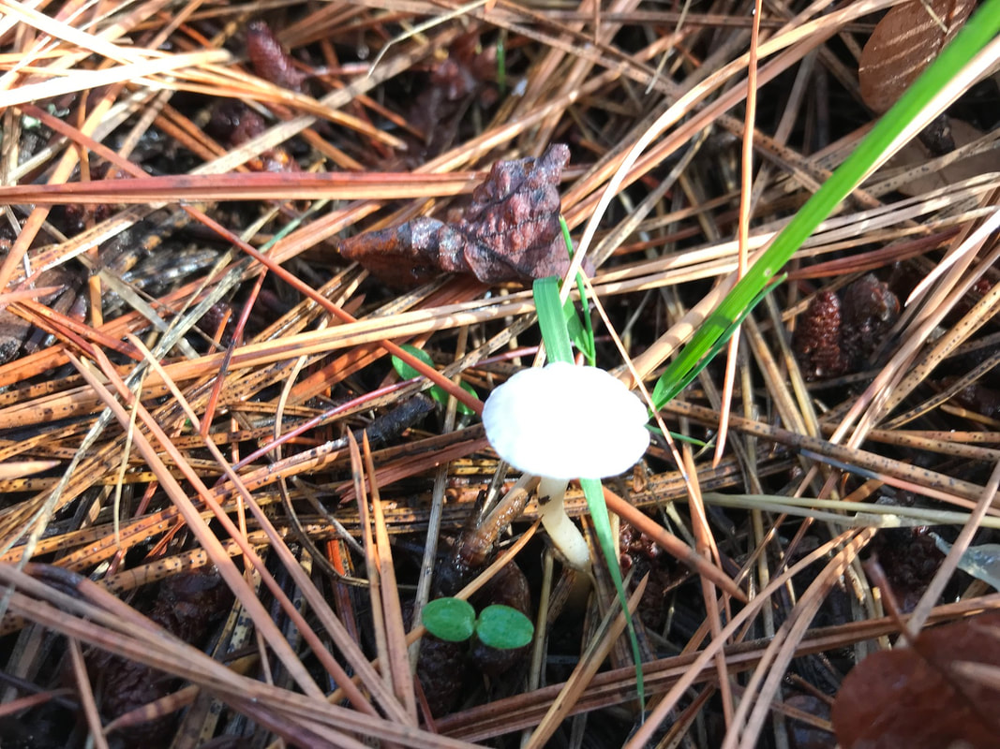"

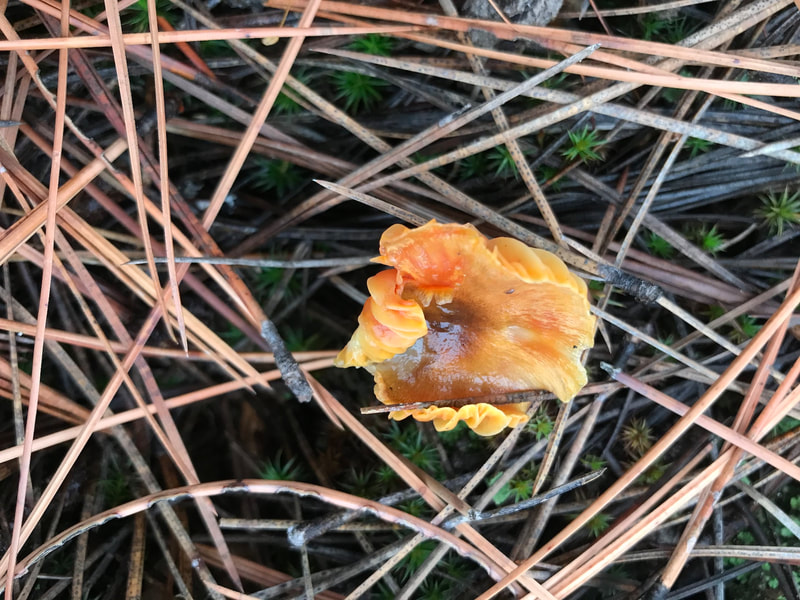{: data-src=" data-title="UNKNOWN" }

"

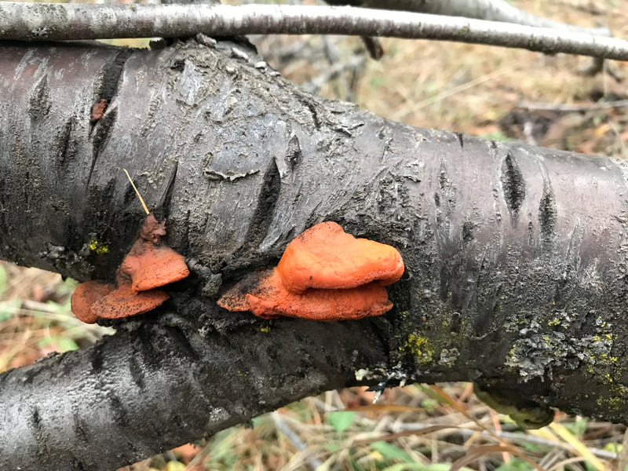{: data-src=" data-title="TRAMETES CINNABARINA" }

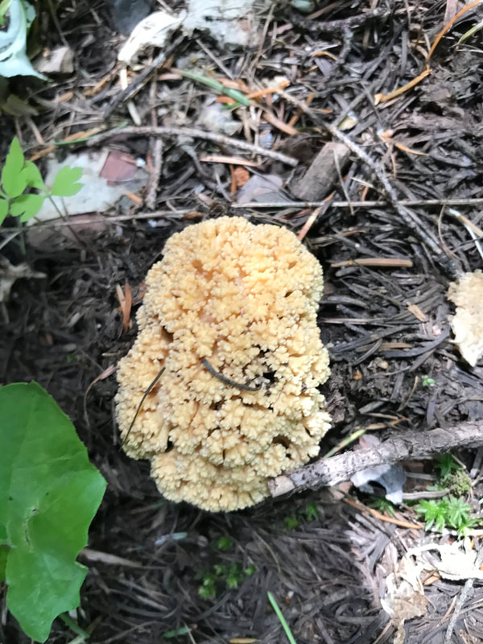"

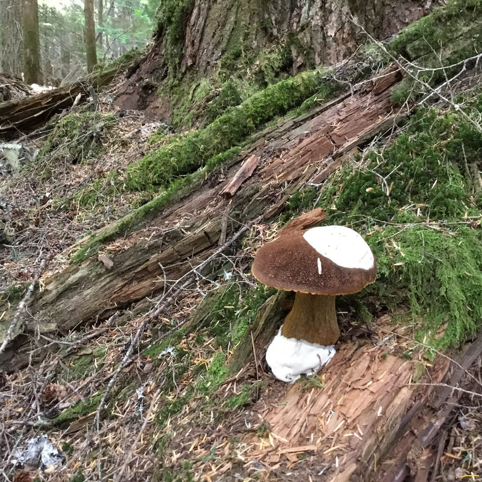{: data-src=" data-title="KING BOLETE" }

"

{: data-src="assets/images/152022121p_orig.jpeg" data-title="UNKNOWN" }

"

{: data-src=" data-title="UNKNOWN" }

"
