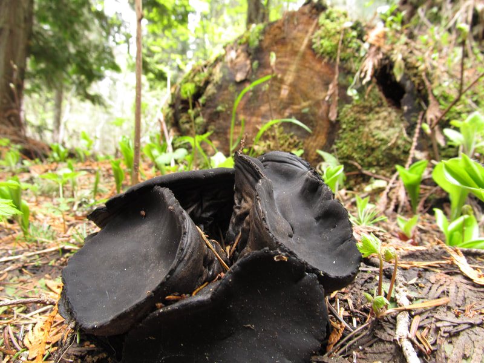

---
tags:
  - Flora & Plants
  - Photo Gallery
---

# Fungi & Mushrooms

Click any image to enlarge and view high-resolution photo and caption.

## Photo Gallery

- 
- 
- 
- 
- 
- 
- 
- 
- 
- 
- 
- 
- 
- 
- 
