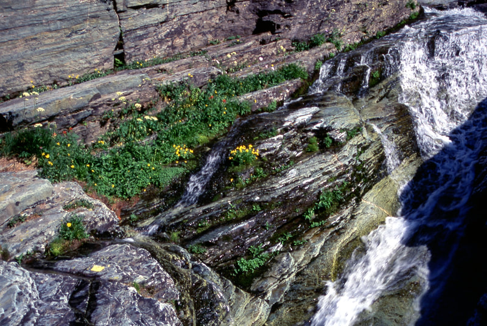

---
tags:
  - Streams & Rivers
  - Photo Gallery
---

# Streams to Rivers

Click any image to enlarge and view high-resolution photo and caption.

## Photo Gallery

- 
- 
- 
- 
- 
- 
- 
- 
- 
- 
- 
- 
- 
- 
- 
- 
- 
- 
- 
- 
- 
- 
- 
- 
- 
- 
- 
- 
- 
- 
- 
- 
