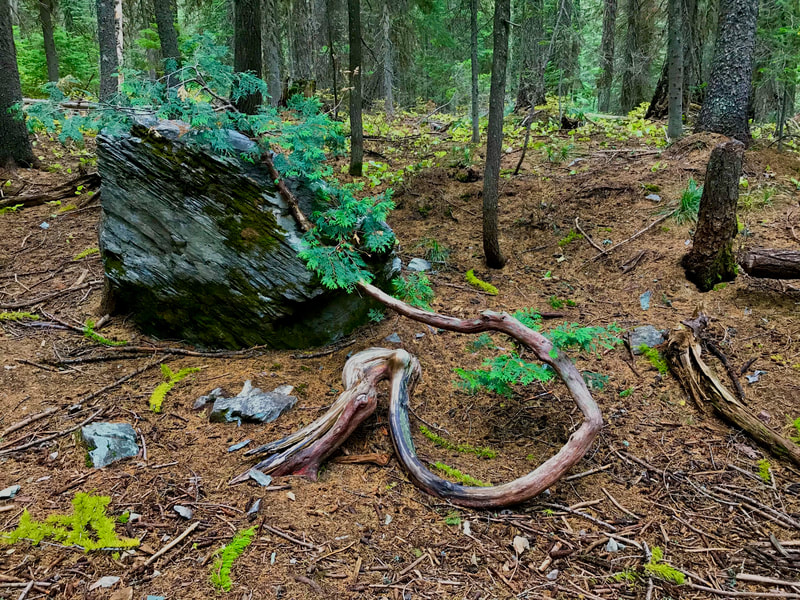
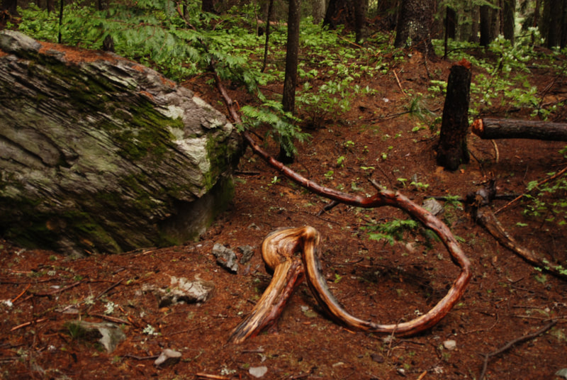
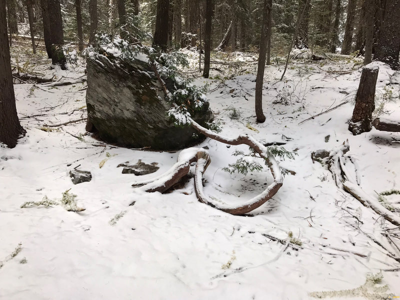
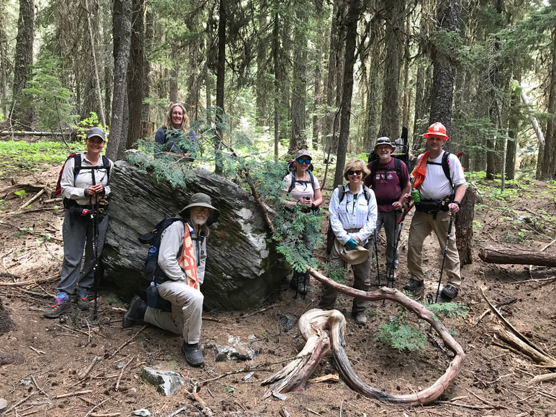
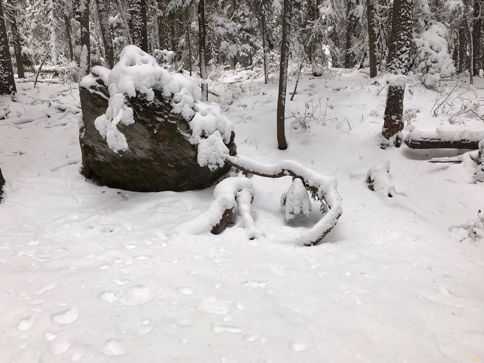
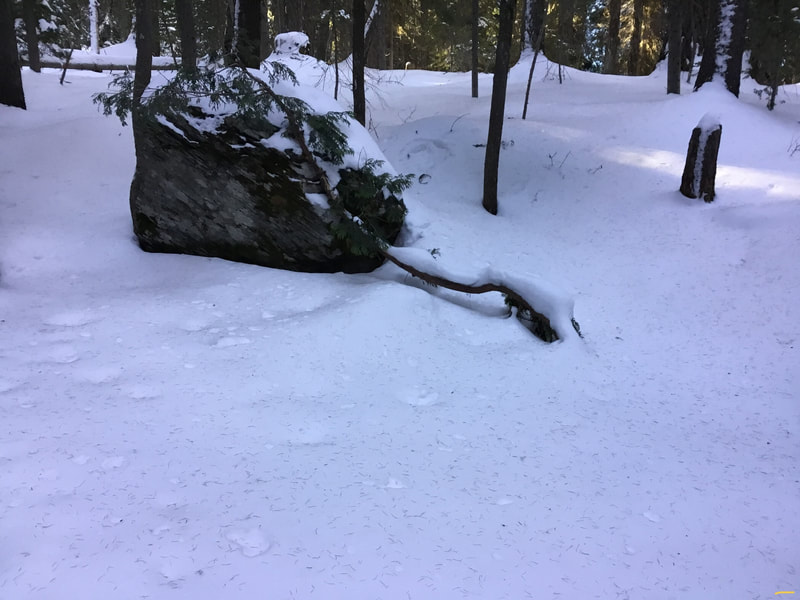
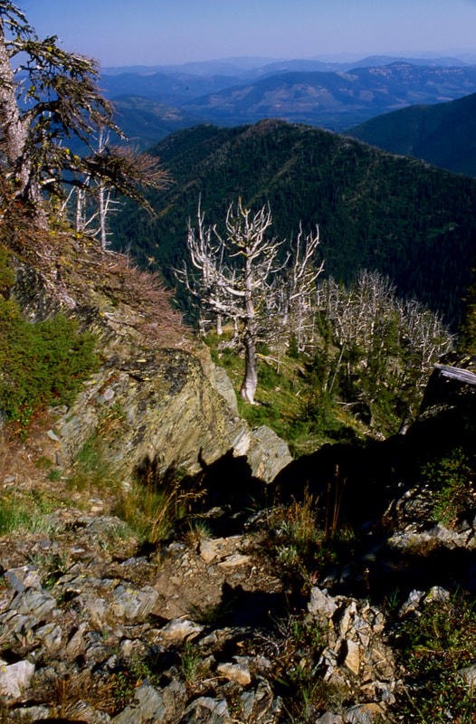
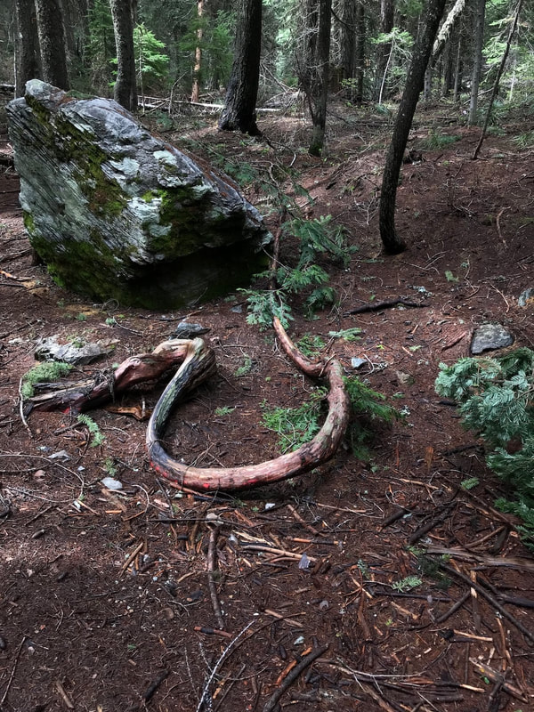

---
tags:
  - Flora & Plants
  - Photo Gallery
---

# Trees

## Identification Resource

For off-grid tree identification while hiking in the Inland Northwest, **TreesPNW** is an essential offline mobile resource. Rather than relying on cellular coverage, **TreesPNW** works as a self-contained mobile guide accessible anywhere in the backcountry to identify native conifers, western red cedars, and sub-alpine species. Search your mobile app store for *TreesPNW* to download the free guide.

Click any image to enlarge and view high-resolution photo and caption.

## Photo Gallery

- 
- 
- 
- 
- 
- 
- 
- 
- 
- 
- 
- 
- 
- 
- 
- 
- 
- 
- 
- 
- 
- 
- 
- 
- 
- 
- 
- 
- 
- 
- 
- 
- 
- 
- 
- 
- 
- 
- 
- 
- 
- 
- 
- 
- 
- 
- 
- 
- 
- 
- 
- 
- 
- 
- 
- 
- 
- 
