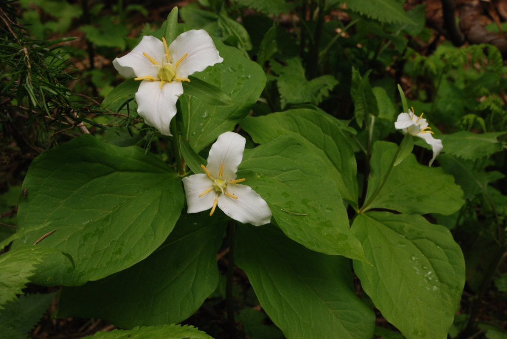
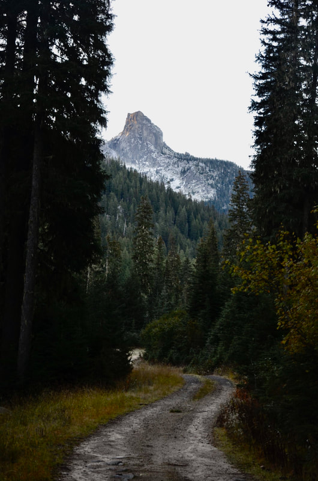
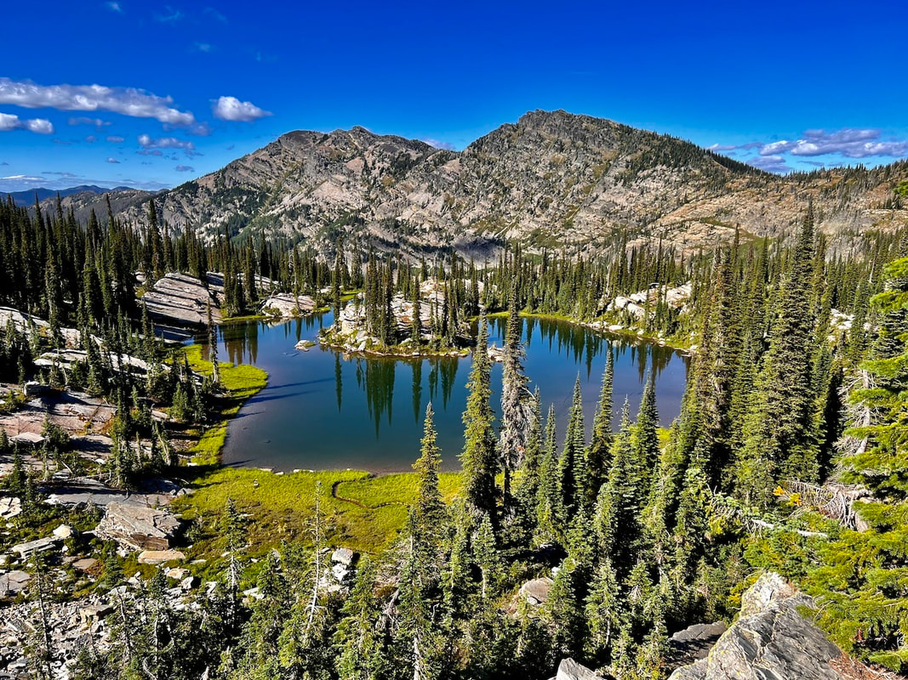
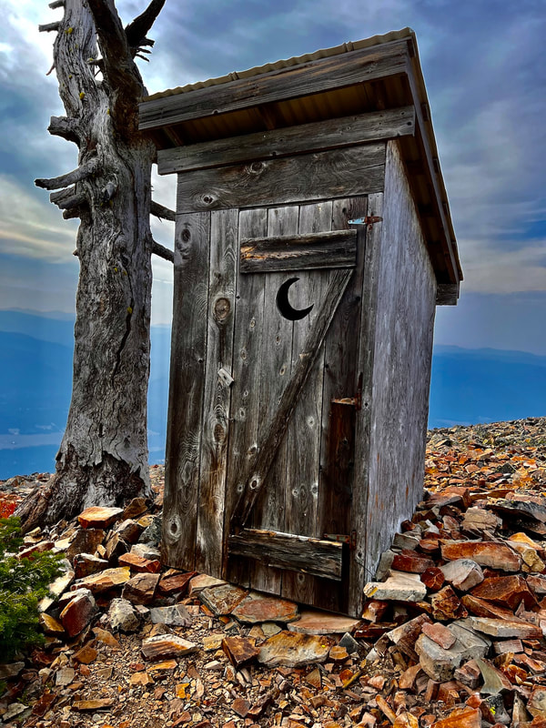
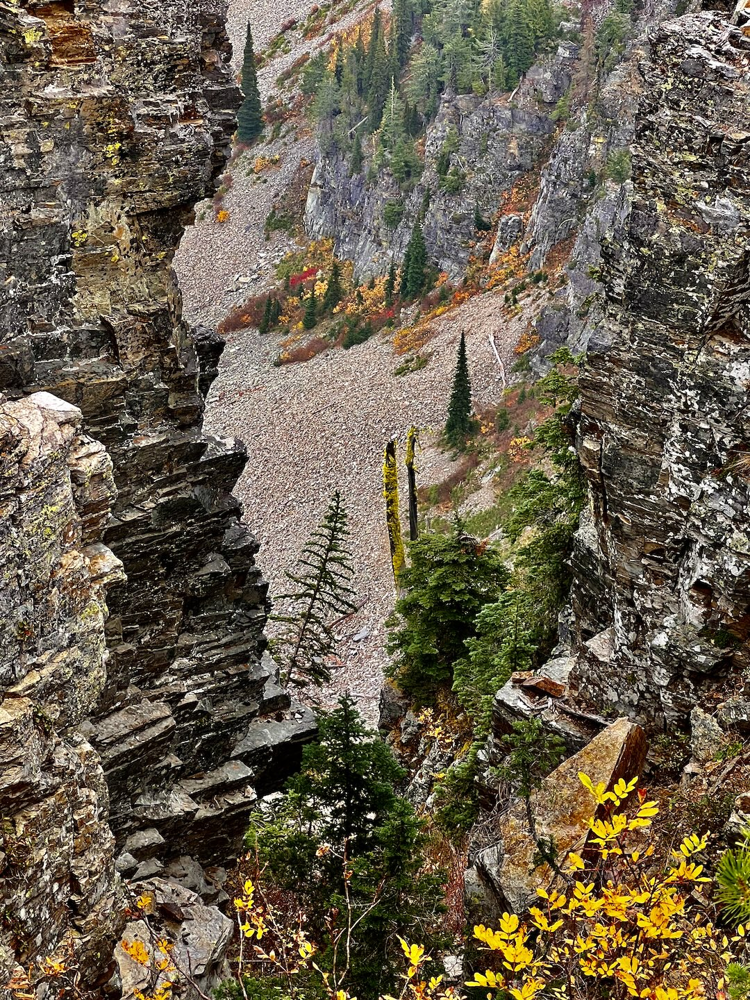
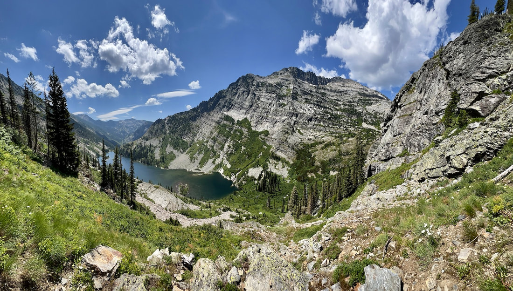
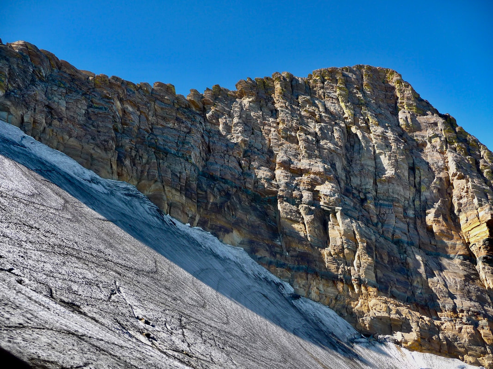

# Chris Herath

---

## Chris herath

Chris is a semi retired architect who lives in otis orchard, with his wife shea and daughters tia and sarah.
I first met chris in 1980 and have been skiing and hiking together ever since. Chris led our 2005 trip to
patagonia. see... <https://www.inlandnwroutes.com/patagonia.html>

---

## Click on the image to enlarge

_Broken spectre, a shadow cast on an underlying cloud._

## This is a "broken spectre"  a shadow cast on an underlying cloud

_Western trillium (Trillium ovatum), aka waking robin._

## WESTERN TRILLIUM (Trillium ovatum)    AKA-WAKING ROBIN

_Lions Head from the west climbers trail._

## Lions head from the west climbers trail

_Horseshoe Pond, proposed Scotchman Peaks Wilderness, MT (PSPW)._

## Horseshoe pond  popposed scotchman peaks wilderness, mt (pspw)

_The outhouse at Star Peak, proposed Scotchman Peaks Wilderness, MT._

## The outhouse at star peak proposed scotchman peaks wilderness, mt

_A view along the route to Billiard Table Mountain (PSPW)._

## A view along the route to billiard table mountain  (pspw)

_1 of 3 Libby Lakes at sunset, Cabinet Mountain Wilderness, MT._

## 1 of 3 libby lakes at sunset cabinet mountain wilderness, mt

_Rock Lake and Rock Peak up near Libby Lakes, CMW._

## Rock lake and rock peak up near libby lakes  cmw

_A rare image of the Blackwell Glacier next to Snowshoe Peak, 8738'; the closest glacier to Spokane._

A rare image of the blackwell glacier next to snowshoe peak 8738' This is the closest glacier to spokane
