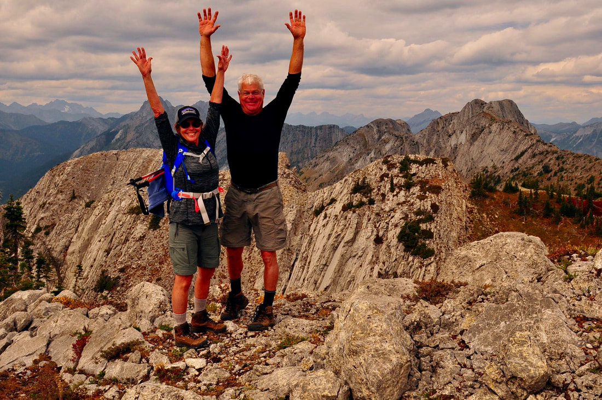
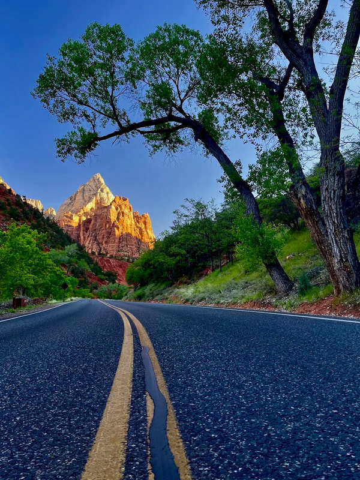
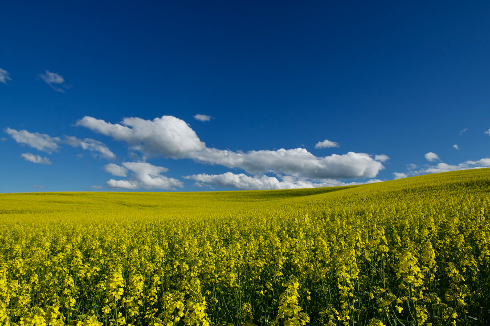
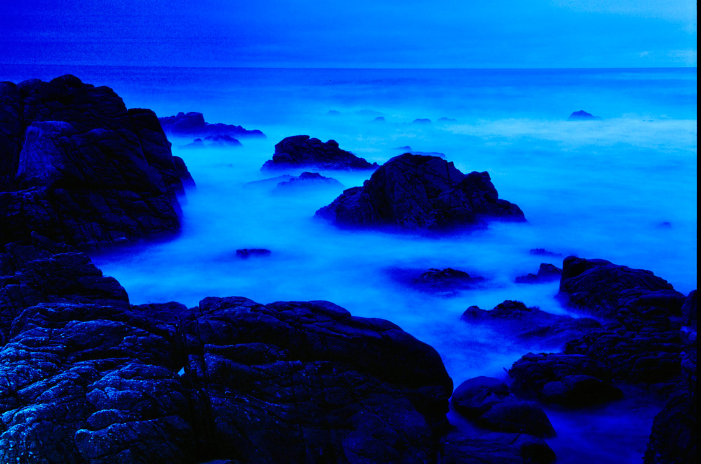

# Tony Kozlowski

---

## Tony kozlowski

Tony & melody kozlowski live in mccall, and travels the american south west in search of images to add to
his collection. They are avid mt. biker, hiker and skier.

---

## Photo gallery

Click on an image to enlarge.

_Tony and Melody Kozlowski celebrating on a rocky summit ridge._

_Tumalo Falls dropping through a fall-colored canyon._

_Zion Canyon road framed by cottonwood trees at sunrise._

_Golden aspen grove in autumn._

_Snow-covered cabin porch glowing at dusk._

_Weathered barn in a green Palouse field under stormy skies._

_Golden canola field under a blue sky with scattered clouds._

_Misty blue seascape over coastal rocks at dusk._
