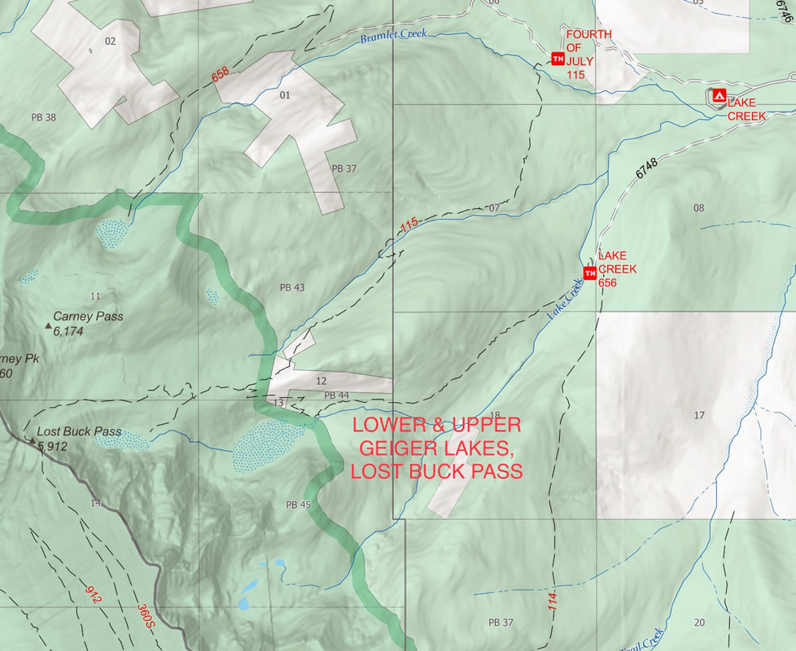
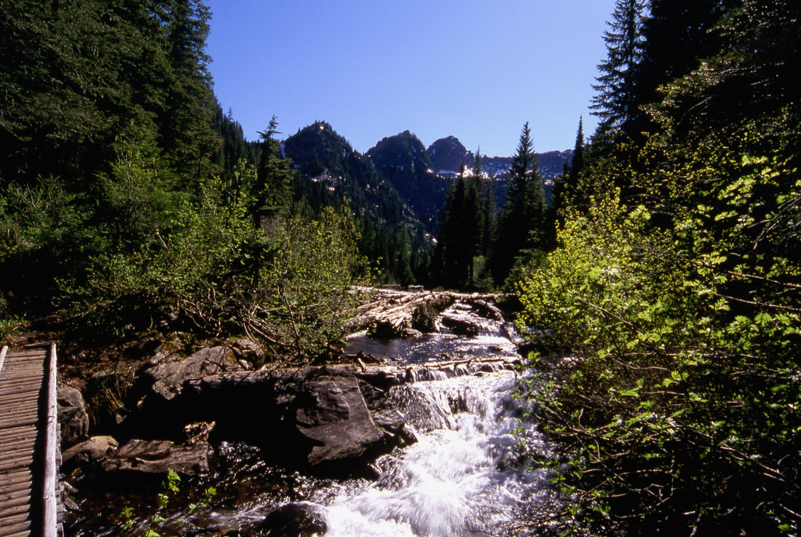
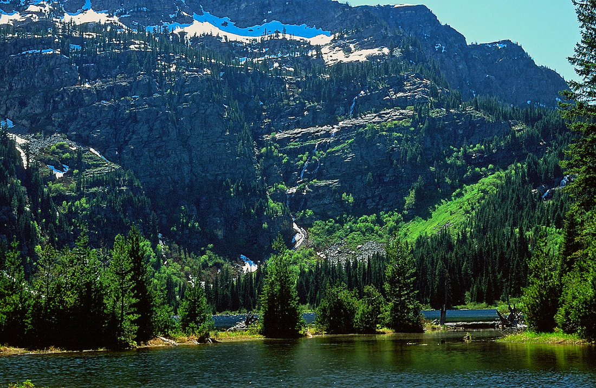
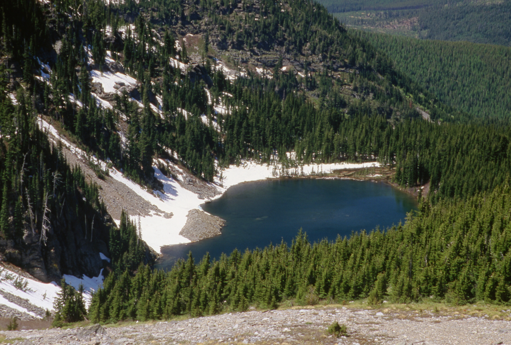
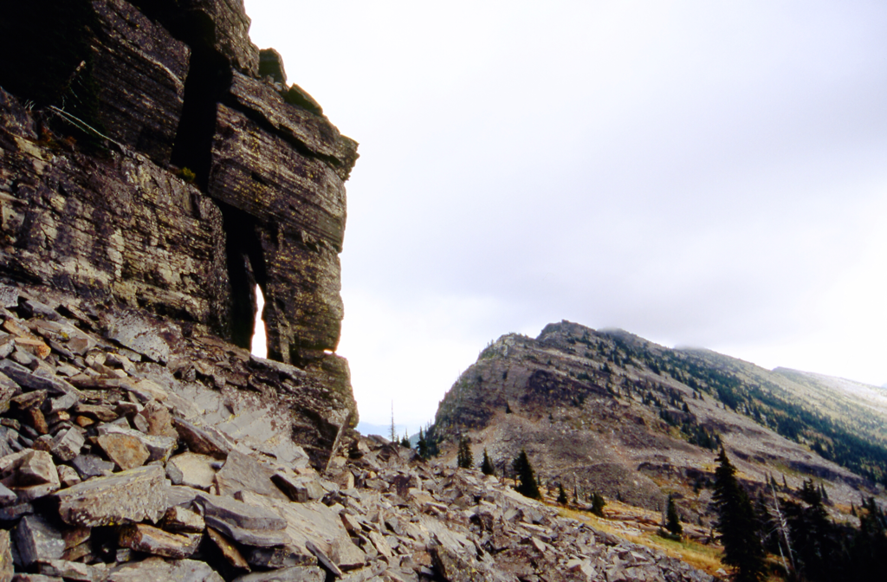
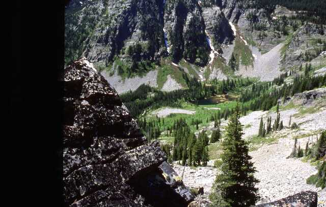
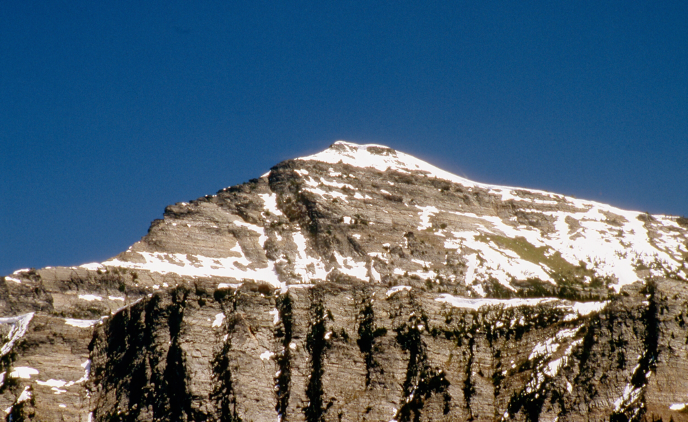

---
tags:
- Trails & Scrambles
- Moderate
- Hiking
- Backpacking
- Fishing
- Scenery
- Photography
stats:
- label: Event Type
  icon: hiking
  value: Hiking, backpacking, fishing, scenery, and photography.
- label: Distance
  icon: map-marker-distance
  value: To Lower Lake 4 miles RT, Upper Lake 6 miles RT, L.B.P. & Cabinet Divide
    Trail 8+RT miles.
- label: Elevation Gain
  icon: elevation-rise
  value: Lower Lake 1000 verts, Upper Lake 1600 verts
- label: Acres
  icon: vector-square
  value: lower 34.4…..upper 12.5
- label: Difficulty
  icon: speedometer
  value: Moderate
- label: Maps
  icon: map
  value: Kaniksu N.F., Goat Peak Topo
- label: GPS
  icon: crosshairs-gps
  value: 48°00’58" n 115°32’08" w
- label: Ranger District
  icon: pine-tree
  value: Libby R.D. 406.293.7773
- label: Lincoln County Sheriff
  icon: shield-account
  value: CALL 911 FIRST or 406.293.4112
notes:
- Kootenai national forest/alerts
- <https://www.fs.usda.gov/alerts/kootenai/alerts-notices>
---

# Geiger Llost Buck Pass

*Lower 4749’ & upper 5333’ geiger lakes*

## Description

We have added the areas sheriff’s emergency phone numbers for each trip write up under the ranger district info. if an emergency ocurrs, evaluate your circumstances and call only if needed.
Trail #656 wonders thru a young forest for 2 miles to the lower lake. An unnamed peak fills the entire backdrop of the lake, and is stunning. After spending some time here, skirt the north end of the lake and hike a mile to the upper lake.

To the north there is a trail up a cool scree slope to Lost Buck Pass and the Cabinet Divide Trail # 360. Walk south for about .2 of a mile and you can find a place to eat lunch and take in the views of Wanless Lake out to the west, with Engle Peak above. The Cabinet Divide Trail runs 6 miles to the wilderness boundary, and another 8 miles past. Spend some time up high and take in the incredible views.

## Option #1

There is a way to get over to Wanless Lake from here but it is long and requires great route finding skills.
By continuing along the Cabinet Divide Trail #360, you will find Trail #912 that leads down to Buck Lake, with Wanless Lake above its waterfall.

## Option #2

To the NW of Lost Buck Pass is Carney Peak 7173'. Scramble the south side to the top for exceptional views. 2.2 miles and 600 verts RT from Lost Buck Pass

## Directions

From Libby, Montana, drive about 17 miles south on Highway 2, and turn right (west) onto West Fisher Creek Road # 231. Follow 231 for about 6 miles and turn left (south) onto Road # 6748 for another 2 miles to the trailhead.

---

## Cool things close by

Bear Lakes, Baree Lakes, Leigh Lake, the Sanders County Museum, and historical Libby, Montana

## Hazards

There are few if any hazards, but be aware of Wood Ticks in the tall grasses around the lakes.

## R & P

Kaiju Bar & Grill in Libby.   Henry’s & Pizza Hut, in Libby, Clark Fork Pantry, Eicharts, Mr Sub & Jalapeños in Sandpoint
The Shed south of Libby a few miles is on Hwy 2

*Picture (Image missing)*

## Photo gallery

"

## Trail #656 to lower geiger lake

---

## Lower geiger lake

*Picture (Image missing)*

## The waterfall between lower & upper geiger lakes

*Picture (Image missing)*

## Upper geiger lake with lost buck pass

## Upper geiger lake from near lost buck pass

---

*Picture (Image missing)*

## Trail #360 to lost buck pass

---

## Towering columns on high route to wanless lake

---

## Buck lake from lost buck pass

---

*Picture (Image missing)*

## Wanless lake and engle peak

---

## Engle peak’s fluted eastern face, above wanless lake
