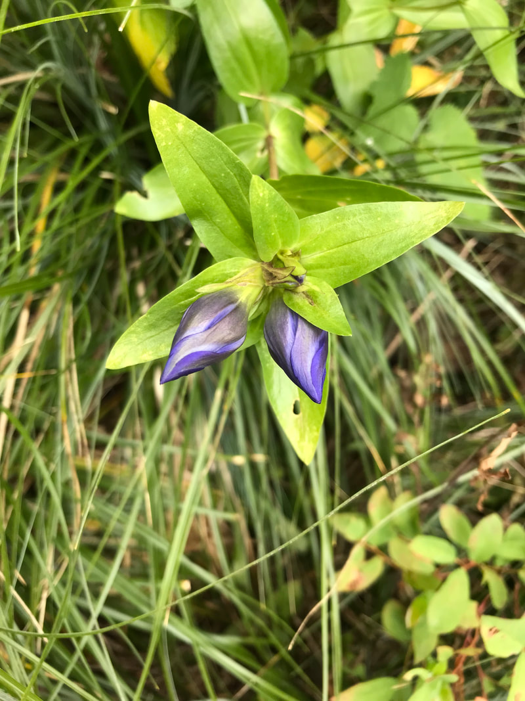
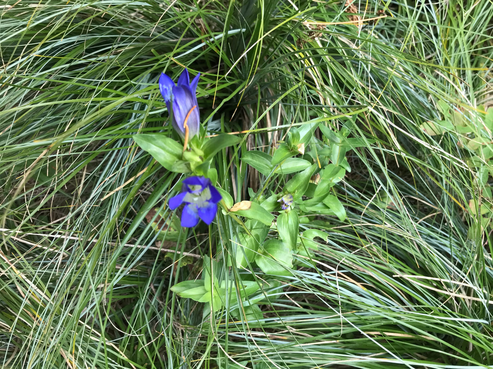
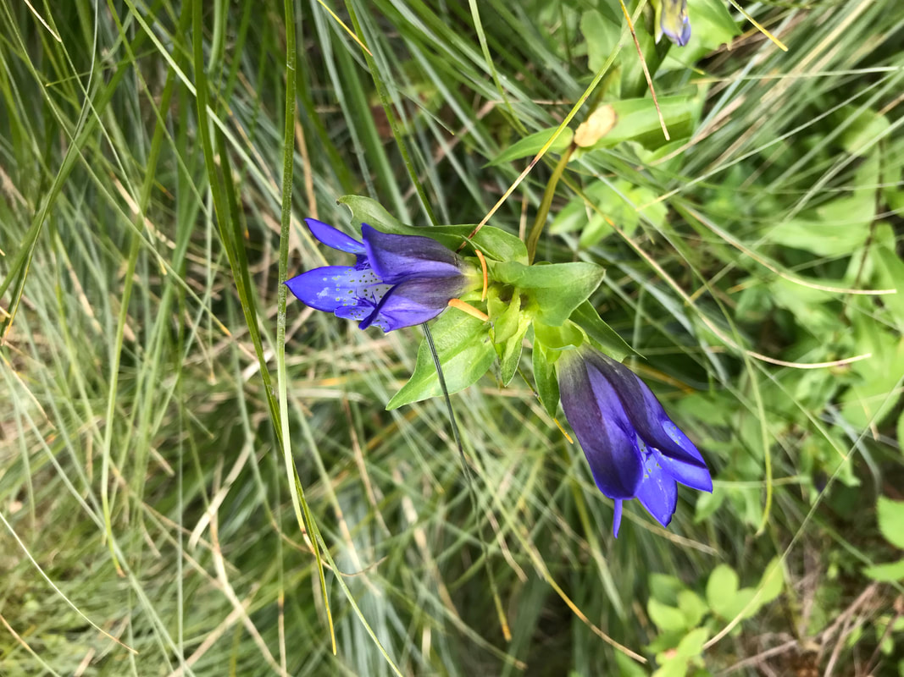
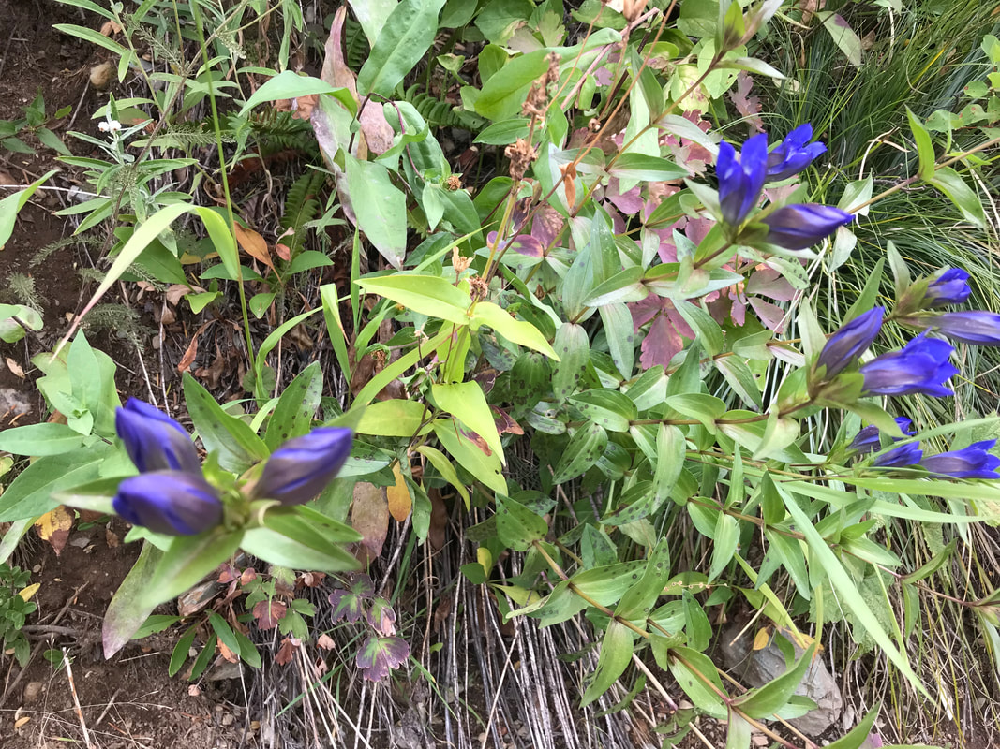

---
tags:
- Trails & Scrambles
stats:
- label: Genesis Name
  icon: book-open-variant
  value: Gentiana affinis
- label: Distribution
  icon: earth
  value: AZ, CA, CO, ID, MN, MT, ND, NM, NV, OR, SD, TX, UT, WA, WY. Canada...sk
- label: Season
  icon: calendar
  value: August thu September
- label: Medical Use
  icon: medical-bag
  value: Gentian is an herb. The root of the plant and, less commonly, the bark are
    used to make medicine. Gentian is used for **digestion problems** such as loss
    of appetite, bloating, diarrhea, and heartburn. It is also used for fever and
    to prevent muscle spasms
- label: Edibility
  icon: food-apple
  value: It also has a peppery taste, but when cooked it turns mildly sweet and almondy.
    The plants **grow from edible tubers**, which can swell to the size of an egg.
    ... Cook grows Gentian sage from seed, which he starts every year in the greenhouse
- label: Features
  icon: information-outline
  value: It also has a peppery taste, but when cooked it turns mildly sweet and almondy.
    The plants **grow from edible tubers**, which can swell to the size of an egg.
    ... Cook grows Gentian sage from seed, which he starts every year in the greenhouse.
- label: Leaves
  icon: leaf
  value: linear-lanceolate to lance-ovate 2.5-4 cm long, 0.5-1 cm wide, puberulent
    on margins and lower surface of midrib
- label: Fruits
  icon: fruit-cherries
  value: It also has a peppery taste, but when cooked it turns mildly sweet and almondy.
    The plants **grow from edible tubers**, which can swell to the size of an egg.
    ... Cook grows Gentian sage from seed, which he starts every year in the greenhouse.
notes:
- label: '.Poisonous: no'
  url: '#'
---

# Gentian

## Gentian. aka. closed bottle gentian

## Description

gentian, (genus *Gentiana*), any of about 400 [species](https://www.britannica.com/science/species-taxon) of
annual or [perennial](https://www.merriam-webster.com/dictionary/perennial) (rarely biennial) flowering
plants of the family [Gentianaceae](https://www.britannica.com/plant/Gentianaceae) distributed worldwide in
temperate and alpine regions, especially in Europe and Asia, North and
[South America](https://www.britannica.com/place/South-America), and
[New Zealand](https://www.britannica.com/place/New-Zealand). They are especially a notable feature of
mountain regions, where the moisture-loving plants have access to underground water in summer and snow cover
in winter. Gentian flowers are typically blue (hence "gentian blue") or purplish blue but may be purple,
violet, mauve, yellow, white, or even red; the four or five petals are usually united into a trumpet,
funnel, or bell shape. The flowers have been used in the making of dyes, especially *Gentiana pneumonanthe,*
a source of blue dye. The tough fibrous roots were once used

herbally for

[putative](https://www.merriam-webster.com/dictionary/putative) alimentary cures, and the name gentian
derives from Gentius, king of ancient Illyria and
[alleged](https://www.merriam-webster.com/dictionary/alleged) discoverer of the
[plant’s](https://www.britannica.com/plant/plant) medicinal value. *Gentiana lutea,* the [yellow

gentian](https://www.britannica.com/plant/great-yellow-gentian), is found in Europe and western Asia and is
the source of a flavouring in liqueurs.

Other species, such as the fringed gentians, formerly included in *Gentiana,* are now referred to as

### Gentianella

(about 125 species) and *Gentianopsis* (about 15 species). The gentian family, Gentianaceae, includes 87

genera and

nearly 1,700 species. It also has a peppery taste, but when cooked it turns mildly sweet and almondy. The
plants **grow from edible tubers**, which can swell to the size of an egg. ... Cook grows Gentian sage from
seed, which he starts every year in the greenhouse. *Gentiana affinis* is a perennial forb with stems 20-40
cm (7.9-15.7 in.) tall. The leaves are sessile, oblong

to ovate

in shape, 2-7 cm (0.8-2.8 in.) long and 0.5-2 cm (0.3-0.8 in.) wide, and the margins are minutely scabrous.
The flowers are bright blue and have 5 petals; they are 2.5-4 cm (1.0-1.6 in.) long and clustered at the
base of the upper leaves. The petals of the elongate, funnel-shaped corolla are united for most of their
length by plaited or folded membranes, with the free triangular portion of each petal curving outward from
the mouth of the corolla tube. The small, sharply pointed ends of the pleats in the sinuses between the
spreading corolla lobes impart a slightly frilled look to the flower.

---

## Photo gallery

---

