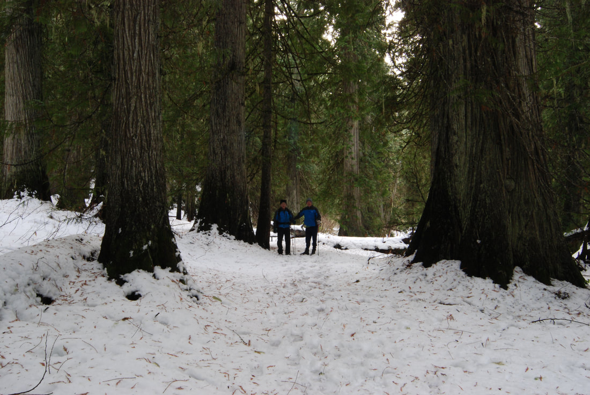
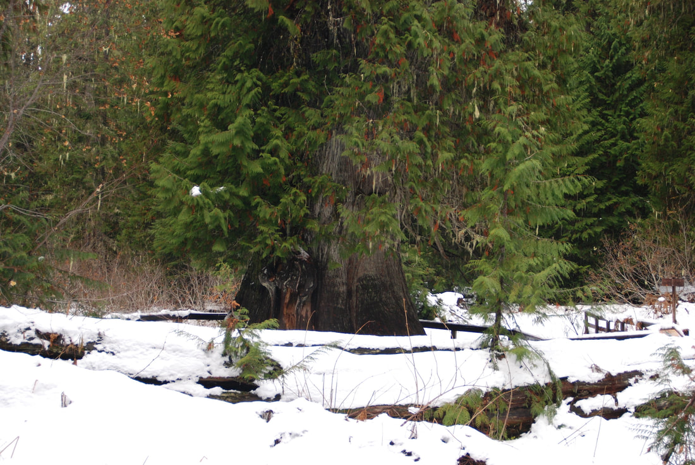
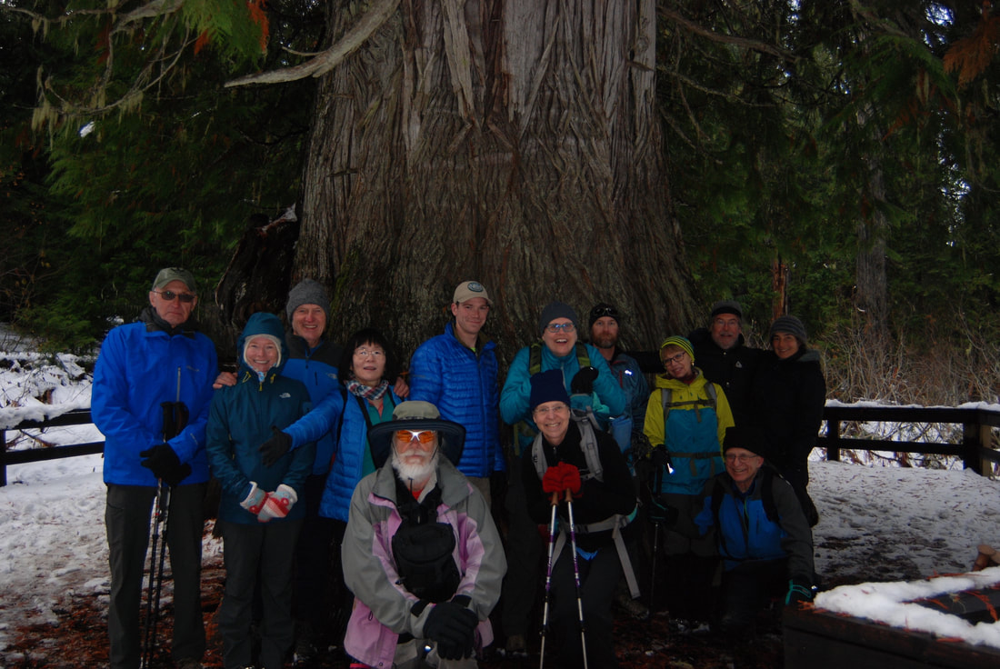
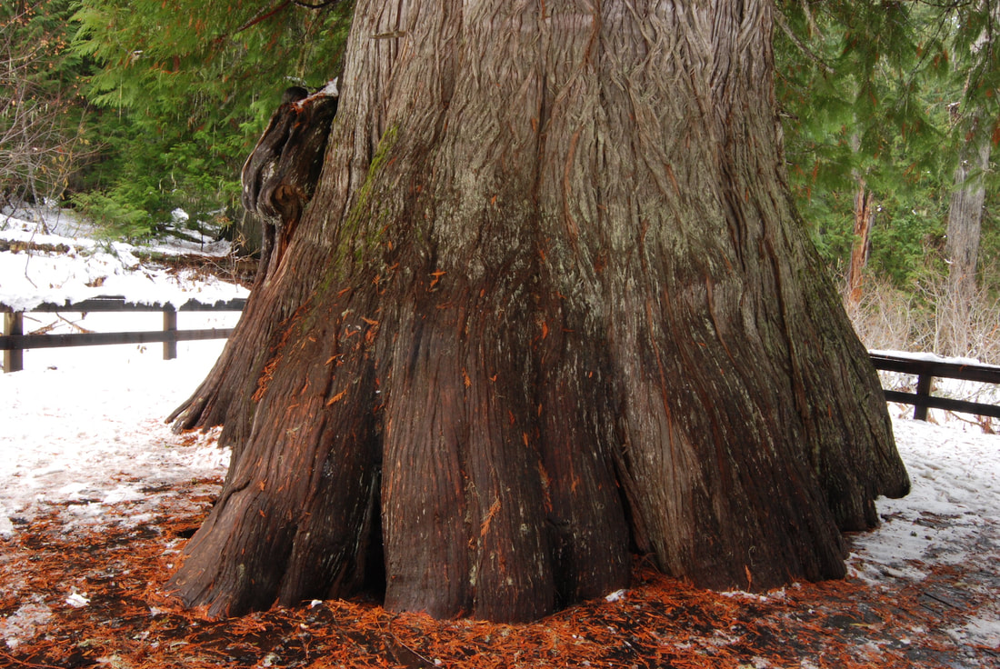
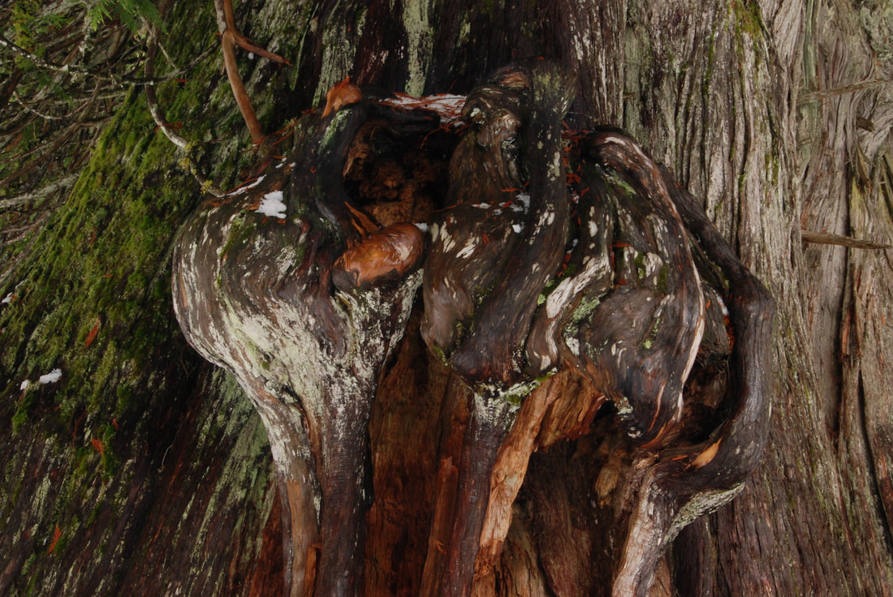

---
tags:
- Trails & Scrambles
- Easy
- Sight Seeing
stats:
- label: Event Type
  icon: hiking
  value: Sight seeing
- label: Distance
  icon: map-marker-distance
  value: .5 miles
- label: Elevation
  icon: terrain
  value: minimal
- label: Difficulty
  icon: speedometer
  value: easy
- label: Maps
  icon: map
  value: Elk Creek Falls National Recreation Area map.
- label: GPS
  icon: crosshairs-gps
  value: 46°88’80" n 116°11’82" w
- label: Ranger District
  icon: pine-tree
  value: Palouse R.D. 208.875.1131
- label: Clearwater County Sheriff
  icon: shield-account
  value: CALL 911 FIRST or 208.476. 4521
notes:
- '[Clearwater national forest/ alerts](https://www.fs.usda.gov/alerts/lolo/alerts-notices)<https://www.fs.usda.gov/alerts/nezperceclearwater/alerts-notices>'
---

# Giant Cedar Grove Trail

*Giant cedar grove trail #748*

## Description

We have added the areas sheriff’s emergency phone numbers for each trip write up under the ranger district info. if an emergency ocurrs, evaluate your circumstances and call only if needed.Do not miss this hike. its beyond belief.
The trail to the Giant Western Red Cedar is only .5 miles from the parking area, but you will talk about it for years to come.
The trail is paved, and wonders among giant. But then the grand daddy of all Cedars, stands proud before you.
Please do not touch the tree, and keep your children from climbing on its massive roots.
The USFS built a deck around it, because its roots were being damaged.
That damage can harm the ancient tree.

---

## Directions

From Elk River take County Road #382 north for about 10 miles, turn right on F.S.Road 4764. The trailhead is .25 miles beyond the parking area.

Be sure to pick up a brochure of the area.

## Cool things close by

Elk Creek Falls National Recreation Area, the a giant Western Red Cedars, Dworshak Reservoir, and the Hobo Cedar Grove.

## Hazards

No hazard, beyond walking on your Lowe jaw.

## R & P

NA

## Photo gallery

## Two hikers walking into the giants

*Picture (Image missing)*

## Giant red cedar along to trail to the giant

## First site of the giant

*Picture (Image missing)*

## Tyler & shuwen arm measuring the giant

---

## Members of the spokane mountaineers posing in front of the giant

## The giant

## Burles like this one, hold all the dna of the tree

---

---

*Picture (Image missing)*

## Looking up the giant
