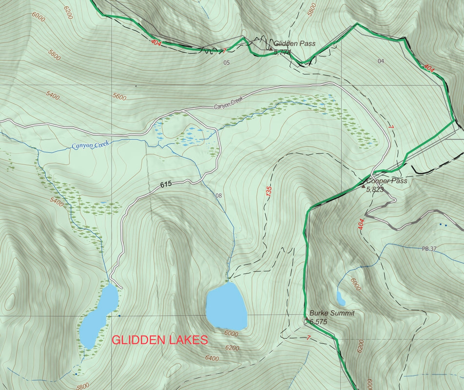
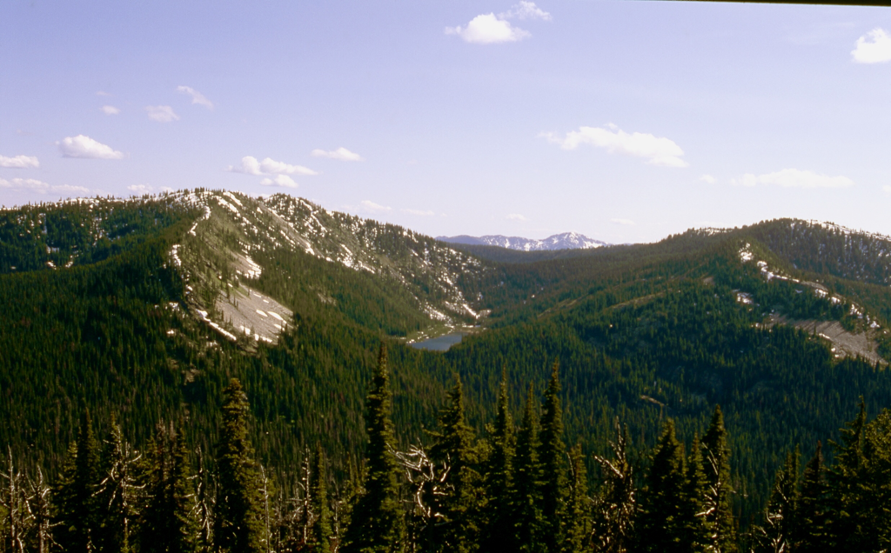
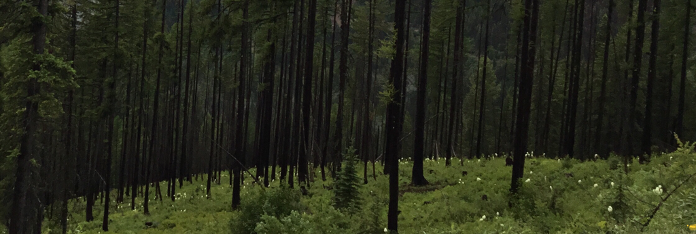
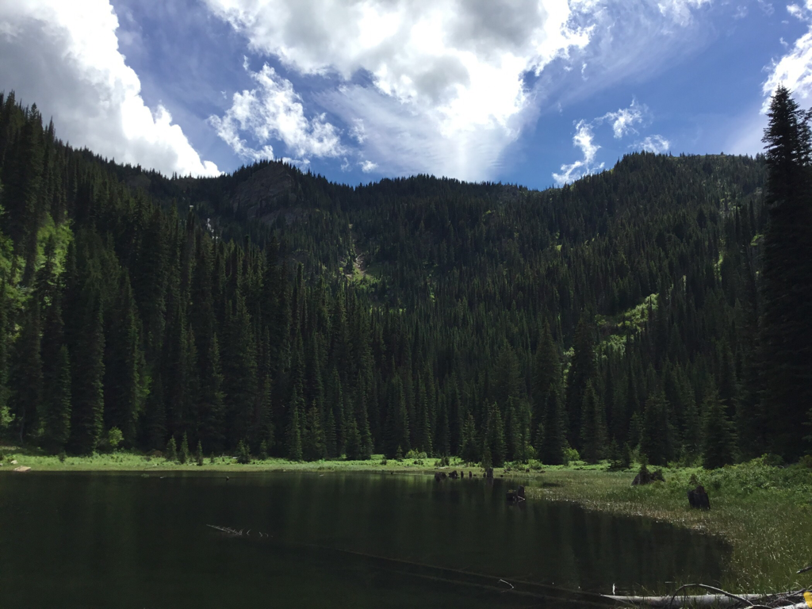
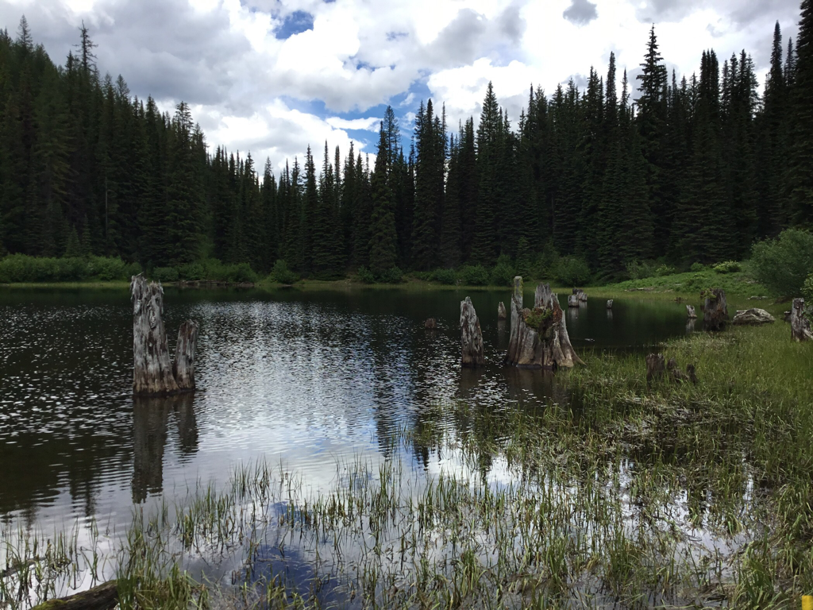
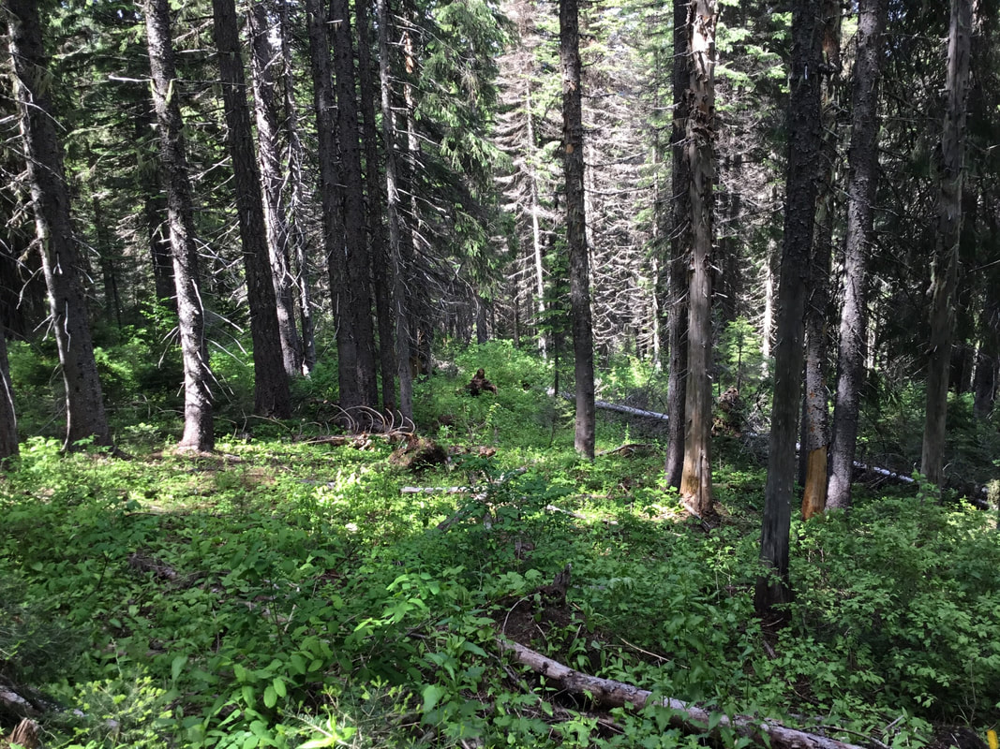
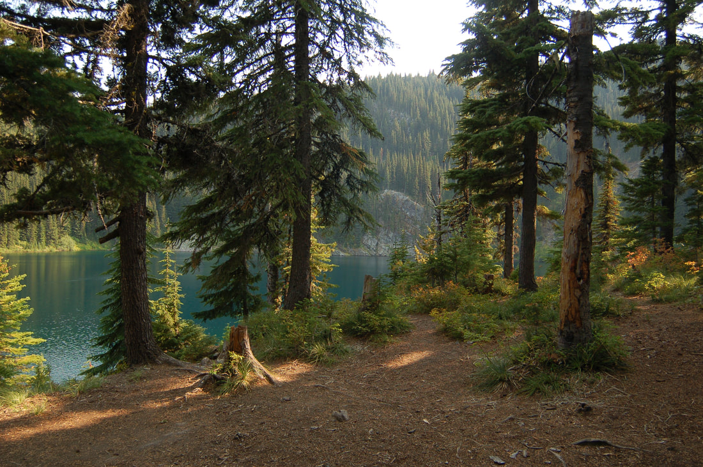

---
tags:
- Lakes
- Easy
- Day Hiking
- Backpacking
- Skiing & Snowshoeing
stats:
- label: Event Type
  icon: hiking
  value: Day hike, backpacking, backcountry skiing
- label: Distance
  icon: map-marker-distance
  value: Upper 3.2 miles RT. Lower lake you drive to.
- label: Elevation
  icon: terrain
  value: Minimal
- label: Difficulty
  icon: speedometer
  value: Easy
- label: Maps
  icon: map
  value: IPNF, Lolo N.F., Cooper Gulch topo
- label: GPS
  icon: crosshairs-gps
  value: Lower Lake 47°31’05" N 115°43’45" W
- label: Ranger District
  icon: pine-tree
  value: Coeur d'Alene River R.D. CALL 911 FIRST or 208.769.3000
notes:
- label: Idaho Panhandle National Forests Alerts
  url: https://www.fs.usda.gov/alerts/ipnf/alerts-notices
- label: 'Acreage: Lower Lake 14.2 acres | Upper Lake 18 acres'
- label: 'Upper Lake GPS: 47°31’08" N 115°43’05" W'
---

# Glidden Lakes Upper and Lower

Lower Glidden Lake (5,616’) & Upper Glidden Lake (5,935’).

## Description

The trail/road heads SE for about a mile to the lower lake. At about 300 feet there is a trail off to the
left (East) that leads to Upper Glidden Lake in less than a mile. These lakes are not only easy to get to,
they are surrounded by a nice forest and if you hike to the peak south of the lakes, you will have a great
view of Stevens Peak and its lakes.

The Upper Glidden Lake trailhead is on the Idaho-Montana border up the road from the lower lakes road. The
trail drops slightly along the way before it ascends gently to the Upper Lake. As you turn off the trail to
the right, the lake is about 200 feet ahead. If you turn left, the trail climbs gently to the saddle above
the lake. From here Trail #133 drops into the valley towards I-90 and Lookout Pass.

If you turn right where Trail #133 starts to drop, there is a primitive trail to the peaks above the lakes.

### Option 1: Lower Lake to Upper Lake Peak Trail

You can go into the Lower Lake and start the climb to the Upper Lake until you get to the trail's summit.
From here, if you turn right uphill, you can access the peak above and between the lakes. The views here are
worth the effort. From the top, you can head east down the ridge to the south of Upper Glidden Lake. The
trail is of good quality, and in 1.2 miles you will be at Upper Glidden Lake. There is very little elevation
gain or loss.

To the north is the creek out of Upper Glidden Lake. If you go down the east side of the creek, you will end
up at the Idaho-Montana border. If you walk out the west side of the creek, it will take you back to Lower
Glidden Lake.

### Option 2: Trail #135 from Glidden Pass

There is a relatively new trail (Trail #135) to Upper Glidden Lake. Continue past FR #615 to Glidden Pass
and the Idaho-Montana border. Take a right (south) turn up to the power lines. The trail is well marked. For
the most part, the trail undulates, dropping slightly then climbing slightly to the lake.

### Option 3: Peak 6632' Loop

To extend your hike or ski, travel to either lake and go cross-country to Peak 6632'. Then head
cross-country to the other lake to make it a loop hike or ski. There are trails to each lake and the ridge
above Upper Glidden Lake.

### Option 4: Cooper Gulch Waterfalls

At the Idaho-Montana border just east of the upper lake trailhead, drive into Montana over Cooper Pass to
the second switchback and park your car. Cooper Gulch Waterfalls is due south of the second switchback about
30 feet.

## Directions

Drive I-90 to Wallace, Idaho, and drive through town to the east I-90 off-ramp. Before turning onto the
freeway, drive north up Burke Canyon for about 12.5 miles. At the Idaho-Montana border (Glidden Pass), the
Upper Glidden Lakes trailhead is on the right (south) 0.1 miles up under the power lines.

To get to the Lower Glidden Lake trailhead, veer right about 11 miles from Wallace onto FR #615. Look for a
red arrow painted at the intersection. (To get to the upper lake, do not turn right at the arrow.) After
crossing two creeks, the trailhead is above the second creek.

## Hazards

None noticeable to the lakes. However, if you go off trail, ensure you have the appropriate abilities and
equipment.

## Cool Things Close By

Beautiful Burke Canyon, scenic and very photogenic rock walls above Burke, historic Wallace, Lookout Pass
Ski Area, Trail of the Coeur d'Alenes, and Route of the Hiawatha.

## Restaurants & Pubs

Pizza Factory, 1313 Club, Brooks Hotel & Restaurant, City Limits Brew Pub, Fainting Goat, Smoke House BBQ &
Saloon, Muchacho’s Tacos, and Wallace Brewing Co. in Wallace. Radio Brewing in Kellogg. The Snake Pit north
of Kingston. Moon Time & The Mexican Food Factory in CDA.

## Photo Gallery

_Glidden Lakes Overview_

_Upper Glidden Lake in Spring. That’s Stevens Peak off in the distance, taken from Glidden Pass._

_Bear grass along the road to the upper lake._

_Upper Glidden Lake with Snowstorm Peak (6,328’)._

_Remnants of an old forest in Upper Glidden Lake._

_It was a great walk out to Upper Glidden Lake. On the way out I spotted Bigfoot._

_Upper Glidden Lake campsite._
