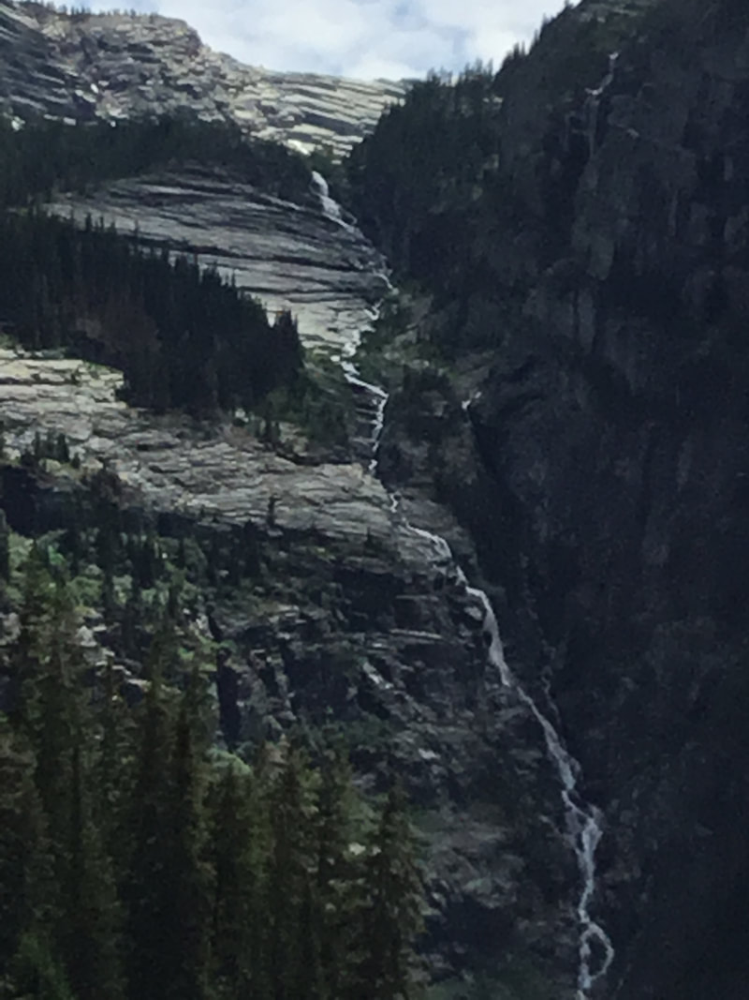

---
tags:
- Waterfalls
stats:
- label: Waterfall
  icon: waterfall
  value: Granite Creek Falls
- label: Drop
  icon: arrow-collapse-down
  value: 10' and hundreds of feet
- label: Waterfall Type
  icon: waterfall
  value: Plunge and serious cascades
- label: Distance Car to Falls
  icon: map-marker-distance
  value: 2.3 miles to Granite Falls, & about 8.5 miles to the back wall of A Peak
    8634'
- label: Maps
  icon: map
  value: Kootenai N.F., Treasure Mountain & Snowshoe Peak topes
- label: GPS
  icon: crosshairs-gps
  value: Approximate coordinates 48°17’?13" N 115°40’14" W
---

# Granite Falls

*Granite creek falls*

## Description

The trial starts out in the forest and climb steadily for about 2.3 miles to a nice 10' tall waterfall on
Granite Creek. In the spring, the water is flowing high, so crossing it may take some effort. Explore your
options for crossing it carefully. The next four miles isn't steep, but it's in the trees until about 1 1/2
a mile from the lake. When the trail opens up, the first views of A Peak 8634' loom large. As you approach
the lake along Granite Creek, there are places to sleep. At the lake, there is only room for two campsites,
but what a view it has. Above the lake in the spring, about 50 waterfalls tumble over massive cliffs for
100' or more. These falls are fed by the only glacier in our region, Blackwell Glacier. There isn't a lot of
exploring capabilities here without doing some serious brushwacking on very steep terrain. The A Peak back
wall is very difficult to get to, but can be photographed from the lakes shores.

## Directions

From Libby, head south on Highway 2 for 1/2 a mile to the Shaughnessy Hill Road. At the top of the hill go
south for about 1/2 a mile to sharp west turn onto FR #128, Flower Creek Road. After a mile turn east onto
FR #618, and follow it for 8 miles to the trailhead.

---

## Cool things close by

Historic Libby, Montana, Leigh Lake, Snowshoe Peak, Upper & Lower Geiger Lakes with Lost Buck Pass above, A
Peak, two of the largest Douglas Firs in Montana are located near the back of the lake. In 2016 during our
Summer Outing, member Chuck Huber and his hiking team found dozens of Morel Mushrooms along this trail.

## Hazards

All waterfalls are a hazard, due to their slippery nature. always be extra careful near any waterfall.In the
spring the entire forest around Granite Falls can be flooded due to spring run off.

## R & P

For a 1950’s dining experience, stop by Henry’s. It is located close to the Roseaurs, Pizza Hut, in Libby,
Clark Fork Pantry & Squeeze In in Clark Fork. , Eicharts, Mr Sub & Jalapeños in Sandpoint. In Libby, try The
Shed

---

## Plan your trip

Click for Current NOAA Weather Conditions

## Photo gallery

---

