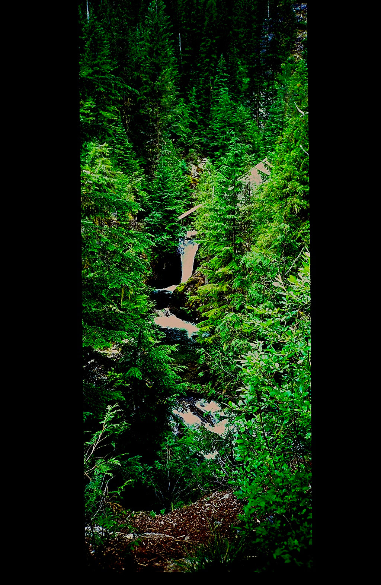

---
tags:
- Waterfalls stats:
- label: Waterfall icon: waterfall value: Granite Creek Falls
- label: Drop icon: arrow-collapse-down value: 10' and hundreds of feet
- label: Waterfall Type icon: waterfall value: Plunge and serious cascades
- label: Distance Car to Falls icon: map-marker-distance value: 2.3 miles to Granite Falls, & about 8.5
  miles to the back wall of A Peak 8634'
- label: Maps icon: map value: Kootenai N.F., Treasure Mountain & Snowshoe Peak topes
- label: GPS icon: crosshairs-gps
## value: Approximate coordinates 48°17’?13" N 115°40’14" W
## Granite Falls
## Granite creek falls
## Description
The trial starts out in the forest and climb steadily for about 2.3 miles to a nice 10' tall waterfall on
Granite Creek. In the spring, the water is flowing high, so crossing it may take some effort. Explore your
options for crossing it carefully. The next four miles isn't steep, but it's in the trees until about 1 1/2
a mile from the lake. When the trail opens up, the first views of A Peak 8634' loom large. As you approach
the lake along Granite Creek, there are places to sleep. At the lake, there is only room for two campsites,
but what a view it has. Above the lake in the spring, about 50 waterfalls tumble over massive cliffs for
100' or more. These falls are fed by the only glacier in our region, Blackwell Glacier. There isn't a lot of
exploring capabilities here without doing some serious brushwacking on very steep terrain. The A Peak back
wall is very difficult to get to, but can be photographed from the lakes shores.
## Directions
From Libby, head south on Highway 2 for 1/2 a mile to the Shaughnessy Hill Road. At the top of the hill go
south for about 1/2 a mile to sharp west turn onto FR #128, Flower Creek Road. After a mile turn east onto
FR #618, and follow it for 8 miles to the trailhead.
---

# Granite Falls

## Cool things close by

Historic Libby, Montana, Leigh Lake, Snowshoe Peak, Upper & Lower Geiger Lakes with Lost Buck Pass above, A
Peak, two of the largest Douglas Firs in Montana are located near the back of the lake. In 2016 during our
Summer Outing, member Chuck Huber and his hiking team found dozens of Morel Mushrooms along this trail.

## Hazards

All waterfalls are a hazard, due to their slippery nature. always be extra careful near any waterfall.In the
spring the entire forest around Granite Falls can be flooded due to spring run off.

## R & P

For a 1950’s dining experience, stop by Henry’s. It is located close to the Roseaurs, Pizza Hut, in Libby,
Clark Fork Pantry & Squeeze In in Clark Fork. , Eicharts, Mr Sub & Jalapeños in Sandpoint. In Libby, try The
Shed

---

## Plan your trip

Click for Current NOAA Weather Conditions

## Photo gallery

---

---

---
tags:

- Waterfalls stats:
- label: Waterfall icon: waterfall value: Granite Falls La Sota Falls
- label: Drop icon: arrow-collapse-down value: Granite 75' La Sota 10'
- label: Waterfall Type icon: waterfall value: Granite. Slide La Sota Plunge
- label: Distance Car to Falls icon: map-marker-distance value: Granite 365'. La Sota about .6 miles
- label: Maps icon: map value: IPNF, Priest Lake Ranger District. 208.443.2512
- label: GPS icon: crosshairs-gps

## value: Granite 48°76’79" N 117°06’52" W. La Sota. 48°77'21" N 117°06'86" W

## Granite Falls  La Sota Fallsb

## Granite falls & la sota falls aka upper granite falls

## Description

The North Fork Granite Creek winds through stands of towering ancient western red cedar trees, known as the
Roosevelt Grove of Ancient Cedars Some of these towering giants date back 2000 to 3000 years. Two trails are
maintained from the trailhead. An easily hiked trail of 365 feet runs along the creek bringing hikers to a
viewpoint of the Granite Creek Falls cascading over a sheer rock wall. There is a one mile loop trail of
moderate difficulty that leads up the old road for 200 feet above the trailhead. This longer trail will
bring you through ancient western red cedars and after a series of switchbacks will bring you to views of
the Upper Granite Creek Falls and the Lower Granite Creek Falls. Hiking is permitted among the old growth
trees.

## Option #1

Do not forget to visit the Roosevelt Grove of Ancient Cedars. That trail spurs off the Granite Loop, La Sota
Falls trial.

## Directions

From Priest River, drive north on Hwy 57, and bear left at the Dickensheet Junction past the Priest Lake

## R.D. From Priest Lake Ranger District travel 4 miles north to Nordman, then 14 miles north of Nordman, Idaho

## Granite Falls  La Sota Fallsb (2)

## Cool things close by (2)

Roosevelt Grove of Ancient Cedars, Upper & Lower Priest Lake, Little Snowy Top Mountain, Snowy Top Mountain,
Salmo Priest Wilderness, Gypsy Peak, Blacktail Mountain, and Packer Falls,

## Hazards (2)

All waterfalls are a hazard, due to their slippery nature. always be extra careful near any waterfall.
Granite Falls has a loop trail that takes you above the falls. Please be EXTRA CAREFUL on this trail.
Towards the cedar grove, is La Sota Falls tucked off to the NW in the trees.

## R & P (2)

Stagger Inn

---

## Plan your trip (2)

Click for Current NOAA Weather Conditions

## Photo gallery (2)

---

