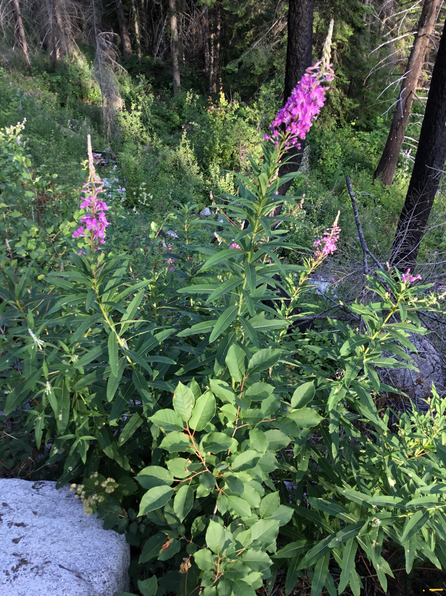
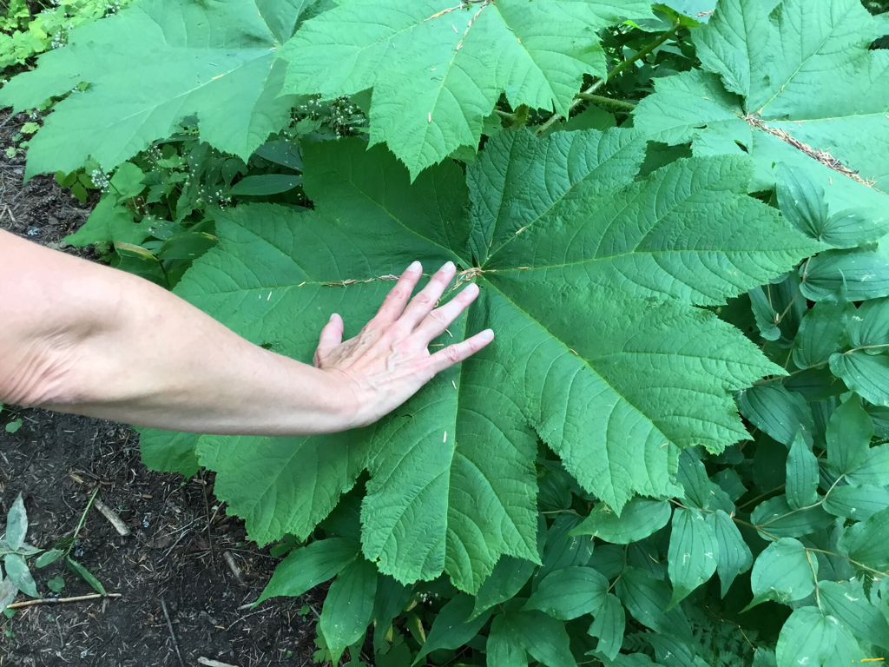
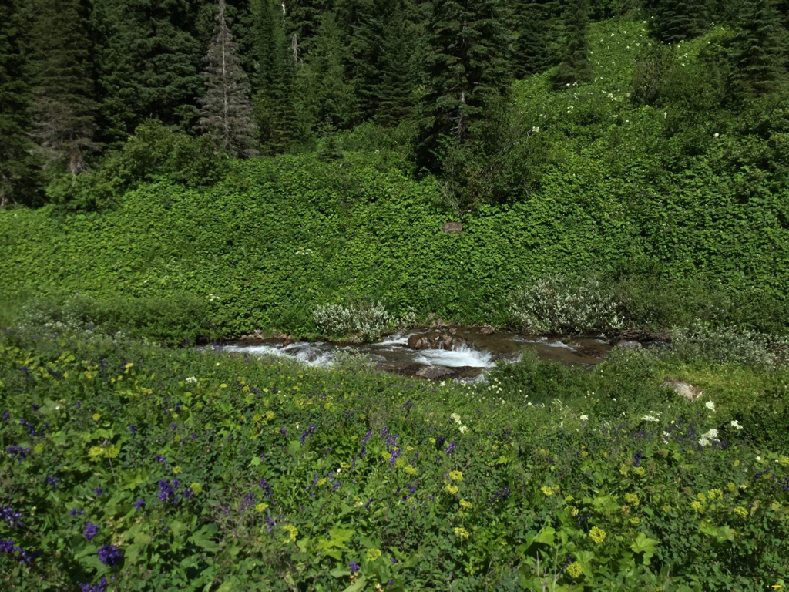
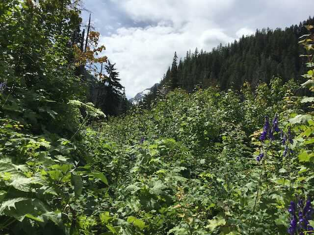
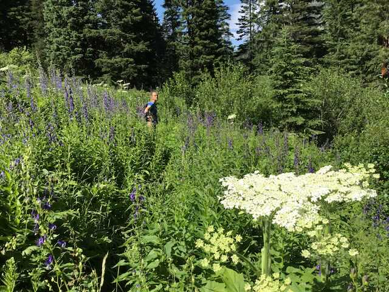
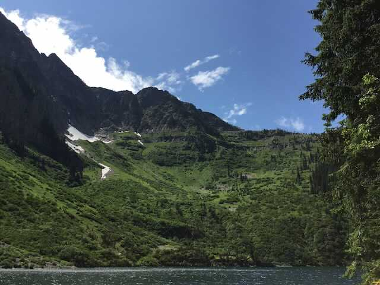
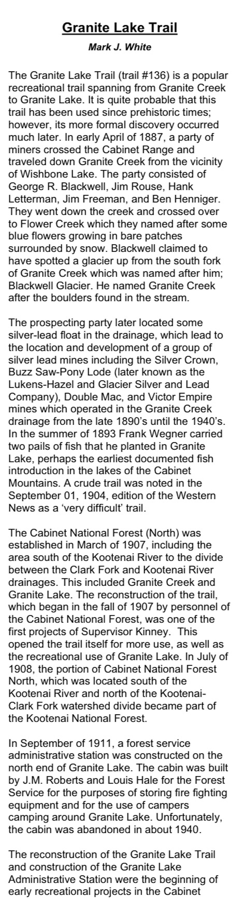
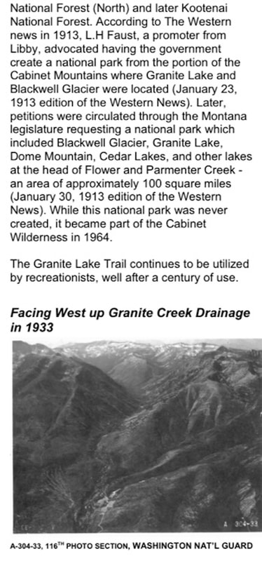

---
tags:
- Lakes
- Hiking
- Backpacking
- Scrambling
- Ice Climbing
stats:
- label: Event Type
  icon: hiking
  value: Hiking, backpacking, scrambling, and ice climbing.
- label: Distance
  icon: map-marker-distance
  value: 12 miles RT
- label: Elevation Gain
  icon: elevation-rise
  value: 1400' gain
- label: Acres
  icon: vector-square
  value: '56.7'
- label: Difficulty
  icon: speedometer
  value: Difficult, but harder during spring runoff.
- label: Maps
  icon: map
  value: Kootenai N.F., Treasure Mt., Snowshoe Peak
- label: GPS
  icon: crosshairs-gps
  value: 48°15’10"n 115°41’20"w
- label: Ranger District
  icon: pine-tree
  value: Libby R.D. 406.293.7333
- label: Lincoln County Sheriff
  icon: shield-account
  value: CALL 911 FIRST or 406.293.4112
notes:
- Kootenai national forest/alerts
- url: https://www.fs.usda.gov/alerts/kootenai/alerts-notices
---

# Granite Lake 4629

## Granite lake, c.m.w. 4629’

## Description

We have added the areas sheriff’s emergency phone numbers for each trip write up under the ranger district
info. if an emergency ocurrs, evaluate your circumstances and call only if needed. The trial starts out in
the forest and climb steadily for about 2.3 miles to a nice 10' tall waterfall on Granite Creek. In the
spring, the water is flowing high, so crossing it may take some effort. Explore your options for crossing it
carefully. The next four miles isn't steep, but it's in the trees until about 1.5 of a mile from the lake.
When the trail opens up, the first views of A Peak 8634' loom large. As you approach the lake along Granite
Creek, there are places to sleep. At the lake, there is only room for two campsites, but what a view it has.
Above the lake in the spring, about 50 waterfalls tumble over massive cliffs for 100' or more. These falls
are fed by the only glacier in our region, Blackwell Glacier. There isn't a lot of exploring capabilities
here without doing some serious brushwacking on very steep terrain. In 1936, the Spokane Mountaineers held
there second Summer Outing at Granite Lake, putting 11 of 15 members on top of Snowshoe Peak. This is the
most difficult ascent of Snowshoe Peak. Along the trail in, the horse team hired to carry in gear, was
spooked by a fisherlady dressed in white. Six of the seven horses fell off the trail and scattered their
gear everywhere. They repacked 6 horses and made it to the lake. If you are looking for solitude, this is
the place to go. If you are an ice climber, Granite Peak is said to be the best in the world.

## Directions

From Libby, head south on Highway 2 for 1/2 a mile to the Shaughnessy Hill Road. At the top of the hill go
south for about 1/2 a mile to sharp west turn onto FR #128, Flower Creek Road. After a mile turn east onto
FR #618, and follow it for 8 miles to the trailhead.

## Hazards

The most hazardous part of this hike is the creek crossing, especially in the spring.

## Cool things close by

Historic Libby, Montana, Leigh Lake, Snowshoe Peak, Upper & Lower Geiger Lakes with Lost Buck Pass above, A
Peak, two of the largest Douglas Firs in Montana are located near the back of the lake. In 2016 during our
Summer Outing, member Chuck Huber and his hiking team found dozens of Morel Mushrooms along this trail.

## R & P

Kaiju Bar & Grill in Libby. For a 1950’s dining experience, stop by Henry’s. It is located close to the
Roseaurs, Pizza Hut, in Libby, Clark Fork Pantry & Squeeze In in Clark Fork. , Eicharts, Mr Sub & Jalapeños
in Sandpoint. In Libby, try The Shed

### Picture (Image missing)

## Photo gallery

### Picture (Image missing) Details

To get to granite creek below the falls, we had to work our way thru the flooded forest in early june

<!-- Missing Image: <!-- Missing Image: [*Picture (Image missing)*](assets/images/202178527.jpg) --> -->

## Granite creek cascades

---

## Fireweed along the trail

---

## The queen of devils club

---

## Granite creek

---

## The first glimpse of "a peak" on the trail in

---

## Amy on the trail to granite lake

---

### Picture (Image missing) Details (2)

## A peak 8634’

---

## Vimy ridge

---

### Picture (Image missing) Details (3)

## Vimy ridge and corner of a peak

---

### Picture (Image missing) Details (4)

## This is a gnarly west face of a peak

### Picture (Image missing) Details (5)

## A king bolete along the trail IDENTIFIED BY SEEK, iNATURALIST

