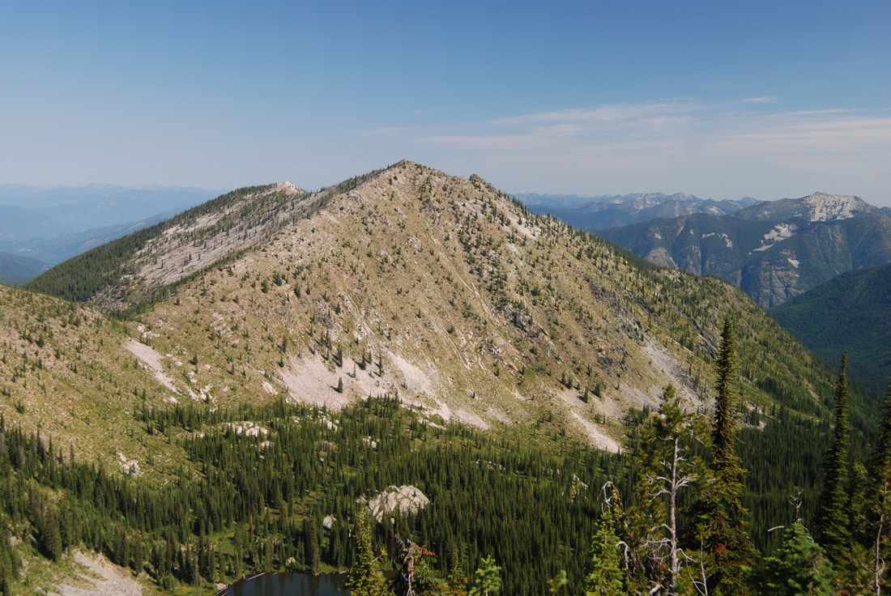
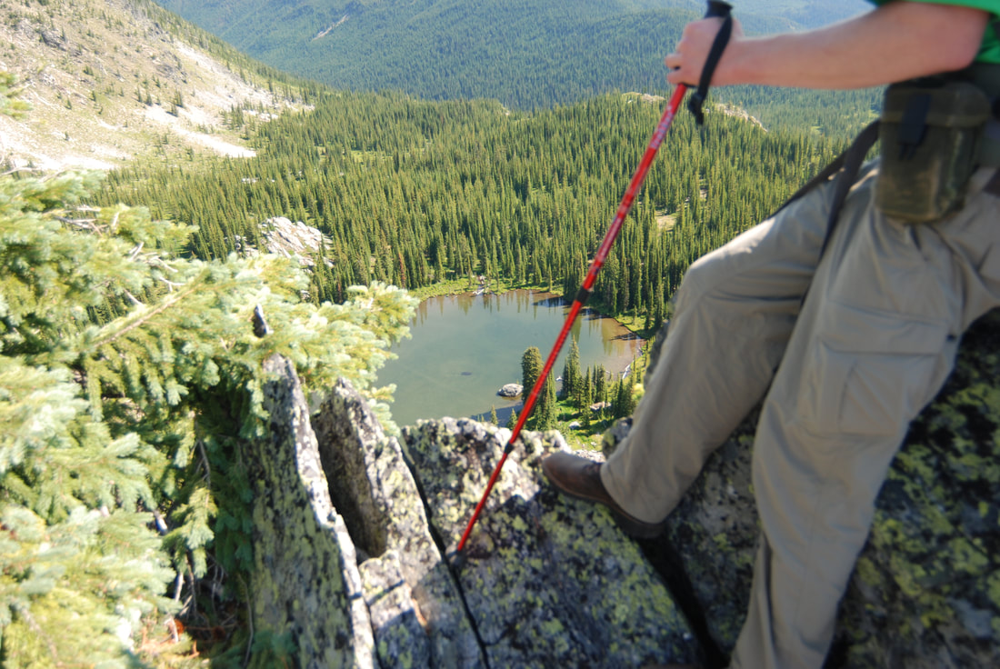
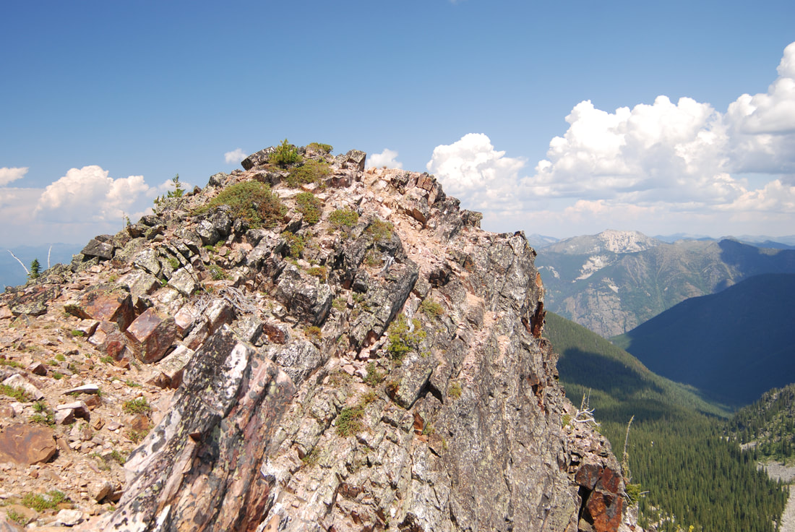

---
tags:
- Peaks & Mountains
- Moderately Difficult
- Day Hiking
- Backpacking
- Equestrian stats:
- label: Event Type icon: hiking value: Day hiking, backpacking, and equestrian
- label: Distance icon: map-marker-distance value: 6.5 miles RT
- label: Elevation icon: terrain value: 1750’
- label: Difficulty icon: speedometer value: moderately difficult
- label: Maps icon: map value: Colville N. F., Salmo-Priest Wilderness, Gypsy Peak Topo
- label: GPS icon: crosshairs-gps value: Trailhead 48°55’ 04" N 117°08’ 37" W
- label: Managing Agency icon: domain value: Sullivan Lake R.D. 509.446.7500
- label: Pend Orielle County Sheriff icon: shield-account
## value: CALL 911 FIRST or 509.447.3151
## Gypsy Peak
## Gypsy peak trail #435 salmo-priest wilderness
## Description
Because of the distance and the road to the trailhead, I would suggest you drive to the trailhead the night
before. There are several places to pitch a tent. The next morning, the hike westish on the Crowell Ridge
Trail #515 for about a mile to the Salmo-Priest Wilderness. There are 5 switchbacks to the ridge. Once on
the ridge, the views of the Crowell Ridge and several adjoining ridges are spectacular.
At this point, turn right (north) and find your way along the ridge towards Gypsy Peak. Something I noticed
was the many false summits to Gypsy. Most of the trail is just walking the Crowell Ridge with little or no
actual trail. Soon Watch Lake will appear below you on your right. There is a primitive camp site along the
ridge above Watch Lake. The route skirts the prominence above the lake on the right (east) side, and
descends slightly to a saddle just before the final false summit to Gypsy Peak. As you near the last
prominence, Gypsy Peak sits north, hidden slightly from view. Summit the last prominence and hike over to
the summit of Gypsy Peak at 7000’ in a short distance. It’s a rocky summit that offers views all around.
Retrace your steps back to the trailhead. There are no water sources along Crowell Ridge, so carry all you
need. You can drop down to Watch Lake, if you run out of water.
## Directions
On S.R. (Hwy) 20 just north of Cusick, turn north on S.R. #31 for a little over 3 miles towards Ione. Turn
right on the Sullivan Lake Road (C.R #9345) over the Pend Orielle River and turn left (north) towards
Sullivan Lake and the Noisy Creek Campground at a little over 7 miles.
Then drive 4.5 miles along the Sullivan Lake road. Turn right onto F.R. #22, and drive 6 miles and bear left
at the junction onto F.R. #2220.
Drive 1.5 miles and bear left onto F.R. 2212. Drive 4.6 miles to the trailhead and the road end. The
trailhead sits at 5560’.
---

# Gypsy Peak

## Cool things close by

Crowell Ridge South, Sullivan Lake & the shore line trail, Elk Creek Falls, Hall Mountain, Salmo River,
Shedroof Divide, Thunder Creek & Mountain, Mankato Mountain ( Shedroof Divide), Grassy Top Mt., and the
Roosevelt Grove of Ancient Cedars.

## Hazards

There is no water on this hike from shortly after leaving the trailhead, except at Watch Lake. Be aware,
it’s several hundred rugged feet down to the lake. I often take extra water on my, out and back hikes, and
leave a bottle at key locations, so I don’t have to carry it all the way. However, mark your stash spot
well. The "trail" along Crowell Ridge is faint in some areas, but knowing you stay on the ridge top all the
way, with some prominences to skirt, it’s a straight forward hike.

## R & P

NA

### Picture (Image missing)

## Photo gallery

### Picture (Image missing) Details

## Hikers on connective trail #515, nearing the crowell ridge trail #515

### Picture (Image missing) Details (2)

## On crowell ridge walking towards gypsy peak

Watch lake peeks out below the ridge line to gypsy peak Gypsy peak is out to the back right of this unnamed
mountain

## Watch lake below crowell ridge, taken from same as above location

## Gypsy peak 7309'
