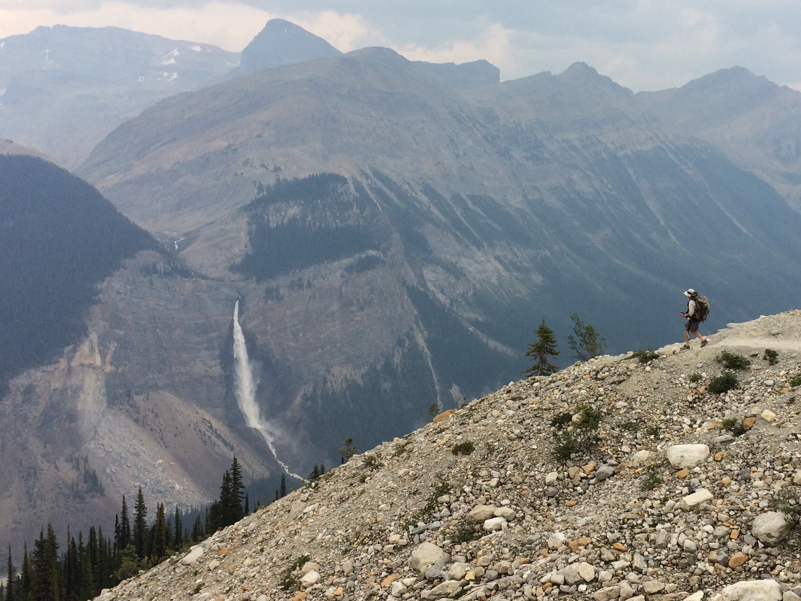

# Hiking & Scrambling Regional Portal

Welcome to the Inland NW Routes Hiking & Scrambling portal! As you explore the route guides below, select any regional destination to discover detailed trail statistics, historical context, geographic overviews, and regional geology reports for each area.

---

## Regional Hiking Areas Map

<iframe src="https://www.google.com/maps/d/embed?mid=18Eph2Apv8Dw7VKOmd7A9QOR2fIeAHpai" width="100%" height="520" style="border-radius: 12px; border: 1px solid var(--md-default-foreground-color--lightest, #ccc); margin-top: 1rem; margin-bottom: 2rem; box-shadow: 0 4px 12px rgba(0,0,0,0.12);" allowfullscreen></iframe>

---

## Regional Hiking Guidebooks Overview

| Regional Range / Area | Geography & Key Highlights | Guide Link |
| :--- | :--- | :--- |
| **American Selkirks** | High granite spires, Priest Lake basin, Harrison & Chimney Rock | [American Selkirks Guide](american-selkirks.md) |
| **Cabinet Mountains Wilderness** | Deep glaciated valleys, Snowshoe Peak (8,736'), Leigh Lake | [Cabinet Wilderness Guide](cabinet-mountains-wilderness.md) |
| **Proposed Scotchman Peaks** | Steep terrain above Lake Pend Oreille, Scotchman Peak (7,709') | [Scotchman Peaks Guide](proposed-scotchman-peaks-wilderness.md) |
| **Bitterroot Mountains** | St. Joe River headwaters, Illinois Peak (7,690'), Stateline Trail | [Bitterroots Guide](bitterroots.md) |
| **Canadian Rockies** | Bugaboos, Fisher Peak (9,336'), Creston Valley | [Canadian Rockies Guide](canada.md) |
| **Glacier National Park** | Continental Divide passes, Highline Trail, alpine lakes | [Glacier N.P. Guide](glacier-np.md) |
| **Spokane & Scablands** | Spokane Conservation Futures, Washington Scabland coulees | [Spokane Regional Guide](spokane-county-conservation-futures.md) |

---

## Trip Planning & Wilderness Safety

!!! info "Essential Wilderness Preparation"

    - **Weather & Conditions:** Always check local weather and Forest Service trail alerts before heading into backcountry areas.
    - **14 Essentials:** Carry proper navigation (map & GPS), layers, sun protection, hydration, and emergency shelter.
    - **Bear & Wildlife Safety:** Carry bear spray in an accessible location and practice Leave No Trace principles across all trail networks.
