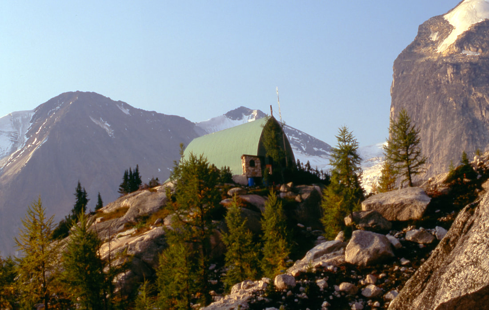

# The Bugaboos (Bugaboo Provincial Park)

_The Bugaboos (Bugaboo Provincial Park)_

Situated in the rugged Purcell Mountains of British Columbia, Bugaboo Provincial Park is a world-renowned alpine
destination encompassing 13,646 hectares of icefields, massive glaciers, and sheer granite spires reaching over 3,000
meters in elevation. Known globally for its mountaineering history, the Bugaboos also offer spectacular day hikes and
backcountry hut trips for experienced hikers.

---

## Overview & History of the Spires

The Purcell Mountains are ancient geologic formations dating back 1.5 billion years—substantially older than the
neighboring Canadian Rockies. Heavy snowfall from the "Columbia Wet Belt" feeds the expansive alpine glaciers that
carved the dramatic granite towers.

Explored initially by the Palliser Expedition (1857–1860), the region attracted miners, loggers, and pioneer
mountaineers. Legendary Swiss guide Conrad Kain visited in 1910 and returned in 1916 with the MacCarthy family to make
first ascents of Bugaboo Spire and North Howser Tower. Subsequent generations of climbers—including Fred Beckey, Yvon
Chouinard, Ed Cooper, and Layton Kor—pioneered iconic face routes across Snowpatch, Bugaboo, and Pigeon Spires.

---

## Main Trails & Alpine Routes

### Conrad Kain Hut Trail

A steep, 3.1-mile climb (6.2 miles RT with 2,640 feet of elevation gain) starting from the main trailhead parking lot
and following the northern lateral moraine of Bugaboo Glacier. The route ascends aggressively through granite bluffs
with significant exposure.

!!! danger "Fixed Chains & Cliff Ladder Exposure"

    The trail edges along cliff faces protected by fixed hand-hold chains, followed by a vertical metal ladder
    anchored into the rock wall. Strong, supportive footwear and extreme care are mandatory.

Above the ladder, wooden footbridges cross rushing glacial streams into subalpine meadows carpeted with wildflowers.
The Conrad Kain Hut sits dramatically on a high granite shelf directly below Snowpatch Spire.

_The Conrad Kain Hut perched on a granite ledge._

### Option #1: Eastport Spire Ridge & Outpost Camp

From the Conrad Kain Hut, ascend the alpine ridge toward Eastport Spire. The trail leads past a high-altitude
backcountry campsite featuring one of the most famous outhouses in the Canadian mountains—perched on a rocky ridge
with panoramic views of the surrounding spires. Blue waste barrels are airlifted out by helicopter each autumn.

_High alpine outhouse on Eastport Spire with panoramic views._

### Option #2: Snowpatch Glacier Stream Walk

From the hut, hike west toward the glacier adjacent to Snowpatch Spire. Descend carefully to the valley floor and
follow the roaring glacial meltwater stream as it cascades down polished granite slabs. Follow the stream upward
directly to the foot of Snowpatch Spire before descending via a climber's descent path back to the hut.

_Glacial stream walk leading up toward Snowpatch Spire._

### Option #3: Cobalt Lake & Cobalt Ridge Trail

A 10.5-mile round-trip hike (2,297 feet of elevation gain) beginning across the road from the Canadian Mountain
Holidays (CMH) Bugaboo Lodge. The trail climbs via switchbacks through alpine larch forests before breaking into high
open meadows.

After ascending Cobalt Ridge (about 2 miles from the lake), hikers are rewarded with sweeping views of the Bugaboo
Spires. The route then descends to the shores of Cobalt Lake.

_Cobalt Lake with Bugaboo Spires in the background._

---

## Park Information & Backcountry Camping

!!! warning "Porcupine Vehicle Protection Required"

    Porcupines and small rodents in the trailhead parking lot chew on vehicle rubber tires, brake lines, and
    electrical wiring. **Hikers must enclose the base of their vehicles with chicken wire mesh** (provided at
    the parking area or brought from home) weighted down with rocks before leaving cars unattended.

### Accommodation & Camping Facilities

- **Conrad Kain Hut:** Accommodates up to 35 guests from June 1 to September 30. Features propane stoves,
  kitchen utensils, and sleeping bunks. Reservations are required through the
  [Alpine Club of Canada](https://www.alpineclubofcanada.ca/huts/conrad-kain-hut/). Closed in winter due to
  severe avalanche danger.
- **Designated Backcountry Camping:** Tent camping in the Crescent Glacier area is restricted strictly to
  designated timber tent pads at **Applebee Dome** and **Boulder Camp**. Nightly backcountry permit fees
  apply.
- **Malloy Igloo:** A small shelter accommodating up to 6 people near Malloy Creek (no facilities provided).

_Hiker ascending the stout metal ladder on the cliff section._

---

## Getting There & Trailhead Directions

1. From **Radium Hot Springs, BC**, drive **17 miles north** on **Highway 95** to the town of **Brisco**.
2. Turn left onto **Brisco Road** and follow it for 1.4 miles.
3. Turn right onto **Brisco Mountain Road**, then left onto **Westside Road**.
4. Drive 2 miles to a sharp right hairpin turn onto **Bugaboo Creek Road**.
5. Follow Bugaboo Creek Road for approximately 30 miles to the trailhead parking lot.

!!! tip "Forest Road Conditions"

    Bugaboo Creek Road is an active logging road used by heavy industrial timber trucks. High-clearance
    vehicles are recommended. Drive slowly, keep headlights on, and yield to logging traffic.

---

## Regional Attractions & Nearby Destinations

- **National Parks:** Yoho National Park, Kootenay National Park, Banff National Park, Jasper National Park, Glacier
National Park of Canada.
- **Regional Highlights:** Radium Hot Springs, Golden BC, Lake Louise, Mount Assiniboine Provincial Park.

---

## Photo Gallery

_Snowpatch Spire viewed from Septet Campground._

_Hikers traversing switchbacks toward Cobalt Lake._

_Trail view looking toward the Bugaboo Spires._
