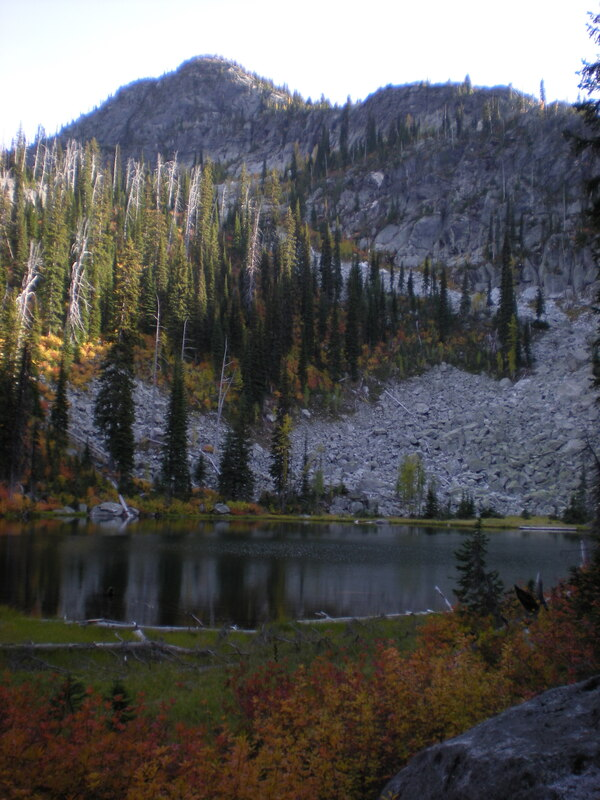
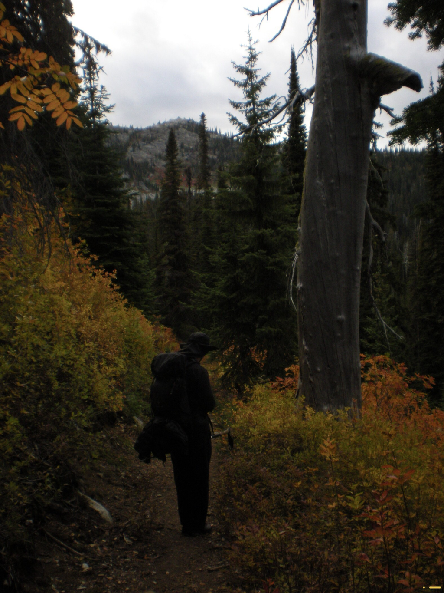
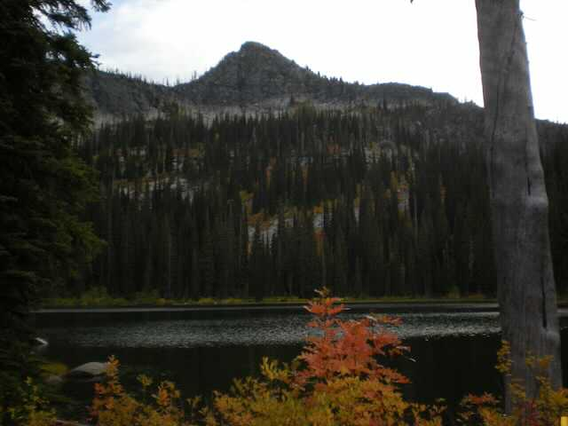
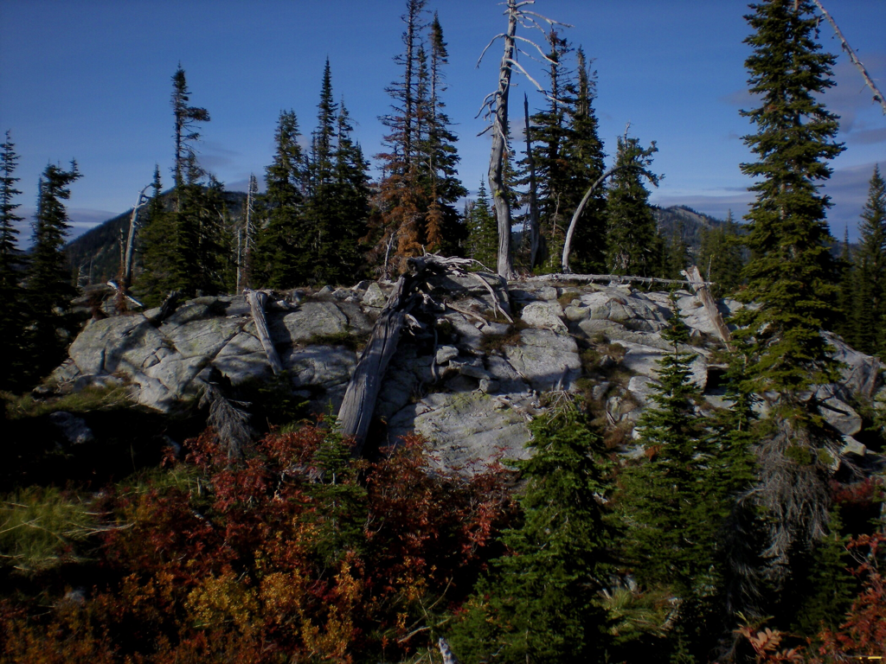
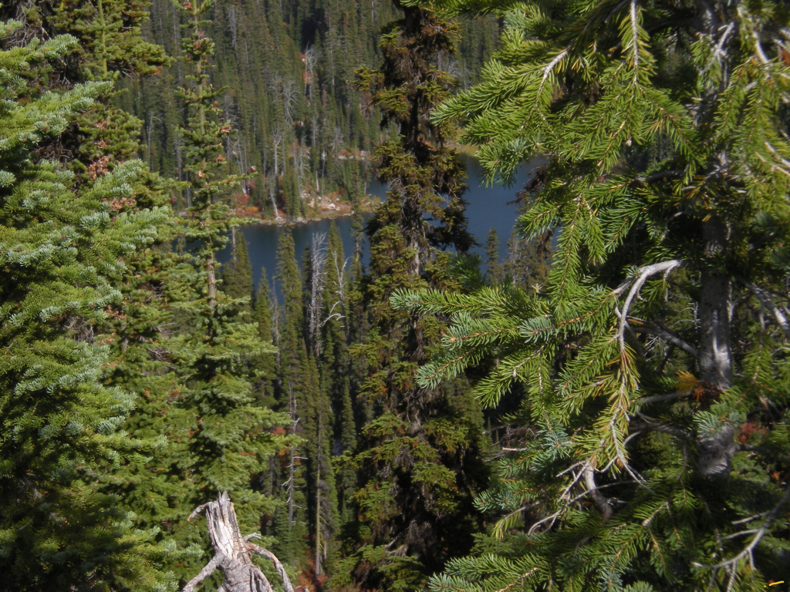
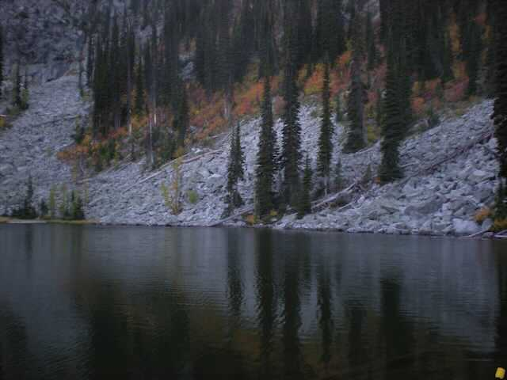
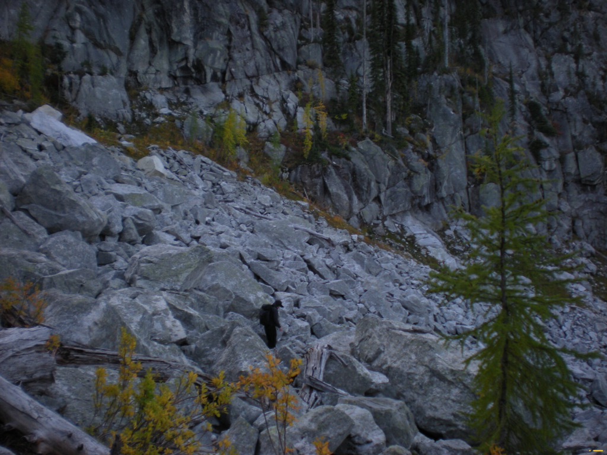
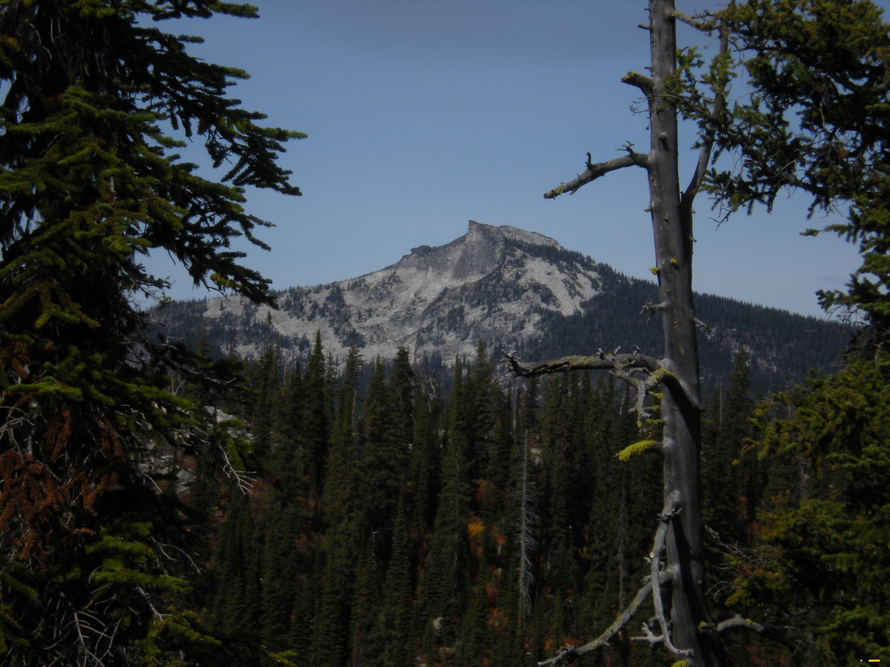
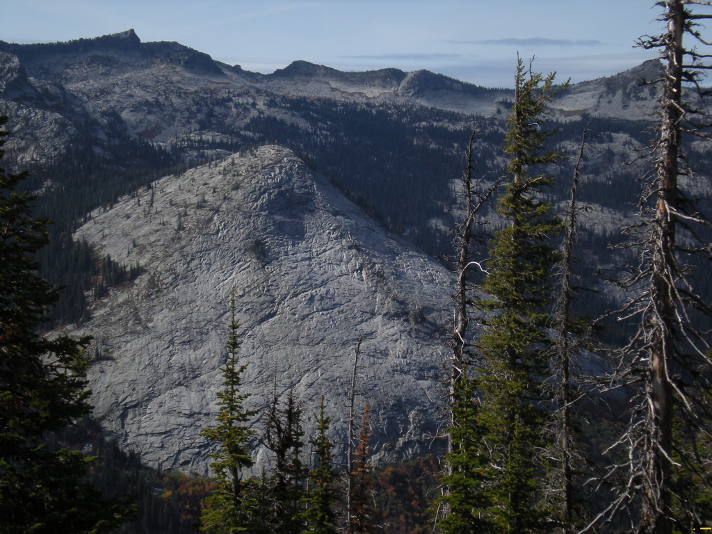

---
tags:
- Lakes
- Moderate
- Day Hiking
- Backpacking
stats:
- label: Event Type
  icon: hiking
  value: Day hiking, backpacking
- label: Distance
  icon: map-marker-distance
  value: 7 miles RT to the peak
- label: Elevation Gain
  icon: elevation-rise
  value: "2543\u2019"
- label: Acres
  icon: vector-square
  value: '10.6'
- label: Difficulty
  icon: speedometer
  value: Moderate
- label: Maps
  icon: map
  value: IPNF, KANIKSU N. F., Roman Nose topo
- label: GPS
  icon: crosshairs-gps
  value: "48\xB039\u201935\" N 116\xB036\u201905\" W"
- label: Ranger District
  icon: pine-tree
  value: Bonners Ferry R.D. 208.267.5561
- label: Boundary County Sheriff
  icon: shield-account
  value: CALL 911 FIRST or 208.263.8417
notes:
- label: Idaho Panhandle National Forests Alerts
  url: https://www.fs.usda.gov/alerts/ipnf/alerts-notices
---

# Bottleneck Lake & Peak

_Bottleneck Lake & Peak_

## Description

We have added the area's sheriff’s emergency phone numbers for each trip write-up under the ranger district
info. If an emergency occurs, evaluate your circumstances and call only if needed. The trailhead is shared
by Bottleneck and Snow Lakes. About 1.8 miles up Trail #185, you will come to a junction with Trail 185 that
leads you to Snow Lakes. At this junction the trail switchbacks twice before heading up to Bottleneck Lake
for about 1.5 miles from the second switchback.

There are two campsites at the base of the lake.

## Options

### Option 1

While at the lake, check out a route to the ridge line that Bottleneck Peak sits on. The beginning is a
scramble up scree, until just below the summit, on its SE side. Look for a chute on its SE side. There is an
upper lake just below the peak to visit. It offers more serenity.

### Option 2

To get to the upper lake, skirt around the lower lake to the left onto a small scree slope, heading SW. It's
a short distance to the upper lake.

### Option 3

For incredible views of the American Selkirks, scramble up toward the peak, wherever you feel comfortable.
The views of the American Selkirks are spectacular to say the least. Bottleneck Peak sits at 6923', and
should not be missed. From this ridge is a spectacular view of the Beehive Dome across the Pack River.

## Directions

As you drive through Bonners Ferry, turn left (west) onto Riverside St. just before the Kootenai River
Bridge. Head west on Riverside for about 5 miles, until you come to West Side Road #18. Make a sharp left
turn (south) for 2.2 miles, and make another sharp turn right (NE) up F.R. #402 for about 9.5 miles to the
joint trailhead with Snow Lake.

Riverside Road follows the Kootenai River and skirts ball fields. Drive the speed limit, or pay the price.

## Hazards

No real hazards on Trail #185.

If you decide to scramble to the peak, there are a few exposed sections to the summit.

## Cool Things Close By

Kootenai National Wildlife Refuge, Myrtle Falls, Burton Peak, Lower & Upper Snow Creek Falls, Roman Nose
Lakes & Peak.

## Restaurants & Pubs

Eichardt’s, Mr. Sub, Burger Express, Jalapeños in Sandpoint.

## Photo Gallery

_On the trail to Bottleneck._

_First sight of lower Bottleneck Lake._

_Bottleneck Peak 6928’._

_Along the trail to upper Bottleneck Lake._

_Lower Bottleneck Lake from trail to the upper lake._

_Upper Bottleneck Lake & Peak._

_Gigantic scree slope above upper Bottleneck Lake._

_View of Harrison Peak from the ridge._

!!! quote "Reflection"

    Whether you go into Nature for serenity or peace, a walk amongst Nature will show you more than you can
    imagine. It is a fact that a walk in Nature soothes our souls, allows us to become centered. And as
    we return to life, we are changed. — Chic 7.27.2024
