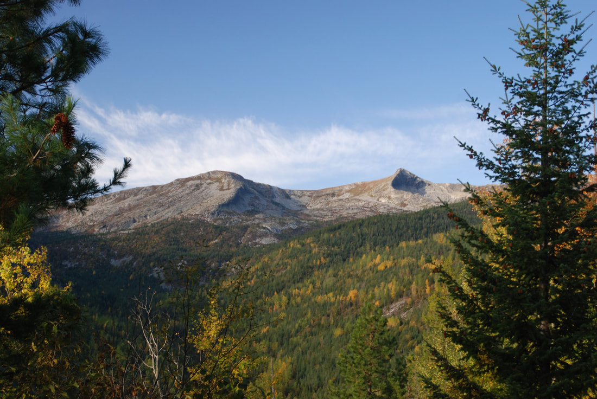
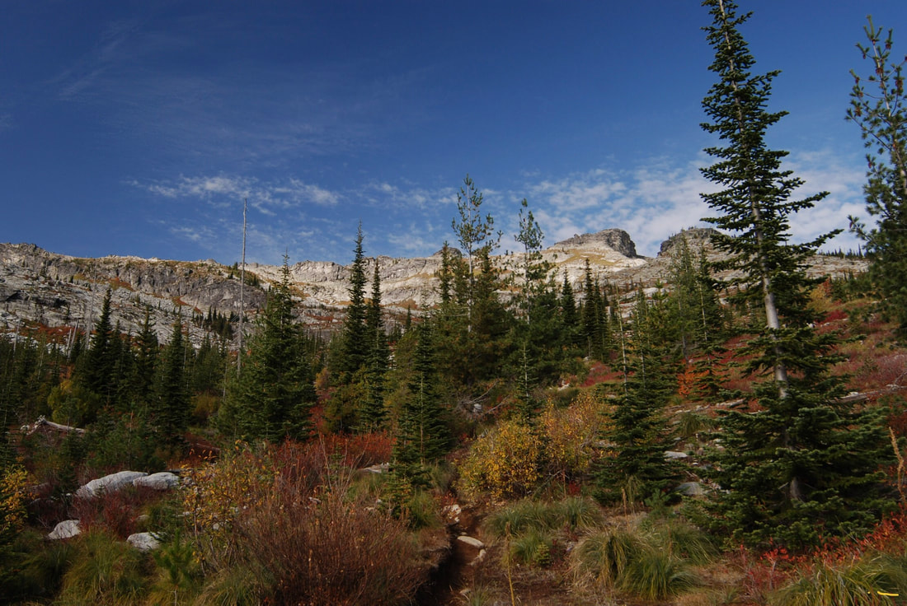
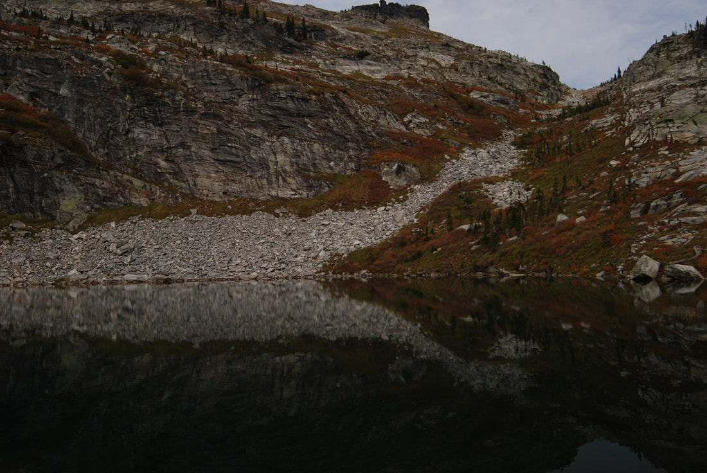
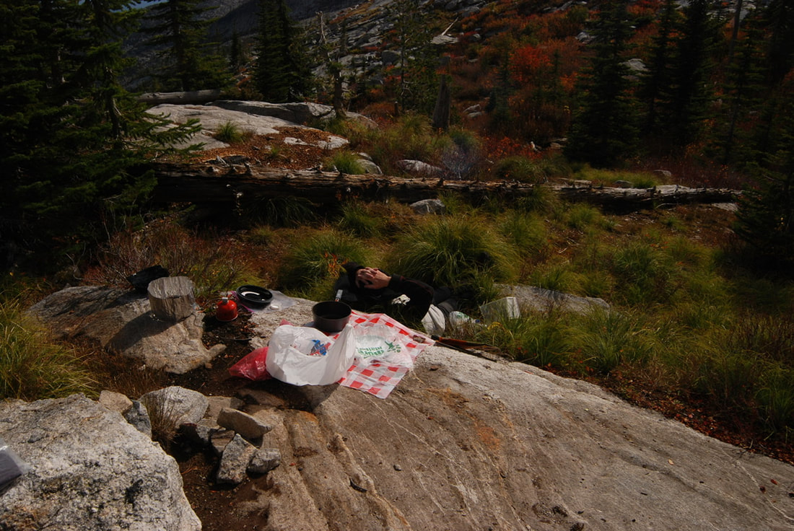
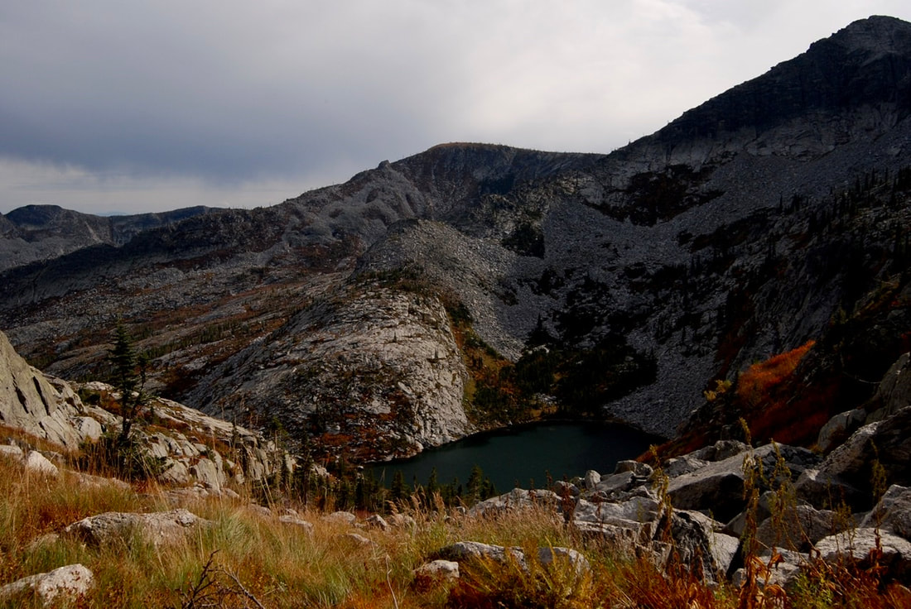
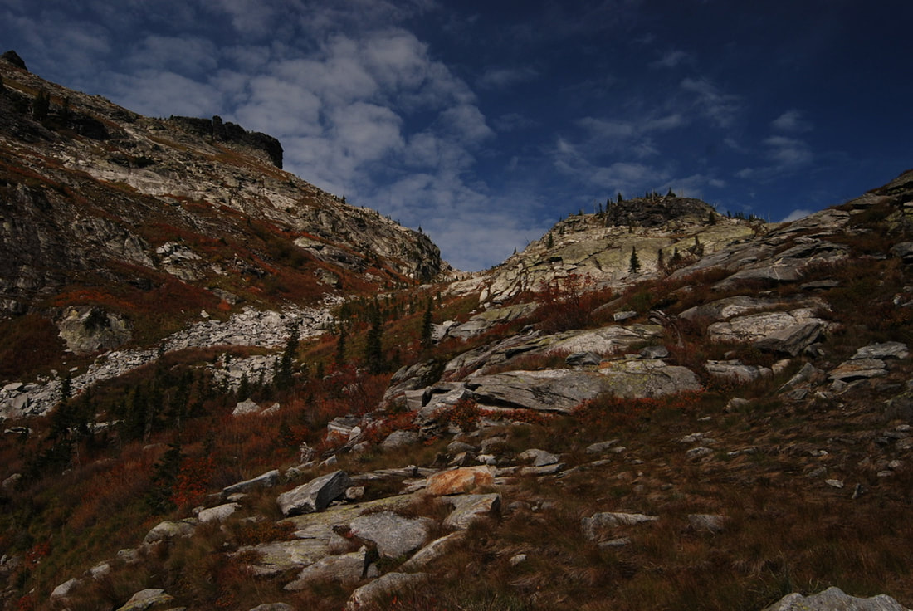

---
tags:
- Lakes
- Strenuous to Very Strenuous
- Day Hiking
- Backpacking
- Scrambling
- Mountain Biking
stats:
- label: Event Type
  icon: hiking
  value: Hiking, backpacking, scrambling and Mt Biking
- label: Distance
  icon: map-marker-distance
  value: Lake 12 miles RT, Peak about 14 miles RT
- label: Elevation Gain
  icon: elevation-rise
  value: Lake 2785' gain, Peak 3776' gain
- label: Acres
  icon: vector-square
  value: '6'
- label: Difficulty
  icon: speedometer
  value: Strenuous to Very Strenuous
- label: Maps
  icon: map
  value: IPNF-Kaniksu N.F., Mt Roothaan, Dodge Peak
- label: GPS
  icon: crosshairs-gps
  value: 48° 34’ 37.3"n 116° 37’ 17.8"w
- label: Ranger District
  icon: pine-tree
  value: Sandpoint R.D. 208.263.5111
- label: Bonner County Sheriff
  icon: shield-account
  value: CALL 911 FIRST or 208.263.8417
notes:
- label: Idaho Panhandle National Forest Alerts
  url: https://www.fs.usda.gov/alerts/ipnf/alerts-notices
---

# Fault Lake 5980 Hunt Peak 7058 Trail 59

## Description

We have added the areas sheriff’s emergency phone numbers for each trip write up under the ranger district
info. if an emergency ocurrs, evaluate your circumstances and call only if needed. From the Fault Lake
trailhead near the Pack River, drive on FR #293 for 1.2 miles to the trailhead by McCormick Creek. From the
McCormick Creek bridge head west on Trail #59 for 6 miles to Fault Lake. Most of the trail is on an old
logging/mining road to within 1.6 miles of the lake. As the old road switches to a single track, the trail
is moderate and is easy for hiking and Mt Biking. Of course, there are sections of the trail that Mt Bikes
might have to walk, but they are few. The last 1.6 miles of the trail are steeper and rough in places. Once
at the Fault Lake, head north up the fault, for which the lake is named, and look for lunch spot with a
view. Huckleberries abound around the lake.

This trail is a section of the Idaho Centennial Trail that roughly skirts the eastern boarder. From the SW
above the lake, a fault is obvious, and it's where Fault Lake gets its name.

## Directions

From Sandpoint, drive north on 95 10.5 miles to Samuel. There is a gas mart just after the signs to the Pack
River Road 231. Drive 12 miles to a junction with FR #293, and bear left (west). At a switchback take a
secondary road straight ahead to the trailhead.

## Option #1

From Fault lake, head north up past several rock bands to a gully that leads to the ridge between Hunt Peak
and Gunsight Peaks. From here you can head north to Gunsight Peak, or south to Hunt Peak.

## Hazards

To the lake, the trail is pretty long. Above the lake, the route is pure scrambling FUN.

There is a stream crossing down low at the start of the hike. In spring and early summer be cognizant of the
weather and any pending thunderstorms. If it starts raining on the snow while you are on the other side of
the creek you may not make it back to your truck until the water level drops again.

## Cool things close by

Beehive Lake, Harrison Lake & Peak, the Pack River, Sandpoint, and the Selkirk Crest.

## R & P

Jalapeños, Mr. Sub, Burger Express, in Sandpoint

## Plan your trip

[Click for Current NOAA Weather Conditions](http://www.nws.noaa.gov/wtf/udaf/area/?site=otx)

## Photo gallery

The huckleberries were great along Trail #59 below the lake.

_Lower section of the Selkirk Crest, south of Hunt Peak._

_Along the trail to Fault Lake._

Even a trickle of falling water, makes a hike more enjoyable.

_Does anyone see the alligator in this image?_

_Always find the best spot for lunch & a nap._

The fall colors around Fault Lake.

_Fault Lake from high in the fault._

_The fault that the lake is named for._

!!! quote
    The mountains are… What we all need. What centers our lives and calms our souls Strengthens our bodes
    and causes awe. chic 1.1.2023
