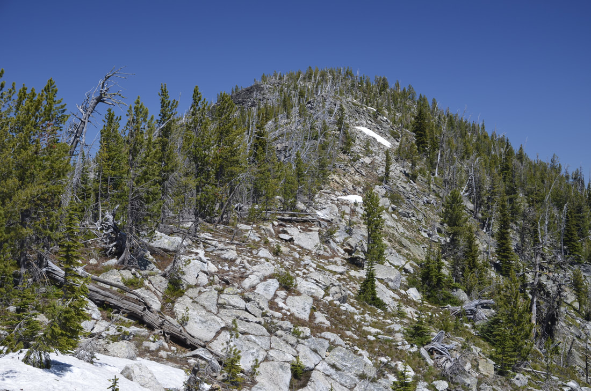

---
tags:
- Peaks & Mountains
- Difficult
- Day Hiking
- Backpacking
- Scenery
stats:
- label: Event Type
  icon: hiking
  value: Day hiking, backpacking, scenery, and possibly mt biking for the hearty.
- label: Distance
  icon: map-marker-distance
  value: 14 miles RT
- label: Elevation
  icon: terrain
  value: "Less than 3000\u2019"
- label: Difficulty
  icon: speedometer
  value: Difficult
- label: Maps
  icon: map
  value: IPNF, Pyramid Peak topo
- label: GPS
  icon: crosshairs-gps
  value: "48\xB09\u20198\" n 116\xB031\u201931\" w"
- label: Ranger District
  icon: pine-tree
  value: Bonners Ferry R.D. 208.267.5561
- label: Boundary County Sheriff
  icon: shield-account
  value: CALL 911 FIRST or 208.267.3151
notes:
- label: Idaho Panhandle National Forests Alerts
  url: https://www.fs.usda.gov/alerts/ipnf/alerts-notices
---

# Fisher Peak Trail 27

_Fisher Peak Trail 27_

## Description

We have added the area's sheriff emergency phone numbers for each trip write-up under the ranger district
info. If an emergency occurs, evaluate your circumstances and call only if needed. Trail #27 starts at
4,145’ on F.R. #634, Trout Creek Road, or the road to Pyramid Peak. The first thing you will notice is the
trail is not too steep, but relentless to the summit. The trail received some improvements in 2012, which
helps with the up. There are about 25+ switchbacks to the summit.

In less than a mile from the trailhead, the trail crosses a stream that could be tricky during runoff. This
stream is the only water source on this hike. A clear cut and road is crossed at about 2 miles. After 14
switchbacks you will be hiking on Farnham Ridge. Up near the real summit, and just past 2 false summits, the
trail becomes less relentless, and the views become unbelievable. To the north is Creston, B.C., with the
Kootenai River flowing through it.

## Option #1

Instead of hiking the trail down for about 1.3 miles, stay up on Farnham Ridge to the right (west) along a
ridgeline. Off to the SW is a nondescript knoll that is the highest point in the American Selkirks, at
7,709’. When you notice the trail is fading from view, bushwhack east down to the trail.

## Directions

While driving through Bonners Ferry, turn left (west) onto Riverside Street, just before the Kootenai River
Bridge. Drive 5 miles to the West Side Road F.R. #18, turn right (north) to the Kootenai National Wildlife
Refuge. There’s a reading room here. In about 15 miles past the K.N.W.R., turn left (west) onto Trout Creek
Road #634. Drive another 5.3 miles to the pull off for parking.

## Hazards

This trail isn’t too steep, but is relentless the whole 6.5 miles. There is no water up high.

## Cool Things Close By

Parker Peak, Trout Lake & Big Fisher Lake, Pyramid Peak, and Pyramid Lake & Ball Lakes.

## Restaurants & Pubs

Eichardt's, Mr. Sub, BURGER EXPRESS, Jalapeños in Sandpoint.

## Photo Gallery

_Trout Creek Cascades._

_Creston, BC, Canada from Fisher Peak._

_The Lion's Head Peak group (L) - Parker Peak (R)._

_A peak 8634', Snowshoe Peak 8738', Ibex Peak 7676' SE of Fisher Peak._

!!! quote
    If there is a way to go... Up is it. — Chic, 8.2.2023
