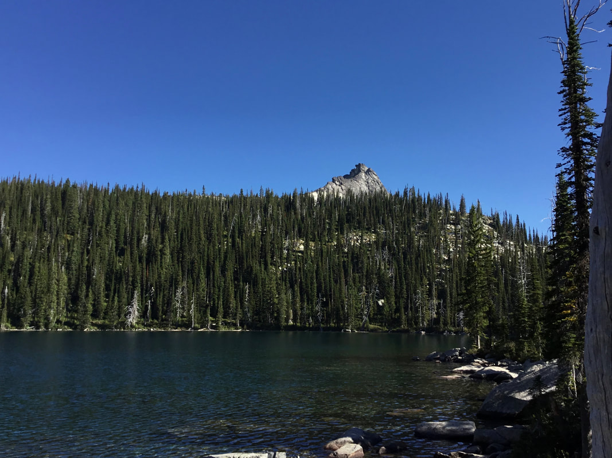
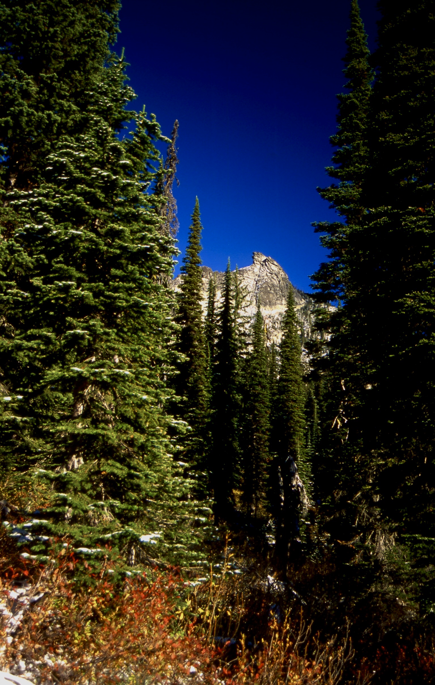
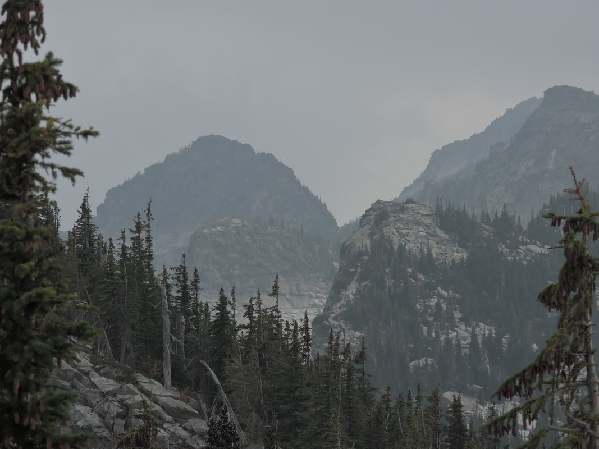
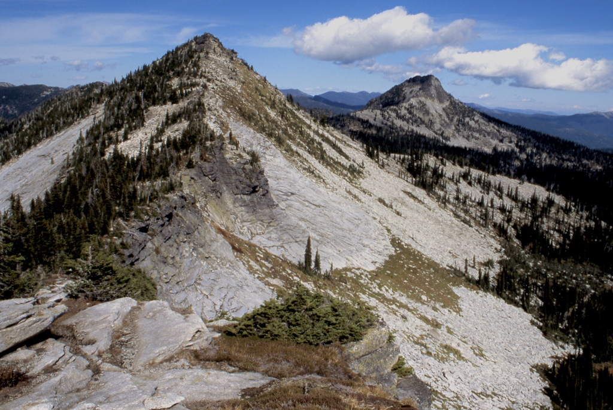
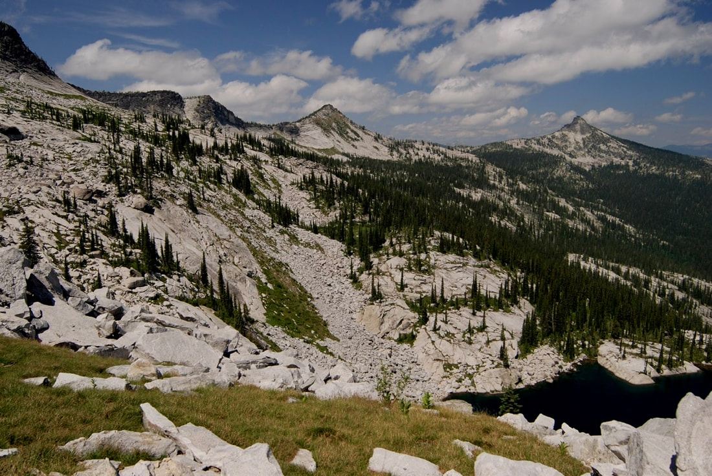
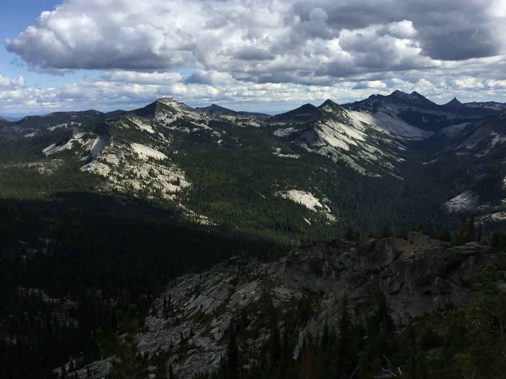
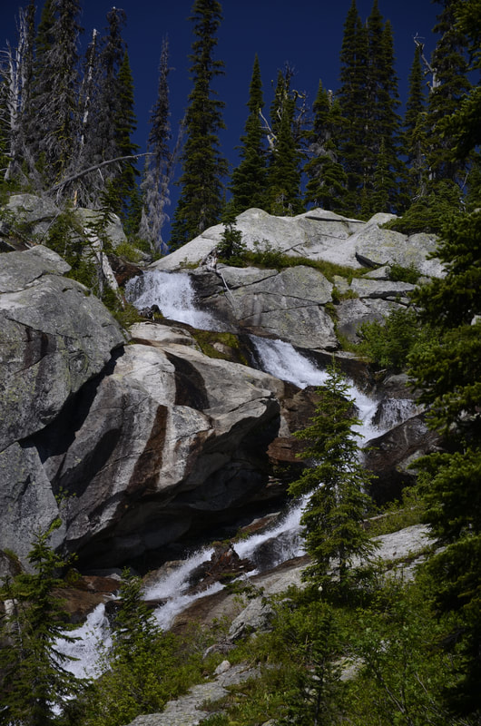

---
tags:
- Lakes
- Day Hiking
- Backpacking
- Scrambling
- Climbing
stats:
- label: Event Type
  icon: hiking
  value: Hiking, backpacking, scrambling and climbing
- label: Distance
  icon: map-marker-distance
  value: Lake 5 miles RT, Harrison Peak about 8.6 miles
- label: Elevation Gain
  icon: elevation-rise
  value: Lake 1435' gain, Peak 2546' gain
- label: Acres
  icon: vector-square
  value: '28.8'
- label: Difficulty
  icon: speedometer
  value: Lake Moderate, Peak very Strenuous
- label: Maps
  icon: map
  value: IPNF-Kaniksu N.F, The Wigwams
- label: GPS
  icon: crosshairs-gps
  value: 48° 39’ 5°7′.4″N 116° 37’ 3°8′.0″W
- label: Ranger District
  icon: pine-tree
  value: Bonners Ferry 208.267.5561 & Sandpoint R.D. 208.263.5111
- label: Boundary County Sheriff
  icon: shield-account
  value: 911 or 208.267.3151
- label: Bonner County Sheriff
  icon: shield-account
  value: CALL 911 FIRST or 208.263.8417
notes:
- label: Idaho Panhandle National Forests Alerts
  url: https://www.fs.usda.gov/alerts/ipnf/alerts-notices
---

# Harrison Lake & Peak 7292 (Trail #217 & #6)

_Harrison Lake & Peak 7292 (Trail #217 & #6)_

!!! warning "Before You Go"

    Good news, F.R. #231 is open to the Harrison Lake trailhead as of 3/12/26.

## Description

We have added the area's sheriff’s emergency phone numbers for each trip write-up under the ranger district
info. If an emergency occurs, evaluate your circumstances and call only if needed.

**Hike to Harrison Lake**: From alongside the Pack River, head up Trail #217 for 2.5 miles to the lake.
Along the trail there are several viewpoints to stop at to view the Beehive, the Seven Sisters of the
Selkirk Crest, the Twins, and a beautiful rock basin below the crest. About 2 miles up the trail, you will
find a junction with Trail #6 that leads in from the Myrtle Creek drainage. Above the junction for Trail #6,
the trail breaks out onto granite. Follow the cairns up the huge granite slabs to the lake.

To the NNE of the lake, Harrison Peak stands high to the north, while the Selkirk Crest fills the western
view. To the south, a huge granite ridge descends to just below the lake. To the east is the eastern arm of
the Selkirk Crest.

There are several campsites on the SE end of the lake, as well as some cool rock formations, and a fishing
trail along its shoreline.

## Directions

From Sandpoint, drive north for 10.5 miles to Samuels. There is a gas station/mart on the west side of the
highway, just after the Pack River Road #231 turn. Turn up Pack River Road for 20 miles on a good dirt road
to the trailhead.

### Option 1: Hike to Harrison's Summit

From Harrison Lake, look to the NNE for a faint climber's trail heading up towards and under Harrison Peak's
east face. This trail is easy to follow until you are directly under the peak’s massive east wall. Stay next
to the face as you scramble up to the saddle on the NE of the summit. The last 20 vertical feet is more
difficult but doable. If you feel uncomfortable with this approach, continue north into the forest, and go
up from there.

After spending some time on the summit, walk north on the summit ridge, stopping to take in the view of the
massive Harrison Peak overhang. To descend, you can follow your route up, or head due east down thru the
woods to Trail #6, which skirts the entire east and southeast side of the peak. At Trail #6, turn right (SW)
back to the Harrison Lake Trail #217.

### Option 2

Along Trail #217 from the Harrison Lake trailhead, look for an obscure trail to the NE at about 2.25 miles.
Look for a sign denoting Trail #6 at a sharp right turn. Turn right (NE) onto Trail #6 for about a mile+ and
head uphill towards the peak. It’s about 0.75 of a mile to the summit block. Look for some rock slabs to
scramble over to achieve the summit block. The summit is on your left (SW), and is dramatically overhung.
**PLEASE USE EXTREME CAUTION WHILE ON THE SUMMIT.** After spending some time on the summit, wander north to
find a great lunch spot. After lunch, continue north along the ridge top. Soon you will come to its north
end, where there are spectacular views of the Two Mouth Lakes Basin, and Myrtle's Turtle dome.

Come back towards the summit about halfway, and turn left (east, downhill) to Trail #6. You can’t miss Trail
#6; it skirts the entire east flank of Harrison Peak. Trail #6 comes south from the Myrtle Creek basin.

### Option 3

This option takes you to the Selkirk Crest via the route described above. Then turn left (south) and ascend
Peak 7171’. You can see Peak 7171’ from the north end of Harrison Lake. Have your lunch on top of 7171 with
incredible views before heading down the ridge. The ridge heads east and skirts Harrison Lake about 600 feet
above. Eventually, the ridge starts a descent down to near the Pack River out of Harrison Lake. There is no
trail, so wander down the granite slabs, staying centered on its crest. Near the bottom of the ridge, where
it gets steep, look for a north-south band of greenery that skirts the cliffs. If need be, walk SE on lesser
slopes to get to the greenery. Once there, the greenery takes you back towards the lake. Wherever you cross
the Pack River up high, turn left (north) to get back to the lake.

### Option 4

On 9/15/22 we hiked into Harrison Lake, looking for a scramble in its basin. We chose to head up my regular
route to the Selkirk Crest on Harrison Lake's west wall. After boulder-hopping around the lake, we headed up
to the second-lowest notch in the back wall. When you can hike up thru greenery, do so, but soon you will
have to start a really fun scramble to the crest. Just above on the ridge to the left (S) is a great place
to rest. We dropped off the crest and headed SSW to the far ridge line east of Peak 7171'. The high garden
between your ascent and the south wall is well worth the visit. Head SE until you access the ridge, heading
east high above the lake. While walking this ridge, always stay centered on the ridge. Do not allow your
path to drop off either side of the ridge. As you get closer to the campsite area at Harrison Lake, work
your way carefully to the north and down a steep but safe patch of greenery to the Upper Pack River. Walk
back out to the lake. None of this option is on any trail, so enjoy the adventure!

## Hazards

No matter which route you take to get to the lake, they are easy with no real hazards. However, all other
hikes from Harrison Lake require care. As you come along the east side of Harrison Peak, the route becomes
steeper and requires great care. By using the brush and trees, you can get above the steep section. Once out
of the vertical gulley, there are several low-angle granite slabs to scramble over to reach the summit. When
you are approaching Harrison's summit block, **PAY CLOSE ATTENTION TO WHERE YOU ARE WALKING**.

## Cool Things Close By

Beehive Lake, Myrtle Lake, Fault Lake, Kootenai National Wildlife Refuge, Myrtle Falls, Snow Creek Falls,
Burton Peak, the Purcell Trench, and Bonners Ferry.

## R & P

Jalapeños, Eichardt's, Burger Express, Mr. Sub in Sandpoint.

## Photo Gallery

_Harrison Peak from Trail #217._

_The South Twin and other Selkirk Crest peaks, taken from near Peak 7171'._

_Peak 7171’ on left with Harrison Peak on right. Harrison Lake is between, but not visible._

_Harrison Peak top right with Little Harrison Lake bottom right._

_From Roman Nose summit, the Seven Sisters, the Beehive dome and Harrison Peak on right._

_Harrison Peak on left from the Wigwams East trail._

_Harrison Lake outlet creek falls._

> _A trail not taken leads to places few go. Whereas, a path taken leads those who wander to new heights,
new views, and old memories._ — Chic, 9/13/11
