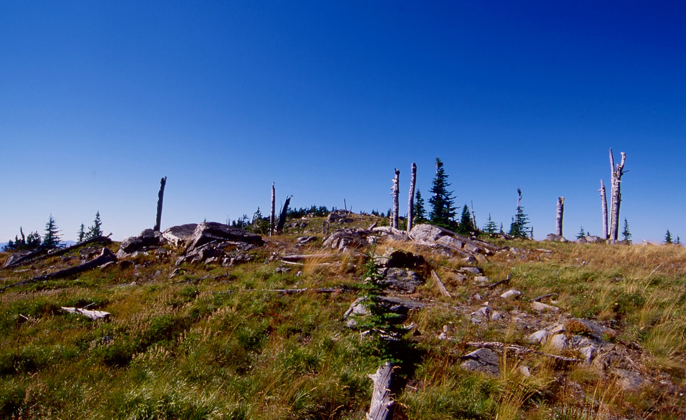

---
tags:
- Peaks & Mountains
- Difficult
- Day Hiking
- Backpacking
stats:
- label: Event Type
  icon: hiking
  value: Hiking & backpacking
- label: Distance
  icon: map-marker-distance
  value: About 11 miles RT
- label: Elevation Gain
  icon: elevation-rise
  value: 3420'
- label: Difficulty
  icon: speedometer
  value: Difficult
- label: Maps
  icon: map
  value: IPNF-Kaniksu N.F., Clifty Mt, Leana
- label: GPS
  icon: crosshairs-gps
  value: 48°54’49" n 116°41’06" w
- label: Ranger District
  icon: pine-tree
  value: Sandpoint R.D. 208.263.5111
- label: Bonner County Sheriff
  icon: shield-account
  value: CALL 911 FIRST or 208.263.8417
notes:
- label: Idaho Panhandle National Forests Alerts
  url: https://www.fs.usda.gov/alerts/ipnf/alerts-notices
---

# Iron Mountain 6426 Trails 180 & 176

_Iron Mountain 6426 Trails 180 & 176_

## Description

We have added the area's sheriff emergency phone numbers for each trip write-up under the ranger district
info. If an emergency occurs, evaluate your circumstances and call only if needed. The first thing to know
about Iron Mountain (6,426') is that the trail is steep. You can choose the direction you want to hike,
depending on if you want to do the elevation gain or loss going up or down. From the Boulder Creek Road #628
Trailhead, choose your route. The NW route, Trail #180, leads to a series of switchbacks as it heads towards
Iron Mountain Divide. Keep in mind, you gain 3,420 verts in 6 miles. Once at Iron Mountain, continue SSE on
Trail #180 until it meets with Trail #176, the Slate Ridge.

At Trail #176, turn left (NE) and hike the Slate Ridge past Buck Mountain and on to the trailhead and cars.

To do this loop counterclockwise, reverse the above.

## Option #1

After summiting Iron Mountain, continue to Trail #176. Turn right (south) on the Iron Mountain Divide to
Boulder Mountain, Divide Lake, Middle Mountain, to Star Mountain, the end of the trail.

## Directions

From the north side of Bonners Ferry, turn east onto Ash Street. Drive 0.4 of a mile, and bear left on Cow
Creek FR #24 for 0.5 miles to a "Y" and bear left staying on FR #24 for 3 miles, then turn left staying on
FR #24. Continue on 24 for 11 miles to Road #408, and bear left onto Road #628. The trailhead is just past
Middle Fork Boulder Creek on your right.

## Hazards

Expect a very steep trail to Iron Mountain. The only reliable water source is Middle Fork Boulder Creek, SE
of Iron Mountain. Keep in mind, the descent is 3,420 verts.

## Cool Things Close By

Black Mountain, Clifty Mountain, Bonners Ferry, Kootenai N.W.R., Burton Peak, Shorty Peak, Lone Tree Peak,
and West Fork Lake & Mountain. There is a waterfall on Smith Creek close to SH #1.

## Restaurants & Pubs

Jalapeños, Eichardt's, and Mr. Sub in Sandpoint.

## Photo Gallery

No images available. If you would like to contribute images, contact Chic.
