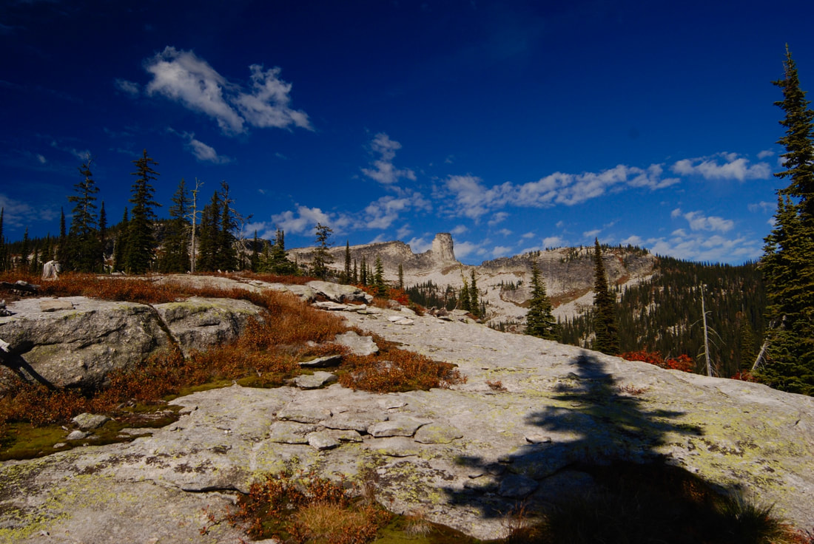

---
tags:
- Trails & Scrambles
- Moderate
- Day Hiking
- Backpacking
- Climbing
stats:
- label: Event Type
  icon: hiking
  value: Hiking, backpacking, and Climbing
- label: Distance
  icon: map-marker-distance
  value: 5+ miles RT Easy, to Roothaan Saddle moderate, SE Face Chimney Rock challenging
- label: Elevation Gain
  icon: elevation-rise
  value: 1235' gain
- label: Difficulty
  icon: speedometer
  value: Moderately Easy
- label: Maps
  icon: map
  value: IPNF - Kaniksu N.F., USGS - Mt. Roothaan
- label: GPS
  icon: crosshairs-gps
  value: 48° 36’ 27.5"n 116° 44’ 08.7"w
- label: Ranger District
  icon: pine-tree
  value: Sandpoint R. D. 208.263.5111
- label: Bonner County Sheriff
  icon: shield-account
  value: CALL 911 FIRST or 208.263.8417
notes:
- label: Idaho Panhandle National Forests Alerts
  url: https://www.fs.usda.gov/alerts/ipnf/alerts-notices
---

# Mount Roothaan (7326') and Chimney Rock (7124') Trail 256

_Mount Roothaan (7326') and Chimney Rock (7124') Trail 256_

## Description

We have added the area's sheriff's emergency phone numbers for each trip write-up under the ranger district
info. If an emergency occurs, evaluate your circumstances and call only if needed.

### West Route to Mt. Roothaan

The trail starts on Horton Ridge and climbs slightly into the forest where it gets a little steeper until it
breaks out of the forest and skirts the ridge to Mt. Roothaan's Saddle. From the saddle, turn right (NE) and
scramble up to the high rocky peak for .4 miles in 376 vertical feet.

From the top of Mount Roothaan, the views in all directions are worth the drive and walk. Chimney Rock sits
about a mile to the NNE. Gunsight Peak continues the Selkirk Crest to the north. To the west, there is a
knoll along the ridge that offers good views of Priest Lake.

### West Route to Chimney Rock

From the Roothaan Saddle, walk the north edge until a trail appears and drops to the north.

From here to Chimney Rock, the trail is sparse and very rough over boulders to the base of the rock. To
continue the hike, go to the north base of the rock and look for a narrow path around the rock. When the
trail emerges from around the rock, set your compass to Mt. Roothaan. Along the east side of the rock,
notice the upper top left of the face and the lighter colored rock. A few years ago, a huge slab of the
monolith broke off and crashed to the basin below.

As you make your way towards Mount Roothaan, the high meadows offer opportunities for wildflowers and small
cascades. Near Mount Roothaan, the scramble up to the top is moderately easy. To get to the saddle, follow a
well-used trail down the west side.

### East Route to Chimney Rock

The trail starts on the Pack River and climbs steadily up through the forest until it breaks out on the
granite slabs.

Look for cairns to get you to the Chimney. Be sure to look back to see where the trail enters the woods.
This trail is 11 miles round trip with 2,250 vertical feet gain. If your goal is to get to the rock,
rock-hop the rest of the way. For great views of the rock, find a soft place to have lunch and kick back.
Retrace your steps down and pay attention to where the trail enters the woods. On this route, there are 9
switchbacks after you have walked the 1.8-mile-long nearly straight stretch. Also be aware that there are 9
creek crossings of note (not related to the 9 switchbacks); five will be difficult in the spring and early
summer.

### Option 1

No matter which trail you come in on, there is a cool circumnavigation around Chimney Rock that includes the
summit of Mount Roothaan.

**East route:** As you get close to Chimney Rock, walk right (north) to the north face of Chimney Rock.
Carefully examine the route that circles around the north face. This route requires each hiker to pay close
attention to their footing and handholds. There are enough trees and shrubs to use for support and
protection as you walk around the face. In no time, you will be on the west face, and the walking becomes
easier for a while. Now the chore is to find a faint trail that leads you up to the saddle on the west side.
Once at the saddle, look for another faint trail that leads you up to Mount Roothaan. Enjoy the views from
Mount Roothaan. Your next route off of Mount Roothaan leads you south, then east around the base of Mount
Roothaan. From here, you can hike cross-country down towards the Pack River, keeping an eye out for the many
trail cairns you came up on.

### Option 2

**West route:** As you summit the ridge line trail from Horton Ridge, you will be on a saddle with Mount
Roothaan on your right (east). Look for a faint trail heading down the NW face to Chimney Rock. This trail
fades as you enter several boulder fields on your way to the rock. Once at the rock, continue north to the
edge. Look carefully for a small trail that eventually leads you around the NNE face of the rock. After
circling the NNE face, start your ascent up towards Mount Roothaan. Once on top of Mount Roothaan, stop and
enjoy a view of the American Selkirks laid out to the north. From the summit of Mount Roothaan, head NW down
to the saddle where Trail #256 heads west back to the trailhead.

## Directions

### West Route

From Priest River, head to the East Side Road and drive 4.5 miles to Hunt Creek Road #24 just across the
Hunt Creek bridge. Go 4.5 miles to a junction with FR #2, bear left, and go 1.6 miles to FR #25. Stay
straight for about a mile to a fork and bear right for .3 miles to another fork and bear left. About 2 miles
up FR #25, the road is very rough; don't try to get a car up it.

### East Route

Drive 10.5 miles past Sandpoint to Sunnyside/Samuel. Turn left (west) up the Pack River Road #231 for 17
miles, then turn left (west) onto FR #2653 to the trailhead.

The USFS has not replaced the trailhead signs on the Pack River Road yet, so consult a Forest Service map.

## Hazards

- **West Route:** Road from Horton Ridge to Mount Roothaan's Saddle to the base of Chimney Rock passes
  through serious scree fields.
- **East Route:** More serious scree fields east and south of Chimney Rock.
- **Mount Roothaan:** Lots of rock hopping, then more serious scramble to the summit.
- **Circumnavigation:** On any of the routes around Chimney Rock, use extreme caution while walking,
  scrambling, and especially circling the north face. Exercise extreme caution with children on this route
  as it requires intense concentration and careful monitoring.

## Cool Things Close By

Fault Lake, Hunt Peak, Gunsight Peak, Harrison Lake & Peak, The Selkirk High Traverse, Beehive Lake & Dome,
Priest Lakes and Priest River, Hunt Creek Falls, Lion Head water slide, and the Pack River itself.

## Rules & Regulations / Refreshments

Jalapeños, Mr. Sub, Burger Express, and Eichardt's in Sandpoint.

## Photo Gallery

_Mount Roothaan and Chimney Rock_

_A glimpse of Mount Roothaan & Chimney Rock from the Pack River Road_

_Pack River from the trailhead bridge_

_Chimney Rock from the eastern Pack River trail_

_An aerial view of Mount Roothaan & Chimney Rock flown by pilot Galen_

_A 1957 summit of Chimney Rock by Spokane Mountaineers_

_Spokane Mountaineers Frank Hefferlin, Bill Fix, NA, Helen Stowell in June 1958_

_A Spokane Mountaineers climbing party heading towards Chimney Rock_

_Chimney Rock from Mount Roothaan_

_From along the Selkirk Crest High Traverse, Chimney Rock & Mt. Roothaan in back_

!!! quote "Reflections"
    Whether you go into Nature for serenity or peace, a walk amongst Nature will show you more than you can
    imagine. It is a fact that a walk in Nature soothes our souls, allows us to become centered. And as
    we return to life, we are changed. — Chic (7/27/2024)
