---
tags:
- Peaks & Mountains
- Moderate to Strenuous
- Day Hiking
- Backpacking
- Scrambling
stats:
- label: Event Type
  icon: hiking
  value: Hiking, backpacking and scrambling
- label: Distance
  icon: map-marker-distance
  value: About 10 miles
- label: Elevation
  icon: terrain
  value: 3500 to 4000'
- label: Difficulty
  icon: speedometer
  value: Moderate to strenuous
- label: Maps
  icon: map
  value: IPNF - Kaniksu N.F., USGS - The Wigwams, Roman Nose, ID
- label: GPS
  icon: crosshairs-gps
  value: Harrison Lake 48° 42’ 1°2′.5″N 116° 37’ 2°3′.4″W, Beehive Lake 48° 38’ 59.3"n
    116° 37’ 25.0"w
- label: Ranger District
  icon: pine-tree
  value: Bonners Ferry R.D. 911 or 208.267.5561
notes:
- label: Idaho panhandle national forest/alerts
  url: '#'
- url: https://www.fs.usda.gov/alerts/ipnf/alerts-notices
---

# Selkirk Crest High Traverse

_Selkirk Crest High Traverse_

## Selkirk crest high traverse. trails # 217 & 279

## Description

Because of the length of the drive, I would suggest staying at or near the trailhead. Leave a car at the
Beehive Trailhead so you don't have to walk the 1.2 miles up to the cars. Hike to the 2.3 miles to Harrison
Lake on trail # 217.

While enjoying the lake and your snack, notice the back wall above the lake. Your goal is to scramble to the
SECOND LOWEST NOTCH on that wall, or the left notch. After a snack, walk around the left (south) side of the
lake and look for a small stand of Sub-Alpine Fir on your left about 75 verts above the back of the lake.
Skirt the right (west) side of the trees, and start your scramble to the notch. Yes it’s steep, but very
doable. Stop as much as you need to rest. Once you are on top, you are on the American Selkirk's Crest. Turn
left (south) and make your way to Peak 7171'. Peak 7171' is the second high peak on the Crest above the
lake. This is a good place to have your first lunch. From here you can hike the Crest south for up to 3
summits. You can't get down the 4th peak. All along the ridge there are ways to get down to the high meadows
below. Once in the meadows, walk the 1.4 miles south towards the long ridge ABOVE Little Harrison Lake.

However, make absolutely sure you stay up high on your right in the meadow. Going low, puts you in a few
difficult creek gully. Little Harrison Lake is a good place for your second lunch and a quick nap. After you
have enjoyed Little Harrison Lake, walk around the left (east) side of the lake, and scramble to the top of
the ridge. On the ridge look for a notch and a faint trail down to Beehive Lake. The steep gully that the
user caused braided trail is difficult and unsafe. Look for a route to the left or slightly down hill from
the steep gully. Enjoy Beehive because the hike to the trailhead is nearly 3.8 miles below the lake. Be
aware, the trail has diminished in quality ver the last few years. be extra careful n the beehive trail.

## Directions

Drive north of Sandpoint on 95 for 10.5 miles to Samuel. There is a gas mart on the west side of 95 and
signs for the Pack River Road #231. Drive 20 miles on 231 to the end of the road and the Harrison Lake's
trailhead.

---

## Hazards

Because about half of the route is off trail, you must take extra care on this entire route. Be sure to
carry your 13 essentials, a water purifier, and dress for all weather conditions.

## Cool things close by

Fault Lake, the Seven Sisters of the American Selkirks, and Pend Orielle Lake.

## Restaurants & Pubs

Jalapeños, Mr. Sub, Burger Express, and Eichardt’s in Sandpoint

---

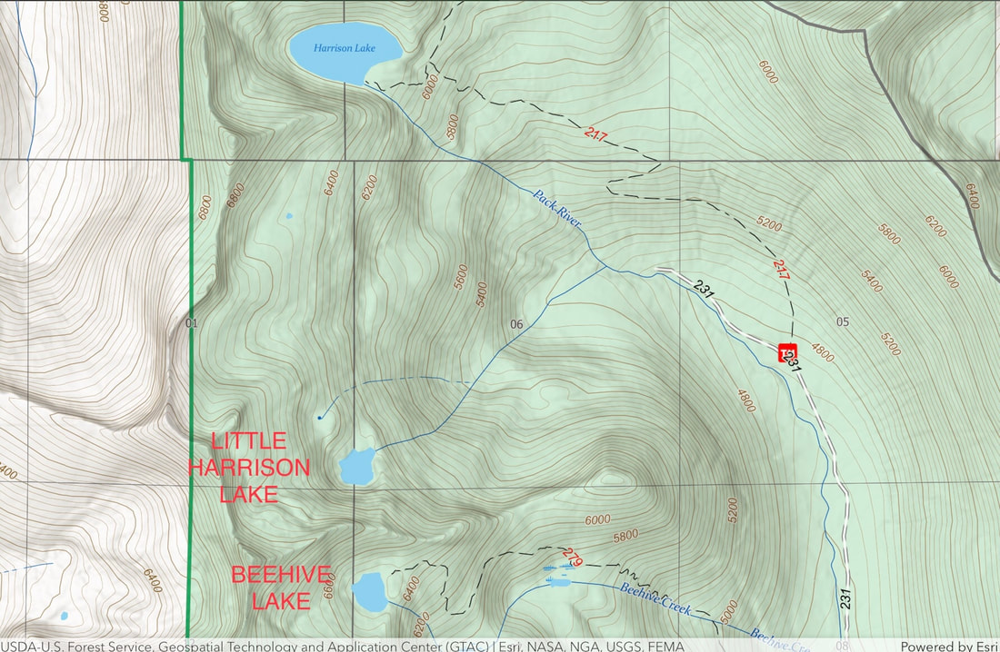

## Photo gallery

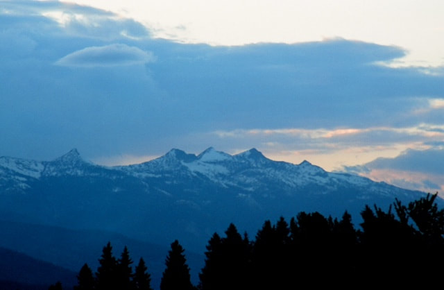

## Most of the seven sisters, from near colburn, idaho

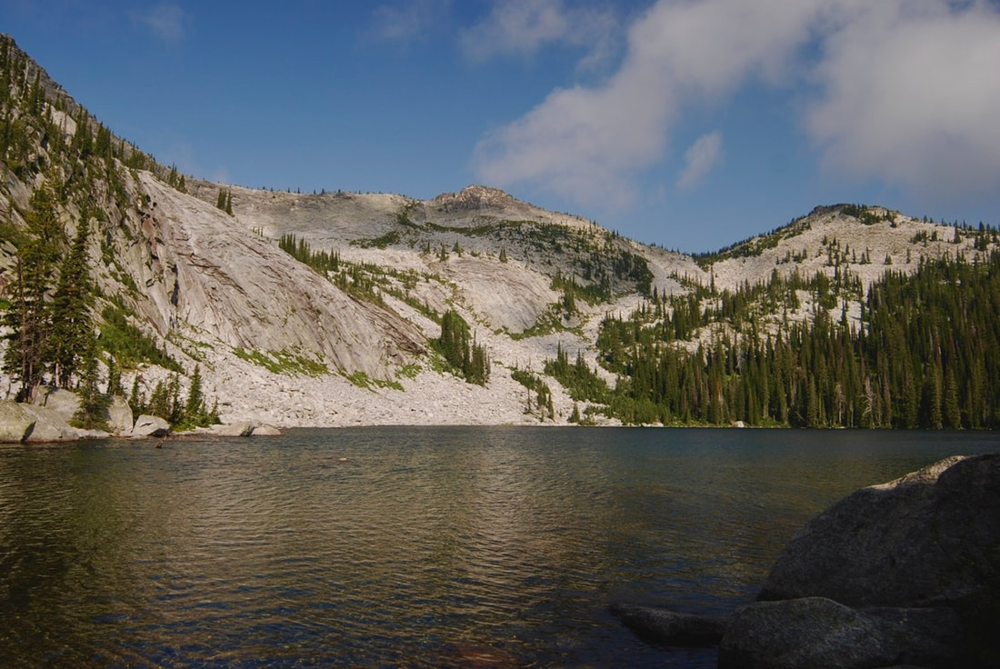

## Harrison lake, scramble to notch left of center summit, not the right one

---

### Picture (Image missing)

## Two scramblers atop peak 7171’ with harrison lake below

---

<!-- Missing Image: <!-- Missing Image: [*Picture (Image missing)*](../../../assets/images/p336.png) --> -->

## The team after summiting the selkirk crest above harrison lake

---

### Picture (Image missing) Details

## Harrison peak (left) peak 7171’ in distance & crest above harrison lake

---

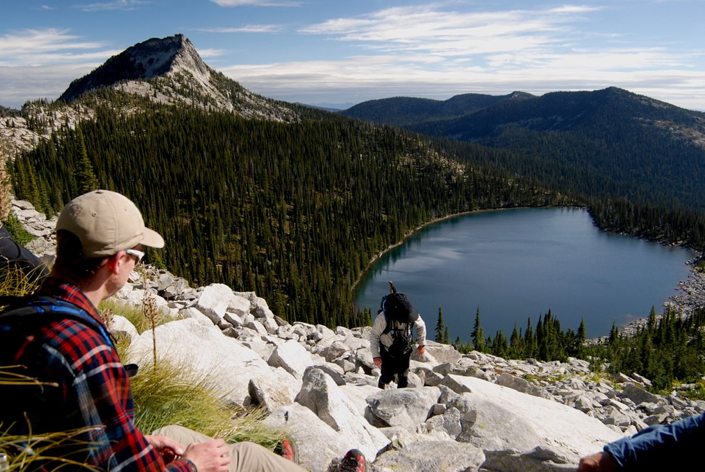

## Tyler watching chic scrambling towards the crest. harrison lake below

---

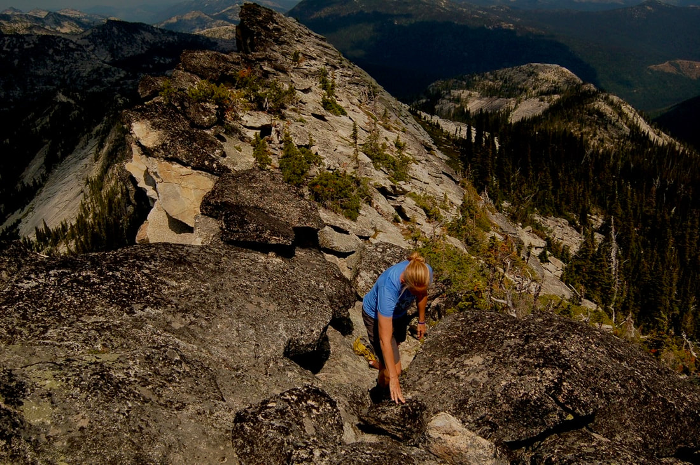

## Amy scrambling above harrison lake, on the crest

---

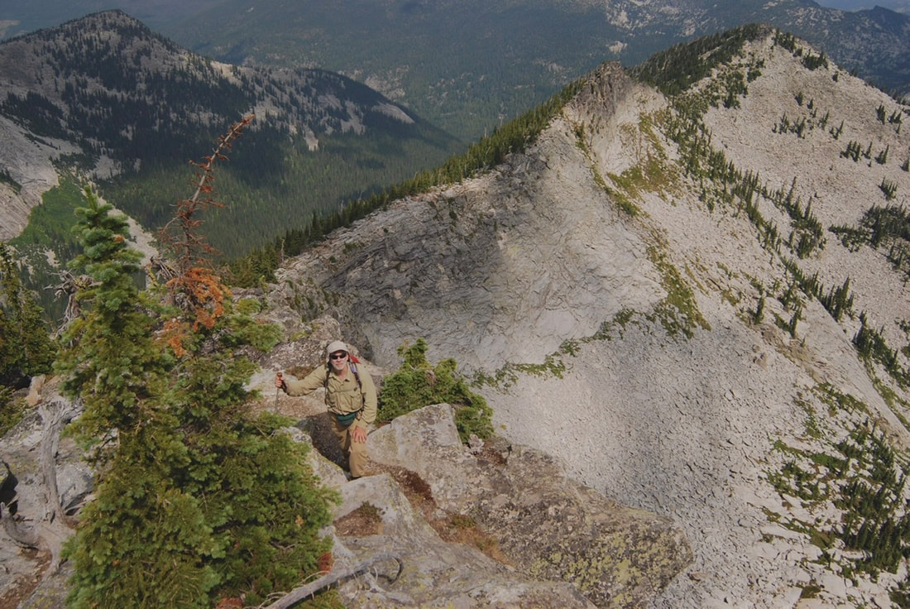

## Rich scrambling above harrison lake along the crest

---

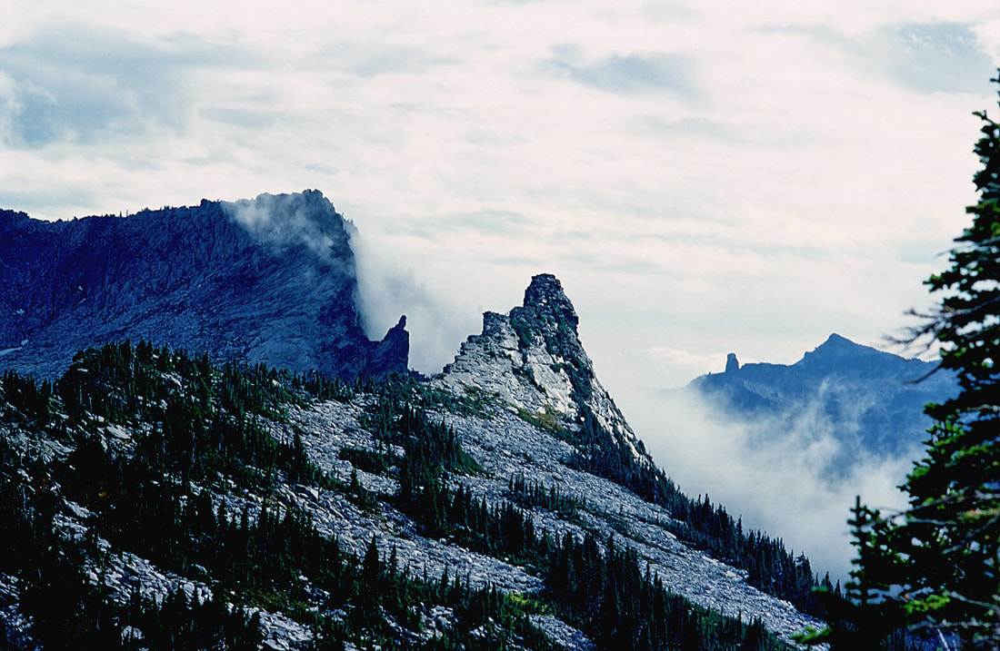

## Along the selkirk crest

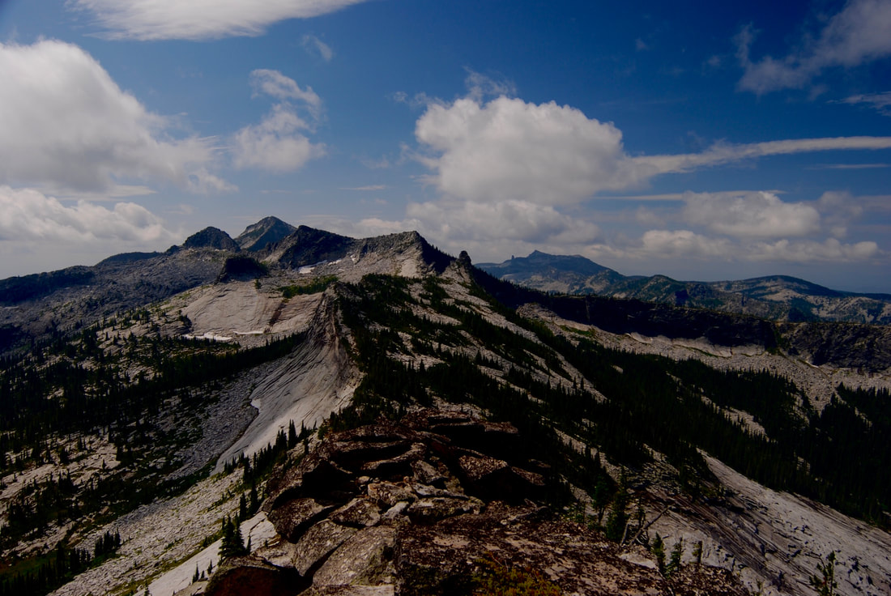

## Along the crest on the way to the twins, of the seven sisters

---

### Picture (Image missing) Details

## Chris admiring the meadows between harrison & little harrison lakes

---

## The meadows below the crest, with harrison peak on back right

---

### Picture (Image missing) Details

## The crew posing below the selkirk crest, in the meadows

---

### Picture (Image missing) Details

## The selkirk crest with peak 7171’ on right

---

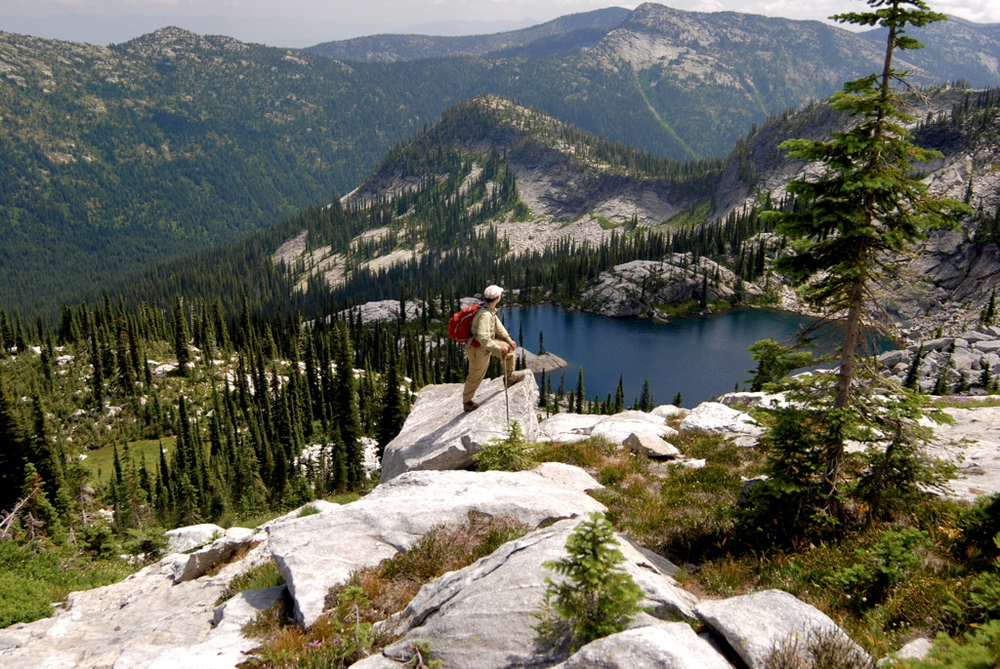

## The guru of hiking, rich taking in the views above little harrison lake

---

### Picture (Image missing) Details

## The final drop down to little harrison lake

---

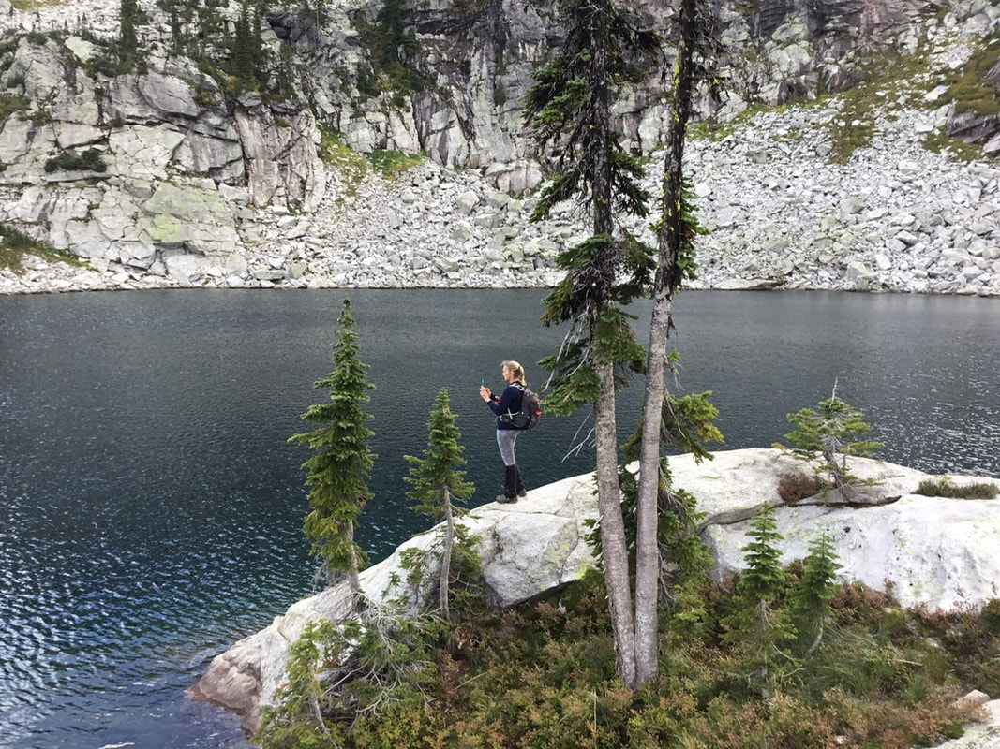

## Amy taking an image of little harrison lake

---

### Picture (Image missing) Details

## Taking a break before the scramble up top right

---

### Picture (Image missing) Details

## Little harrison lake photo by jennifer stone

---

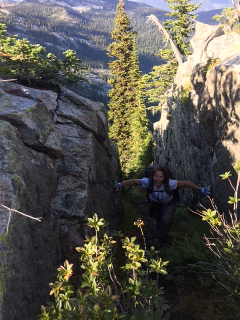

## A hiker scrambling up thru the rocks

---

### Picture (Image missing) Details

## The crew making gear changes on the ascent above little harrison lake

---

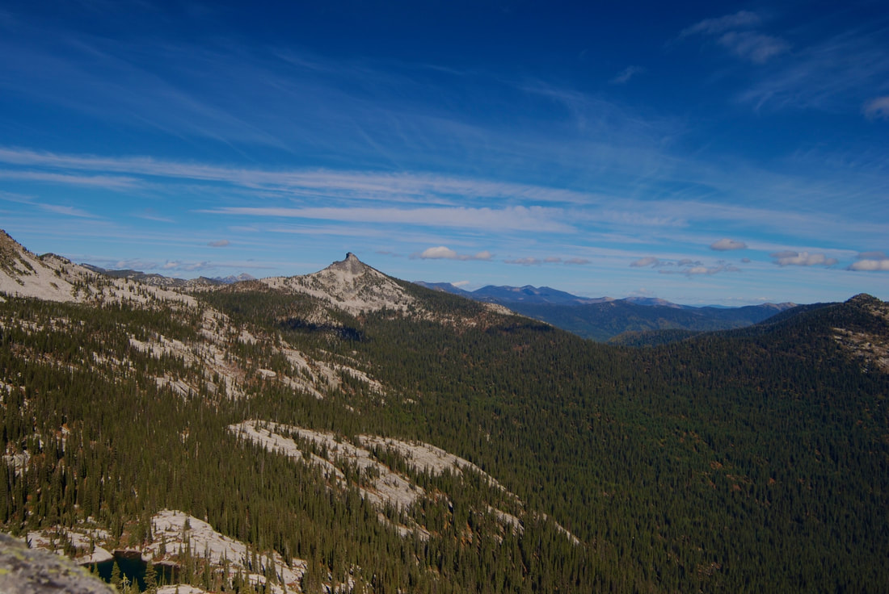

## Little harrison lake lower left, and harrison peak in background

---

### Picture (Image missing) Details

## The selkirk crest from the ridge to beehive lake

---

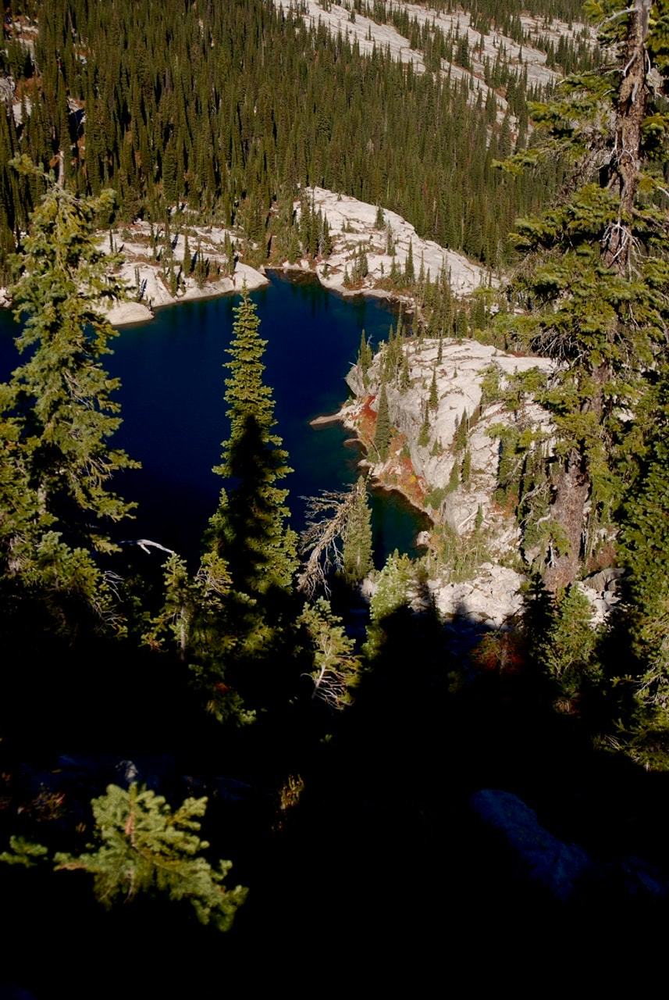

## Little harrison lake from ridge between beehive and l.h.l

## Wisdom is the knowledge we gain, usually too late.  chic     2013
