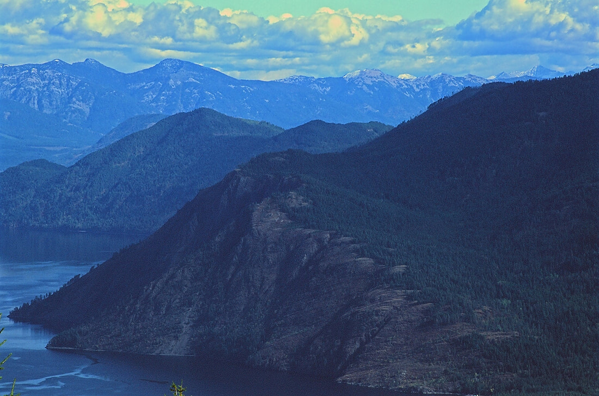

---
tags:
- Peaks & Mountains
- Moderate
- Day Hiking
- Scenic Overlook
stats:
- label: Event Type
  icon: hiking
  value: Day hiking and scenic overlook
- label: Distance
  icon: map-marker-distance
  value: 6.2 miles RT
- label: Elevation Gain
  icon: elevation-rise
  value: 1750 verts; Maiden Rock 2877 verts
- label: Difficulty
  icon: speedometer
  value: Moderately difficult
- label: Maps
  icon: map
  value: IPNF, Cocolalla Lake topo
- label: GPS
  icon: crosshairs-gps
  value: 48°07′00″ N 116°32′29″ W
- label: Ranger District
  icon: pine-tree
  value: CDA River R.D. 208.769.3000
- label: Kootenai County Sheriff
  icon: shield-account
  value: CALL 911 FIRST or 208.446.1300
notes:
- label: Idaho Panhandle National Forests Alerts
  url: https://www.fs.usda.gov/alerts/ipnf/alerts-notices
---

# Blacktail Mountain Overlook

_Blacktail Mountain Overlook_

!!! warning "Before You Go"

    Trail #117 has loose rock due to motorcycle use. Maiden Rock Trail drops steeply to the lake—remember
    that the return trip is entirely uphill! Poison ivy grows near the base of the Maiden Rock cliffs.

## Description

The cool thing about this trailhead is that it offers two great hikes. Pend Oreille Lake Trail #117 heads NE
towards Blacktail Mountain.

Because of bike use, the trail has lots of loose rock. PLEASE USE CAUTION. In about 2.5 miles, the trail
skirts around the west side of Blacktail Mountain. Just as you lose sight to the east, there is a faint
trail heading down to the east towards the lake. Take this faint trail for about 0.5 miles to a rock
outcropping. Along this path, you will walk through a thin forest before breaking out onto an open ridge.

There are two rock outcroppings along the path. Once used to house a fire lookout, you'd never know it
today. Go down to the second rock outcropping, where views are about 220° wide. Have lunch here and enjoy
views of Granite Point on Lake Pend Oreille, the Green Monarchs, Scotchman Peak and the Proposed Scotchman
Peaks Wilderness, and the Cabinet Mountains Wilderness to the NNE.

## Option #1: Maiden Rock Beach Trail #321

From the same trailhead, you can walk down to Maiden Rock on the west shore of Lake Pend Oreille. It's
almost 2 miles down to the beach and drops about 1,200 feet. After swimming and sunbathing, it's a steady
uphill hike back to the trailhead.

The trail is mostly shaded by trees. Near the bottom, it drops down through a cool young cedar forest. At
the beach, options include swimming, cliff jumping, and rock skipping on small, round, flat rocks. There are
picnic tables and a pit toilet. Note that this is a popular boat camp, so you won't be alone. Water is over
800 feet deep just 50 feet off Maiden Rock point.

Be aware: poison ivy grows along the base of the cliff. Poison ivy has three identical drooping leaves per
stem. Do not touch it!

## Directions

From Coeur d'Alene, drive north on US-95 to the south end of Cocolalla Lake. From the first Blacktail Road
on the right, drive 0.8 miles to the second Blacktail Road on the right (a sharp right turn). Continue on
Blacktail Road for a short distance to where it turns left onto Butler Road. Stay on Butler Road to the
trailhead.

## Cool Things Close By

Cocolalla Lake, Evans Landing, North & South Chilco Mountains, Packsaddle Mountain, and Talache Landing.

## Hazards

Trail #117 is very rocky and requires careful footing. Maiden Rock Trail is a steep 1,200' climb back up
from Lake Pend Oreille. Poison ivy near Maiden Rock cliffs.

## R & P

Trails End Brewery, Moon Time, Franklins Hoagies, and Mexican Food Factory.

## Photo Gallery

_The west shoreline of Lake Pend Oreille looking south_

_Granite rock, Lake Pend Oreille_

_Trail #321 down to Maiden Rock boat camp through a cedar forest_

_Maiden Rock beach_
