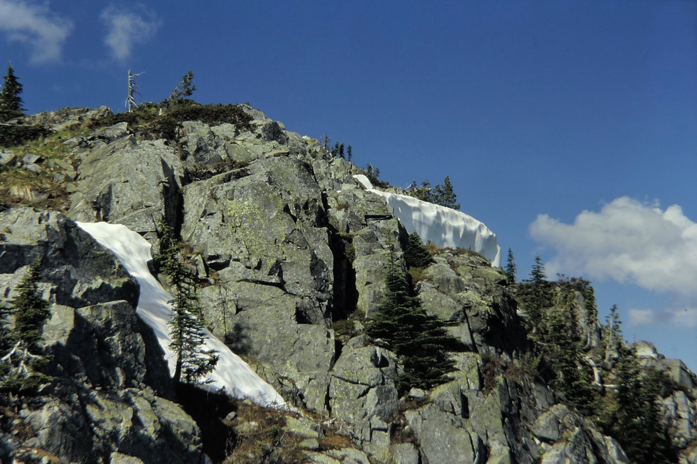
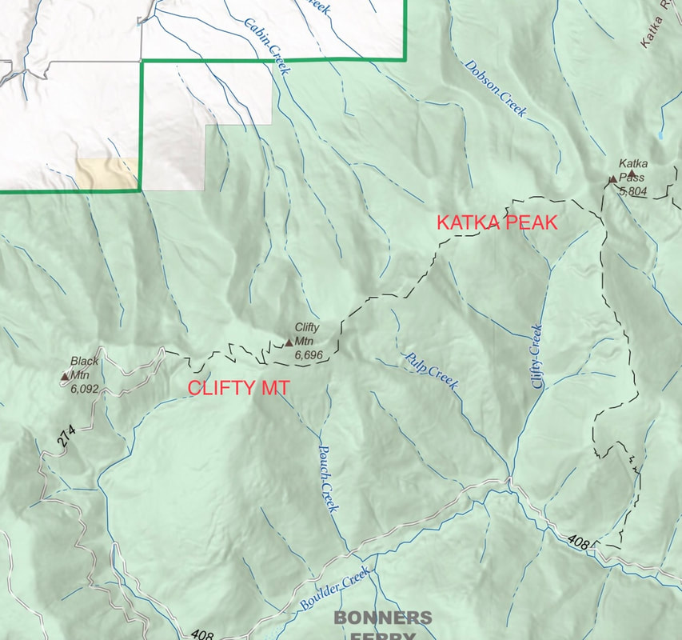
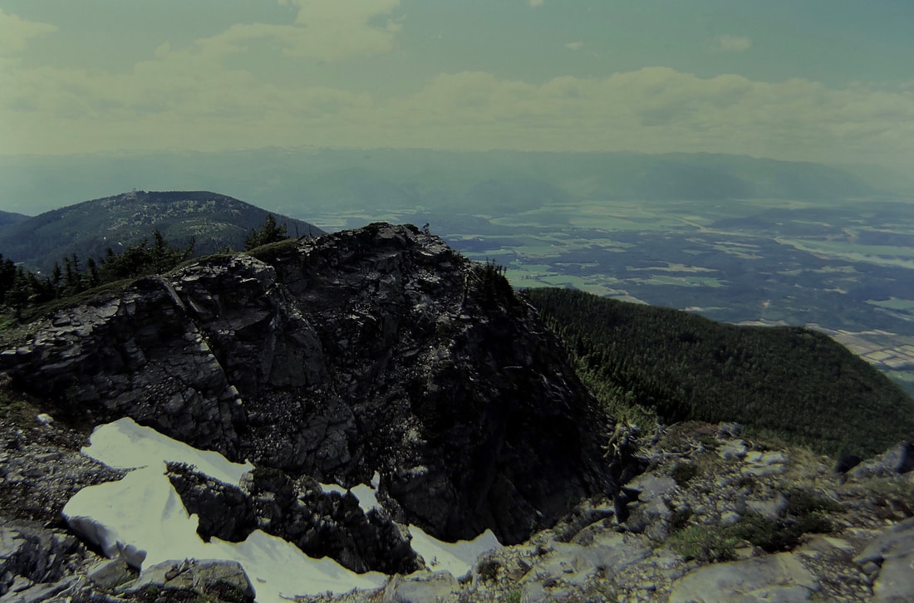
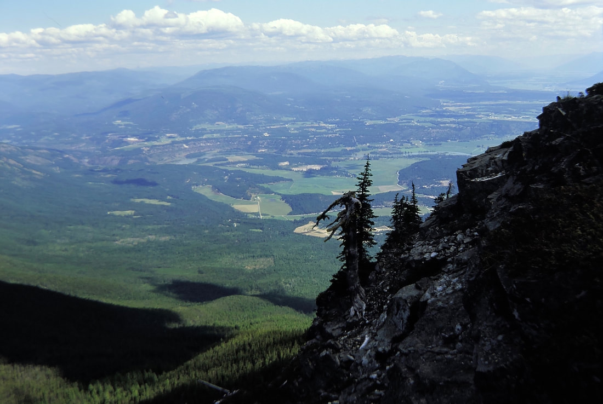
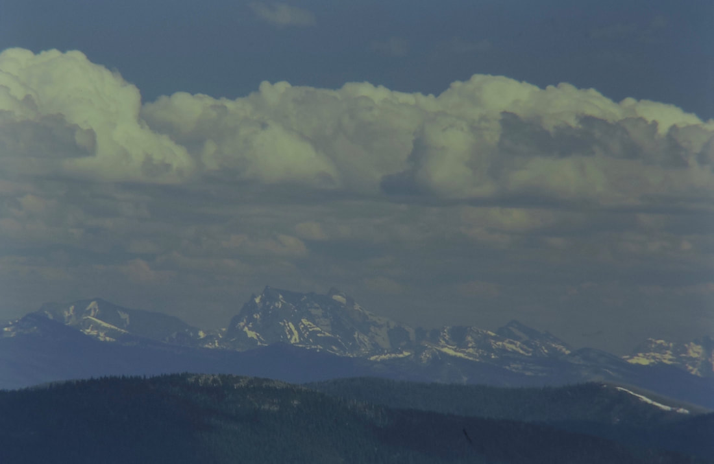

---
tags:
- Trails & Scrambles
- Peaks & Mountains
- Moderate
- Day Hiking
- Equestrian
stats:
- label: Event Type
  icon: hiking
  value: Day hiking, dry backpacking, equestrian
- label: Distance
  icon: map-marker-distance
  value: 8 miles RT
- label: Elevation Gain
  icon: elevation-rise
  value: 1,000' gain
- label: Difficulty
  icon: speedometer
  value: Moderate
- label: Maps
  icon: map
  value: IPNF, Moyie Springs & Clifty Mountain Topos
- label: GPS
  icon: crosshairs-gps
  value: "48\xB038'48\" N 116\xB001'08\" W"
- label: Ranger District
  icon: pine-tree
  value: Bonners Ferry RD (208.267.5561)
- label: Boundary County Sheriff
  icon: shield-account
  value: CALL 911 FIRST or 208.267.3151
notes:
- label: Idaho Panhandle National Forests Alerts
  url: https://www.fs.usda.gov/alerts/ipnf/alerts-notices
---

# Clifty Mountain to Katka Peak

_Clifty Mountain to Katka Peak_

## Description

Trail #182 climbs out of a high ridgeline switchback, ascending steeply onto a bench before circling the
southern shoulder of Clifty Mountain (6,705'). A short spur trail climbs directly to Clifty's summit,
offering expansive panoramic views over the Kootenai Valley to the south and the Purcell Trench to the
north.

From Clifty Mountain, Trail #182 heads east-northeast along an undulating alpine ridge for 3 miles toward
Katka Pass. Passing the junction with Trail #143 (which descends McGinty Ridge), Trail #182 skirts Katka
Mountain and ascends the eastern slope of Katka Peak (6,208'). The summit of Katka Peak opens up panoramic
views across the Kootenai River Valley toward Troy and Libby, Montana, showcasing the dramatic S-curves of
the Kootenai River below.

## Access & Directions

From Naples, Idaho, drive 1.2 miles east on Twentymile Creek Road. Continue for 10 miles to the junction
with Forest Road #274 (which leads toward Black Mountain Lookout). Drive 4 miles up FR-274 to the trailhead
located at a sharp left switchback on the ridgeline.

## Hazards & Safety

!!! warning "Dry Ridgeline Route"

    There are no reliable water sources anywhere along the high ridgeline between Clifty Mountain and Katka
    Peak. Carry sufficient drinking water for the full day. Watch trail junction signs carefully near
    Katka Pass.

## Nearby Points of Interest

- **Selkirk Mountains & Cabinet Mountains Wilderness**
- **Northwest Peaks Scenic Area**
- **Kootenai Falls & Proposed Scotchman Peaks Wilderness**

## Restaurants & Refreshments

- **Oriental Garden** (Bonners Ferry)
- **Burger Express** (Bonners Ferry)

## Photo Gallery

_Clifty Mountain Trail #182 viewpoint._

_Clifty Peak on the way to Katka Peak._

_Bonners Ferry from Trail #182._

_Snowshoe Peak (8,738') seen from Katka Peak._

## Plan Your Trip

- [Current NOAA Weather Conditions](https://www.nws.noaa.gov/wtf/udaf/MapClick.php?lel=4000&uel=9000&polygon=49.016%2C-114.180%2C48.994%2C-114.381%2C48.890%2C-114.341%2C48.924%2C-114.151%2C&area=63)
