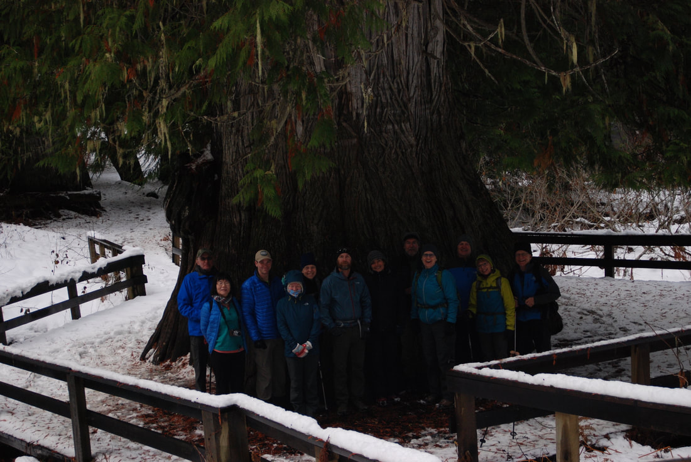

---
tags:
- Trails & Scrambles
- Easy
- Sight Seeing
stats:
- label: Event Type
  icon: hiking
  value: Sight seeing
- label: Distance
  icon: map-marker-distance
  value: .5 miles
- label: Elevation
  icon: terrain
  value: minimal
- label: Difficulty
  icon: speedometer
  value: easy
- label: Maps
  icon: map
  value: Elk Creek Falls National Recreation Area map.
- label: GPS
  icon: crosshairs-gps
  value: "46\xB088\u201980\" n 116\xB011\u201982\" w"
- label: Ranger District
  icon: pine-tree
  value: Palouse R.D. 208.875.1131
- label: Clearwater County Sheriff
  icon: shield-account
  value: CALL 911 FIRST or 208.476.4521
notes:
- label: Lolo National Forest Alerts
  url: https://www.fs.usda.gov/alerts/lolo/alerts-notices
- label: Nez Perce-Clearwater National Forests Alerts
  url: https://www.fs.usda.gov/alerts/nezperceclearwater/alerts-notices
---

# Giant Cedar Grove Trail

_Giant Cedar Grove Trail_

## Description

We have added the area's sheriff's emergency phone numbers for each trip write-up under the ranger district
info. If an emergency occurs, evaluate your circumstances and call only if needed.

Do not miss this hike; it's beyond belief. The trail to the Giant Western Red Cedar is only .5 miles from
the parking area, but you will talk about it for years to come. The trail is paved and wanders among giants.
But then the granddaddy of all cedars stands proud before you. Please do not touch the tree, and keep your
children from climbing on its massive roots. The USFS built a deck around it because its roots were being
damaged. That damage can harm the ancient tree.

## Directions

From Elk River, take County Road #382 north for about 10 miles, then turn right on F.S. Road 4764. The
trailhead is .25 miles beyond the parking area.

Be sure to pick up a brochure of the area.

## Cool Things Close By

Elk Creek Falls National Recreation Area, the Giant Western Red Cedars, Dworshak Reservoir, and the Hobo
Cedar Grove.

## Hazards

No hazard, beyond walking with your lower jaw dropped.

## Rules & Regulations

N/A

## Photo Gallery

_Two hikers walking into the giants_

_Giant red cedar along the trail to the giant_

_Members of the Spokane Mountaineers posing in front of the giant_

_The giant_

_Burls like this one hold all the DNA of the tree_
