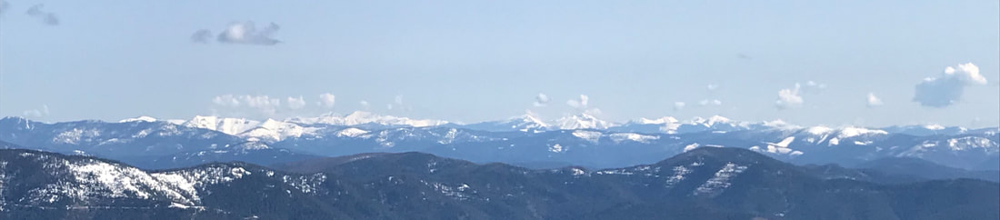
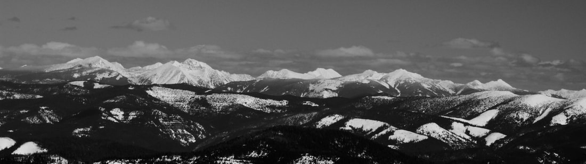
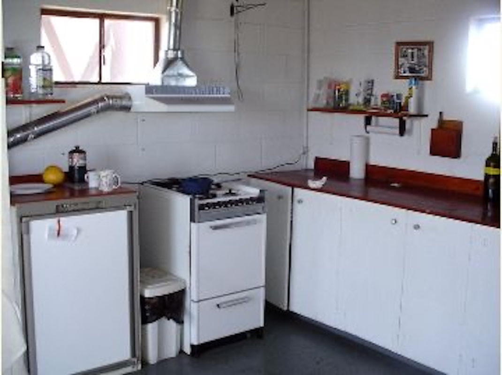
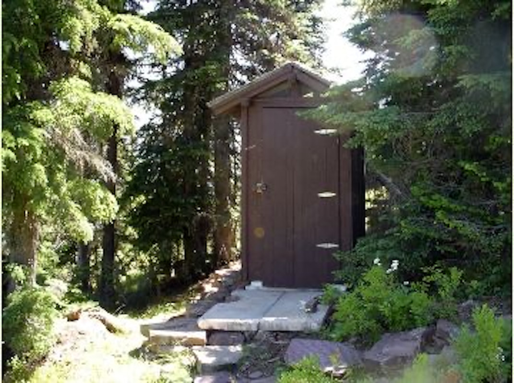

---
tags:
- Peaks & Mountains
- Day Hiking
- Fire Lookout Rental
- Equestrian
stats:
- label: Event Type
  icon: hiking
  value: Day hiking, lookout rental, equestrian
- label: Distance
  icon: map-marker-distance
  value: '1.4 mile from the gate, plus Trail #81, up the Shoshone Ridge'
- label: Elevation Gain
  icon: elevation-rise
  value: 540 verts
- label: Difficulty
  icon: speedometer
  value: easy to lookout & moderate on the Shoshone Ridge trail
- label: Maps
  icon: map
  value: IPNF, Mount Pend Orielle Topo
- label: GPS
  icon: crosshairs-gps
  value: 47°48’ 34" n 116°01’25 w
- label: Ranger District
  icon: pine-tree
  value: cda river r.d. 208.769.3000
- label: Shoshone County Sherrif
  icon: information-outline
  value: 911 or 208.556.1114
notes:
- label: Idaho Panhandle National Forests Alerts
  url: https://www.fs.usda.gov/alerts/ipnf/alerts-notices](https://www.fs.usda.gov/alerts/ipnf/alerts-notices
- label: Idaho panhandle national forest/alerts
  url: '#'
---

---

# Little Guard Peak  Lookout

## Little guard peak 6031’ & lookout trail #81

## Description

We have added the areas sheriff’s emergency phone numbers for each trip write up under the ranger district
info. if an emergency ocurrs, evaluate your circumstances and call only if needed. From I-90, take Exit #43
(Kingston) and drive 24 miles north on Forest Highway 9 to Prichard junction. From there, continue on Forest
Road 208 for about 5 miles to Forest Road 602 (on the right just past Shoshone Base Camp). Drive about 9
miles to the lookout at the end of the road. Vehicles with high clearance and good tires are strongly
recommended. I highly recommend renting this lookout. It’s views and hiking to the north is exceptional.

## Option #1

Once at the lookout, the Shoshone Ridge Trail #81 heads north. At 2.4 miles is Bennett Peak 6209’, and
in 3.4 miles is Sentinel Peak 6000’, and at 3.97 miles is Pond Peak 6136’, then the high point of the ridge
is 4.3 miles from the lookout. But, back at the lookout, off to the north east 33 miles is the tallest peak in
our region, Snowshoe Peak 8738’. Outstanding views of the C.M.W.

## Option #2

You can extend your hike further north to Spion Kop Rock, Shoshone Peak 5425’, and the CDA River Trail #20.

## Directions

Drive I-90 east to the Kingston exit, and turn left over the freeway, staying on F.R. #9 past Pritchard on
F. R. #208, CDA River Road for 6.1 miles to F.R. #602, just south of the Shoshone Base Camp. There is a
restroom on 208 at the camp. After turning up F.R. #602, stay on 602 past F,R. #1504 to the gate below
Little Guard.

## Cool things close by

Fern, Shadow, and Continental Falls, Upper CDA River National Recreation Trail #20, and Bloom Peak,

## Hazards

None to the lookout. From the lookout to the high point 4.3 miles along the Shoshone Ridge Trail #81 is on
the ridge the whole way. Use caution.

## R & P

The Snake Pit, and the Radio Brewery in Kellogg. The Moon Time in CDA.

## Photo gallery

### Picture (Image missing)

## From silver mt. kellogg peak

## Little guard lookout, near left The cabinet mountain wilderness

## The view of the cabinet mountain wilderness to the ne

---

## Little Guard Peak  Lookout (2)

## Picture (Image missing) (2)

One of the cool things about this rental lookout, Is it has a full kitchen on the bottom level of the cinder

block

foundation

### Picture (Image missing) Details

## The kitchen is located on the ground level

## Its always wise to know where the outhouse is

Little Guard Lookout

Little Guard Lookout, located about 9 miles north of Shoshone Camp, was one of the last remaining fire
lookouts used in the Coeur d'Alene River area and has only just recently become inactive. The structure
standing today on Little Guard Peak is the third in a series of lookout buildings that originated back
to 1919. In October 1990, Little Guard Lookout was accepted for listing in the National Historic Lookout
Register and the first for Idaho. Natural Features: At an elevation of 6,031 feet, the lookout boasts
spectacular views overlooking the North Fork of the Coeur d'Alene River and the Bitterroot Mountains, with
views of nearby Downey Peak to the northwest. Wildlife in the area includes mule deer, moose, osprey and
calliope hummingbirds. Recreation: Hiking is a great way to explore and take in the scenery of the grand
mountains. The lookout provides access to the Shoshone Ridge Trail #81, a very nice day hike for visitors to
the lookout. The trail provides many scenic viewpoints, but there is no source of water along the way, so
hikers must bring plenty of their own.

Facilities: The fully furnished two-story fire lookout has dimensions of 14 x 14 feet, an external cat walk,
and a gabled roof. It sleeps four guests, with one single bed and three fold-up cots available. Quarters are
tight and at least two cots will need to be set up downstairs in the kitchen area. The kitchen is on the
ground floor and is equipped with a small propane refrigerator, propane cook stove, table, chairs and basic
cooking utensils. Propane for the stove and refrigerator is also provided. The outdoor pit toilet is within
200 feet of the lookout. It comes with biodegradable toilet paper. Other amenities include a propane heater
upstairs and propane lanterns, but renters will need to bring their own propane for these. No water or
electricity is available. Visitors should bring plenty of water. A mountain spring is within a half-mile by
footpath, and can be boiled and treated for consumption. In addition to water, guests should bring food,
propane for lanterns and heater, matches or lighters, warm clothing, garbage bags, insect repellent, towels
and washcloths, toiletries, dish soap, and a first aid kit. Air mattresses or sleeping pads are also
recommended.

At a GlanceCurrent Conditions:No drinking water; please bring plenty for drinking and cooking; Please bring
garbage bags; this is a Pack in - Pack out facility; Paper materials may be burned when no fire restrictions
are in

effect;

Children under age 7 are discouraged due to the height of the lookout; Cabinets in cabin are rodent
resistant and should be used for food storage; Please clean up the lookout and pack out all waste; No
smoking allowed in lookout; While pets are not allowed inside our recreation rentals, they are welcome to be
on site and must be on a leash while in the area of the facility. Please clean up after pets and place pet
waste outside cabin vicinity.

Operational Hours:Rental period begins at 1:00 p.m. on your check-in day and ends at 12:00 p.m. on the
checkout day. Reservations: Reservations can be made at
[Recreation.gov](https://www.recreation.gov/camping/little-guard-lookout/r/campgroundDetails.do?contractCode=NRSO&parkId=75302).
Reservations must be made 4 days ahead of arrival and can be made up to 6 months in advance. Fees:$55 per
night Open Season:July - mid-September

Restrictions:Capacity of 4 people. No tent or RV camping allowed; all visitors must sleep in the cabin. Dogs
are not allowed in any of our cabins, lookouts or historic recreation areas that are available for
reservation. Closest Towns:Kingston, Idaho Water:None. Restroom:Pit Toilet Information Center:A combination
is needed to access the lookout Propane is provided for the stove and refrigerator. Propane is not provided
for the propane heater that is located in the kitchen area. If you wish to use this propane heater you’ll
need to bring a 5 or 7.5 gallon propane tank (such as those typically used for BBQs). You will also need to
bring small propane bottles to use in the propane lanterns for lighting, as these are not provided. A wood
stove has been installed for heat on the top floor. Some firewood is available for your use. Not knowing how
long this supply of wood will last, it is advisable to bring extra firewood (the stove burns 15" long
firewood). General InformationDirections: GPS Info. (Latitude, Longitude): 47.80278, -116.00944 47°48'10"n,
116°0'34"w

From I-90, take Exit #43 (Kingston) and drive 24 miles north on Forest Highway 9 to Prichard junction. From
there, continue on Forest Road 208 for about 5 miles to Forest Road 602 (on the right just past Shoshone
Base Camp). Drive about 9 miles to the lookout at the end of the road. Vehicles with high clearance and good
tires are strongly recommended.

Little Guard Lookout, located about 9 miles north of Shoshone Camp, was one of the last remaining fire
lookouts used in the Coeur d'Alene River area and has only just recently become inactive. The structure
standing today on Little Guard Peak is the third in a series of lookout buildings that originated back
to 1919. In October 1990, Little Guard Lookout was accepted for listing in the National Historic Lookout
Register and the first for Idaho. Facilities The fully furnished two-story fire lookout has dimensions of 14
x 14 feet, an external cat walk, and a gabled roof. It sleeps four guests, with one single bed and three
fold-up cots available. Quarters are tight and at least two cots will need to be set up downstairs in the
kitchen area. The kitchen is on the ground floor and is equipped with a small propane refrigerator, propane
cook stove, table, chairs and basic cooking utensils. Propane for the stove and refrigerator is also
provided. The outdoor pit toilet is within 200 feet of the lookout. It comes with biodegradable toilet
paper. Other amenities include a propane heater upstairs and propane lanterns, but renters will need to
bring their own propane for these. No water or electricity is available. Visitors should bring plenty of
water. A mountain spring is within a half-mile by footpath, and can be boiled and treated for consumption.
In addition to water, guests should bring food, propane for lanterns and heater, matches or lighters, warm
clothing, garbage bags, insect repellent, towels and washcloths, toiletries, dish soap and a first aid kit.
Air mattresses or sleeping pads are also recommended.

Natural Features At an elevation of 6,031 feet, the lookout boasts spectacular views overlooking the North
Fork of the Coeur d'Alene River and the Bitterroot Mountains, with views of nearby Downey Peak to the
northwest. Wildlife in the area includes mule deer, moose, osprey and calliope hummingbirds.

Recreation Hiking is a great way to explore and take in the scenery of the grand mountains. The lookout
provides access to the Shoshone Ridge Trail #81, a very nice day hike for visitors to the lookout. The trail
provides many scenic viewpoints, but there is no source of water along the way, so hikers must bring plenty
of their own.
