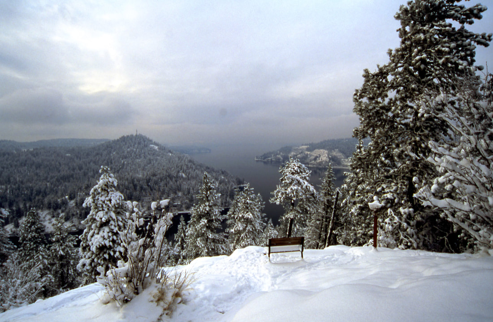
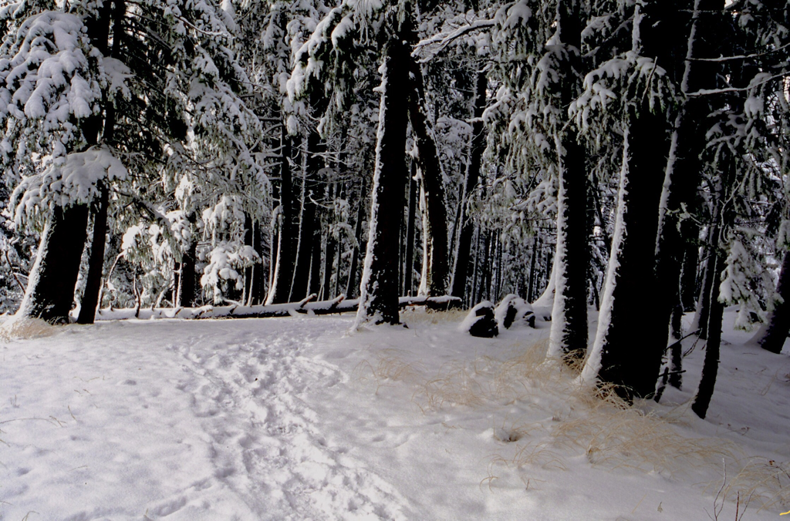
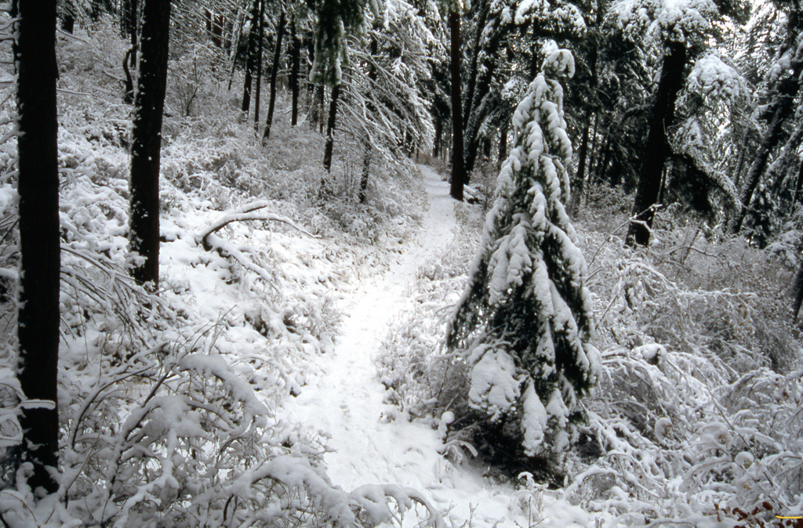
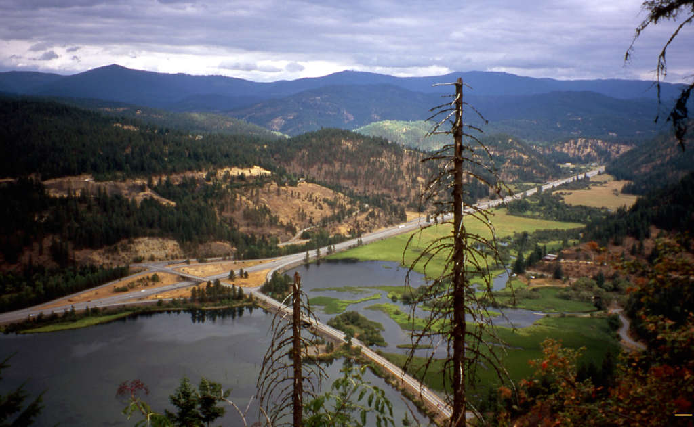
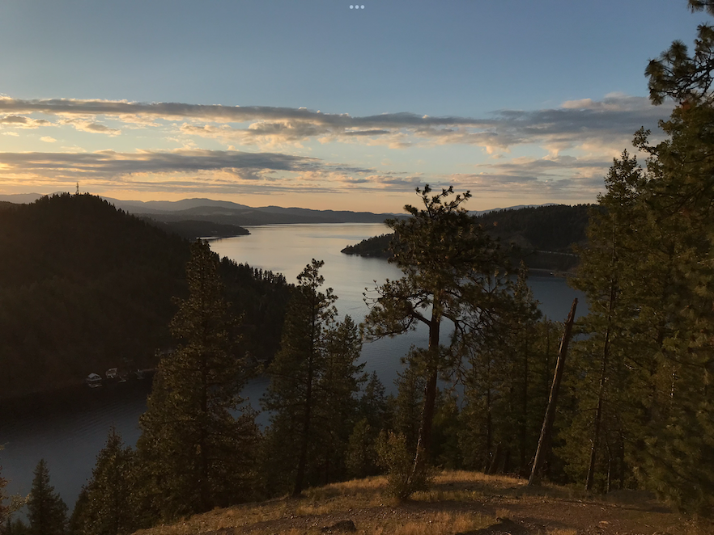

---
tags:
- Peaks & Mountains
- Easy
- Day Hiking
- Skiing & Snowshoeing
stats:
- label: Event Type
  icon: hiking
  value: Day hiking, snowshoeing
- label: Distance
  icon: map-marker-distance
  value: 3.3 mile loop to 5.3 mile loop
- label: Elevation
  icon: terrain
  value: 630’
- label: Difficulty
  icon: speedometer
  value: easy
- label: Maps
  icon: map
  value: IPNF, Lane Topo
- label: GPS
  icon: crosshairs-gps
  value: 47°36’55" n 116°4’43" w
- label: Managing Agency
  icon: domain
  value: blm spokane 509.536.1200
- label: Kootenai County Sheriff
  icon: shield-account
  value: CALL 911 FIRST or 208.446.1300
notes:
- label: Idaho Panhandle National Forests Alerts
  url: https://www.fs.usda.gov/alerts/ipnf/alerts-notices
---

# Mineral Ridge

_Mineral Ridge_

## Description

We have added the areas sheriff’s emergency phone numbers for each trip write up under the ranger district
info. if an emergency ocurrs, evaluate your circumstances and call only if needed. This hike is on BLM land
and climbs gradually for 1.6 miles to the Caribou Cabin, atop Mineral Ridge. Once at the cabin, switchback
east for 1 mile to the Wilson Overlook, (Wilson Mutual Mining and Milling Trail) This overlook looks down on
the I-90 and Harrison Exit 97A. Return to the Caribou Cabin and continue on the main trail west to the
Silver Tip View Point 2724’ at about 1.5 miles. After spending some time here enjoying the views of Wolf
Lodge Bay and the main body of Lake CDA in the distance, the trail drops down the Johnny Jack Trail below
the view point, to the south. Way west you will notice Mica Peak, Idaho towering over Casco and Cougar Bays.
There are a number of view points and a spur trail along this trail to showcase the mining operations of
old. Drop by the BLM office behind Fred Meyers to pick up a detailed brochure.
<https://www.blm.gov/sites/blm.gov/files/documents/files/media-center_public-room_idaho_mineral-ridge-trail_guide.pdf>

---

## Directions

Head east on I-90 to the Harrison exit 97A at the east end of Wolf Lodge Bay. Turn right onto SH 97A for
about 3 miles to the Beauty Bay's Mineral Ridge trailhead.

## Cool things close by

Wallace L. Forest Conservation Area, Beauty Bay Overlook, Trail #257, Trail 79, Mount CDA

## Hazards

In the winter, the trail can be icy, carry traction devises. Some areas along the trail have very steep
slopes below. Please use caution.

## Restaurants & Pubs

Moon Time, The Mexican Food Factory, Franklins Hoagies, and the Trails End Brewery.

## Photo gallery

---

## Mineral ridge trail between caribou cabin and silver tip view point

### Picture (Image missing)

## Silver tip viewpoint

## The wilson mutual mining & milling trail

---

## I-90, harrison interchange from the wilson overlook as viewed from the wilson mm.&m. trail

---

### Picture (Image missing) Details

## The wind storm from 1.2021, there were 91 trees down across the trail

---

## Wolf lodge bay from silver tip viewpoint
