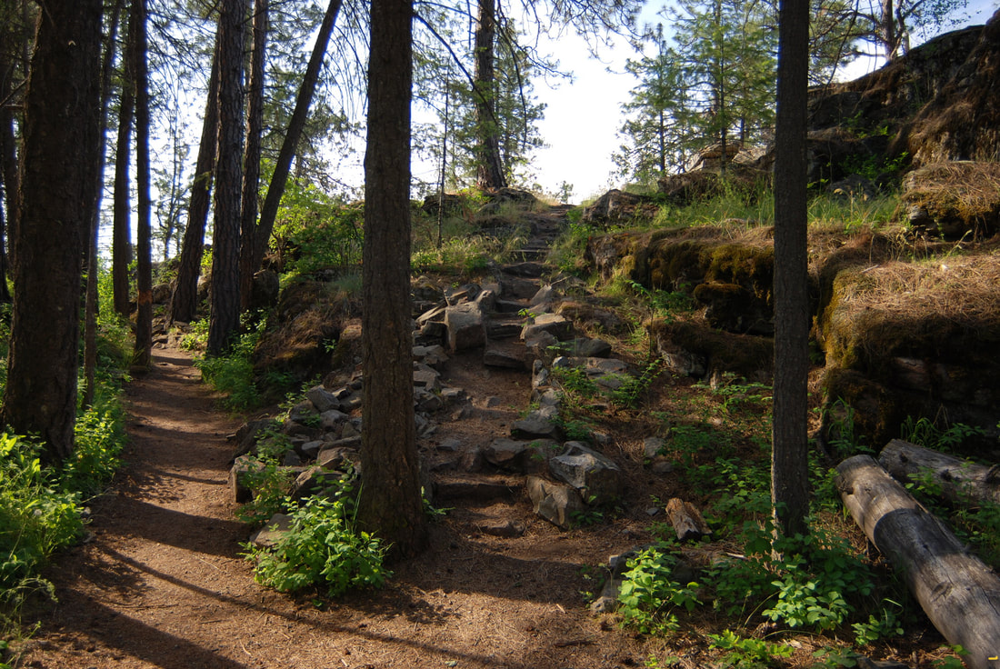
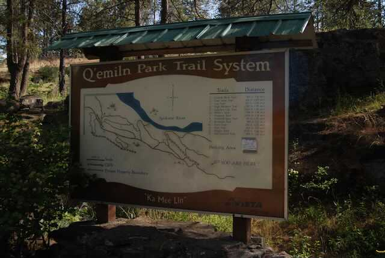
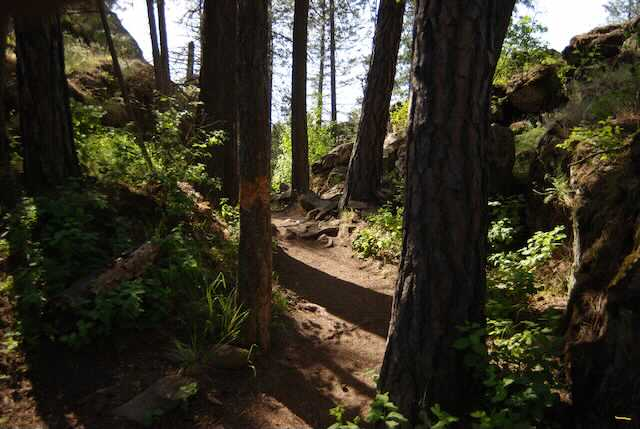
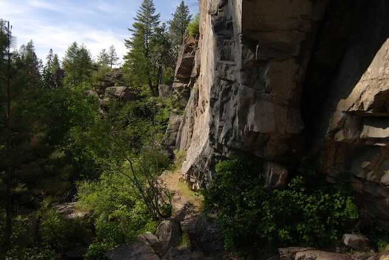
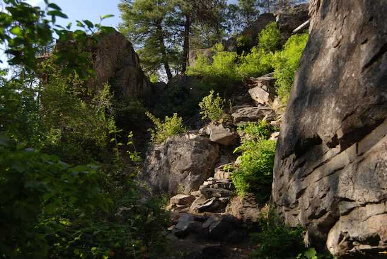
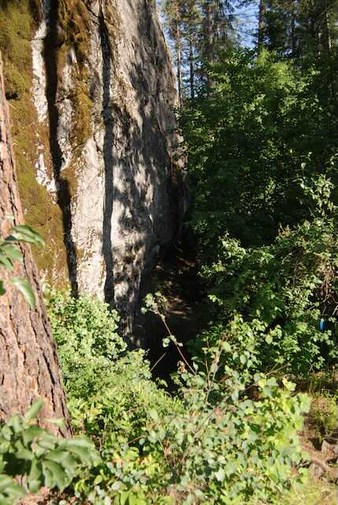
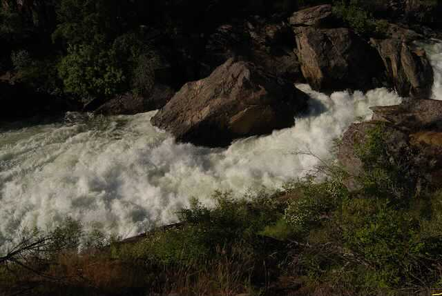
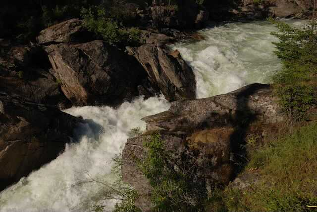
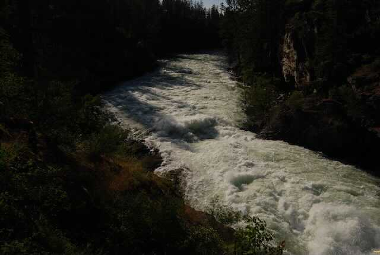

---
tags:
- Trails & Scrambles
- Moderate
- Day Hiking
- Climbing
- Photography
stats:
- label: Event Type
  icon: hiking
  value: Day hiking, climbing, and photography
- label: Distance
  icon: map-marker-distance
  value: varies
- label: Elevation
  icon: terrain
  value: varies depending on where you start
- label: Difficulty
  icon: speedometer
  value: easy to moderate
- label: Maps
  icon: map
  value: IPNF, Post Falls Park & Recreation Map, Post Falls Topo
- label: Ranger District
  icon: pine-tree
  value: CDA River R.D. 208.769.3000. Post Falls Parks. 208.773.3511
- label: Kootenai County Sheriff
  icon: shield-account
  value: 911 or 208.446.1300
notes:
- label: Spokane Street Bridge 47°42’08" N 116°57’15" W
  url: '#'
- label: West Riverview Drive. 47°41’45" N 116°58’23" W
  url: '#'
---

# Qemlin Park

_Qemlin Park_

## Q'emiln park

## Description

We have added the areas sheriff’s emergency phone numbers for each trip write up under the ranger district
info. if an emergency ocurrs, evaluate your circumstances and call only if needed.The Q’emiln Park is noted
for its outstanding climbing. There are several trails thru the climbing rocks, that eventually leads you to
the new Community Forest 500+ acres. At one point, the trail follows the Spokane River just after the Post
Falls Dam. It’s quit spectacular

to see the

river rage down thru a narrow gorge. This river side route leads you out onto the area west of the Avista
Generating Station and on to the Community Forest. You can stay along the river for about 2.5 miles to the
west end of the park.

From the south parking lot on W. Riverview Drive, the trail drops down a bit to where it splits and does a
loop, back up to the W. Riverview lot. Your best bet is to stop by the Post Falls City Fall on Spokane
Street to pick up a map. Or
[<https://www.postfallsidaho.org/departments/parks-recreation/parks/community-forest>](https://www.postfallsidaho.org/departments/parks-recreation/parks/community-forest/)

## Directions

From Spokane, drive I-90 east to the Spokane Street exit. Turn right (south) at the light. Drive over the
Spokane River Bridge, and take the first right (west) into the park. To reach the W. Riverview Drive
trailhead, continue past the Q’emiln Park and drive up W. Riverview Drive for less then 2 miles. Watch
closely for the parking area across from S. Marion Ct.

## Cool things close by

Corbin Park, Mica Peak, Idaho, and along the Signal Point Road, is the Dept of Lands Blossom Endowment
Lands.

## Hazards

Because Q’emiln Park is dotted with cliffs, extra caution should be use. Anywhere along the Spoken River, is
another place to practice extra caution. In the Community Forest, some trails are steep, and or rocky. Pay
attention to the parks colored dot system to navigate the area.

## R & P

The White House Grill

---

## Plan your trip

Click for Current NOAA Weather Conditions

## Photo gallery

## Parking area & kiosk

---

## Trailhead kiosk. notice the pronunciation of the park on the bottom

### Picture (Image missing)

## This trail sign explains the trails at the "y"

## The next three images are the trail. to the climbing area

### Picture (Image missing) Details

## Going left is to the climbing area. going right is to the spokane river

## The below two images are from the main trail into the park

### Picture (Image missing) Details

## A climbers trail to the cliffs

### Picture (Image missing) Details

## One of many quality climbing walls

## A route to above the cliffs where the protection is done

### Picture (Image missing) Details

## Some hard routes

### Picture (Image missing) Details

## Two climbers. one is belaying the climber on the wall

## Some of the climbers trails are great walks. but watch out for poison ivy

### Picture (Image missing) Details

## A trail away from the climbing area to the spokane river

---

### Picture (Image missing) Details

## A new foot bridge to the spokane river

## The next three images are of the south channel of the spokane river the sounds are deafening

### Picture (Image missing) Details

## Spokane river’s south channel avista’s power plant, with intermittent over flow waterfall

---

---

---

---

---
