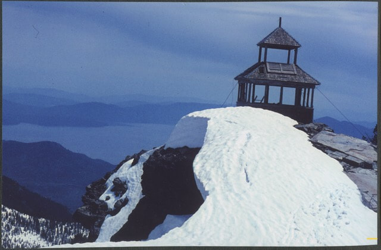
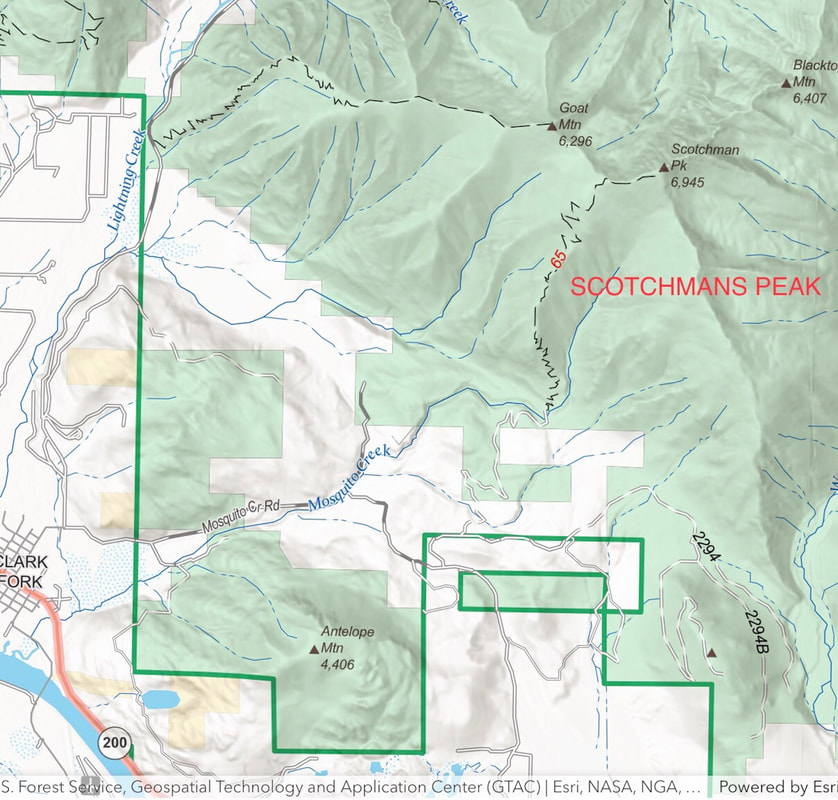
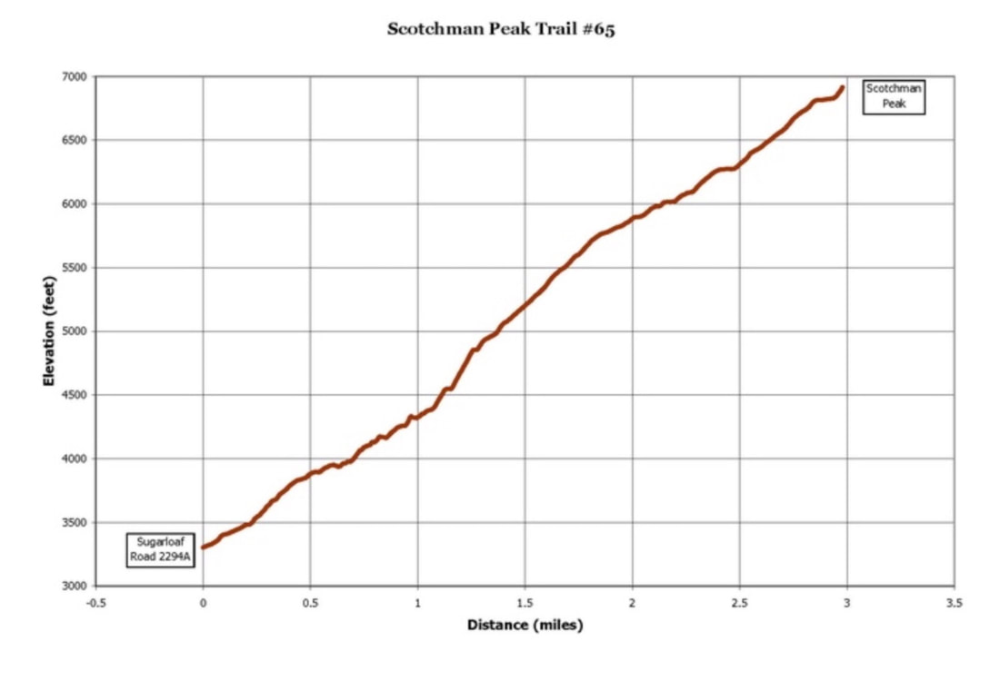
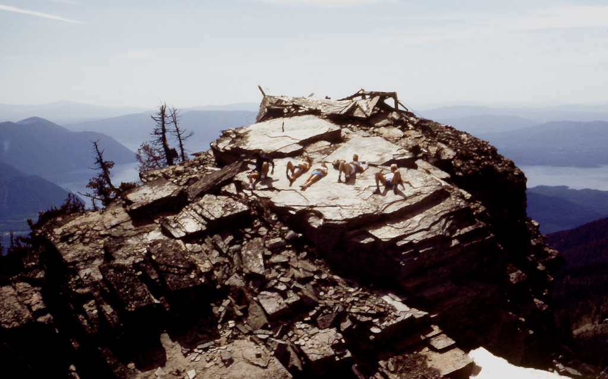
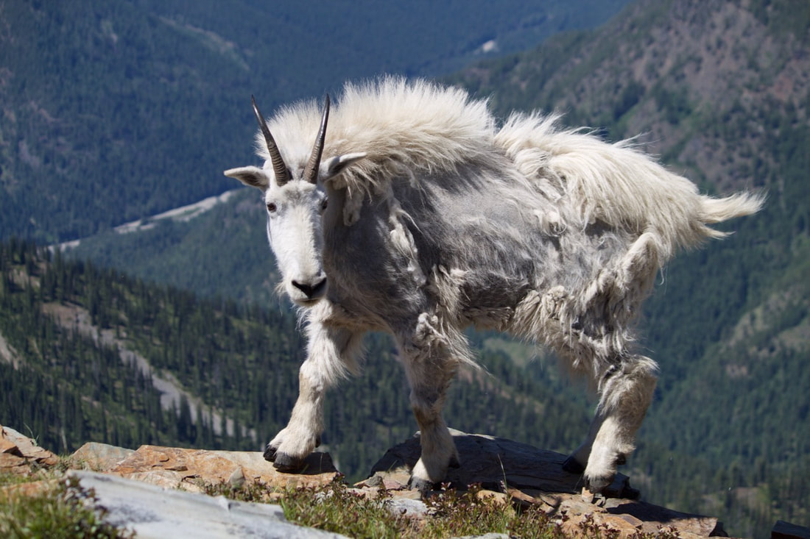
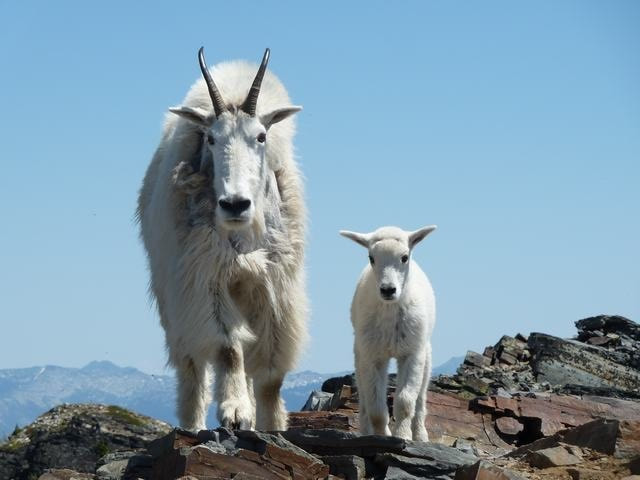
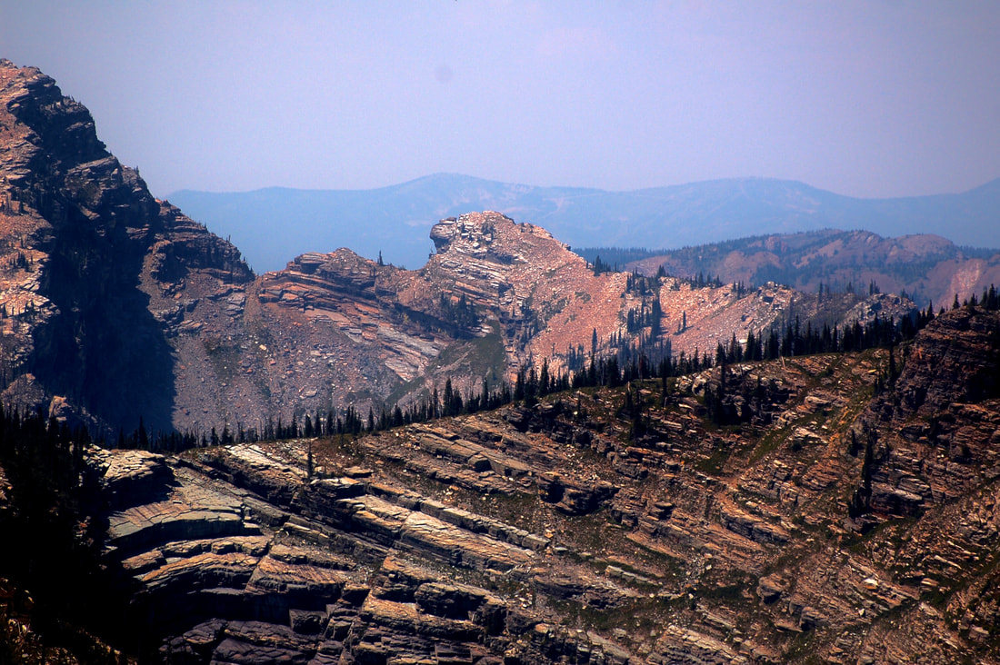

---
tags:
- Peaks & Mountains
- Moderately Difficult to Difficult
- Day Hiking
- Backpacking
- Sshoeing
stats:
- label: Event Type
  icon: hiking
  value: Day hiking, backpacking, sshoeing
- label: Distance
  icon: map-marker-distance
  value: 8 miles RT
- label: Elevation Gain
  icon: elevation-rise
  value: 3700 verts
- label: Difficulty
  icon: speedometer
  value: Moderately difficult to difficult
- label: Maps
  icon: map
  value: IPNF, Scotchmans Peak & Clark Fork topos
- label: GPS
  icon: crosshairs-gps
  value: "48\xB011\u201918\" n 116\xB069\u201916\" w"
- label: Ranger District
  icon: pine-tree
  value: Sandpoint R.D. 208.263.5111
- label: Bonner County Sheriff
  icon: shield-account
  value: 911 or 208.263.8417
notes:
- label: Idaho Panhandle National Forests Alerts
  url: https://www.fs.usda.gov/alerts/ipnf/alerts-notices
---

# Scotchmans Peak

_Scotchmans Peak_

## Scotchmans peak 7009’

## Description

We have added the areas sheriff’s emergency phone numbers for each trip write up under the ranger district
info. if an emergency ocurrs, evaluate your circumstances and call only if needed. This is the "grand-daddy"
of hikes in the Proposed Scotchman Peak Wilderness, and an annual pilgrimage for many local hikers. The
trail is a little over 4 miles one-way, with an elevation gain is 3,700 feet. This is a short climb, but
strenuous because it is steep. The well worn tread is usually in good shape and leads to the highest point
in Bonner County, the top of Scotchmans Peak. Stunning panoramas of Lake Pend Oreille begin at "the
meadows", about two thirds of the way up and they continue to unfold as you reach the summit. The peak looks
over, and deep into, the rugged valleys and ridges of the Scotchman Peaks area. Mountain goats are
frequently encountered on the surrounding ridges and near the summit. Snow lingers late into the summer of
most years. There are some very aggressive mountain goats that frequent the upper trail and the summit area.
please, do not approach the goats. And if they come close to you or others, gently use your hiking poles to
hold them away. Please, please, do no harm to the goats. After all, **YOU** are visiting their home.

they want to lick your legs for the salts from sweeting. There are "Trail/Goat Ambassadors along the trail
to educate visitors about goat behavior.

## Directions

From Sandpoint, drive east on Hwy 200 to Clark Fork turn left (north) at the Chevron Station. Go past the
school and continue up Mosquito Creek Road #276 to the junction of Road #2295. Turn right and go a little
over a mile. Watch for signs for Trail #65. Turn left on road 2294. Turn left next on 2294A. Follow this
road a little over a mile to where the road ends at the parking area. As you pass thru Clark Fork, stop by
the Clark Fork Pantry for goodies. They make excellent peanut butter cookies, as well as sandwiches, breads,
and have a small store for specialty goods.

## Hazards

This is a long, steep trial to the summit. Don't miss it, but be prepared. Mountain Goats can be hazardous.

## Cool things close by

The Clark Fork River, Johnson Creek and the Delta for paddling, Montana, Hwy 56, the Cabinet Mountain
Wilderness, Star Peak, Pillick Ridge, and Bull Lake.

## R & P

Jalapeños, Burger Express, in Sandpoint The Squeeze Inn & Clark Fork Fork Pantry, in Clark Fork. This unique
store sells bulk food, great sandwiches, and to die for Peanut Butter Cookies.

## Photo gallery

---

## Scotchmans peak from a spokane mountaineers 1985 hike, led by chic

---

## Mr scotchman image by david craftn

---

## Ms scotchman image by a. buddington

### Picture (Image missing)

---

## Center is scotchmans peak from sawtooth mountain. It really is taller then middle peak on left

## More images coming soon
