---
tags:
- Peaks & Mountains
- Strenuous
- Day Hiking
- Backpacking
- Equestrian
stats:
- label: Event Type
  icon: hiking
  value: Day hiking, backpacking, equestrian
- label: Distance
  icon: map-marker-distance
  value: about 9.4 miles RT
- label: Elevation Gain
  icon: elevation-rise
  value: "3910\u2019"
- label: Difficulty
  icon: speedometer
  value: Strenuous
- label: Maps
  icon: map
  value: Kootenai N.F., Heron topo
- label: GPS
  icon: crosshairs-gps
  value: "48\xB009\u201933\" n 115\xB092\u201977\" w"
- label: Ranger District
  icon: pine-tree
  value: Cabinet R.D. 406.827.3533
- label: Sanders County Sheriff
  icon: shield-account
  value: 911 or 406.827.3584
notes:
- label: Kootenai National Forest Alerts
  url: https://www.fs.usda.gov/alerts/kootenai/alerts-notices
---

# Star Peak

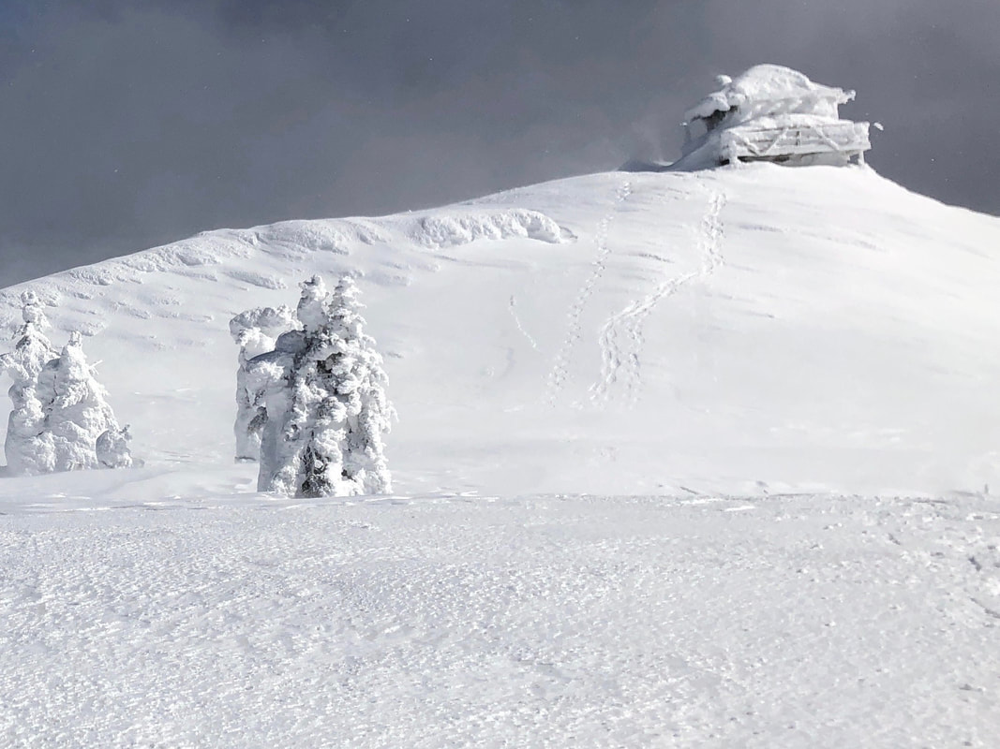
_Star Peak_

## Star peak 6167’. trail #998

## Description

We have added the areas sheriff’s emergency phone numbers for each trip write up under the ranger district
info. if an emergency ocurrs, evaluate your circumstances and call only if needed. Trail #998 starts near
the Big Eddy Campground and Boat launch along the Clark Fork River, on Highway 200. The actual trailhead was
relocated in 2016-7.

Most of the trail is up thru thick forests of Douglas Fir, until higher up the trail, where Lodgepole pine
takes over. Be sure to stop and rest occasionally along this trail. As you approach the summit, the views
are restricted to the trees. But as you walk onto the summit block, the views open up. In the middle of the
summit area stands an old rock cabin that was used for storage for the lookout personnel. The active lookout
tower remains on it's rocky pinnacle above to the east. Take a moment to walk to it for some of the most
spectacular views in the area. But there's something else that draws people to this peak. Off in the
distance to the south rim of the summit, is the most spectacular outhouse you can imagine. It sits on the
very edge of the summit block. From near the outhouse, you can look down some 50+ degrees to the Clark Fork
River and Hwy 200..

Take extra care descending this trail. It is steep in places and hard on the knees.

## Directions

From Clark Fork, head east on Highway 200 into Montana for 6 miles and look for a Big Eddy sign along
Hwy 200. Look for the new parking area north of Hwy 200. Across from the Big Eddy sign is a steep road that
leads to the trailhead.

## Hazards

Long hard up with lots of elevation gain. Take many rest breaks on this hike.

## Cool things close by

The Clark Fork River, Cabinet Gorge Dam, Heron, Pillick Ridge, the Cabinet Mountain Wilderness.

## R & P

Clark Fork Pantry, Clark Fork Jalapeños, Mr. Sub, Burger Express, and Eichardt’s in Sandpoint

---

Click for Current NOAA Weather Conditions

## Photo gallery

## On the way up looking west towards Clark Fork image by david crafton

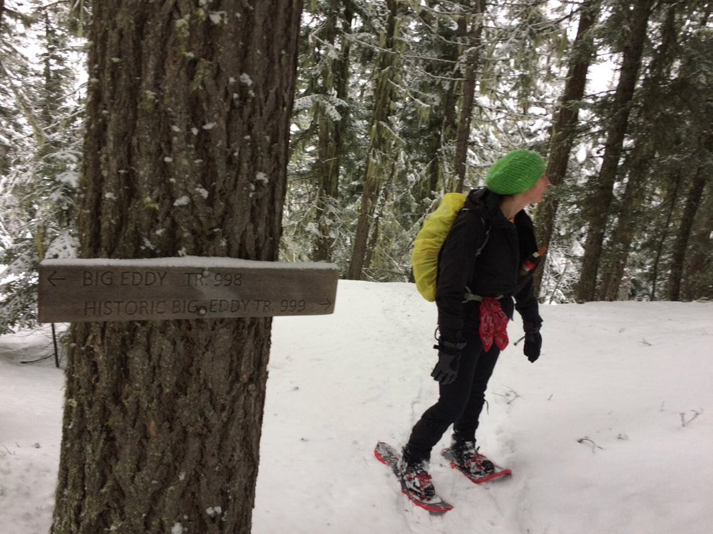

## Trail junction with big eddy trail image by david crafton

---

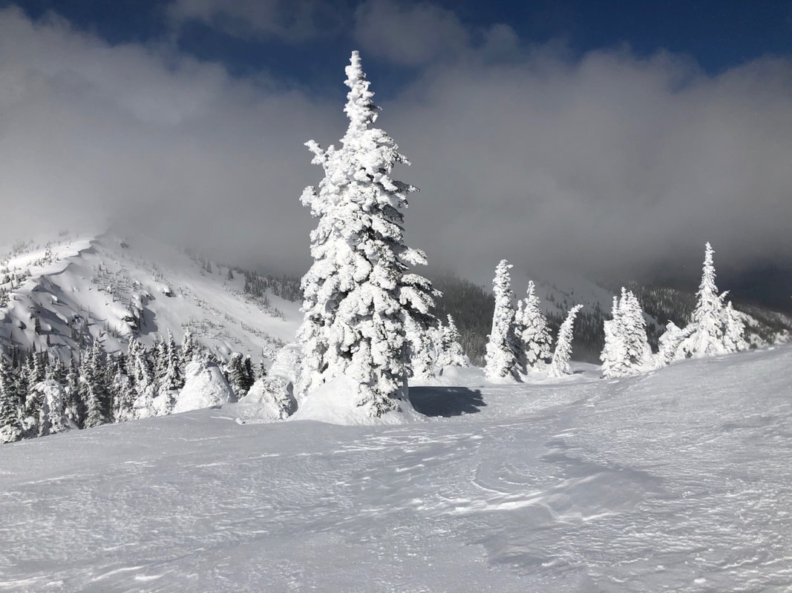

## Looking north from the summit image by david crafton

---

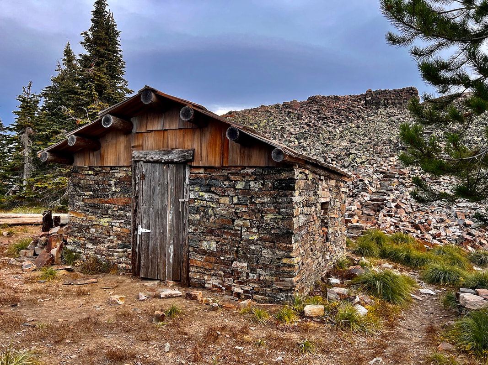

The stone house below the lookout tower. This house uses zero mortor in its construction. Image by chris h

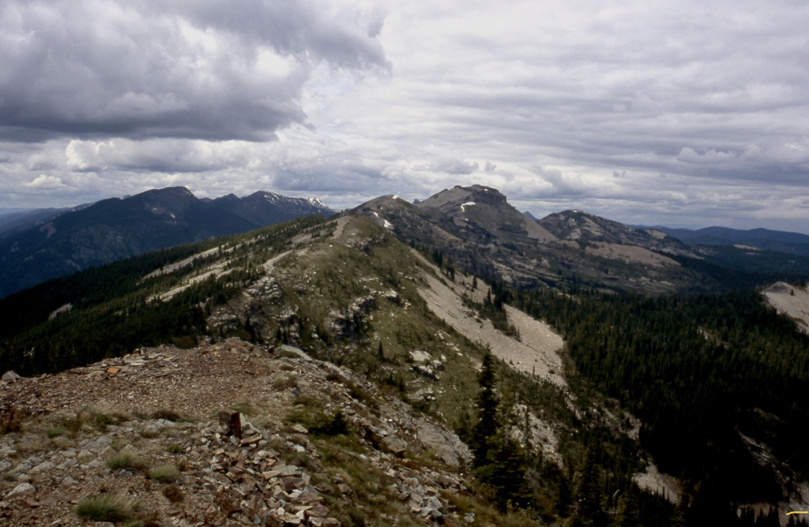

## Billiard table peak 6622' looking north from star peak 6167' image by david crafton

---

### Picture (Image missing)

## The ridge between star peak and billiard table mountain image by chris h

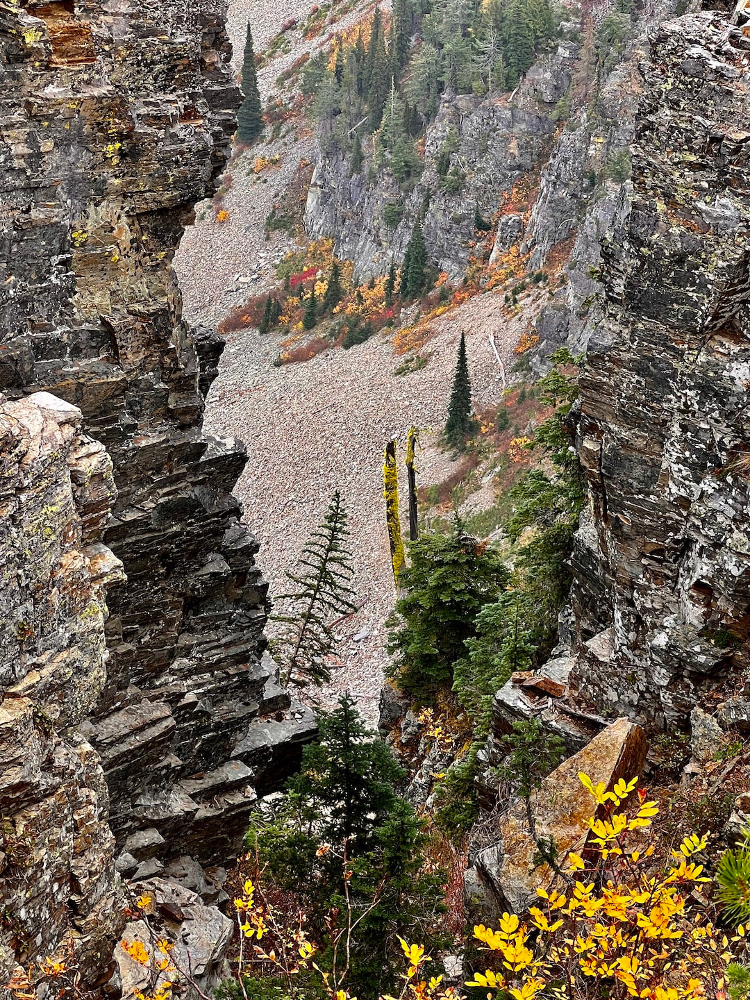

## Along the route to billiard table mountain image by chris h

### Picture (Image missing) Details

## The main attraction at star peak. this outhouse has an incredible view. A real poop with a view

### Picture (Image missing) Details

## This image was shot by amy v. on the descent of star peak on 11.24.23

We walk to the summits, not only "because it’s there", but to see where else we want to go play next.
chic 1.2.2025

**The history of the sqaw peak 6167' (now star peak)

1906:** Established as an unimproved observation point. **December 27, 1907:** "The supervisor expects some
time this winter or early in the spring to begin

building the

telephone line up Bull river to the lookout point on Squaw peak." **(The Sanders County
Independent-Ledger)**

**June 19, 1908:**"The trail from Bull river to the top of Squaw peak, where a lookout station will be

maintained during

the fire season, was completed recently and is now open from the mouth of Star gulch to the summit." **(The
Sanders County Ledger)** **July 23, 1909:** "The Squaw Peak lookout station, at the west end of the Cabinet
National Forest, in

charge of

Forest Guard James Berray, has already shown its efficiency by reporting the discovery of three fires in the
Coeur d'Alene forest and one in the valley near Noxon, outside of the Cabinet forest boundaries, the
presence of none of which had not become known to anybody prior to the lookout reporting them. A telephone
line from the peak affords communication with the supervisor's headquarters and the several ranger stations
and no sooner is a fire discovered by the lookout than are steps on foot for its quelling. The Mt. Silcox
station will soon be occupied. At present the mountain top is the abiding place, day and night, for three
forest service men engaged in trail work, and they keep a lookout for fires, though hereabout there is but
little damage just yet, unless a careless camper leaves his fire unguarded." **(The Sanders County Ledger)**

**July 27, 1909:** "It has been reported to the district forester that forest fires are now burning in

national

forests in Idaho, and that, incidentally, the practicability of lookout stations has been demonstrated. One
fire is on Gold creek, north of Clark's Fork, Idaho, and is said to be doing considerable damage. It was
discovered by a forest guard stationed in a lookout cabin on the top of Squaw peak, a jagged mountain of the
locality which rears its head far above the surrounding country and enables anyone on its summit to overlook
the country for 65 miles around. From this point one can see from Sandpoint to Trout Creek. The station is
fitted with telephone facilities, and when the fire broke out the supervisor, 75 miles away, was promptly
notified and got assistance to the scene in short time. A large force of rangers and guards is now fighting
the flames." **(The Daily Missoulian)**

**October 15, 1909:** "Supervisor R.H. Bushnell devoted all last week to inspecting permanent improvement
work

and

looking over timber sales in the Bull river and Noxon district. He visited Squaw peak and declares it an
ideal lookout station during the fire season. He says the entire Clarksfork valley from Sandpoint on the
west to the Blue Slide on the east, is easily visible from its top and it also affords a splendid view of
the Elk creek, Pilgrim creek and Bull river valleys. Mrs. Bushnell accompanied him on his journey on
horse-back." **(The Sanders County Ledger)** **1910:** A stone cabin was built to serve as living quarters
for the lookout. A pillar of rocks piled for

use as the

observation post.

**July 12, 1912:**"Sam Shafer has accepted a position as lookout on Squaw peak for the forest service."

### (The Sanders County Ledger)

**September 24, 1915:** "Mr. Hudson a student at Missoula who has been lookout man on Squaw peak, left here

Wednesday." **(The Sanders County Ledger)**

**July 15, 1920:** "Ranger Saint has installed the Squaw Peak and Gem Peak lookouts during the last few
days." **(The

Sanders County Independent-Ledger)**

**September 24, 1930:** "The work of installing four ready cut lookout houses has been finished. The
buildings

were put

on Squaw Peak in the Noxon district, Seven Point Peak in the Trout Creek district, and at Big Hole and
Penrose Peaks in the Plains district." **(The Sanders County Independent-Ledger)** **1930:** A R-1 style
gable roof ground house was constructed. **August 31, 1950:** "Jim Brooks had been a lookout on Squaw peak
and had just been released that morning

due to the

heavy rains." **(Sandpoint News Bulletin)**

**1952:** A L-4 ground cabin. **(Kresek)** **June 7, 1956:** "Jim Dewey, assistant ranger, announced plans
to start construction of the Squaw Peak

lookout tower

about June 4." **(Sandpoint News-Bulletin)**

**July 5, 1956:** "The forest service lookout crews were sent out June 25 and 26. Mr. and Mrs. Earl

Robinette from

Nebraska are on Squaw peak." **(Sandpoint News-Bulletin)**

**September 6, 1956:** "The forest service has released all its lookout crews for the season Dean Henderson,

who was

on Green mountain lookout, went up on Squaw peak Tuesday to man the automatic repeat station there until
Sept. 20. Velmer Munsen accompanied him." **(Sandpoint News-Bulletin)**

**June 27, 1957:** "Dean Henderson and Velmer Munsen left Monday for Squaw peak lookout station. Dean will

return

this week end and then go to Green mountain peak lookout." **(Sandpoint News-Bulletin)**

**September 13, 1962:** "David Runkle was sent up to Squaw Peak the first of last week to replace the
lookout

who came

down a few days before returning to school." **(Sanders County Ledger)**

**July 4, 1963:** "Mr. and Mrs. David Runkle went up on Squaw Peak Monday where they will spend the summer."
**(Sanders

County Ledger)**

**August 1, 1963:** "Mr. and Mrs. David Runkle, who are stationed at the Squaw Peak lookout were flown by

helicopter to

Sandpoint Friday when Mrs. Runkle needed medical attention following a spider bite. They spent the remainder
of the weekend with relatives here and returned to the lookout Tuesday." **(Sanders County Ledger)**

**September 19, 1963:**"Mr. and Mrs. David Runkle came down from Squaw Peak Tuesday. They had spent the
summer

as

lookouts there. They motored to Spokane Friday when David registered for school. They returned to Spokane
again Sunday as classes at the Spokane Trade school started Monday." **(Sanders County Ledger)** **September
22, 1966:** "Miss Laura Harker came down from Squaw Peak Thursday. She has been lookout there

this

summer. She was down over labor day but had to go back up due to the weather conditions." **(Sandpoint News
Bulletin)** **April 30, 1967:** "Miss Harker, who spent three months on Squaw Peak without a break, had only
50 visitors

all

summer. She had n o electricity and used a wood stove for heat but she says she is ready for another year."

### (The Independent Record)

**October 12, 1967:** "Due to the rains last weekend, Laura Harker came down from Squaw Peak on Monday when

the

lookout was closed. She had spent the summer up there." **(Sandpoint News Bulletin)** **September 10,
1970:** "Mary Ballenger of Squaw Peak Lookout will remain on Lookout until her duties are

finished." **(Sandpoint News Bulletin)**

**2004:** The mountain suffered a name change from the historic Squaw Mountain to the present Star Peak.

---

---

---

---

---

---

---
tags:

- Peaks & Mountains
- Strenuous
- Day Hiking
- Backpacking
- Equestrian stats:
- label: Event Type icon: hiking value: Day hiking, backpacking, equestrian
- label: Distance icon: map-marker-distance value: about 9.44 miles RT
- label: Elevation icon: terrain value: 3910verts
- label: Difficulty icon: speedometer value: Strenuous
- label: Maps icon: map value: Kootenai N.F., Heron topo
- label: GPS icon: crosshairs-gps value: 48°09’33" n 115°92’77" w
- label: Ranger District icon: pine-tree value: Cabinet R.D. 406.827.3533
- label: Sanders County Sheriff icon: shield-account value: CALL 911 FIRST or 406.827.3584 notes:
- label: Kootenai National Forest Alerts

## url: https://www.fs.usda.gov/alerts/kootenai/alerts-notices

## Star Peak1

## Star peak 6167’. trail #998

## Description

We have added the areas sheriff’s emergency phone numbers for each trip write up under the ranger district
info. if an emergency ocurrs, evaluate your circumstances and call only if needed. Star Peak used to be
called Squaw Peak on older maps and apps. Trail #998 starts near the Big Eddy Campground and Boat launch
along the Clark Fork River, on Highway 200. The actual trailhead was relocated in 2016-7.

Most of the trail is up thru thick forests of Douglas Fir, until higher up the trail, where Lodgepole Pine
take over. Be sure to stop and rest occasionally along this trail. And because of the length and verts are
so high, there is zero shame to turn around. "It is a wise hiker that knows when to turn around." As you
approach the summit, the views are restricted to the trees. But as you walk onto the summit block, the views
open up. In the middle of the summit area stands an old rock cabin that was used for storage for the lookout
personnel. The lookout tower remains on it's rocky pinnacle above to the east. Take a moment to walk to it
for some of the most spectacular views in the area. The Friends of Scotchman Peaks Wilderness and others a
planning a restoration of the lookout. But there's something else that draws people to this peak. Off in the
distance to the south rim of the summit, is the most spectacular outhouse you can imagine. It sits on the
very edge of the summit block. From near the outhouse, you can look down some 50+ degrees to the Clark Fork
River and Hwy 200..

Take extra care descending this trail. It is steep in places and hard on the knees. In our "Trail Etiquette
and Skills" section, under resources there is "Hiking Steep Trails Downhill" for hints on saving your knees.

## Directions

From Clark Fork, head east on Highway 200 into Montana for 6 miles and look for a Big Eddy sign along
Hwy 200. Look for the new parking area. Across from the Big Eddy sign is a steep road that leads to the
trailhead.

## Hazards

Long hard up with lots of elevation gain. Take many rest breaks on this hike. And hydrate a lot.

## Cool things close by

The Clark Fork River, Cabinet Gorge Dam, Heron, Pillick Ridge, the Cabinet Mountain Wilderness.

## R & P

Clark Fork Pantry, Clark Fork Jalapeños, Mr. Sub, Burger Express, and Eichardt’s in Sandpoint

---

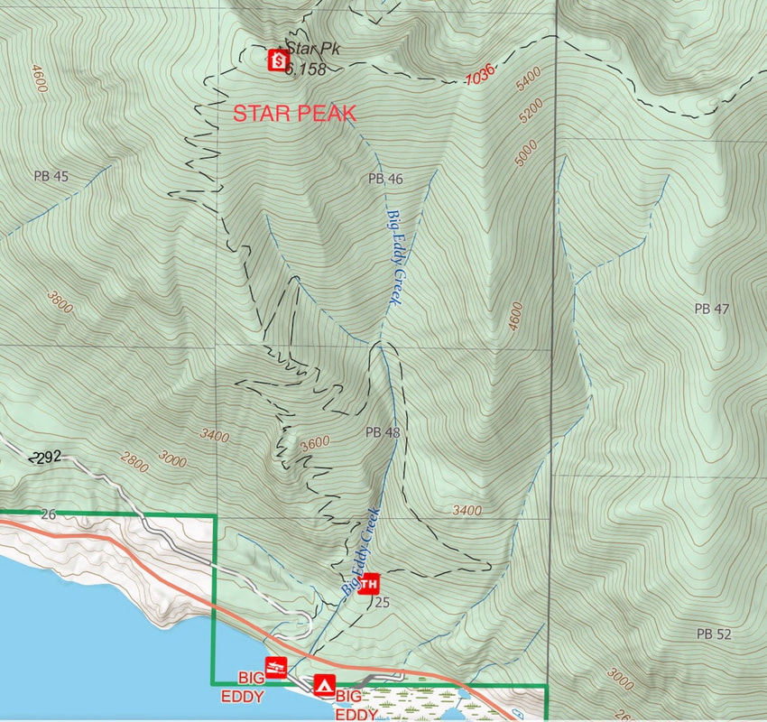

## Photo gallery

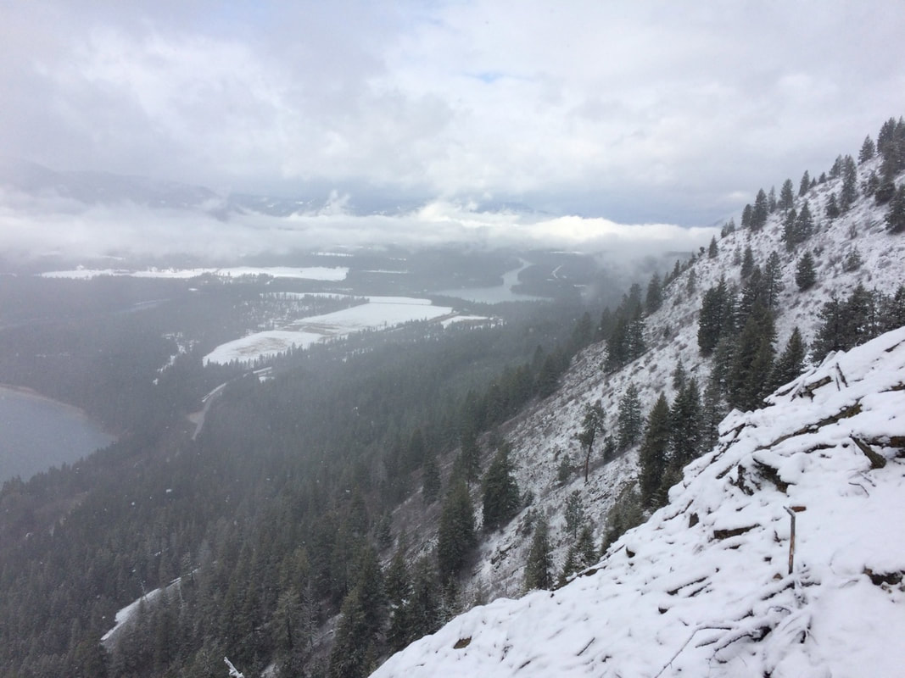

## On the way up, looking towards clark fork

### Picture (Image missing)

## Trail junction with big eddy trail

---

### Picture (Image missing) Details

## Looking north from the summit

---

### Picture (Image missing) Details (2)

## Billiard table peak 6622' looking north from star peak 6167'

---

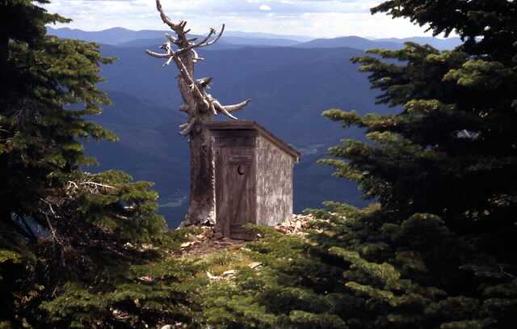

## The main attraction at star peak. this outhouse has an incredible view. A real poop with a view

The below images were sent to me, by a spokane mountaineers hiking friend, Vanette leighty. her images were
take on 3.2023 in the proposed scotchman peaks wilderness in montana. thank you vanette

### Picture (Image missing) Details

## The route to the top of star peak. Image by vanette leighty

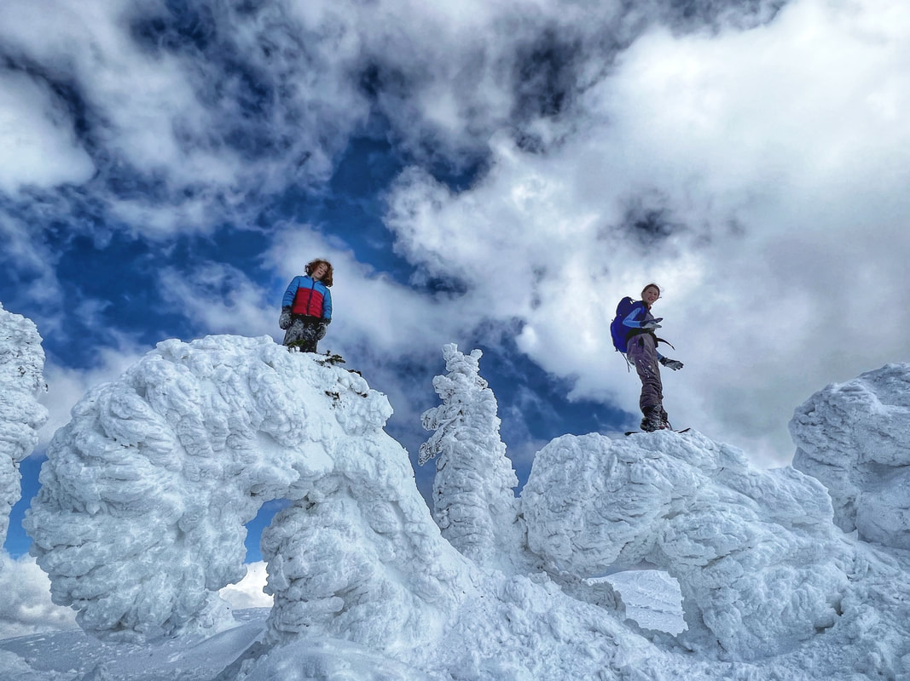

An image near the summit of star peak. 3.2023. pictured are Immanuel and annalyse sanchez Image by vanette
leighty

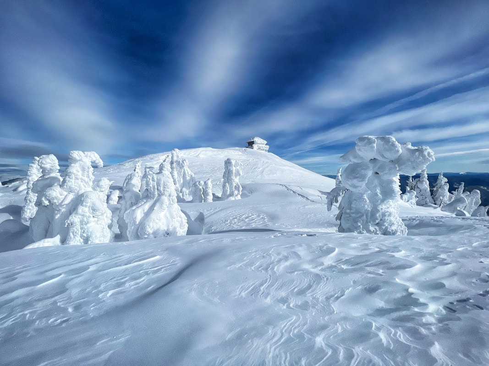

A beautiful sceen on the way to the star peak's summit. look at the clouds. Image by vanette leighty

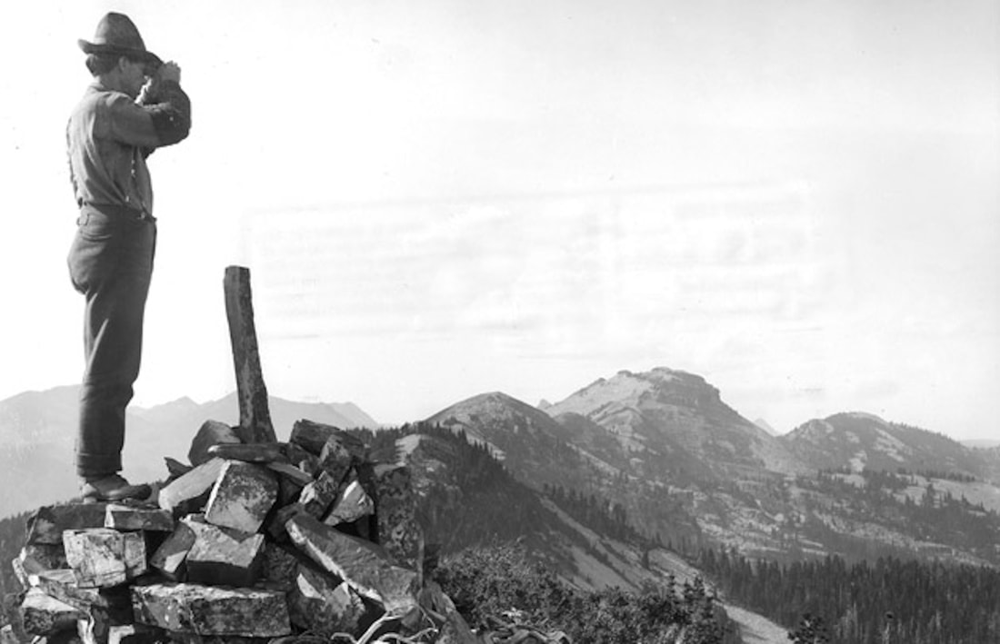

## This was the "lookout' on squaw peak now star peak, p.s.p.w., montana prior to 1906

**The history of the star peak 6167' (formerly sqaw peak)

1906:** Established as an unimproved observation point. **December 27, 1907:** "The supervisor expects some
time this winter or early in the spring to begin

building the

telephone line up Bull river to the lookout point on Squaw peak." **(The Sanders County
Independent-Ledger)**

**June 19, 1908:**"The trail from Bull river to the top of Squaw peak, where a lookout station will be

maintained during

the fire season, was completed recently and is now open from the mouth of Star gulch to the summit." **(The
Sanders County Ledger)** **July 23, 1909:** "The Squaw Peak lookout station, at the west end of the Cabinet
National Forest, in

charge of

Forest Guard James Berray, has already shown its efficiency by reporting the discovery of three fires in the
Coeur d'Alene forest and one in the valley near Noxon, outside of the Cabinet forest boundaries, the
presence of none of which had not become known to anybody prior to the lookout reporting them. A telephone
line from the peak affords communication with the supervisor's headquarters and the several ranger stations
and no sooner is a fire discovered by the lookout than are steps on foot for its quelling. The Mt. Silcox
station will soon be occupied. At present the mountain top is the abiding place, day and night, for three
forest service men engaged in trail work, and they keep a lookout for fires, though hereabout there is but
little damage just yet, unless a careless camper leaves his fire unguarded." **(The Sanders County Ledger)**

**July 27, 1909:** "It has been reported to the district forester that forest fires are now burning in

national

forests in Idaho, and that, incidentally, the practicability of lookout stations has been demonstrated. One
fire is on Gold creek, north of Clark's Fork, Idaho, and is said to be doing considerable damage. It was
discovered by a forest guard stationed in a lookout cabin on the top of (Squaw) Star Peak, a jagged mountain
of the locality which rears its head far above the surrounding country and enables anyone on its summit to
overlook the country for 65 miles around. From this point one can see from Sandpoint to Trout Creek. The
station is fitted with telephone facilities, and when the fire broke out the supervisor, 75 miles away, was
promptly notified and got assistance to the scene in short time. A large force of rangers and guards is now
fighting the flames." **(The Daily Missoulian)**

**October 15, 1909:** "Supervisor R.H. Bushnell devoted all last week to inspecting permanent improvement
work

and

looking over timber sales in the Bull river and Noxon district. He visited Squaw peak and declares it an
ideal lookout station during the fire season. He says the entire Clarksfork valley from Sandpoint on the
west to the Blue Slide on the east, is easily visible from its top and it also affords a splendid view of
the Elk creek, Pilgrim creek and Bull river valleys. Mrs. Bushnell accompanied him on his journey on
horse-back." **(The Sanders County Ledger)** **1910:** A stone cabin was built to serve as living quarters
for the lookout. A pillar of rocks piled for

use as the

observation post.

**July 12, 1912:**"Sam Shafer has accepted a position as lookout on Squaw peak for the forest service."

### (The Sanders County Ledger)

**September 24, 1915:** "Mr. Hudson a student at Missoula who has been lookout man on Squaw peak, left here

Wednesday." **(The Sanders County Ledger)**

**July 15, 1920:** "Ranger Saint has installed the Squaw Peak and Gem Peak lookouts during the last few
days." **(The

Sanders County Independent-Ledger)**

**September 24, 1930:** "The work of installing four ready cut lookout houses has been finished. The
buildings

were put

on Squaw Peak in the Noxon district, Seven Point Peak in the Trout Creek district, and at Big Hole and
Penrose Peaks in the Plains district." **(The Sanders County Independent-Ledger)** **1930:** A R-1 style
gable roof ground house was constructed. **August 31, 1950:** "Jim Brooks had been a lookout on Squaw peak
and had just been released that morning

due to the

heavy rains." **(Sandpoint News Bulletin)**

**1952:** A L-4 ground cabin. **(Kresek)** **June 7, 1956:** "Jim Dewey, assistant ranger, announced plans
to start construction of the Squaw Peak

lookout tower

about June 4." **(Sandpoint News-Bulletin)**

**July 5, 1956:** "The forest service lookout crews were sent out June 25 and 26. Mr. and Mrs. Earl

Robinette from

Nebraska are on Squaw peak." **(Sandpoint News-Bulletin)**

**September 6, 1956:** "The forest service has released all its lookout crews for the season Dean Henderson,

who was

on Green mountain lookout, went up on Squaw peak Tuesday to man the automatic repeat station there until
Sept. 20. Velmer Munsen accompanied him." **(Sandpoint News-Bulletin)**

**June 27, 1957:** "Dean Henderson and Velmer Munsen left Monday for Squaw peak lookout station. Dean will

return

this week end and then go to Green mountain peak lookout." **(Sandpoint News-Bulletin)**

**September 13, 1962:** "David Runkle was sent up to Squaw Peak the first of last week to replace the
lookout

who came

down a few days before returning to school." **(Sanders County Ledger)**

**July 4, 1963:** "Mr. and Mrs. David Runkle went up on Squaw Peak Monday where they will spend the summer."
**(Sanders

County Ledger)**

**August 1, 1963:** "Mr. and Mrs. David Runkle, who are stationed at the Squaw Peak lookout were flown by

helicopter to

Sandpoint Friday when Mrs. Runkle needed medical attention following a spider bite. They spent the remainder
of the weekend with relatives here and returned to the lookout Tuesday." **(Sanders County Ledger)**

**September 19, 1963:**"Mr. and Mrs. David Runkle came down from Squaw Peak Tuesday. They had spent the
summer

as

lookouts there. They motored to Spokane Friday when David registered for school. They returned to Spokane
again Sunday as classes at the Spokane Trade school started Monday." **(Sanders County Ledger)** **September
22, 1966:** "Miss Laura Harker came down from Squaw Peak Thursday. She has been lookout there

this

summer. She was down over labor day but had to go back up due to the weather conditions." **(Sandpoint News
Bulletin)** **April 30, 1967:** "Miss Harker, who spent three months on Squaw Peak without a break, had only
50 visitors

all

summer. She had n o electricity and used a wood stove for heat but she says she is ready for another year."

### (The Independent Record)

**October 12, 1967:** "Due to the rains last weekend, Laura Harker came down from Squaw Peak on Monday when

the

lookout was closed. She had spent the summer up there." **(Sandpoint News Bulletin)** **September 10,
1970:** "Mary Ballenger of Squaw Peak Lookout will remain on Lookout until her duties are

finished." **(Sandpoint News Bulletin)**

**2004:** The mountain suffered a name change from the historic Squaw Mountain to the present Star Peak.

---

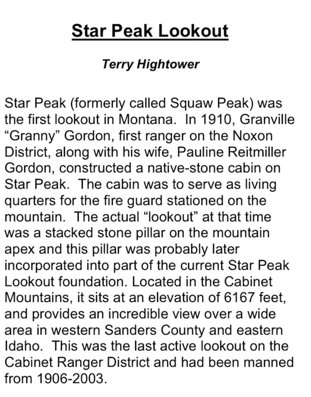

### Picture (Image missing) Details

### Picture (Image missing) Details

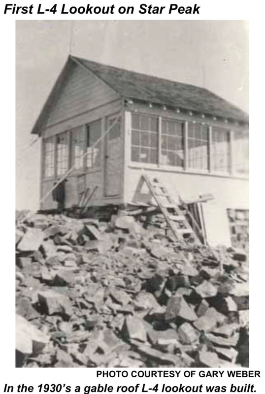

In addition eto work at Star Peak, NMLA volunteers will also be working on Meadow Peak, Mount Wam, McGuire
Mountain, Big Creek Baldy, Zeigler Mountain, Mount Henry, Lost Horse, and Stahl Peak lookouts. As part of
these efforts, the NMLA enjoys working closely with the four Kootenai National Forest Ranger Districts to
bring life back to these iconic structures. The first gable roofed L4 built in the 1930s – Credit Gary Weber

Join the Northwest Montana Lookout Association (NMLA) at the Cabinet Mountain Brewing Company (CMBC) to
support a fundraising campaign for the restoration of fire lookouts located on the Kootenai National Forest.
We’ll have multiple nights including March 2nd, 9th, 16th, 23rd, and 30th from 5:00 – 8:00 p.m. Through the
CMBC’s Brews for Benefits Program, CMBC pledges to donate $1 of every beer sold between 6-8pm to NMLA. The
history of fire lookouts on the Kootenai dates to 113 years ago. In 1910, Granville "Granny" Gordon, first
ranger on the Noxon District, along with his wife, Pauline Reitmiller Gordon, constructed a native-stone
cabin on Star Peak. The cabin was to serve as living quarters for the fire guard stationed on the mountain.
The actual "lookout" at that time was a stacked stone pillar on the mountain apex and this pillar was
probably later incorporated into part of the current Star Peak Lookout foundation. The stacked stone
foundation served as the lookout platform until the early 1930’s, when the Forest Service erected a gable
roof "L-4" cab lookout. Around 1957 the current lookout was constructed; a pyramidal roof "L-4" cab
structure. Star Mountain Lookout complex includes the original 1910 stone building, a stone step path from
the building leading to the actual lookout, two helipads, or helicopter landing sites and of course, an
outhouse. In 1991, a historical preservation project put a new roof on the building and repaired windows of
the stone building. The two-foot thick, dry laid native stone walls show remarkable craftsmanship and
resilience; the masonry has endured the harsh elements and stood intact for nearly a century. Historical
documents indicate a telephone line was run to the lookout and that a "good, clear spring" about 3/8 mile
below the peak, at an old mine, provided water for the fire lookout. Located in the Cabinet Mountains, it
sits at an elevation of 6167 feet, and provides an incredible view over a wide area in western Sanders
County and eastern Idaho and this was the last active lookout on the Cabinet Ranger District and was staffed
from 1906-2003. We are pleased to announce that this summer NMLA will kick off restoration work at Star Peak
as our newest KNF project! The humble beginnings of Star Peak Lookout – Credit Gary Weber

---

---

---

---

---
