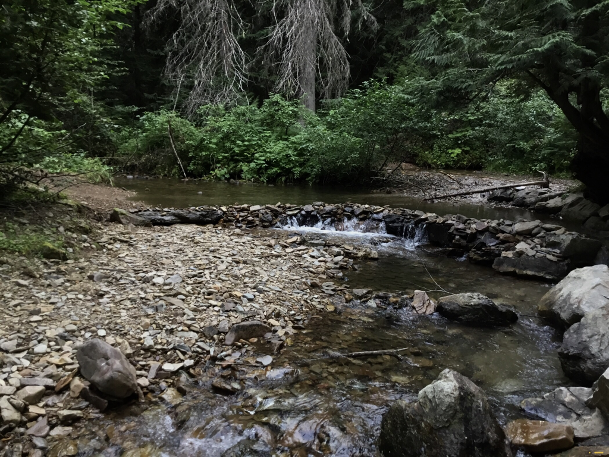
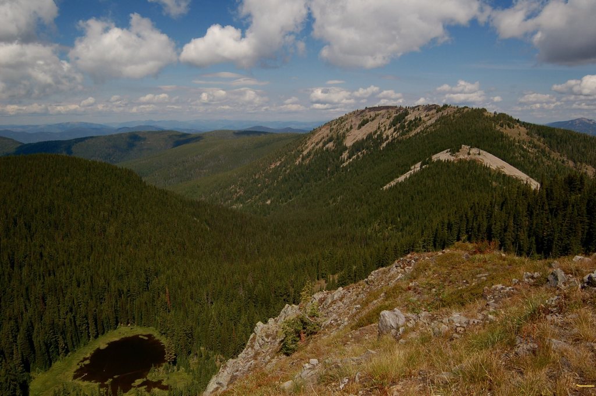
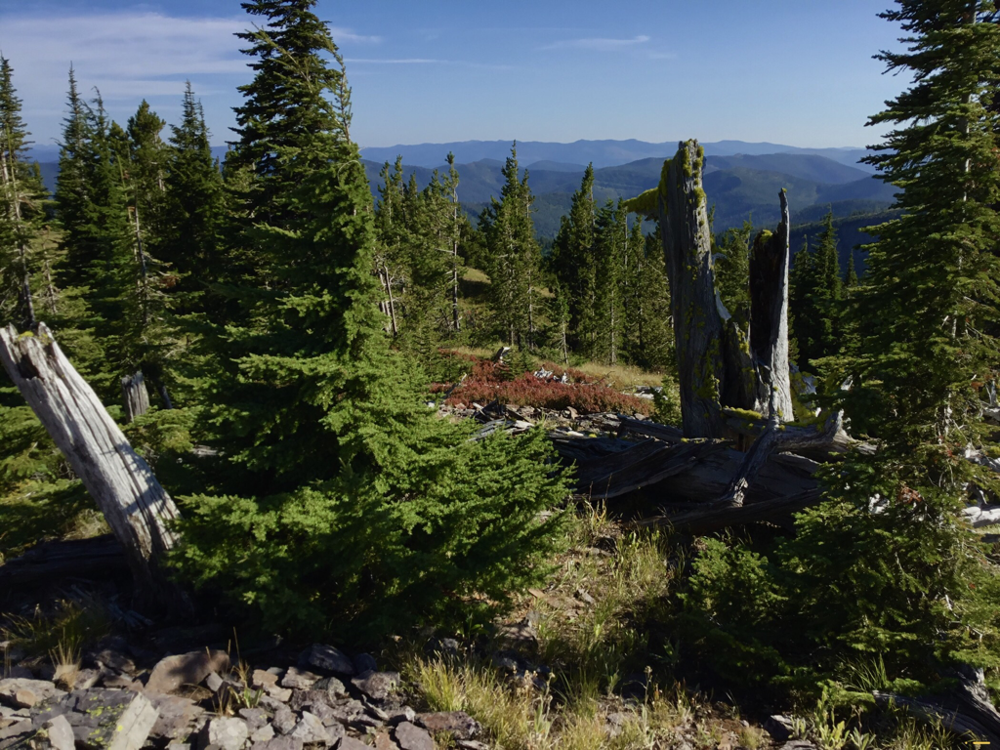
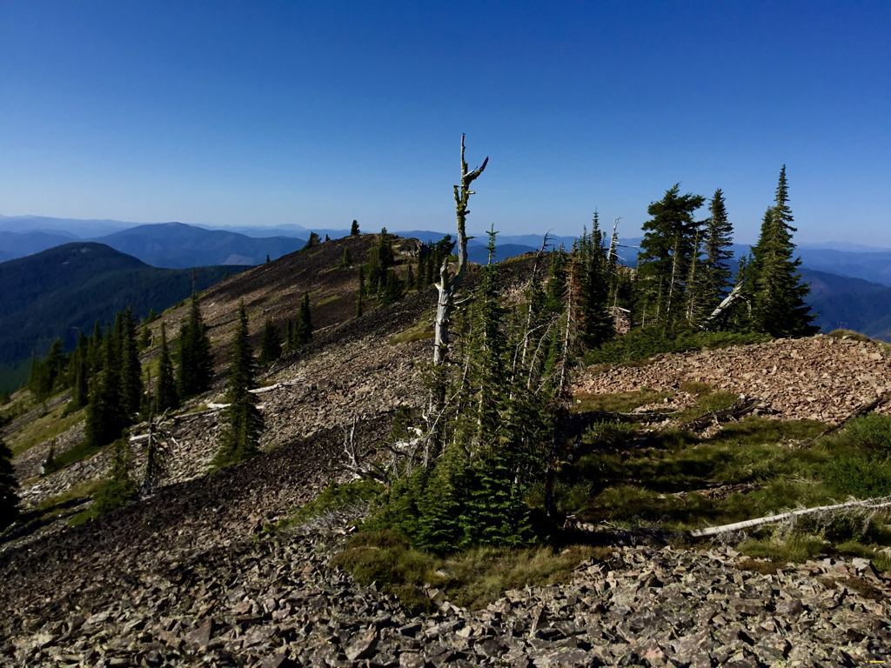
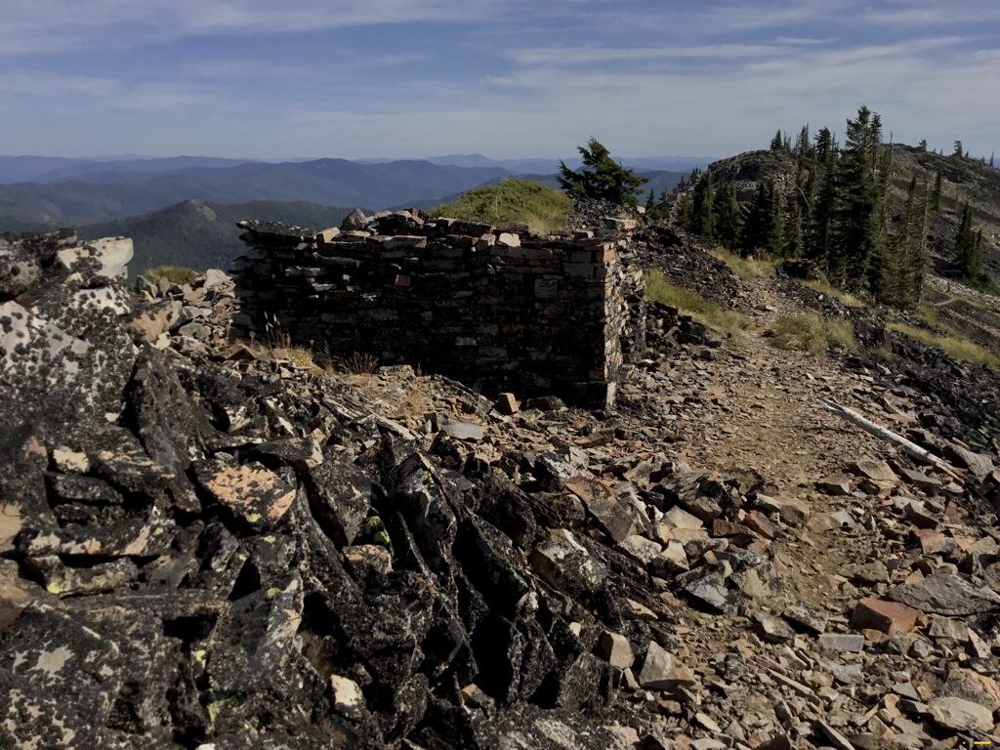

---
tags:
- Lakes
- Moderate
- Day Hiking
- Backpacking
- Fishing
- Paddling
- Orving
stats:
- label: Event Type
  icon: hiking
  value: Dayhiking, backpacking, fishing, floating, ORVing
- label: Distance
  icon: map-marker-distance
  value: From Elsie Lake to Striped Peak is about 6 miles RT
- label: Elevation
  icon: terrain
  value: 1289 verts
- label: Acres
  icon: vector-square
  value: '16.2'
- label: Difficulty
  icon: speedometer
  value: Moderately easy
- label: Maps
  icon: map
  value: IPNF, Wallace topo
- label: GPS
  icon: crosshairs-gps
  value: Elsie Lake 47°25’42″N 116°01’24″W Striped Peak. 47°26’23″N 115°59’45″W
- label: Ranger District
  icon: pine-tree
  value: cda river r.d. 208.769.3000
- label: Shoshone County Sheriff
  icon: shield-account
  value: CALL 911 FIRST or 208.556.1114
notes:
- label: Idaho Panhandle National Forest Alerts
  url: https://www.fs.usda.gov/alerts/ipnf/alerts-notices
---

# Elsie Lakes Striped Peak Trail 16

Lower & Upper Elsie Lakes & Striped Peak 6313’

## Description

We have added the areas sheriff’s emergency phone numbers for each trip write up under the ranger district
info. if an emergency ocurrs, evaluate your circumstances and call only if needed. The most unfortunate
thing about this old trail, National Recreation Trail #16, is, it is now an ORV trail.

The trailhead is on the east side of Elsie Lake, and basically heads SE for about two miles to N.R.T #16.

***At this trail junction, be sure to look back, or take a picture, at the junction so on your return hike,
you know where to turn down to Elsie Lake.*** Once on N.R.Trail #16, head NE for about .3 of a mile and bear
left up towards Striped Peak for a little less then a mile to its long summit. Walk north on the summit and
see a rock/wind shelter someone built with great skill. Retrace your steps back to the lake.

!!! warning
    The first right walking back to Elsie Lake off of N.R.Trail #16 is not the road back to Elsie Lake. Walk
    about .4 miles to the next right turn and head down to Elsie Lake.

## Option #1

After summiting Striped Peak and hiking SW on Trail #16, do not turn down Trail #106. Instead, continue on
N.R. Trail #16 for about two miles to an intersection with 4 roads up on a barren knoll. Take the ORV trail
NW that skirts Elsie Lakes on their west side. This road is about 1 mile down to the Big Creek Road. Turn
right and walk .5 of a mile back to Elsie Lake.

## Directions

On I-90, turn right (south) onto the Big Creek Road #264. This exit is where the memorial for the 90+ miners
that died in a tragic mining accident. Head due south up the Big Creek Road past the Sunshine Mine, where
the road turns to dirt. Elsie Lake is about 13 miles up Road 264.

## Hazards

Watch and listen for ORV’s everywhere up Big Creek. Striped Peak has no ORV traffic.

## Cool things close by

Stevens Peak & Lakes, U. & L Glidden Lakes, Silver Mountain Resort, Graham Mountain, the Trail of the CDA’s,
and the Route of the Hiawatha.

## R & P

Pizza Factory, 1313 Club, Brooks Hotel & Restaurant, City Limits Brew Pub, Fainting Goat, Smoke House BBQ &
Saloon, Wallace Brewing Co., mane Muchacho’s Tacos in Wallace. Radio Brewing in Kellogg. The Snake Pit north
of Kingston. And the Moon Time in CDA.

## Photo gallery

_Big Creek campsites._

Moose, Lower Elsie Lake.

Upper Elsie Lake with Trail #16 along the ridge above.

West end of National Recreation Trail #16, above Lower Elsie Lake.

From west end N.R. Trail #16, Striped Peak back left.

_Upper Elsie Lake with Striped Peak in back right._

On way to Striped Peak along ridge above Trail #16.

National Recreation Trail #16 skirts the south side of Striped Peak.

_Nearing Striped Peak’s summit ridge._

_On Striped Peak's south ridge._

_Stone hut on Striped Peak’s summit._
