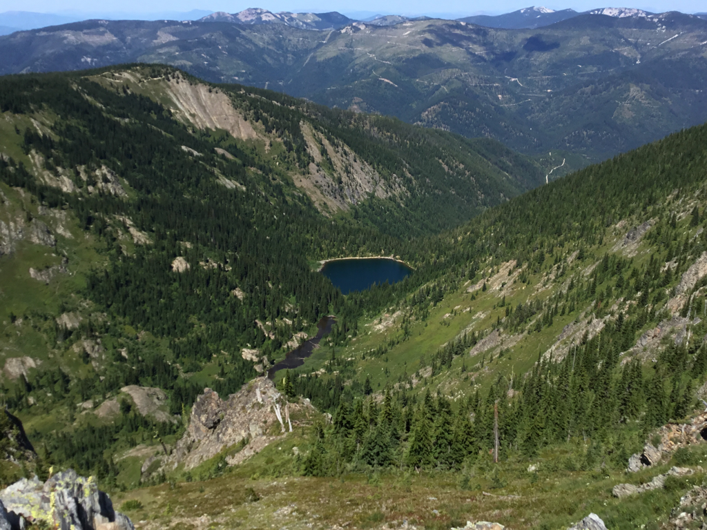

---
tags:
- Lakes
- Moderate
- Day Hiking
- Backpacking
- Fishing
- Skiing & Snowshoeing
stats:
- label: Event Type
  icon: hiking
  value: Hiking, backpacking, fishing, backcountry skiing and the awe inspiring "Upper
    Sanctuary."
- label: Distance
  icon: map-marker-distance
  value: Lone Lake 4 miles RT, Upper Sanctuary about 6+ miles RT
- label: Elevation Gain
  icon: terrain
  value: Lone Lake 1,637' gain. Upper Sanctuary about another 250' gain
- label: Acres
  icon: vector-square
  value: '15.2'
- label: Difficulty
  icon: speedometer
  value: Moderately difficult
- label: Maps
  icon: map
  value: IPNF, Lolo N.F. Mullan topo
- label: GPS
  icon: crosshairs-gps
  value: 47°43’38" N 115°47’44" W
- label: Ranger District
  icon: pine-tree
  value: Coeur d'Alene River R.D. 208.769.3000
- label: Shoshone County Sheriff
  icon: shield-account
  value: 911 or 208.556.1114
notes:
- label: Idaho Panhandle National Forest Alerts
  url: https://www.fs.usda.gov/alerts/ipnf/alerts-notices
---

# Lone & Long Lakes

_Lone & Long Lakes_

## Description

We have added the area's sheriff emergency phone numbers for each trip write-up under the ranger district
info. If an emergency occurs, evaluate your circumstances and call only if needed.

The trail is located on the west (right) side of Willow Creek near two huge boulders the size of a delivery
truck. Head south (uphill) on the old mining road for about 0.4 miles to a wide spot at a hard right turn
uphill. Look for a sign on a tree to the south as the trail heads uphill (south) along the creek. It's a
decommissioned logging road bed that has been trampled down by years of hikers.

Keep in mind that the road/trail runs due south and steps off the road near a gigantic fallen tree section
on the right. As you climb the open area, notice another trail sign at the start of the woods, high in a
tree on the left (SE). The trail skirts West Fork Willow Creek up through a dense forest until it breaks out
into an open area. In front of you is the headwall below Lone Lake.

In about 0.3 miles, the trail heads right near a waterfall. It switchbacks a few times, crossing small
intermittent creeks. At one switchback, the valley you are ascending offers great views and photo ops.
Notice the 500' cascading waterfall from the base of the lake. Continue along a straight section of the
trail into the woods for about 0.3 miles until, all of a sudden, the lake lies below you with massive
Stevens Peak towering above. There are two campsites, one on each side of the creek. Along the west shore
are two more primitive campsites (except during high spring runoff). Notice the small waterfall in the back
right of Lone Lake.

## Option 1: Lone Lake to the Upper Sanctuary

From Lone Lake, hike to your right (west) around the lake. In the spring this area is swampy and wet. Look
for a path that skirts the shoreline and eventually comes back to the lake. There are two rocky sections to
navigate here, but they are doable.

Above the waterfall, on the left (E) of the falls, you will notice a well-worn trail heading up into the
woods. Once above the falls, turn right onto a lesser-used path. This path will take you over to the stream.
Even though this path can be wet, it is much easier to follow and hike than the other way. This path braids
a bit, but eventually leads you to the north end of Long Lake (unnamed on current maps). When heading back
down from the Sanctuary, walk Long Lake's shoreline to its north end. The path follows the stream back to
the waterfall. This route may not be as easy in early spring due to high water flow.

Once at the waterfall, cross over the stream and look for a faint trail heading south up through the woods.
As it breaks out of the woods, wander along upper "Long Lake" and head up one of the two humps into what is
called the "Upper Sanctuary" in about 0.5 miles. The hump on the right (west) has the best views and a great
spot for lunch. Looking left (east), you can see Willow Peak and Ridge. To the south and SE is the back
ridge with 6,838' Stevens Peak dominating your view.

In the Sanctuary to your left (east) is the ridge between Lone Lake and Stevens Lakes, called Willow Ridge.
Look carefully for a large rock band running diagonally from bottom right to top left, ending high near
dominant Willow Peak (6,449’). The climbers' trail heads up just under this rock band to the ridge.

## Directions

Drive east on I-90 to exit #69, and turn left (north) over the freeway to the stop sign. Turn right (east)
past Lucky Friday Mine on SH 10 for about 0.75 miles and bear right at the "Y" until the road crosses over
the freeway. Continue up Willow Creek Road for about 1 mile to the trailhead.

You can park at the area parking lot, or drive the road past the large boulder up about half a mile to where
the road takes a sharp right turn at an opening. Park here. **DO NOT drive or walk up the dominant road.**
You will see a trail sign in a tree due south.

## Hazards

- As you round Lone Lake and get near the waterfall, the path is steep over a rocky area. Use caution going
  down this 15' slope. Use the trees on your right to hand belay yourself down.
- The trail below the headwall is very rocky and slick when wet.
- From the lake to the Upper Sanctuary, the trail is faint, rugged, and braided.

## Cool Things Close By

Upper & Lower Stevens Lakes, Stevens Peak, St. Regis Lakes, Boulder Creek, Shoshone Park, historic Mullan,
Silver Mountain, historic Pulaski Tunnel Trail, Trail of the Coeur d'Alenes, and Route of the Hiawatha.

## Restaurants & Pubs

Pizza Factory, 1313 Club, Brooks Hotel & Restaurant, City Limits Brew Pub, Fainting Goat, Smoke House BBQ &
Saloon, Wallace Brewing Co., and Muchacho’s Tacos in Wallace. Radio Brewing in Kellogg, Snake Pit north of
Kingston, and Moon Time in CDA.

## Photo Gallery

_Chopping out a stump in the trail_

_Chopping out a stump along the Lone Lake trail_

_The SMI 2018 fall trails crew_

_A hiker fly fishing on Lone Lake_

_Hiking in the fog often produces great images_

_A pano from the upper sanctuary_

_Fall in the sanctuary_

_The ridge line north of Stevens Peak, called Willow Ridge_

_Super trail hero Lynn Smith points out features on the NW face of Stevens Peak_

_A waxing moon from the sanctuary_

!!! quote "Sounds of Nature"
    There is a sound in Nature that draws even the tiredest of us all. It’s the roar of the forest’s
    streams, and winds, and Nature herself. All those sounds are calling each of us to put on our packs
    and enjoy Nature's sounds. — Chic, 2025
