---
tags:
- Trails & Scrambles
- Easy
- Walking
- Running
- Day Hiking
- Picnicking
stats:
- label: Event Type
  icon: hiking
  value: Walking, running, hiking & picnicking
- label: Distance
  icon: map-marker-distance
  value: less then a mile RT
- label: Elevation Gain
  icon: elevation-rise
  value: about 240’
- label: Difficulty
  icon: speedometer
  value: easy
- label: Maps
  icon: map
  value: IPNF, Kellogg topo
- label: GPS
  icon: crosshairs-gps
  value: 47°32’50"n 116°08’47"w
- label: Ranger District
  icon: pine-tree
  value: CDA River R.D. 208.769.3000
- label: Shoshone County Sheriff
  icon: shield-account
  value: CALL 911 FIRST or 208.556.1114
notes:
- label: Idaho panhandle national forest/alerts
  url: '#'
- url: https://www.fs.usda.gov/alerts/ipnf/alerts-notices
---

# Shoshone Medical Center Wellness Trail

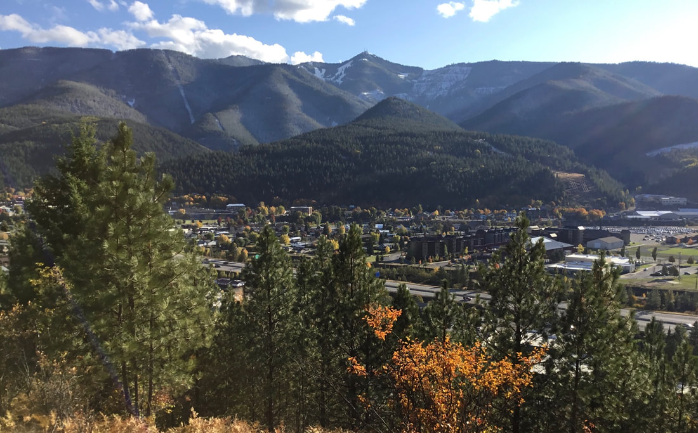
_Shoshone Medical Center Wellness Trail_

## Shoshone medical center’s wellness trail

## Description

We have added the areas sheriff’s emergency phone numbers for each trip write up under the ranger district
info. if an emergency ocurrs, evaluate your circumstances and call only if needed. From the Shoshone Medical
Center’s parking area, look east for a set of stairs heading east up hill. The entire trail to the viewpoint
is easy and designed for people to get a moment for themselves. The trail switchbacks 5 times until it head
south to the viewpoint. The viewpoint has a picnic table and an informative kiosk telling of Kellogg’s
mining history and it’s forest reforestation. In a nut shell... after decades of mining and smelting, all
the trees in and around Kellogg were gone. I mean barren dirt was all that could be seen. By the end of
1993, Ed Pommerening, with the help of high school students, at 8$ per hour, planted 2.8 million trees over
5,000 acres. The first plantings died, due to the toxicity of the soil. So Ed designed a plastic sheath to
cover the root mass of each tree, and they soon began to grow. There was not a greenhouse large enough to
grow the starts, so Bunker Hill Mines offered some unused mining tunnels to grow the saplings in. GTE
Sulvania designed a special lighting system to be used in the tunnels. An astonishing 90% of the trees
survived and were planted. The tunnel had the perfect temperature, humidity, and Co2 levels for the starts
to grow.

## Directions

Take exit 49 in Kellogg, and turn left (north) onto Bunker Ave. At the stop sign, continue north on Bunker
Ave. (to the Shoshone Medical Center parking area, near the helipad.)

## Hazards

None

## Cool things close by

Silver Mountain Resort, Historic Wallace, Elsie Lake & Striped Peak, Stevens Lakes & Peak, Lone Lake, U. &
L. Glidden Lakes, Trail of the CDA’s, and the Route of the Hiawatha.

## R & P

Pizza Factory, 1313 Club, Brooks Hotel & Restaurant, City Limits Brew Pub, Fainting Goat, Smoke House BBQ &
Saloon, Wallace Brewing Co., and Muchacho’s Tacos in Wallace. Radio Brewing in Kellogg. the Snake Pit north
of Kingston, and Moon Time in CDA

## Photo gallery

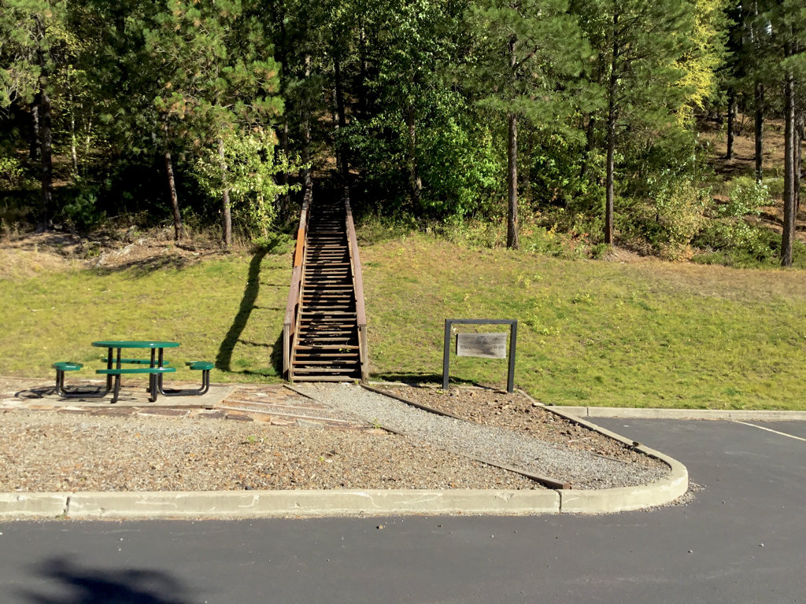

## The stairs leading to the wellness trail

---

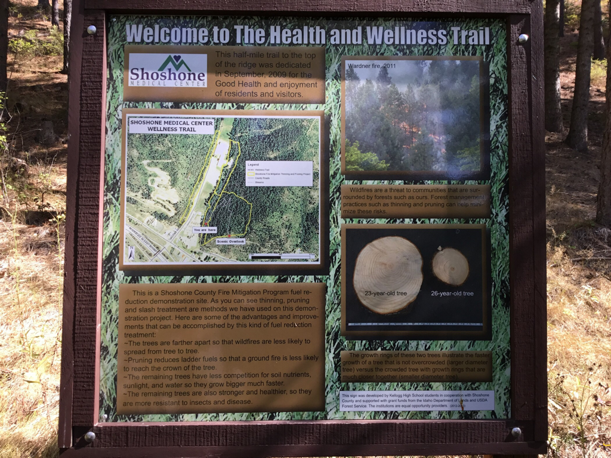

## The first infosign showing the property and how its managed

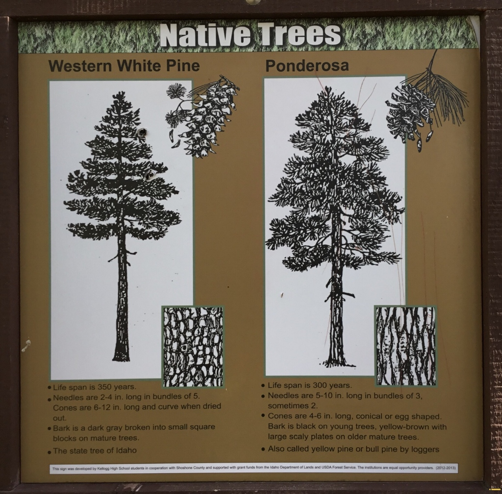

## All along this trail are info signs like the one above

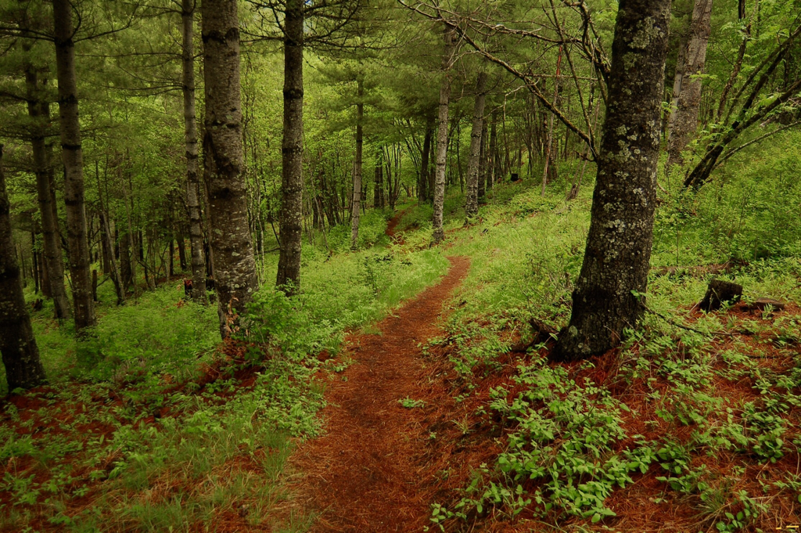

## Spring on this trail is spectacular

### Picture (Image missing)

## A section of the trail above the picnic table    6.30.2022

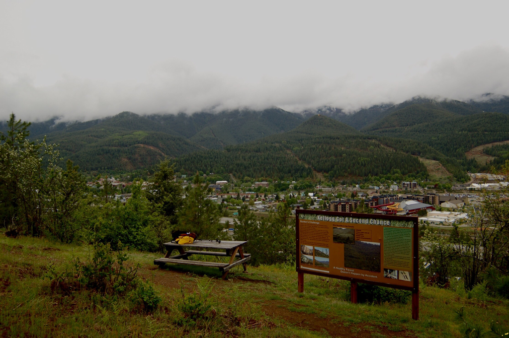

## .4 miles up this beautiful trail is a place to relax and learn

---

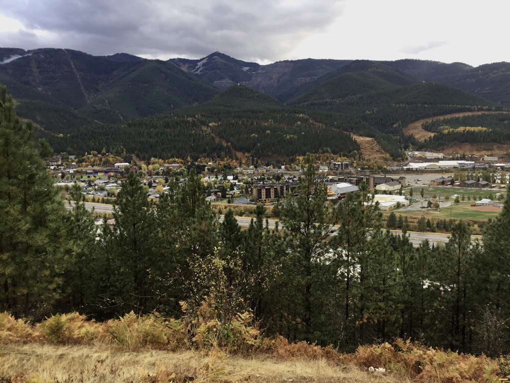

## Silver mountain looms above kellogg

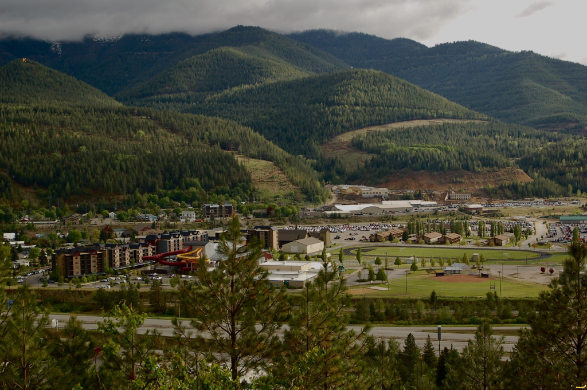

## The silver mountain resort base area from the picnic table

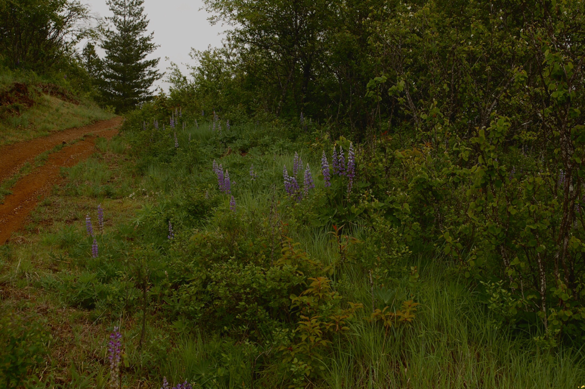

## Lupine along the wellness trail

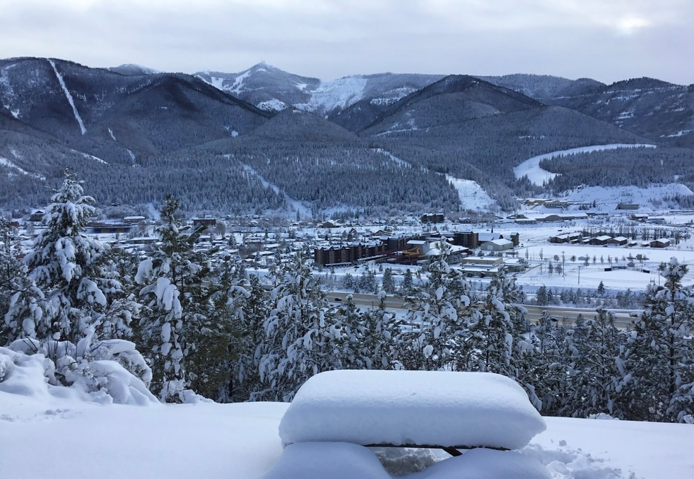

## A winter view from the wellness trail on 1.15.2020

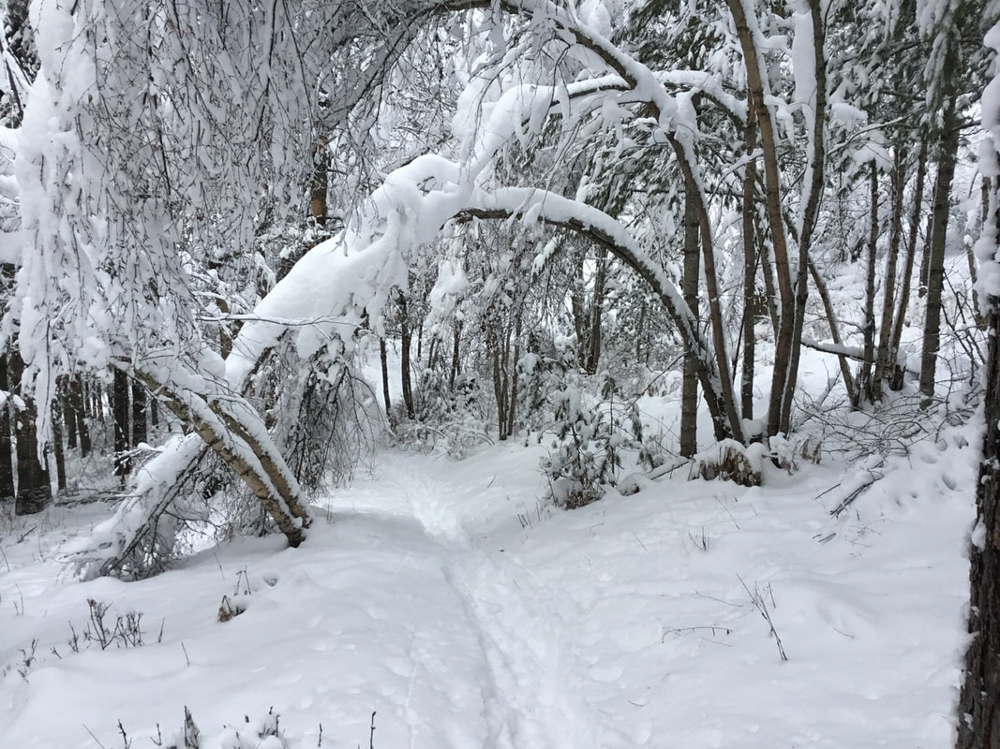

## Along the trail mid winter

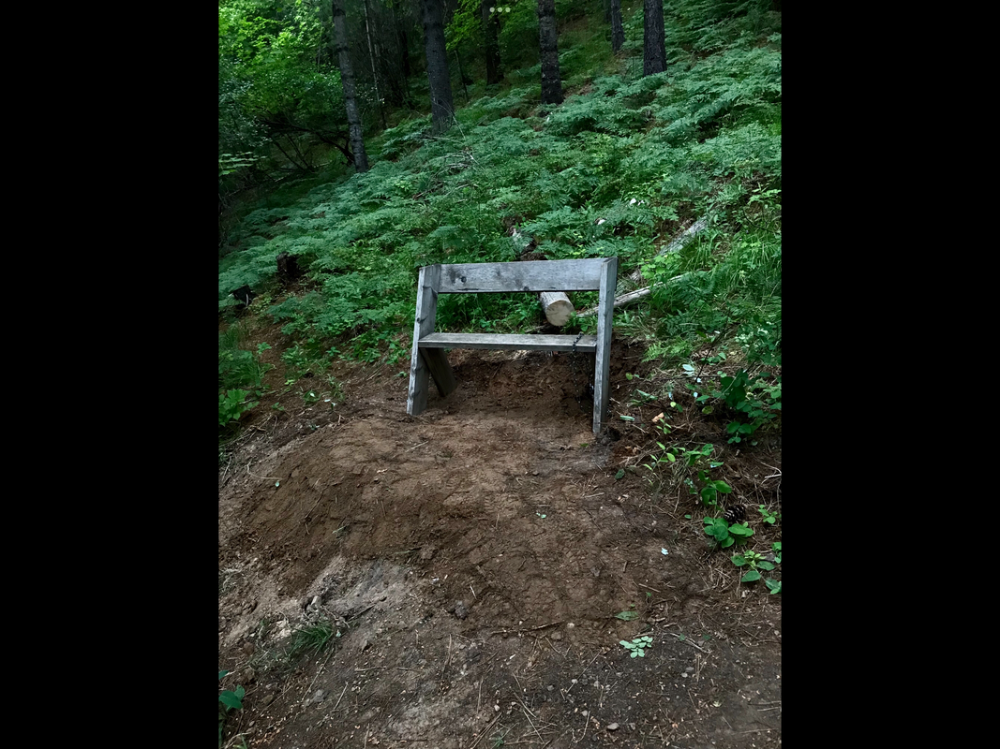

## Bench about half way to the picnic table

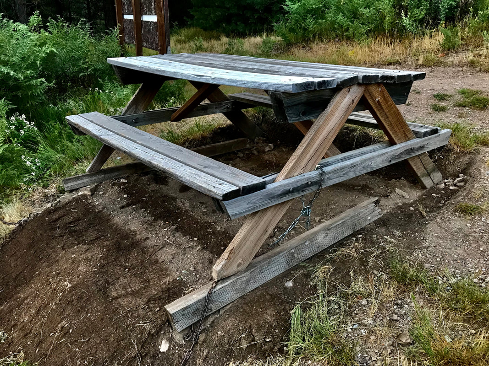

## Picnic table at overlook
