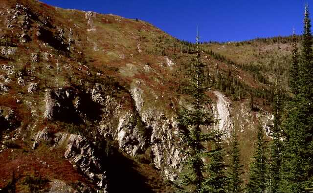
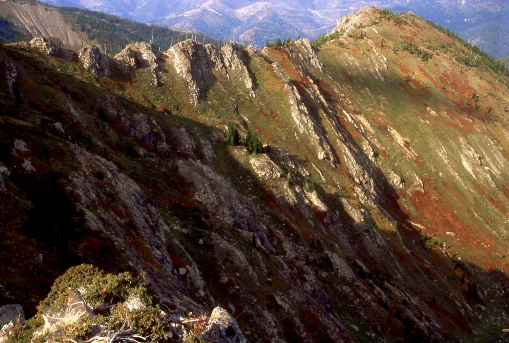
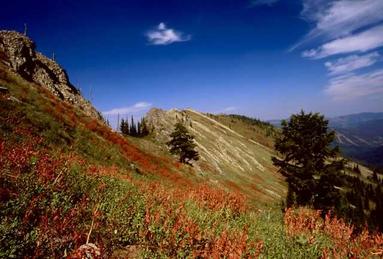
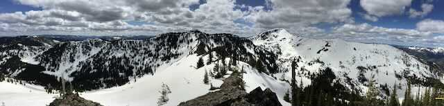
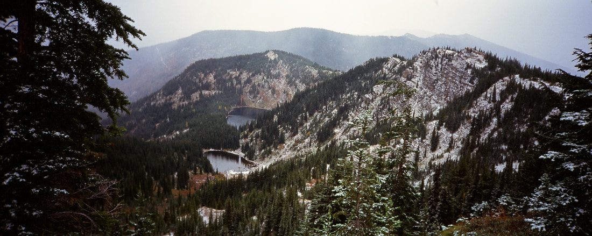

---
tags:
- Lakes
- Easy
- Day Hiking
- Backpacking
- Fishing
- Skiing & Snowshoeing
stats:
- label: Event Type
  icon: hiking
  value: Day hiking, backpacking, fishing, Backcountry. Skiing.
- label: Distance
  icon: map-marker-distance
  value: 6 miles RT
- label: Elevation
  icon: terrain
  value: gains 1090 verts
- label: Acres
  icon: vector-square
  value: '8.62'
- label: Difficulty
  icon: speedometer
  value: easy
- label: Maps
  icon: map
  value: I.P.N.F., LOLO N.F., Lookout Pass topo
- label: GPS
  icon: crosshairs-gps
  value: 47°42’65" n -115°75’10" w
- label: Ranger District
  icon: pine-tree
  value: CDA River R.D. 208.769.3000
- label: Shoshone County Sheriff
  icon: shield-account
  value: CALL 911 FIRST or 208.556.1114
notes:
- label: Idaho panhandle national forest/alerts
  url: '#'
- url: https://www.fs.usda.gov/alerts/ipnf/alerts-notices
---

# Upper  Lower St Regis Lakes

## Description

We have added the areas sheriff’s emergency phone numbers for each trip write up under the ranger district
info. if an emergency ocurrs, evaluate your circumstances and call only if needed. St.Regis Lakes are
located in Montana SW of the Lookout Pass Ski Area. The trail starts at the old railroad's hairpin turn up
the south side of the ski resort. If you don’t have a high clearance vehicle or 4 wheel drive, park near the
south chairlift base. Walk the road west for about a mile to the official trailhead. Take Trail #267 south
west up thru a canyon crossing the river three times before heading up to the lakes. At the second
river/creek crossing, the trail continues for a short distance, then bear right (west). At the trails third
crossing of the river, the trail cuts up hill for about 400' to the lakes basin. The first lake you come to
is actually the Upper St. Regis Lakes at 5990' while the second lake is the lower lake at 5559'. There are
several campsite around the lake. Follow the trail thru the woods to the west, and you will find the lower
lake. To the west is the very scenic ridge between St. Regis Lakes and U & L Stevens Lakes, and also is the
Idaho Montana boarder, State Line Ridge.

## Option #1

From the top of Lookout Pass Ski Area, head SW along the treed ridge until it breaks out of the woods and
becomes open and rocky. Up near the south wall, the ridge gets dicy. You may have to drop off the ridge to
the east to get past some intense jagged rocks. Once at the back wall, you can drop down to the Lower St.
Regis Lake and make this a loop hike of about 9 miles. Be aware, the section on top of the ridge is very
rugged and demands caution.

---

## Directions

Drive I-90 east to the Idaho Montana boarder at Lookout Pass. Turn right (west) to the stop sign and turn
left (south) onto a paved road (old railroad) downhill for .9 of a mile to a hairpin turn and turn right
(west) for 1/10th of a mile to the trailhead. About .1 of a mile further is a primitive area for camping.
From the upper campsite, there is a short steep climb to the road and to the chairlifts.

## Hazards

During spring high water, crossing the river may be more difficult above the trailhead.

## Cool things close by

Lookout Pass Ski Area, Route of the Hiawatha, The Trail of the Coeur d'Alenes, historic Wallace, Idaho, and
Montana, Stevens Lakes, and Lone Lake

## R & P

Radio Brewing in Kellogg, Pizza Factory and Muchacho’s Tacos in Wallace

---

### Picture (Image missing)

## Photo gallery

<!-- Missing Image: <!-- Missing Image: [*Picture (Image missing)*](../../../assets/images/202111535385-jpeg-1.jpg)
--> -->

## The trail into st. regis lakes along the headwaters of the st. regis river

---

## The north wall of st. regis valley

---

## The west wall of st. regis lakes. l. & u. stevens lake are on the other side

---

### Picture (Image missing) Details

## Chic scrambling up to the id. mt. state lines

---

## The state line ridge

## On the ridge overlooking stevens lake and peak st. regis lakes are left center

## Lower & upper st. regis lakes from the state line trail
