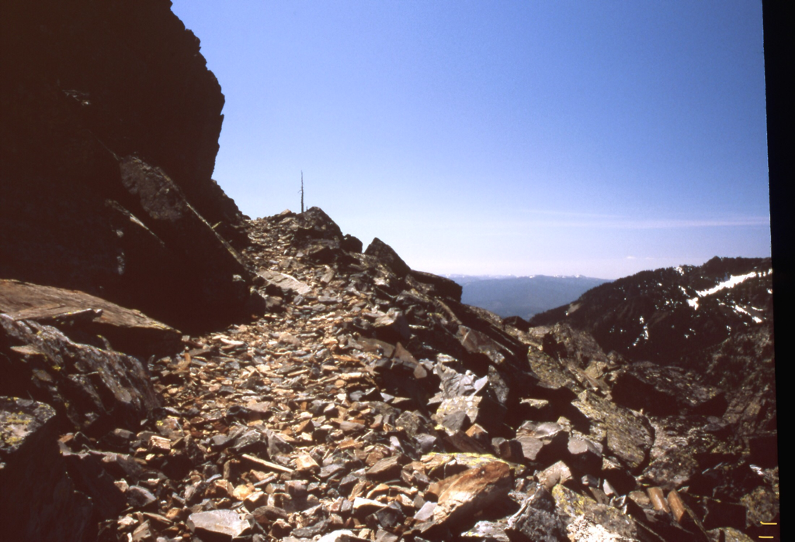
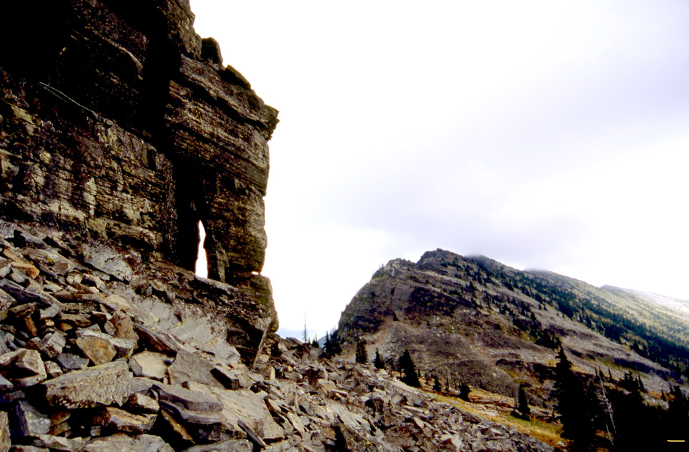
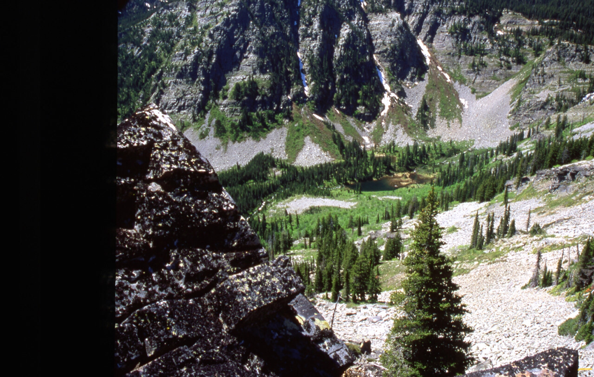
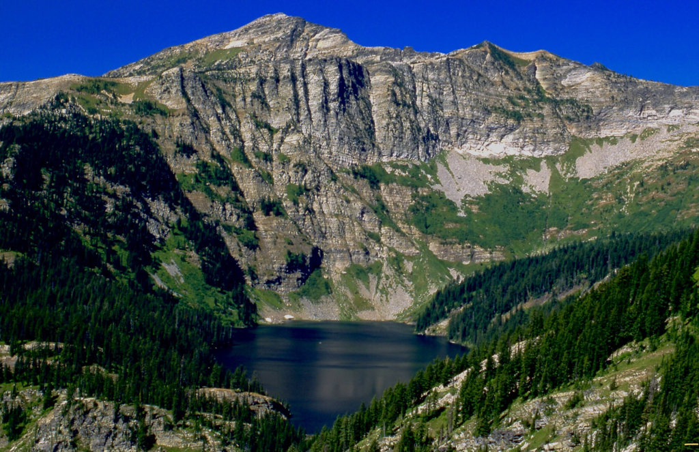
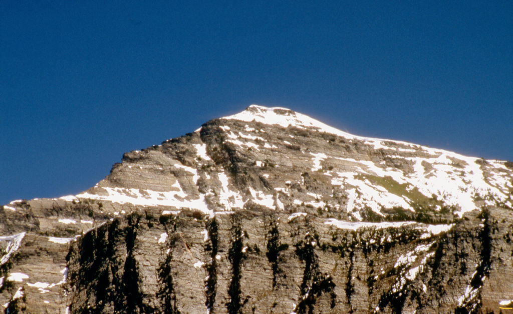

---
tags:
- Trails & Scrambles
- Difficult
- Day Hiking
- Backpacking
stats:
- label: Event Type
  icon: hiking
  value: Day hiking, backpacking
- label: Distance
  icon: map-marker-distance
  value: Up to 16 miles RT (6 miles in Wilderness)
- label: Elevation
  icon: terrain
  value: Varies by access trailhead
- label: Difficulty
  icon: speedometer
  value: Difficult
- label: Maps
  icon: map
  value: Kootenai NF, Goat Peak, Silver Butte Topos
- label: GPS
  icon: crosshairs-gps
  value: "48\xB000'54\" N 115\xB031'46\" W"
- label: Cabinet Ranger District
  icon: pine-tree
  value: 406.827.3533
- label: Lincoln County Sheriff
  icon: shield-account
  value: CALL 911 FIRST or 406.293.4112
notes:
- label: Kootenai National Forest Alerts
  url: https://www.fs.usda.gov/alerts/kootenai/alerts-notices
---

# Cabinet Divide Trail 360

## Description

The Cabinet Divide Trail (#360) is a rugged, high-alpine ridge traverse running along the crest of the
Cabinet Mountains Wilderness in Northwestern Montana. Stretching 16 miles from Lost Buck Pass south toward
Silver Butte Pass, the trail offers breathtaking panoramic views of Wanless Lake, Engle Peak, Bear Lake, and
Baree Lake.

Starting from Lost Buck Pass above Upper Geiger Lake, the rocky trail heads south along alpine ridges,
passing high above Wanless Lake to the west. From Silver Butte Pass at the southern end, the trail climbs
steeply for 2 miles up Canyon Peak (6,326') before continuing along the divide.

## Access & Directions

- **North Access (Geiger Lakes / Lost Buck Pass)**: From Libby, MT, drive 17 miles south on US-2 and turn
  right (west) onto West Fisher Creek Road #231. Follow Road #231 for 6 miles, then turn left (south) onto
  Road #6748 for 2 miles to the Geiger Lakes Trailhead. Hike past Upper Geiger Lake 1 mile to Lost Buck
  Pass.
- **South Access (Silver Butte Pass)**: From Trout Creek, MT, drive 2 miles west on Highway 200 to Blue
  Slide Road. Drive 4 miles to Vermillion River Road #154, follow it 7 miles to Silver Butte Road #148,
  and continue 5 miles to the trailhead at the top of the pass.

## Hazards & Safety

!!! warning "Steep Rocky Terrain & Exposure"

    The Cabinet Divide Trail involves steep, rocky ridge walking with loose talus and high wind exposure.
    Sturdy hiking boots, trekking poles, and alpine weather gear are essential. Carry adequate water as
    ridge springs are sparse.

## Nearby Points of Interest

- **Geiger Lakes & Wanless Lake**
- **Bear Lake & Baree Lake**
- **Engle Peak & Canyon Peak (6,326')**
- **Cabinet Mountains Wilderness**

## Photo Gallery

_Cabinet Divide Trail #360 from Lost Buck Pass above Upper Geiger Lake._

_Alpine ridgeline of the Cabinet Divide Trail._

_Buck Lake along the Wanless Lake trail._

_Spectacular view of Wanless Lake from the Cabinet Divide Trail._

_East face of Engle Peak rising above Wanless Lake._

## Plan Your Trip

- [Current NOAA Weather Conditions](https://www.nws.noaa.gov/wtf/udaf/MapClick.php?lel=4000&uel=9000&polygon=49.016%2C-114.180%2C48.994%2C-114.381%2C48.890%2C-114.341%2C48.924%2C-114.151%2C&area=63)
